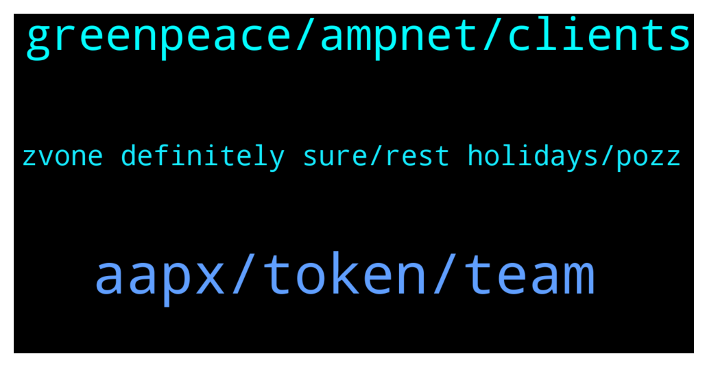

# **@ampnetapxchat**
 ## Analysis for **2021-12-29** - **2022-01-03**.

---

## 📊 **Basic Stats**

**n_messages_sent**: 74

---

---

## 🔝 **Top keywords and related messages**

1. **aapx, token, team**

    @E_Don --- *We need more pairs on Matic. Eth gas fee is crazy  Matic/AAPX. Eth/AAPX* **--->** [TG Discussion](https://t.me/ampnetapxchat/36085)

    @<UNK> --- *Here is the aapx network address  https://polygonscan.com/token/0x3fc8bd9b0d8054cbdc174c4ed4b41a95d3c6a427* **--->** [TG Discussion](https://t.me/ampnetapxchat/36087)

    @Lord of the --- *Nice but wen exchange listings ?* **--->** [TG Discussion](https://t.me/ampnetapxchat/36029)

    @<UNK> --- *You just need to provide transaction hash and you'll be compensated   https://docs.google.com/forms/d/e/1FAIpQLSf4GCX62RAfb0oZvGNPzNynTdHFlvoIw9KZqA0o1VOkEwG_Kw/viewform* **--->** [TG Discussion](https://t.me/ampnetapxchat/36040)

    @PFCBLic --- *Also troop! We have to survive this ammount of food* **--->** [TG Discussion](https://t.me/ampnetapxchat/35855)

    @matejmz --- *Matic/AAPX exists. You can swap ETH to Matic and then swap it for AAPX* **--->** [TG Discussion](https://t.me/ampnetapxchat/36086)

2. **greenpeace, ampnet, clients**

    @Bob_Fosse --- *That was basically a very long winded statement that reads, “ampnet did nothing wrong, it’s everyone else’s fault”. Just awful (and not surprising).* **--->** [TG Discussion](https://t.me/ampnetapxchat/36017)

    @mislavjavor --- *I agree, and the team finds ourselves more than accountable for things in and beyond our control. In the history of our company, there has never been an attitde of - “it must be somebody elses fault”. We should have acted sooner on red flags by Greenpeace, we should have moved on to Ethereum sooner, etc… Trust me when I say that we do not pat ourselves on the back saying “good job, it’s the fault of the clients”. On the other hand - it’s easy to look on things from hindsight - with all the extra information that hindsight provides.   The post was meant as an update to the community, that we are working hard, exploring new business models and new clients and that AAPX will be the token that’s backing these new developments.* **--->** [TG Discussion](https://t.me/ampnetapxchat/36027)

    @mislavjavor --- *Hey @IncogSen - the breakdown of Greenpeace partnership and the Aeternity attacks were all announced as they happened. The onboarding of new clients and the decision to develop AMPnet v2 was also communicated when it happened. There was no hiding of information from our side - when we had nothing to say, we stayed silent. When we had new partners or developments - we announced them, as was expected from us.   The optimism in our announcements was how we felt at the time, it was a genuine excitement that we felt - but we couldn’t know how things would end before they ended.  I understand the frustrations, but information was not witheld.* **--->** [TG Discussion](https://t.me/ampnetapxchat/36007)

    @IncogSen --- *Maybe they already knew about the greenpeace deal falling through behind the scenes* **--->** [TG Discussion](https://t.me/ampnetapxchat/36013)

    @Lord of the --- *Dude stop be crybaby it's history now* **--->** [TG Discussion](https://t.me/ampnetapxchat/36014)

    @IncogSen --- *It's not history and you're in a loss* **--->** [TG Discussion](https://t.me/ampnetapxchat/36016)

3. **zvone definitely sure, rest holidays, pozz**

    @PFCBLic --- *Ovo je 25 najperspektivnijih hrvatskih startupa koje vrijedi pratiti u 2022. - Poslovni dnevnik https://www.poslovni.hr/sci-tech/ovo-je-25-najperspektivnijih-hrvatskih-startupa-koje-vrijedi-pratiti-u-2022-4318317* **--->** [TG Discussion](https://t.me/ampnetapxchat/35835)

    @<UNK> --- *Pozz Jakov, just working and waiting  for a new year, how about you ? 😁* **--->** [TG Discussion](https://t.me/ampnetapxchat/35945)

    @<UNK> --- *Zvone here, all is well 😄* **--->** [TG Discussion](https://t.me/ampnetapxchat/35892)

    @Troop --- *Definitely! 😊  For sure not an easy task! Hahaha Keep it strong bro💪* **--->** [TG Discussion](https://t.me/ampnetapxchat/35856)

    @Troop --- *Have seen this a few days ago... Quite a nice reputation! Sretan Bozic Rango! 🎄* **--->** [TG Discussion](https://t.me/ampnetapxchat/35854)

    @<UNK> --- *Merry Christmas everyone, enjoy the rest of your holidays and wish you all the best in the upcoming year🌲🎁🎉* **--->** [TG Discussion](https://t.me/ampnetapxchat/35842)

