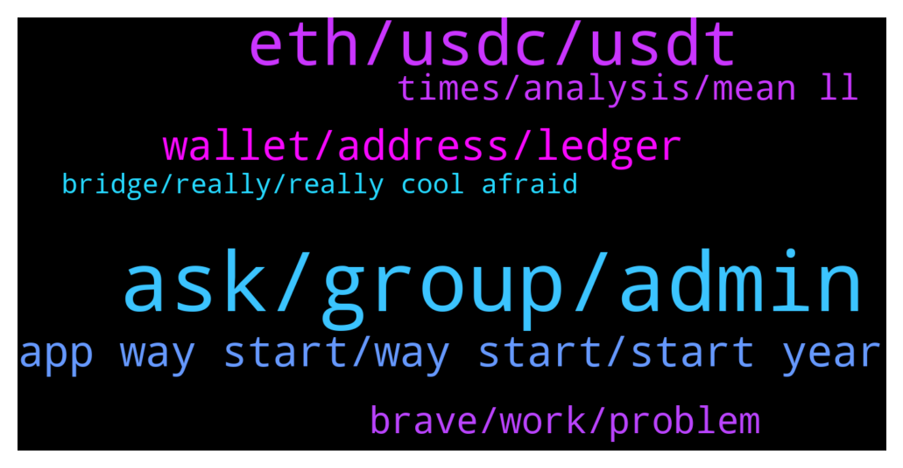

# **@avalancheavax**
 ## Analysis for **2022-01-02** - **2022-01-03**.

---

## 📊 **Basic Stats**

**n_messages_sent**: 151

---

---

## 🔝 **Top keywords and related messages**

1. **ask, group, admin**

    @alrko616 --- *Accounts with girls profile should get banned* **--->** [TG Discussion](https://t.me/avalancheavax/319178)

    @wow1234567890 --- *Kek  Been dead for weeks, literally using tons of ip  Either they have a huge database of ips because they don't like people keeping their privacy or there's another problem* **--->** [TG Discussion](https://t.me/avalancheavax/319102)

    @Altenna --- *btw scammers these days are really crazy i asked 1 question and i have like 20 pm and 5+ ppl calling me* **--->** [TG Discussion](https://t.me/avalancheavax/319337)

    @sanse_sebastian --- *I did it on purpose, trying to attract scammers to bam them from groups where I'm admin* **--->** [TG Discussion](https://t.me/avalancheavax/319194)

    @HellenicAng3 --- *I flirted with one and she blocked me :(* **--->** [TG Discussion](https://t.me/avalancheavax/319197)

    @Raj 4m CryptoFit.Me --- *if impersonating, then hard to differentiate* **--->** [TG Discussion](https://t.me/avalancheavax/319243)

2. **eth, usdc, usdt**

    @gmoney202 --- *does anyone know where to swap dai.e to usdt.e without crazy slippage* **--->** [TG Discussion](https://t.me/avalancheavax/319247)

    @Manu --- *Guys… I have a v off topic question…. For borrowing on aave or compound etc… or even curve for that matter,,, if we are to over-collateralise…. What is the point… I deposit 1 eth to borrow 0.75 eth and have to pay interest on it….. why not just use the initial 1 eth??  I know it is off topic.. but if someone knows please do tell me :) Thanks!* **--->** [TG Discussion](https://t.me/avalancheavax/319172)

    @Nicolas_A --- *They are both decentralized exchange. TraderJoe also has lending so you could say its competing with BenQi, Aave* **--->** [TG Discussion](https://t.me/avalancheavax/319156)

    @ipeltek --- *How can I buy NFT through avax ecosystem ?* **--->** [TG Discussion](https://t.me/avalancheavax/319040)

    @Cyberks95 --- *Which stable coin you guys prefer over USDT?* **--->** [TG Discussion](https://t.me/avalancheavax/319074)

    @offorjp --- *What is the total supply for avax?* **--->** [TG Discussion](https://t.me/avalancheavax/319188)

3. **app way start, way start, start year**

    @cryptomaxcrypto --- *Hey! Where can I find avalanche projects that launch today?* **--->** [TG Discussion](https://t.me/avalancheavax/319409)

    @szh7940704 --- *Do we have an avalanche and BSC chain bridge* **--->** [TG Discussion](https://t.me/avalancheavax/319097)

    @Denim --- *I received an Invites to avalanche beta app 🎉😄 what a way to start the year.  Anyone else does?   https://play.google.com/store/apps/details?id=com.kamzadevs.avalanchewallet* **--->** [TG Discussion](https://t.me/avalancheavax/319312)

    @Nicolas_A --- *Twitter perhaps, Rugdoc has a calendar also afaik* **--->** [TG Discussion](https://t.me/avalancheavax/319414)

    @christp23 --- *Hi, Is there a exactly date for the Avalanche Summit in Barcelona? Thanks in advance.* **--->** [TG Discussion](https://t.me/avalancheavax/319269)

    @IgorKrumpak --- *I cannot find roadmap for 2022. Anyone got idea where to find it.* **--->** [TG Discussion](https://t.me/avalancheavax/319115)

4. **wallet, address, ledger**

    @TheRealForever --- *Not complaining, but I connected my ledger with wallet.avax and I have 0.1 AVAX. No idea where it's from and there is no history of transfer. It's on C chain within the wallet.* **--->** [TG Discussion](https://t.me/avalancheavax/319373)

    @Nicolas_A --- *No you login to the same wallet but have access to different addresses* **--->** [TG Discussion](https://t.me/avalancheavax/319402)

    @CryptoBotje --- *Your ledger has a passphrase. Someone could have the same.* **--->** [TG Discussion](https://t.me/avalancheavax/319387)

    @HellenicAng3 --- *multiple addresses means multiple wallets on say your wallet.avax?* **--->** [TG Discussion](https://t.me/avalancheavax/319398)

    @HellenicAng3 --- *Can you have more than one AVAX wallet on your ledger?* **--->** [TG Discussion](https://t.me/avalancheavax/319396)

    @Nicolas_A --- *There is only 1 seed phrase. You can have multiple addresses with the HD wallet* **--->** [TG Discussion](https://t.me/avalancheavax/319397)

5. **brave, work, problem**

    @wow1234567890 --- *Kek I am using Brave  In fact I am using many devices amd many browsers and it still doesn't work  Avascan website is dead in the water  Glad Snowtrace is here* **--->** [TG Discussion](https://t.me/avalancheavax/319105)

    @oathtobarbatos --- *It could probably be a problem with your browser or something, try deleting avascan page cache or just use brave, for example* **--->** [TG Discussion](https://t.me/avalancheavax/319103)

    @oathtobarbatos --- *That is weird, mine works fine.* **--->** [TG Discussion](https://t.me/avalancheavax/319100)

    @TheSEOdude --- *Reset your metamask by going into advanced settings.* **--->** [TG Discussion](https://t.me/avalancheavax/319174)

    @no0ki --- *all its doing is retracing its range rn, calm down* **--->** [TG Discussion](https://t.me/avalancheavax/319090)

    @li --- *yes ,I have try ,but it still not work* **--->** [TG Discussion](https://t.me/avalancheavax/319347)

6. **times, analysis, mean ll**

    @HellenicAng3 --- *Is there anywhere I can read more on this?* **--->** [TG Discussion](https://t.me/avalancheavax/319411)

    @Nix --- *Or more than to BNb burning?* **--->** [TG Discussion](https://t.me/avalancheavax/319213)

    @oathtobarbatos --- *Do you mean this one? https://avascan.info/staking/validators* **--->** [TG Discussion](https://t.me/avalancheavax/319077)

    @oathtobarbatos --- *You'll find analysis and everything else here: https://t.me/avalanche_trading* **--->** [TG Discussion](https://t.me/avalancheavax/319071)

    @Nicolas_A --- *This article explains it to some degree https://medium.com/vault0x/hd-wallets-structure-and-its-implementation-5897ab3da210* **--->** [TG Discussion](https://t.me/avalancheavax/319413)

    @TheRealForever --- *Probably not, that's some next level stuff.* **--->** [TG Discussion](https://t.me/avalancheavax/319388)

7. **bridge, really, really cool afraid**

    @Nicolas_A --- *Did you use the bridge once ?* **--->** [TG Discussion](https://t.me/avalancheavax/319381)

    @DeFiCenturion --- *That I wasn't aware of. That said, I have an AVAX balance, so no transfer from the bridge is necessary in my case.* **--->** [TG Discussion](https://t.me/avalancheavax/319419)

    @BinanceApe --- *Yeah it’s really cool, also if anyone is afraid of ethereum network bridge fees try it. It’s surprisingly extremely cheap compared to other services (about $6-$10 is what I paid yesterday)* **--->** [TG Discussion](https://t.me/avalancheavax/319421)

    @Nicolas_A --- *Not with the default bridge. WETH only* **--->** [TG Discussion](https://t.me/avalancheavax/319360)

    @oathtobarbatos --- *I'm not really sure but you can use allbridge.io* **--->** [TG Discussion](https://t.me/avalancheavax/319098)

