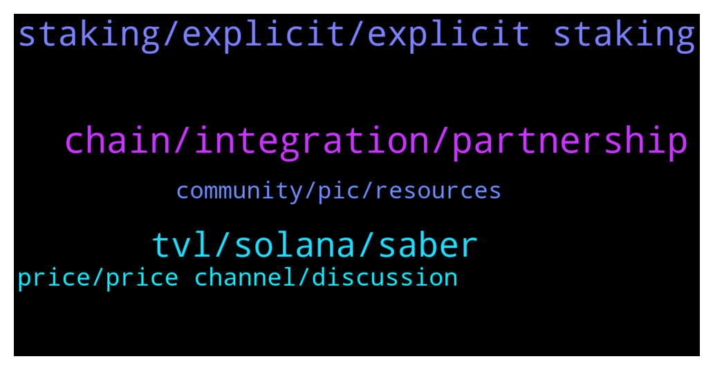

# **@chainlinkofficial**
 ## Analysis for **2022-01-02** - **2022-01-03**.

---

## 📊 **Basic Stats**

**n_messages_sent**: 106

---

---

## 🔝 **Top keywords and related messages**

1. **chain, integration, partnership**

    @Joypokkamol --- *You can find some groups by searching Telegram for "Chainlink Community" but be aware that they are not operated or endorsed by the Chainlink team or admins of this chat. Thank you for your understanding.* **--->** [TG Discussion](https://t.me/chainlinkofficial/359039)

    @athena_meigh --- *Chainlink will be more critical a backbone for the blockchain ecosystem in 2022* **--->** [TG Discussion](https://t.me/chainlinkofficial/359206)

    @CryptoMario --- *Hi,can you confirm partnership incoming with Megladoge ,thank you* **--->** [TG Discussion](https://t.me/chainlinkofficial/358727)

    @harrumphharrumph --- *Chainlink – Telegram communities:   Korea - @chainlink_korea   SE Asia - @chainlinkSEA   Indonesia - @ChainlinkID   Thai - @ChainlinkTH Vietnam - @chainlinkVIETNAM   Japan - @chainlinkJAPAN Spain/LatAm - @chainlinkedesp   Turkey - @chainlinkTR   Italian –  @Chainlink_italian   Finnish – @chainlinksuomi   Sweden - @chainlinkSWEDEN   France – @chainlinkFRA   German - @Chainlinkgerman   Dutch - @chainlinkNL   Middle East - @chainlinkME   Russia - @ChainlinkRussia India - @ChainlinkIN* **--->** [TG Discussion](https://t.me/chainlinkofficial/359051)

    @Linkederic --- *Chainlink 2.0 is not really a "binary" transition, one day you switch off Chainlink and the next day you switch on Chainlink 2.0, but rather a set of capabilities that will develop independently to gradually make hybrid smart contracts go mainstream. Feeds using OCR or even smart contracts leveraging Chainlink Keepers are already "Chainlink 2.0" to some extent, as they leverage the hybrid nature of the oracle networks, given that they post information on-chain but part of the computation occurs off-chain.  This article provides an overview of Chainlink 2.0 https://blog.chain.link/chainlink-2-0-lays-foundation-for-adoption-of-hybrid-smart-contracts/* **--->** [TG Discussion](https://t.me/chainlinkofficial/358988)

    @MarcTillement --- *I see Pyth network mention not one of Chainlink...* **--->** [TG Discussion](https://t.me/chainlinkofficial/359102)

2. **staking, explicit, explicit staking**

    @martinjancik --- *Hello, I am new here, is there any quick link to project roadmap? Particulary interested in LINK staking. Thx* **--->** [TG Discussion](https://t.me/chainlinkofficial/359194)

    @joaotraderbatuc --- *How can I put the coins to link pool?* **--->** [TG Discussion](https://t.me/chainlinkofficial/359245)

    @Sylvarantt --- *Also in this presentation Sergey suggested that some form of explicit staking could be released in 2022  https://twitter.com/chainlink/status/1477323856176111619* **--->** [TG Discussion](https://t.me/chainlinkofficial/359197)

    @nam_nguyenson --- *Staking is not yet available but it will be some time this year.  Check out this video from Sergey where he discusses it: https://youtu.be/YShbzR7mlog* **--->** [TG Discussion](https://t.me/chainlinkofficial/359075)

    @Mirko --- *watched a youtube and they mentioned staking coming out any time now is expected.  i was hopping that the admin would be able to provide more info. admin???* **--->** [TG Discussion](https://t.me/chainlinkofficial/359068)

    @Linkederic --- *Staking isnt yet live, thats correct.  https://blog.chain.link/what-is-chainlink/ https://blog.chain.link/what-is-a-chainlink-node-operator/* **--->** [TG Discussion](https://t.me/chainlinkofficial/358992)

3. **tvl, solana, saber**

    @PolivodaTatiana --- *Intriguing conversation about Saber. The best answer is probably on our Ecosystem website: https://www.chainlinkecosystem.com/ecosystem/saber/* **--->** [TG Discussion](https://t.me/chainlinkofficial/359115)

    @MarcTillement --- *Hey guys Question coming to mind seeing this thread https://twitter.com/chainlink/status/1476961379231965196/photo/1 How does CL even claim Saber TVL while not being on Solana mainnet?* **--->** [TG Discussion](https://t.me/chainlinkofficial/359072)

    @Shogun187 --- *Updated in what sense? CoinGecko has informstion related to current supply. The ICO detailed token allocation/usage. There is no release schedule* **--->** [TG Discussion](https://t.me/chainlinkofficial/358997)

    @Shogun187 --- *2022. The video is posted in some of the previous messages above. There was no specific date - simply coming out this year.* **--->** [TG Discussion](https://t.me/chainlinkofficial/359069)

    @cnnrfr --- *Is Sergey happy with the amount of progress so far?* **--->** [TG Discussion](https://t.me/chainlinkofficial/358738)

    @Parkkyungho --- *Any idea about the date of solana mainnet beta launch ?* **--->** [TG Discussion](https://t.me/chainlinkofficial/359184)

4. **price, price channel, discussion**

    @Wizard --- *Okay thank you. But why does a massive project like LINK don’t have an official price channel? Not difficult to have one, and all you need is a couple of admins to keep everything under control.* **--->** [TG Discussion](https://t.me/chainlinkofficial/359043)

    @Linkederic --- *The majority of serious projects prohibit price discussion in their official channels in my experience.   The official channels are intended to be high signal:noise ratio to serve curious people across all spectrums from third party developers leveraging Chainlink to enthusiasts looking to simply keep up to date on the project. Allowing price speculation is a surefire recipe for the exact opposite of that.* **--->** [TG Discussion](https://t.me/chainlinkofficial/359052)

    @Dagtastic --- *Hi all, is there a trading/price channel?* **--->** [TG Discussion](https://t.me/chainlinkofficial/359004)

    @marcromeron --- *Dear KD, no price/market discussion is allowed here. Thank you.* **--->** [TG Discussion](https://t.me/chainlinkofficial/359131)

    @Wizard --- *I understand that and I agree. But I’m not talking about this main channel. I’m asking why there isn’t a separate price channel, which is made by the official team where people can talk price. There are only unofficial channels where people could get easily scammed. If we have an official separate price channel with a couple of admins, that would help a lot.* **--->** [TG Discussion](https://t.me/chainlinkofficial/359100)

    @Chad --- *Cause the founder doesn’t care about price* **--->** [TG Discussion](https://t.me/chainlinkofficial/359045)

5. **community, pic, resources**

    @Memetic_polyalloy --- *I had someone message me the other day who had the same profile pic and name as you, too. They wished me a Merry Christmas and left the chat.* **--->** [TG Discussion](https://t.me/chainlinkofficial/359029)

    @Linkederic --- *Yep, block and report as spam, unless theyre in this group also then thats the only thing we can do to combat them.* **--->** [TG Discussion](https://t.me/chainlinkofficial/359024)

    @PTournesol --- *Hello Éric someone send messages with thé same pic of you* **--->** [TG Discussion](https://t.me/chainlinkofficial/359023)

    @PTournesol --- *Pay attention there are a lot of scammer* **--->** [TG Discussion](https://t.me/chainlinkofficial/359020)

    @Papasiro --- *Unbelievable. Call the police right now* **--->** [TG Discussion](https://t.me/chainlinkofficial/359033)

    @LDM246 --- *I mean you should make "more like-minded friends"* **--->** [TG Discussion](https://t.me/chainlinkofficial/358963)

