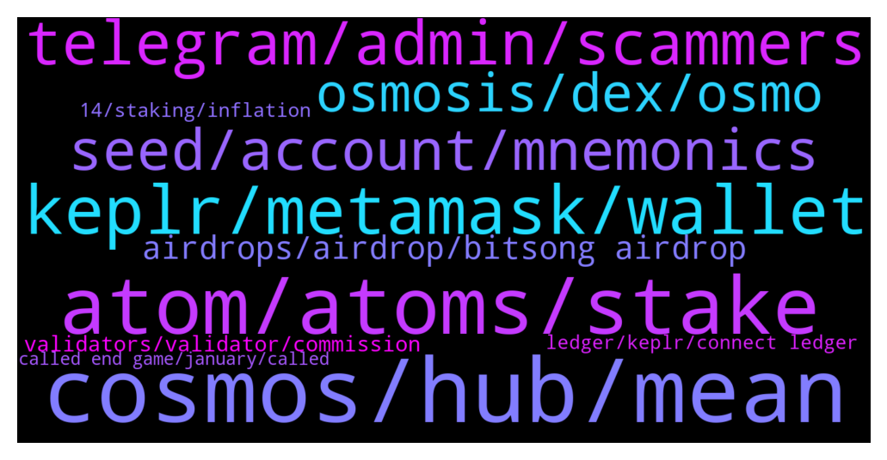

# **@cosmosproject**
 ## Analysis for **2022-01-02** - **2022-01-03**.

---

## 📊 **Basic Stats**

**n_messages_sent**: 522

---

---

## 🔝 **Top keywords and related messages**

1. **cosmos, hub, mean**

    @Rico --- *Unpopular Input: Lets say Cosmos would end up to be the one endstate where everything happens. Wouldnt that make it somehow centralized...?* **--->** [TG Discussion](https://t.me/cosmosproject/465588)

    @Kontiki1803 --- *Thanks, I mean don't get me wrong, I am a big supporter of the cosmos network, but I can't seem to find good answer, I will ask in the Evmos discord* **--->** [TG Discussion](https://t.me/cosmosproject/465548)

    @Crypto --- *Here is a look at Agoric, looks to be sensational for the Cosmos.   https://www.youtube.com/watch?v=cXz9TlPsAmw&t=204s* **--->** [TG Discussion](https://t.me/cosmosproject/466274)

    @SevenLaws --- *Hello. Noob to Cosmos here. Just beginning to learn how I can get involved.* **--->** [TG Discussion](https://t.me/cosmosproject/464778)

    @mdr6425 --- *What changes have been made to the cosmos in the last update?* **--->** [TG Discussion](https://t.me/cosmosproject/466216)

    @ZoltanAtom --- *Prepare a draft of your proposal and publish it here;  https://forum.cosmos.network  Also join to Cosmos discord to ask it to devs.  https://discord.gg/vcExX9T* **--->** [TG Discussion](https://t.me/cosmosproject/465740)

2. **atom, atoms, stake**

    @XMRTARI --- *Happy new year 🥳 could someone point me in the right direction to learn more about Atom and its utility. Ive been watching some youtube videos on it but most the stuff ive seen so far hasent been to great with the utility aspects of it.* **--->** [TG Discussion](https://t.me/cosmosproject/464836)

    @AtomJazz --- *Yeah that's the worst place to hold your ATOMs tbh 🙂* **--->** [TG Discussion](https://t.me/cosmosproject/465205)

    @Anothernoise --- *the turning in to ETH would be my concern but I think they can control the price of ATOM if it becomes the end game as there is an infinite supply* **--->** [TG Discussion](https://t.me/cosmosproject/465627)

    @tbe2017 --- *If atom is not staked? Thanks* **--->** [TG Discussion](https://t.me/cosmosproject/465407)

    @Brisky83 --- *My atom are in binance currently* **--->** [TG Discussion](https://t.me/cosmosproject/465204)

    @KingKend --- *No it will become super expensive , because of voting, ibc router tx fee's , interchain staking service and everything else out there, probably atom is so valuable projects still airdrop to stakers like we are some eth whales with capital* **--->** [TG Discussion](https://t.me/cosmosproject/465618)

3. **keplr, metamask, wallet**

    @hilay00 --- *Thank you! I will download Keplr, but it is compatible with metamask? Do i have to close the metamask or it is working fine both of them?* **--->** [TG Discussion](https://t.me/cosmosproject/466058)

    @AtomJazz --- *Hmm, IDK to be honest. Maybe it would be best to ask Keplr support directly https://keplr.crunch.help/* **--->** [TG Discussion](https://t.me/cosmosproject/466242)

    @Wilder999 --- *the app on android playstore, by chainapsis, having 10K + downloads and 4.3 rating from 184 reviews, is this the offical app of keplr* **--->** [TG Discussion](https://t.me/cosmosproject/466128)

    @Foulahton --- *Does anyone know how to download transactions with Keplr? It's not among Koinly's list of wallets. Thanks* **--->** [TG Discussion](https://t.me/cosmosproject/464806)

    @AtomJazz --- *Keplr is web extension, Metamask like wallet* **--->** [TG Discussion](https://t.me/cosmosproject/465849)

    @AtomJazz --- *You need both defi wallet from Cryptocom and Keplr wallet and connect both* **--->** [TG Discussion](https://t.me/cosmosproject/465634)

4. **telegram, admin, scammers**

    @AtomJazz --- *Yeah we know but we can't do anything about it. Be careful and trust no one. Also no admin will ever DM you first* **--->** [TG Discussion](https://t.me/cosmosproject/464652)

    @MrFalconi --- *actually if enough people report the fake groups, telegram will flag them and let users know its possibly a fake group* **--->** [TG Discussion](https://t.me/cosmosproject/464660)

    @bstbcl --- *can I talk to an admin* **--->** [TG Discussion](https://t.me/cosmosproject/464739)

    @sadra_hallaj --- *yes , question about technical issues ,  but discord is too confusing for me unfortantly !* **--->** [TG Discussion](https://t.me/cosmosproject/465814)

    @Specialonec --- *Incase of a proposal who should be contacted* **--->** [TG Discussion](https://t.me/cosmosproject/465739)

    @Kwoshii --- *Jazz the best admin on telegram* **--->** [TG Discussion](https://t.me/cosmosproject/465903)

5. **seed, account, mnemonics**

    @Wilder999 --- *memonic seed is there, not private key* **--->** [TG Discussion](https://t.me/cosmosproject/466125)

    @Grgiorgi --- *So I’ve seen here that you can use both Kepler and cosmostation with the same seed, how can one do that?* **--->** [TG Discussion](https://t.me/cosmosproject/466011)

    @Cole_linz --- *I have, it's on osmosis.. I tried to send to kucoin but it fails. How can I transfer back to cosmos blockchain* **--->** [TG Discussion](https://t.me/cosmosproject/464905)

    @jim_rubbers --- *I swapped from keplr to cosmostation. I used memomic seed. Now when I go back to keplr it says my seed is too short. Anyone any idea why? PS scammer. Don't even bother I will only reply in this chat* **--->** [TG Discussion](https://t.me/cosmosproject/466241)

    @Wilder999 --- *same seed phrase, different addresses on both* **--->** [TG Discussion](https://t.me/cosmosproject/466117)

    @ZoltanAtom --- *Hey there,did you get any transaction hash ?  Also there was an uprade on Cosmos hub couple of week ago. Many exchange was suspended withdrawals and deposits for Atom. You should reach to Kucoin and ask to it them directly.   (If someone DM to you,just block and report it immediately ⚠️⚠️)* **--->** [TG Discussion](https://t.me/cosmosproject/465291)

6. **osmosis, dex, osmo**

    @ZoltanAtom --- *Cosmostation has ibc feature and Osmosis dex feature too. I haven’t tried them on Cosmostation but check them out.* **--->** [TG Discussion](https://t.me/cosmosproject/465344)

    @ZoltanAtom --- *Go to your Osmosis account and you will see there “defi lab” click there. That’s all* **--->** [TG Discussion](https://t.me/cosmosproject/466212)

    @AtomJazz --- *I think the easiest way is to click Terra banner on top of the Osmosis dex website* **--->** [TG Discussion](https://t.me/cosmosproject/465217)

    @Anna_Hoang_1983 --- *Hi guy, I use defi lab in cosmostation wallet to swap my osmosis to bitsong, after swapping, I can not see my bitsong and also my osmosis ;))* **--->** [TG Discussion](https://t.me/cosmosproject/465763)

    @Erickdrm --- *i have a question, i can use cosmostatio to participate in the osmosis pools?* **--->** [TG Discussion](https://t.me/cosmosproject/466205)

    @Erickdrm --- *ok ok so i need a osmosis account in cosmostation to interact whit it rigth?* **--->** [TG Discussion](https://t.me/cosmosproject/466217)

7. **airdrops, airdrop, bitsong airdrop**

    @AtomJazz --- *Hey, we have a whole dedicated channel for airdrops. You'll get all your quet answered there https://t.me/CosmosAirdrops* **--->** [TG Discussion](https://t.me/cosmosproject/465184)

    @AtomJazz --- *Yes, that's the best way. We're probably going to see massive amount of airdrops in the Cosmos ecosystem in 2022* **--->** [TG Discussion](https://t.me/cosmosproject/465193)

    @sofbou --- *Is there some airdrops in coming ?* **--->** [TG Discussion](https://t.me/cosmosproject/465536)

    @sethi_shiv --- *Di I need to anything else to get airdrops?* **--->** [TG Discussion](https://t.me/cosmosproject/465984)

    @Brisky83 --- *After that I get back atom, how about the the other airdrop?* **--->** [TG Discussion](https://t.me/cosmosproject/465182)

    @AtomJazz --- *Well you need to follow the projects doing the airdrops but we have a cool channel for that https://t.me/CosmosAirdrops* **--->** [TG Discussion](https://t.me/cosmosproject/465987)

8. **validators, validator, commission**

    @Tio --- *which validator is best to stake iyo?* **--->** [TG Discussion](https://t.me/cosmosproject/465433)

    @not a name --- *Validators verify transactions with proof of stake blockchains like cosmos. You want a healthy diverse group of validators too prevent one big validator from verifying a bad block or creating malicious transactions* **--->** [TG Discussion](https://t.me/cosmosproject/465025)

    @not a name --- *With zero commission validators you get the most, but it's a race to the bottom. It creates an unfair playing field and hurts decentralization if it's a big validator* **--->** [TG Discussion](https://t.me/cosmosproject/465022)

    @ZoltanAtom --- *Do not stake with exchange validators* **--->** [TG Discussion](https://t.me/cosmosproject/466145)

    @not a name --- *Some validators charge higher commission because they refund slashing, or create additional tools to help delegators.  Running one costs money. That's how they pay their bills* **--->** [TG Discussion](https://t.me/cosmosproject/465023)

    @OctoberXIV --- *IMO through Keplr, selecting a validator with >= 1% commission. Avoid CEX validators to help decentralization. Splitting to more than one validators is a good idea too* **--->** [TG Discussion](https://t.me/cosmosproject/465654)

9. **14, staking, inflation**

    @cactushoes --- *Ah OK thanks. I was looking at inflation* **--->** [TG Discussion](https://t.me/cosmosproject/465146)

    @cactushoes --- *Don't know where u get 15% its currently 8.5%* **--->** [TG Discussion](https://t.me/cosmosproject/465137)

    @AtomJazz --- *It's not defined yet. Similar to Ethereum. Inflation is currently around 8%* **--->** [TG Discussion](https://t.me/cosmosproject/464802)

    @AtomJazz --- *APY is currently 14% per year* **--->** [TG Discussion](https://t.me/cosmosproject/465551)

    @Cordtus --- *yes but to clarify they get 5% of your total, not 5 of your 14 points.* **--->** [TG Discussion](https://t.me/cosmosproject/465027)

    @Nice19guy --- *Just wondering if $atom staking has been fixed on ledger?* **--->** [TG Discussion](https://t.me/cosmosproject/466046)

10. **ledger, keplr, connect ledger**

    @Manuel_Pregunta --- *Hello, is it possible to protect your kplr wallet with ledger I don't understand how to do it* **--->** [TG Discussion](https://t.me/cosmosproject/465232)

    @AtomJazz --- *You can connect your ledger device with Keplr and send them to the exchange from there* **--->** [TG Discussion](https://t.me/cosmosproject/464640)

    @AtomJazz --- *It is yes. All you need to to do is connect you Ledger device with Keplr wallet... https://medium.com/chainapsis/how-to-use-keplr-wallet-40afc80907f6?source=user_profile---------0----------------------------* **--->** [TG Discussion](https://t.me/cosmosproject/465233)

    @FENiXWiN11 --- *sorry, please try later the server cannot process your request. please try again later or contact ledger support. api http 501* **--->** [TG Discussion](https://t.me/cosmosproject/465445)

    @Jorik --- *but the problem is i cant transfer atom with ledger so i cant transfer them to keplr* **--->** [TG Discussion](https://t.me/cosmosproject/464655)

    @Reus8888 --- *Hi , is there anyone have issue with 501 code error when undelegate the ATOM in ledger live ? Thanks* **--->** [TG Discussion](https://t.me/cosmosproject/465090)

