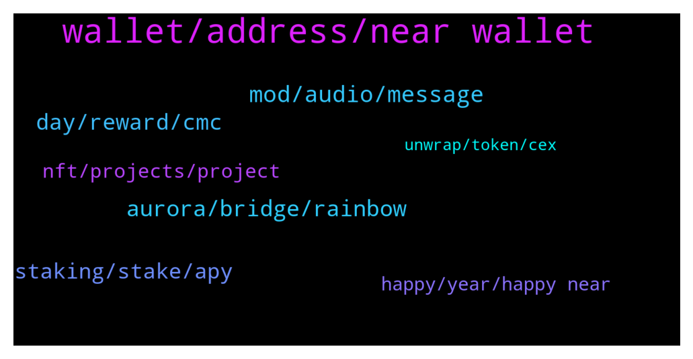

# **@cryptonear**
 ## Analysis for **2022-01-02** - **2022-01-03**.

---

## 📊 **Basic Stats**

**n_messages_sent**: 408

---

---

## 🔝 **Top keywords and related messages**

1. **wallet, address, near wallet**

    @Kripto_Raptor --- *did you claim your wallet first? from wallet.near.org* **--->** [TG Discussion](https://t.me/cryptonear/258382)

    @priyansh95u --- *I don't know how but when searched my address on explorer it shows deleted* **--->** [TG Discussion](https://t.me/cryptonear/259525)

    @Aidrop202 --- *Another question as you log out of the wallet. I can't find where to log out of the wallet.?* **--->** [TG Discussion](https://t.me/cryptonear/259088)

    @larry_lang --- *those keywords are for recovering trust wallet only, not near so that doesnt apply* **--->** [TG Discussion](https://t.me/cryptonear/258657)

    @hvisdukane --- *When i enter the single funding address from near wallet to metamask "send" it says its not an eth address* **--->** [TG Discussion](https://t.me/cryptonear/258268)

    @sanxiacat --- *Any suggest for this. I use trust wallet 12 mnemoic recover it* **--->** [TG Discussion](https://t.me/cryptonear/258654)

2. **mod, audio, message**

    @larry_lang --- *... well can u explain to us more on that muted incident?* **--->** [TG Discussion](https://t.me/cryptonear/258632)

    @TruFinance --- *I think is better to let people speak bullshit  .. then to be able to replay  back* **--->** [TG Discussion](https://t.me/cryptonear/259227)

    @Whiskeylover --- *Yes I saw someone doing it and just try to see what happens....lol* **--->** [TG Discussion](https://t.me/cryptonear/258583)

    @larry_lang --- *yeah i hear the audio, it is good though  ^^* **--->** [TG Discussion](https://t.me/cryptonear/258651)

    @SultanOfStock --- *And I put in a funny joyful audio message and get MUZZELED?!* **--->** [TG Discussion](https://t.me/cryptonear/258625)

    @SultanOfStock --- *There was no incident I posted a funny voice message song that brings joy to many* **--->** [TG Discussion](https://t.me/cryptonear/258633)

3. **aurora, bridge, rainbow**

    @SultanOfStock --- *https://twitter.com/synapseprotocol/status/1477382801095897088?s=21 $SYN bridge to NEAR soon , don’t sleep* **--->** [TG Discussion](https://t.me/cryptonear/258644)

    @Smart --- *aurora doesn't pay any near fees?* **--->** [TG Discussion](https://t.me/cryptonear/258599)

    @vlhai --- *Aurora is a near staking validator with fee and they use it to cover the eth gas fee for whole aurora eco system.* **--->** [TG Discussion](https://t.me/cryptonear/258602)

    @SultanOfStock --- *I’ve onboarded 200+ ppl to NEAR, got Boson from Aurora a main stage speaking opportunity + more for Near and stuck my neck out to make sure it happened. now my TG account is compromised* **--->** [TG Discussion](https://t.me/cryptonear/258631)

    @DT220 --- *Morning, pinned tweets are not showing for me, could anyone help? Once I have added to Aurora Network to MM, how can I get aETH on there? Anyswap won't allow me to send anything across.* **--->** [TG Discussion](https://t.me/cryptonear/258816)

    @CarelessApe --- *if I click "CONNECT" on the Rainbow Bridge "Transfer to" section* **--->** [TG Discussion](https://t.me/cryptonear/258342)

4. **day, reward, cmc**

    @GeorgePro1 --- *🎁🎁🎁  Christmas Creative Contest  4 DAILY WINNERS: Each day we will determine the top 3 entries based on creativity, talent, effort, and following instructions. The 3 top entries each day will receive NEAR prizes as follows:  1st place = 6 $NEAR  2nd place = 4 $NEAR  3rd place = 2 $NEAR  In addition, 1 random winner will be selected each day. The daily random winner will receive 1 $NEAR   We are currently on Day 8. Unleash your creativity, have fun and win some near. #christmas-is-near ( https://discord.gg/sJJVaFCwjE )* **--->** [TG Discussion](https://t.me/cryptonear/259478)

    @FritzWagner --- *I am puzzle about the 6 months without any other reach on other channels* **--->** [TG Discussion](https://t.me/cryptonear/258634)

    @Kripto_Raptor --- *then you won't be eligible for rewards,* **--->** [TG Discussion](https://t.me/cryptonear/258999)

    @Neunk76 --- *How do I get an Airdorp Study and NAER award? And I don't use my bag to pick up. Because I couldn't create a new wallet, because no money was transferred in 0.1 Naer, so I used Asdes from another wallet instead.* **--->** [TG Discussion](https://t.me/cryptonear/258375)

    @younessek --- *are you talking with knowledge or just saying the campaign still active* **--->** [TG Discussion](https://t.me/cryptonear/259002)

    @hoangca6789 --- *Have us event on this month sir* **--->** [TG Discussion](https://t.me/cryptonear/259281)

5. **staking, stake, apy**

    @Herman --- *hi guys i'm new with near protocol, is the staking like this should pick one of them? any feedback?* **--->** [TG Discussion](https://t.me/cryptonear/258912)

    @pburns2002 --- *How can I see the APR for staking?* **--->** [TG Discussion](https://t.me/cryptonear/258736)

    @SerhiIsz --- *Good morning everyone 😊 Guys, what does the validator commission mean for staking?* **--->** [TG Discussion](https://t.me/cryptonear/259369)

    @butola_ravi --- *There is a validator with 0% fee interesting* **--->** [TG Discussion](https://t.me/cryptonear/258913)

    @butola_ravi --- *Yes u can pick any active validaor or stake with metapool* **--->** [TG Discussion](https://t.me/cryptonear/258917)

    @iamkemoo --- *Hey Herman, you could also stake with MetaPool and get 11% on your $NEAR and additional $META. But the best thing is, that MetaPool distributes your $NEAR proportinally to the validator, so you dont have to choose them manually.* **--->** [TG Discussion](https://t.me/cryptonear/258935)

6. **nft, projects, project**

    @Zhekar1998 --- *Please help me. I haven't any ideas for name of crowndfounding platform based on NEAR.* **--->** [TG Discussion](https://t.me/cryptonear/258833)

    @RNFarm --- *How do we find out more about the governance model - as in who is on the foundation and how much power dies the appointed reference maintainer have? - decentralized nodes, but want to explore the level of decentralization on governance* **--->** [TG Discussion](https://t.me/cryptonear/259268)

    @FritzWagner --- *https://twitter.com/FritzWG/status/1477374039018676229  Wish this Bauble NFT works for all of the community ! Success, happiness, health and wealth for you all ! Happy 2022 ! 🥳🚀* **--->** [TG Discussion](https://t.me/cryptonear/258400)

    @iothaP --- *If you read the post, I did not share just one project. It's a discuss all around NEAR NFT ecosystem.  NFT Marketplace on NEAR: paras.id  and mintbase.io  NEAR China NFT Projects Collab with Alibaba: hhs.art  Exciting TenK PFP on NEAR: NEAR misfits: https://misfit.netlify.app/ NEAR tiger academy: https://neartiger.academy/  Many exciting NFT projects is on NEW ECOSYSTEM!!!😍😍* **--->** [TG Discussion](https://t.me/cryptonear/259547)

    @kv9990 --- *Which nft? If it's a near nft discussion,pls do it here -> https://t.me/nearnftclub* **--->** [TG Discussion](https://t.me/cryptonear/259526)

    @larry_lang --- *https://gov.near.org/c/community/10 hmm most of the proposal are showcased in our forum- perhap u can start by looking into that ^^* **--->** [TG Discussion](https://t.me/cryptonear/259286)

7. **happy, year, happy near**

    @FritzWagner --- *Good morning Hai and Larry, here is late now hehe but the sun is rising on your side of this big rock* **--->** [TG Discussion](https://t.me/cryptonear/259244)

    @thanano46 --- *I will be rich afterwards 🤣🤣🤣🤣* **--->** [TG Discussion](https://t.me/cryptonear/258469)

    @Attaulhadisindhu --- *Happy new year my near freind 😀😀😀* **--->** [TG Discussion](https://t.me/cryptonear/258482)

    @vlhai --- *Happy new week my brothers! 🚀* **--->** [TG Discussion](https://t.me/cryptonear/259243)

    @FritzWagner --- *Happy Near Year ! All the blessings 💯🎊🥳🤘🍻* **--->** [TG Discussion](https://t.me/cryptonear/259180)

    @larry_lang --- *ah shiet time to try out another bride=))))* **--->** [TG Discussion](https://t.me/cryptonear/258652)

