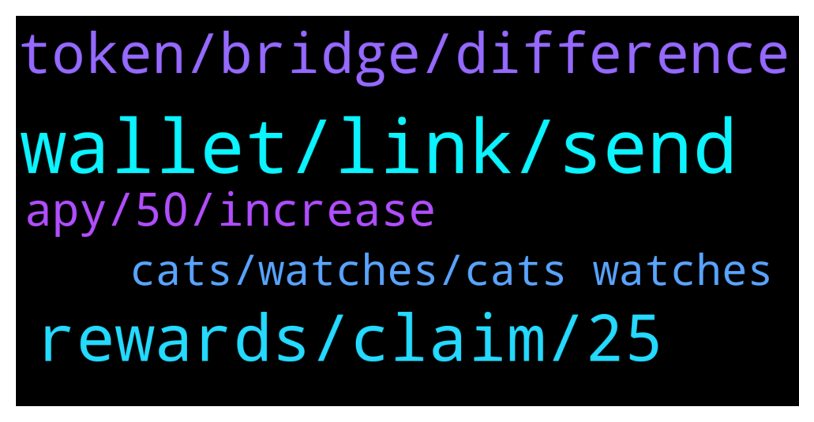

# **@dypfinance**
 ## Analysis for **2022-01-02** - **2022-01-03**.

---

## 📊 **Basic Stats**

**n_messages_sent**: 135

---

---

## 🔝 **Top keywords and related messages**

1. **wallet, link, send**

    @hemanrock --- *Please check this for BSC  https://youtu.be/2pOUmRTMN1o FARM  https://youtu.be/sYkoxGbpBi4 STAKE* **--->** [TG Discussion](https://t.me/dypfinance/236346)

    @Rodri2I --- *Olá pessoal, Por favor, se vocês souberem de alguma coisa sobre esta empresa, por favor, avise-me tanques.  Um amigo me apresentou hoje e eu disse: deixe-me tentar.   Espero que eles não nos enganem como os outros e fujam com todo o nosso dinheiro.* **--->** [TG Discussion](https://t.me/dypfinance/236381)

    @LawrenceUncharted2 --- *Hi everybody!   Allow me to introduce myself. My name is Lawrence, I am the head of marketing at Uncharted Group. We have been searching for projects which we would like to help to achieve the next level/get more exposure. That’s why we noticed this project. We have a marketing proposal for DeFi Yield Protocol.  Who can I send the proposal?  Please refer me to right person 😀  PS please take a look at our website: uncharted . group & we are a doxxed agency!* **--->** [TG Discussion](https://t.me/dypfinance/236254)

    @Yudo_tri_w --- *When Ama with Ceo Defi bro ? Its greats protocol, and survive for 1 year, Its great to making foward.* **--->** [TG Discussion](https://t.me/dypfinance/236099)

    @Jeffzon --- *I need a link to a launchpad.* **--->** [TG Discussion](https://t.me/dypfinance/236256)

    @Marinecommandoz --- *Any tutorial video for the staking and farming?* **--->** [TG Discussion](https://t.me/dypfinance/236343)

2. **rewards, claim, 25**

    @DhoniMSD516 --- *Hey @rzm9899 bot deleted your message, so to answer your question, when you deposited in AVAX farms 75% is converted to AVAX-iDYP LP and 25% DYP* **--->** [TG Discussion](https://t.me/dypfinance/236200)

    @JaySea99 --- *Hi, I have invested quite a bit of Eth in your Farm and was wondering what your strategy will be once Eth can no longer be mined probably 3rd quarter this year? How will rewards in Eth be maintained?.....or will Eth rewards stop altogether* **--->** [TG Discussion](https://t.me/dypfinance/236187)

    @DhoniMSD516 --- *I don't think Whales will effect the volatility, excuse me if I am wrong, you can deposit the amount you wish in the farm or stake and you will be earning rewards based on your share % of the pool and APY in farming and in staking it depends on APY* **--->** [TG Discussion](https://t.me/dypfinance/236527)

    @interwebgorilla --- *when you reinvest rewards on locked stake, does the unlock date remain the same?* **--->** [TG Discussion](https://t.me/dypfinance/236464)

    @Will --- *Hi I just withdrew my lp from 3 day lock avax v2 pool, my rewards were claimed automatically but I didn’t get the full amount?* **--->** [TG Discussion](https://t.me/dypfinance/236065)

    @appliepietrade --- *question: if i claim the farming rewards, i don't have to claim both at the same time, right?* **--->** [TG Discussion](https://t.me/dypfinance/236166)

3. **token, bridge, difference**

    @Q --- *Hey Everyone. Im struggling to find out the difference between DYP and iDYP* **--->** [TG Discussion](https://t.me/dypfinance/236333)

    @HawkeyeOz --- *tks sir, What is different of iDYP and DYP token?* **--->** [TG Discussion](https://t.me/dypfinance/236158)

    @Da --- *What is the difference between idyp and dyp?* **--->** [TG Discussion](https://t.me/dypfinance/236518)

    @HawkeyeOz --- *And Have the bridge for it (iDYP)?* **--->** [TG Discussion](https://t.me/dypfinance/236160)

    @alvindrajw --- *Buy guys dyp is listing in binance Insider news* **--->** [TG Discussion](https://t.me/dypfinance/236543)

    @MJMuppet_JayJay --- *I know it doesn't right now. Hence that I hope the team sees the importance from a stability perspective to have a bridge / arbitrage sooner rather then later🙏 Just my humble 2 cents on the matter!* **--->** [TG Discussion](https://t.me/dypfinance/236062)

4. **apy, 50, increase**

    @DhoniMSD516 --- *The APY is dynamic it might be low now but can increase in future* **--->** [TG Discussion](https://t.me/dypfinance/236442)

    @iamJubi --- *Hello. APY is dynamic, it could go lower or higher.* **--->** [TG Discussion](https://t.me/dypfinance/236145)

    @ThunderChaos --- *why is bsc dyp (locked for 90 days) got such low APY (29% instead of 50%) for a long time now. what is going on? i locked for 90 days expecting at least 50%..* **--->** [TG Discussion](https://t.me/dypfinance/236144)

    @v1ruzz --- *Ok but doesn't Apr generally increase with drop in prices* **--->** [TG Discussion](https://t.me/dypfinance/236457)

    @v1ruzz --- *My question too, what would cause increase in APR in general? I remember days ago it had come to same levels but suddenly increased to 600+ (BSC)* **--->** [TG Discussion](https://t.me/dypfinance/236454)

    @cryptocade --- *I jumped in the 90 day bsc pool because of the high apr and now it has the lowest. 🙄* **--->** [TG Discussion](https://t.me/dypfinance/236441)

5. **cats, watches, cats watches**

    @EnLaMira --- *ok but the rarity will impact how much you get of that 20% delivered to cat holders? or just the quantity of cats you hold* **--->** [TG Discussion](https://t.me/dypfinance/236055)

    @iamJubi --- *#NFTGiveaway time🐱  🔥10 lucky people will get a Cats and Watches Society #NFT which starts minting on January 17, 2022👇 https://dyp.finance/nft  Enter to win: ✅Retweet ✅Tag 3 friends that loves #NFTs ✅Follow @dypfinance ✅Join https://t.me/dypfinance  #NFTCommunity #NFTdrop  👉https://twitter.com/dypfinance/status/1475805248887439360* **--->** [TG Discussion](https://t.me/dypfinance/236198)

    @hemanrock --- *the rarity will be also based on the watch value. The cats' with more expensive watches will be rarer.* **--->** [TG Discussion](https://t.me/dypfinance/236054)

    @EnLaMira --- *20% delivered to the Cats and Watches Society members.* **--->** [TG Discussion](https://t.me/dypfinance/236050)

    @dmitry_nv86 --- *good day! tell me, NFT cats can be bought for $ 250 in the BSC network?* **--->** [TG Discussion](https://t.me/dypfinance/236232)

    @EnLaMira --- *or just the quantity of cats you will be holding?* **--->** [TG Discussion](https://t.me/dypfinance/236053)

