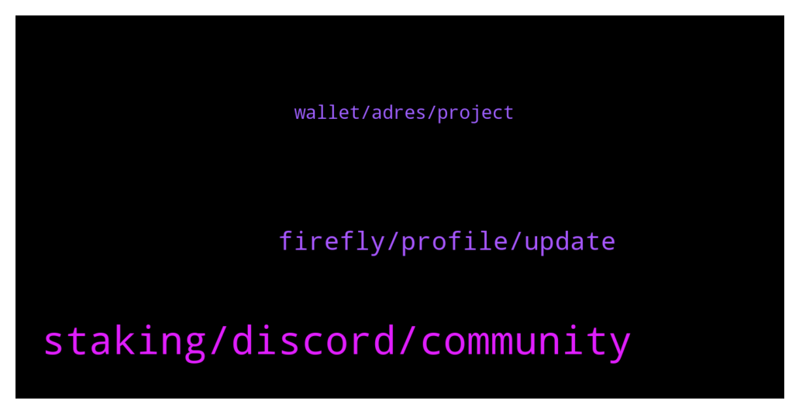

# **@iotatangle**
 ## Analysis for **2022-01-02** - **2022-01-03**.

---

## 📊 **Basic Stats**

**n_messages_sent**: 72

---

---

## 🔝 **Top keywords and related messages**

1. **staking, discord, community**

    @lalit1414 --- *Discord is very complicated to Join.. tried and tired* **--->** [TG Discussion](https://t.me/iotatangle/305622)

    @privat roth --- *Im in a coin the Group reaches 100k by 1 week* **--->** [TG Discussion](https://t.me/iotatangle/305634)

    @lalit1414 --- *But it takes weeks to reach 55k people on telegram* **--->** [TG Discussion](https://t.me/iotatangle/305631)

    @lalit1414 --- *There is no one even knows about iota staking.. I talked to 10 people half of them don’t even heard about IOTA.. very strange 😎* **--->** [TG Discussion](https://t.me/iotatangle/305537)

    @lalit1414 --- *Hello Navin why big influencer not covering IOTA staking?  It’s the only place where people get 2 different tokens by staking IOTA.. there couldn’t be better time to tell others.* **--->** [TG Discussion](https://t.me/iotatangle/305594)

    @lalit1414 --- *That’s the big reason for slow adoption* **--->** [TG Discussion](https://t.me/iotatangle/305629)

2. **firefly, profile, update**

    @Jasziu --- *Hi. I have problems with syncing my Firefly while stacking Iota. Any idea how to solve that ?* **--->** [TG Discussion](https://t.me/iotatangle/305660)

    @Tahmis --- *Firefly Desktop 1.3.1 has been released. This build contains a number of bug fixes and improvements. Update in app or download from https://firefly.iota.org.   Release is here: https://github.com/iotaledger/firefly/releases/tag/desktop-1.3.1 * Fix Ledger migration (#1900) * Update developer profile UX (#1908)         * Hide developer profile setting behind advanced option         * Warn when creating a developer profile          * Display informational banner in app when a dev profile is open          * Display current testnet name below receive address * Only display syncing block when staking if pending transaction can actually confirm (#1978) * Allow installation path selection on Windows (#1743) * Ensure partial stake merges don’t change staking address (#1918) * Display a warning when sending from a wallet that is below minimum rewards (#1918) * Ensure all node settings changes are saved when editing node url (#1910) * Fix staking time remaining display (#1826)  Fixes #1862, #1973* **--->** [TG Discussion](https://t.me/iotatangle/305600)

    @Basti --- *Anyone in here that successfully sent coins from kucoin to firefly und is able to help out @paintedwolf?* **--->** [TG Discussion](https://t.me/iotatangle/305565)

    @DMoneyShot --- *Updated my firefly wallet. Just released Update* **--->** [TG Discussion](https://t.me/iotatangle/305625)

    @cryptoluvr --- *I get an error on firefly wallet and can’t see the tokens I get from staking* **--->** [TG Discussion](https://t.me/iotatangle/305538)

    @Tahmis --- *Check above picture and make a new profile on firefly without checking developer profile  check box* **--->** [TG Discussion](https://t.me/iotatangle/305508)

3. **wallet, adres, project**

    @JJ0111101 --- *ive looked at the roadmap but it says complete, i still have to get a new adres every transaction, how come not implemented yet?* **--->** [TG Discussion](https://t.me/iotatangle/305526)

    @PabloEscoin --- *yea haha i have now tested it works* **--->** [TG Discussion](https://t.me/iotatangle/305655)

    @Tahmis --- *Wallet does that because of privacy reasons. Though I think in next wallet upgrade they are going to make that optional feature* **--->** [TG Discussion](https://t.me/iotatangle/305528)

    @Tahmis --- *Go to settings and switch node management from automatic to manual and it should work* **--->** [TG Discussion](https://t.me/iotatangle/305669)

    @eduinZarc55 --- *Hello comunity, eo you know of #stageholders is trustly project..have you already download chiva wallet?* **--->** [TG Discussion](https://t.me/iotatangle/305662)

    @PabloEscoin --- *Binance now working for withdraw ?* **--->** [TG Discussion](https://t.me/iotatangle/305642)

