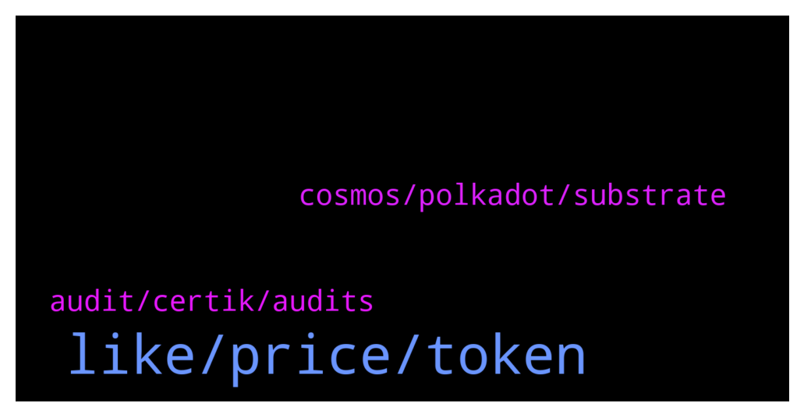

# **@lobsters_chat**
 ## Analysis for **2022-01-02** - **2022-01-03**.

---

## 📊 **Basic Stats**

**n_messages_sent**: 255

---

---

## 🔝 **Top keywords and related messages**

1. **like, price, token**

    @corp399 --- *https://ftmscan.com/token/0xf6c038dd7034b79fac8b6164a713412ac2d8ce09#writeContract  Seems like sommone deploy scam 'FROG' already lol Don't handle with this shit* **--->** [TG Discussion](https://t.me/lobsters_chat/312399)

    @SilkCE --- *The best strategies in DeFi for stablecoins  Aave (with leverage): Yield: 4–6% (lending interest + AVAX/MATIC rewards)  mStable: 10–20% (lending interest + swap fees + MTA rewards)  Liquity LUSD Stability Pool: 12% (ETH + LQTY rewards)  Maple Finance: 14.9%–28.5% (lending interest)  Anchor Protocol: 18%–20% (staking rewards + yield reserve)  Orion Money: 13.5%–20% (staking rewards + yield reserve + ORION rewards)  yEarn MIM-UST Vault: 21% (swap fees + CRV rewards + CVX rewards)  Trader Joe USDC.e / USDC LP: 21% (swap fees + JOE rewards)  Ribbon Finance USDC Put Selling Strategy: 19% –23% (option writing premium)  Abracadabra UST-MIM Degenbox: 20% – 156% (leveraged staking rewards + yield reserve)  —  https://stakingbits.medium.com/the-best-strategies-in-defi-for-stablecoins-e2ee102da1c4* **--->** [TG Discussion](https://t.me/lobsters_chat/312179)

    @ivangbi --- *^ ctrl+f for more ser @MrMcflunday* **--->** [TG Discussion](https://t.me/lobsters_chat/312057)

    @PmRiviere --- *to be fair after a quick check it looked legit + no token. @Cryptocamel you can probably repost if there s something constructive to say about this* **--->** [TG Discussion](https://t.me/lobsters_chat/312138)

    @vasilysumanov --- *Maybe people need to prove it first with models?  If you want to say that tokenomics is cool please share model & calculations* **--->** [TG Discussion](https://t.me/lobsters_chat/312322)

    @vesamm --- *only downside is cant get profit out before 12hr or 1.5% price movement of the asset. otherside pool would be drained by bots (they tried with no limits before in earlier project)  ☝️also Avalanche launch in 3 days* **--->** [TG Discussion](https://t.me/lobsters_chat/312264)

2. **cosmos, polkadot, substrate**

    @Swader --- *No, Cosmos is very much a chain, a hub bridging other chains.* **--->** [TG Discussion](https://t.me/lobsters_chat/312104)

    @Swader --- *Substrate is the framework on which Polkadot and Kusama are built, yes.* **--->** [TG Discussion](https://t.me/lobsters_chat/312099)

    @tatai_007 --- *So substrate is to polkadot, what tendermint is to cosmos.* **--->** [TG Discussion](https://t.me/lobsters_chat/312107)

    @Swader --- *Cosmos is built on its own SDK/tech, just like Polkadot is on Substrate* **--->** [TG Discussion](https://t.me/lobsters_chat/312105)

    @tatai_007 --- *So this is where I get confused about Cosmos all the time, I thought Cosmos was just an SDK that you can use to create blockchains. It doesn't have a chain itself.* **--->** [TG Discussion](https://t.me/lobsters_chat/312103)

    @tatai_007 --- *Also, I don't know why this never comes on Google when I searched for Cosmos vs polkadot comparison. Explains most of my doubts pretty well.* **--->** [TG Discussion](https://t.me/lobsters_chat/312110)

3. **audit, certik, audits**

    @Oxc4t --- *Is multiple audits from Certik worse or better than one audit from them? Can't decide.* **--->** [TG Discussion](https://t.me/lobsters_chat/312268)

    @ivangbi --- *(everyone else is fine, it’s just that they really don’t audit anything - currently)* **--->** [TG Discussion](https://t.me/lobsters_chat/312301)

    @ivangbi --- *Ctrl+f on audit discussions here please [others can’t answer cause this was talked over many times].  And aave is audited by certik as just “one of” they don’t rely on those at all.* **--->** [TG Discussion](https://t.me/lobsters_chat/312318)

    @awnyrvan --- *That’s very interesting. A shit ton of projects including aave et al are audited by certik.  All I meant is all the versions of contracts are audited, and yes as of now they used certik to audit.  Whom do you recommend for auditing? Trail of bits?* **--->** [TG Discussion](https://t.me/lobsters_chat/312316)

    @ivangbi --- *@awnyrvan ser please tone down the shilling, it’s a bit too much now. There is valid cticism that certik is shit ass fuckery moronic auditing team, and if you make an audit with it even 10 times - it doesn’t change that fact. If that’s your reasoning to say that is good security approach - you are digging one for yourself. Otherwise, all fine* **--->** [TG Discussion](https://t.me/lobsters_chat/312300)

    @awnyrvan --- *Haha. Jokes aside, multiple audits come because this project follows a strict practice of full audit every time they release an upgraded contract. Scores have been very high - I think among top 5 or top 10 audit scores on certik website* **--->** [TG Discussion](https://t.me/lobsters_chat/312297)

