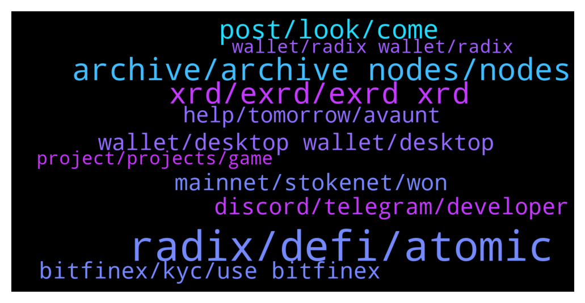

# **@radix_dlt**
 ## Analysis for **2022-01-02** - **2022-01-03**.

---

## 📊 **Basic Stats**

**n_messages_sent**: 877

---

---

## 🔝 **Top keywords and related messages**

1. **radix, defi, atomic**

    @Bernardo --- *I am a believer and I am staking a lot of my crypto money on XRD.  Having said that, I was talking to investors about Radix.  And at the end they were not convinced of the valuation/track record since we only have the mainnet on production (with some issues like the validator node overload).  And a Scrypto emulator.  Hopefully we will deliver consistently on 2022.  Any arguments to the contrary that I can pass along?* **--->** [TG Discussion](https://t.me/radix_dlt/331577)

    @Jazzer9F --- *🎉NEW RADIX REPORT IS NOW LIVE!🎉  In the last Radix Report of 2021 we have some juicy updates from the marketing and development teams, plus news on the latest efforts from the Radix Marketing Council.  Full Report: https://www.radixdlt.com/post/radix-report-9th-december* **--->** [TG Discussion](https://t.me/radix_dlt/332490)

    @groovelight --- *what is the roadmap in details for 2022 for radix* **--->** [TG Discussion](https://t.me/radix_dlt/331777)

    @Buchi --- *i am in the uk and unfortunately there are no exchanhes for radix* **--->** [TG Discussion](https://t.me/radix_dlt/332613)

    @mx471 --- *I don't know about all parts of the crypto gaming sector, but Radix should be able to handle a few things of that.   https://t.me/RadixDevelopers/16890 https://t.me/radix_dlt/321410 https://t.me/radix_dlt/321417* **--->** [TG Discussion](https://t.me/radix_dlt/332352)

    @mx471 --- *https://t.me/radix_dlt/263661 "Avalanche supports atomic multi-asset transactions." Is this actually the case by now?* **--->** [TG Discussion](https://t.me/radix_dlt/332147)

2. **archive, archive nodes, nodes**

    @Artistizen --- *Alternative archive nodes list: https://www.radixscan.io/EmmogluStakeryArchiveNode.shtml  RADIX TEAM TRIBUTE NFTs  74 Collectors 56 Option Traders 130 Group Members  Telegram Group* **--->** [TG Discussion](https://t.me/radix_dlt/331864)

    @Mleekko --- *Archive nodes are slow and are supposed to be replaced by the new API (which is much faster). looks like there was a surge in wallet/explorer usage around New Year and  this is causing the issues.* **--->** [TG Discussion](https://t.me/radix_dlt/332400)

    @ahsimon --- *Its a good question, but one I don't expect a definitive answer to until we are closer to Xi'an release.  Only with Xi'an is your scenario of 10,000 nodes even possible.  My best guess is that Xi'an will come with a whole new approach for validator and archive node business models.  And we will learn more about them as we approach 2023 EOY, and will have plenty of time to discuss before it is used.  One possible approach makes your questions moot.  Specifically one can allow any wallet owner to be responsible for their own node functionality.  That way you don't have to "trust" a validator or archive node you probably know nothing about.  You just have to trust that the code that allows you to upgrade to a new wallet has been audited, and has some form of spoof-proof update process, perhaps using a 2FA.    One future difference in the validator/node/archive model could be that it does not depend on 24/7 availability of your built-in node.  If you close your wallet when you are done with it, either for security reasons or to save battery life on your mobile, you have to anticipate some delay between when you load your wallet the next time and when it is ready for full use again.  During this delay your local archive node re-synchs with the Radix ledger before you can use it again.  You can avoid this start-up delay by keeping your wallet open until you are no longer actively using it.  I think you can see this effect today when you use https://radix.stream/.  I remember seeing it on some older software wallets I have used sporadically, such as iirc Daedalus.  The only other approach I know of is to provide some financial incentive for third party "trusted" node runners to run a 24/7 archive node (or load balanced archive node pool) for you (and others).  That is, for a zero delay archive node service to be self-supporting those users who want it must somehow pay for it.* **--->** [TG Discussion](https://t.me/radix_dlt/331557)

    @fpieper --- *https://status.radixdlt.com/  when will the current issues with the archive nodes be resolved?* **--->** [TG Discussion](https://t.me/radix_dlt/331389)

    @mx471 --- *There is a problem with the wallet that if you haven't set it up yet, you can't do anything. Unfortunately, not even to change the archive node. Could the development team perhaps provide a small hotfix, with which one can still change the archive node before the initial setup?* **--->** [TG Discussion](https://t.me/radix_dlt/332343)

    @fpieper --- *No, I am from Germany 😜.  Also this is the documentation regarding the archive API https://docs.radixdlt.com/main/node-api/introduction.html  (The docs are just a bit thin on how to sign exactly, but that's already implemented by my wallet lib). You will find the action to send in the documentation there 👍* **--->** [TG Discussion](https://t.me/radix_dlt/332477)

3. **xrd, exrd, exrd xrd**

    @Avaunt --- *L1 native crypto are generally referred to as 'coins'. XRD is a coin, eXRD is a token. But people quite often use either to describe the same thing.* **--->** [TG Discussion](https://t.me/radix_dlt/331497)

    @DeepFuckingValeu --- *Just send your xrd to a new wallet. Done.* **--->** [TG Discussion](https://t.me/radix_dlt/331418)

    @Shane_Larson --- *Hey y'all. I'm trying to find a guide on how to swap EXRD for XRD on bitfinex.  Currently my ERXD is sitting on Kucoin, but I have decided it's time to convert to XRD and stake it. I'd love some help from anyone willing to offer.* **--->** [TG Discussion](https://t.me/radix_dlt/332505)

    @Flint --- *xrd are not junk tokens 😐* **--->** [TG Discussion](https://t.me/radix_dlt/331424)

    @Adam --- *So XRD is the main token* **--->** [TG Discussion](https://t.me/radix_dlt/331485)

    @DukiMKD --- *Hello, i have EXRD on Kucoin, i want to convert them to XRD so i can stake. I live in Usa so I can’t use bitfinex. What would be the cheapest way to convert them to xrd ?  Thank you* **--->** [TG Discussion](https://t.me/radix_dlt/332084)

4. **post, look, come**

    @Peter (HAM) --- *He already told me. Nice that you were right!* **--->** [TG Discussion](https://t.me/radix_dlt/332007)

    @fpieper --- *Where does this come from? It is quite funny 😂* **--->** [TG Discussion](https://t.me/radix_dlt/332008)

    @NotBen --- *Have you seen Don't Look Up?* **--->** [TG Discussion](https://t.me/radix_dlt/332259)

    @mx471 --- *How do you actually know so much?* **--->** [TG Discussion](https://t.me/radix_dlt/332186)

    @Buchi --- *is it wise to share my 12 phrase with someone else* **--->** [TG Discussion](https://t.me/radix_dlt/332576)

    @Magal36 --- *Yes, it does, what do you mean?* **--->** [TG Discussion](https://t.me/radix_dlt/332853)

5. **discord, telegram, developer**

    @Clement --- *Russell just updated the community on discord: https://discord.com/channels/417762285172555786/421646460258615317/927365350885048370* **--->** [TG Discussion](https://t.me/radix_dlt/332428)

    @Tokyorider1611 --- *Russel posted a note on discord which explains a lot. Would be great to see this info posted/pinned here as well @Adam_XRD* **--->** [TG Discussion](https://t.me/radix_dlt/332572)

    @MattToTheMoon --- *Is there a developer / node runner telegram group or is that just in discord?* **--->** [TG Discussion](https://t.me/radix_dlt/331506)

    @sheershaka --- *hey is anyone participating in the alexandria launch creative competition. the discord link seems to be broken* **--->** [TG Discussion](https://t.me/radix_dlt/332323)

    @Radstakes --- *Sure, please can you ask your question in the developer telegram: https://t.me/RadixDevelopers* **--->** [TG Discussion](https://t.me/radix_dlt/332179)

    @Radstakes --- *Hi, are you referring to the developer signup?  Did you signup with your Github account here: https://developers.radixdlt.com/devprogram* **--->** [TG Discussion](https://t.me/radix_dlt/332166)

6. **wallet, desktop wallet, desktop**

    @madafak_avril14th --- *Thanks, useful. The work on this wallet is impressive* **--->** [TG Discussion](https://t.me/radix_dlt/332049)

    @nachodon --- *can someone tell me the current version of desktop wallet.   i have 1.2.6   everything is unresponsive or showing null set on mouse over* **--->** [TG Discussion](https://t.me/radix_dlt/332004)

    @Magal36 --- *Soon wallet issues will be a thing of the past* **--->** [TG Discussion](https://t.me/radix_dlt/332050)

    @BlAzAk --- *No, it's not a wallet bug* **--->** [TG Discussion](https://t.me/radix_dlt/332333)

    @bakerlovespibb --- *Why cant I access my desktop wallet?* **--->** [TG Discussion](https://t.me/radix_dlt/332167)

    @ADYBER --- *Heyyy Guy what what happened with my wallet?* **--->** [TG Discussion](https://t.me/radix_dlt/331640)

7. **mainnet, stokenet, won**

    @Diablodalmabuena --- *I have deleted the Wallet and reinstalled it.  but it won't let me put the mainnet.  It has stayed in stokenet and I cannot see my balance.  I did an unstake a few days ago and I'm worried that I won't be able to see my tokens* **--->** [TG Discussion](https://t.me/radix_dlt/331474)

    @Osterzone007 --- *What's de difference between mainnet and stokenet?* **--->** [TG Discussion](https://t.me/radix_dlt/332306)

    @ADYBER --- *Change the node ? move to the Stokenet?* **--->** [TG Discussion](https://t.me/radix_dlt/331647)

    @Pezburger --- *In the box with stokenet, delete that & type- https://api.radix.community* **--->** [TG Discussion](https://t.me/radix_dlt/331880)

    @Natasha --- *I've deleted radixscan and still it's saying invalid network when I press mainnet* **--->** [TG Discussion](https://t.me/radix_dlt/331829)

    @Avaunt --- *p.s. Stokenet is the test network so don't use that* **--->** [TG Discussion](https://t.me/radix_dlt/331828)

8. **bitfinex, kyc, use bitfinex**

    @Magal36 --- *I don't advise using Bitfinex over a VPN* **--->** [TG Discussion](https://t.me/radix_dlt/331991)

    @Adam --- *Bitfinex is a pain, the sign up process is a nightmare* **--->** [TG Discussion](https://t.me/radix_dlt/331472)

    @da0man --- *also can’t use bitfinex from my country so no choice* **--->** [TG Discussion](https://t.me/radix_dlt/331791)

    @Avaunt --- *You can use Bitfinex from the UK* **--->** [TG Discussion](https://t.me/radix_dlt/332616)

    @Adam --- *Strange it's asking me to do KYC to deposit a stablecoin* **--->** [TG Discussion](https://t.me/radix_dlt/331510)

    @LetLoveLeadYou --- *I honestly do not know how to use Bitfinex exchange, it’s so confusing you know. How do I trade on it?* **--->** [TG Discussion](https://t.me/radix_dlt/331467)

9. **help, tomorrow, avaunt**

    @Flint --- *Gotcha! Yeah that works work except I like a couple of them 😁* **--->** [TG Discussion](https://t.me/radix_dlt/331428)

    @Metacheez --- *Thanks for your help, I'll take a look 👍* **--->** [TG Discussion](https://t.me/radix_dlt/332354)

    @Jacob_XRD --- *No problem, I will get a new link shortly* **--->** [TG Discussion](https://t.me/radix_dlt/332340)

    @lalelilulos --- *Thank AVaunt! Have a good day :-)* **--->** [TG Discussion](https://t.me/radix_dlt/332760)

    @Metacheez --- *Thanks for that, I'll take a look 👍* **--->** [TG Discussion](https://t.me/radix_dlt/332303)

    @pastet89 --- *Cool, thanks! Also thanks to Marcus William and @fpieper for their help!* **--->** [TG Discussion](https://t.me/radix_dlt/332719)

10. **wallet, radix wallet, radix**

    @Adam_XRD --- *FYI - closed the issue on status.radixdlt.com about the wallet/explorer, seems fixed now :)* **--->** [TG Discussion](https://t.me/radix_dlt/332711)

    @Natasha --- *Actually I found it. Yesterday when wallet was down I followed steps to change to radixscan. But when I try to change to Mainet it won't allow me to?* **--->** [TG Discussion](https://t.me/radix_dlt/331819)

    @yoplay --- *radix wallet not opening since yesterday. is this a widespread issue?* **--->** [TG Discussion](https://t.me/radix_dlt/332324)

    @Zarick --- *Radix wallet has been down all day. Has team acknowledged it/provided timeline for fix?* **--->** [TG Discussion](https://t.me/radix_dlt/331792)

    @Radstakes --- *There's no ETA from the team unfortunately but they are aware.  Any updates should be posted up on status.radixdlt.com  If you want to check your wallet in the meantime, you can use an alternative explorer on Radixscan: https://www.radixscan.io/JSONExplorer.shtml* **--->** [TG Discussion](https://t.me/radix_dlt/331550)

    @mx471 --- *#walletissue - If you are having issues connecting with the Radix wallet, you can try to use an alternative community node in the wallet settings (see image for example)  Archive Node Addresses: https://radixtalk.com/t/what-community-archive-nodes-can-i-use-with-the-radix-desktop-wallet/156  Explorer Alternatives: https://radixscan.io* **--->** [TG Discussion](https://t.me/radix_dlt/332362)

