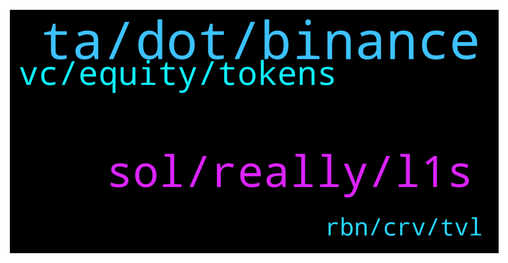

# **@shitpool**
 ## Analysis for **2022-01-02** - **2022-01-03**.

---

## 📊 **Basic Stats**

**n_messages_sent**: 137

---

---

## 🔝 **Top keywords and related messages**

1. **ta, dot, binance**

    @evonMP --- *Surprised it's not on binance, they have kind of big community now* **--->** [TG Discussion](https://t.me/shitpool/713386)

    @goldencatpat --- *my entry was earl(ish) but not spectacular* **--->** [TG Discussion](https://t.me/shitpool/713441)

    @MoneroPal --- *If you’re refering to TA, sigh, just the very fact that you’re refering to TA…* **--->** [TG Discussion](https://t.me/shitpool/713509)

    @Horselorde --- *I sold my DOT today lmao* **--->** [TG Discussion](https://t.me/shitpool/713475)

    @goldencatpat --- *better stick to the spx mate* **--->** [TG Discussion](https://t.me/shitpool/713531)

    @spaceVersity --- *Not all of us are clowns 😅😅😅.. Thank you Sir and God bless😭🙌* **--->** [TG Discussion](https://t.me/shitpool/713532)

2. **sol, really, l1s**

    @goldencatpat --- *no, its over for sol too* **--->** [TG Discussion](https://t.me/shitpool/713496)

    @MoneroPal --- *lol you have no clue brah, let me guess, Avalache is the new holy savior, there won’t be one overwhelmingly dominant L1. Hyper fragmentation coming for private and public chains, SOL definitely is not going absolutely anywhere, Terra and Solana will likely be top 3 along with ETH. Stables, institutional platforms, and well ETH.* **--->** [TG Discussion](https://t.me/shitpool/713499)

    @BeAMightyKing --- *I've been looking into Velas (VLX): Solana fork with their own EVM implementation, & Casper Network as of lately.  By "looking into" I mean I most likely won't buy until they > 10x and land on Binance, then cry later* **--->** [TG Discussion](https://t.me/shitpool/713384)

    @BeAMightyKing --- *There's also Kadena, initially mentioned here a thousand years ago, and Hathor. Both PoW L1s* **--->** [TG Discussion](https://t.me/shitpool/713387)

    @BeAMightyKing --- *hehe yeah I remember Kadena chopped up a good chunk of us in summer 2020, especially when they tanked on the Bittrex listing after Coinbase rumors for months* **--->** [TG Discussion](https://t.me/shitpool/713397)

    @BlockChainUp --- *Firstly, I dint said it is over for Sol, you said. Avax I just dont know.... My 2022 thesis is ETH is old tech* **--->** [TG Discussion](https://t.me/shitpool/713502)

3. **vc, equity, tokens**

    @MoneroPal --- *Almost all crypto VC’s invest solely in equity not tokens* **--->** [TG Discussion](https://t.me/shitpool/713550)

    @spaceVersity --- *What do you invest in Sir, equity or tokens?* **--->** [TG Discussion](https://t.me/shitpool/713555)

    @MoneroPal --- *Majority do invest in equity only, rarely tokens* **--->** [TG Discussion](https://t.me/shitpool/713554)

    @MoneroPal --- *Many dear ser are you in the VC space? Most VC’s do not want liquidity. They also need to be able to onboard investors and do things compliantly so equity is preferred. Most VC’s, even crypto focused, are registered in their respective jursidictions to onboard investors including offshore (BVI and so on) feeder funds. A few “vc’s” popped up, the gp was just some nobody who made a bit of money apeing his 9-5 salary into crypto, no even legal entity behind the funds.* **--->** [TG Discussion](https://t.me/shitpool/713558)

    @BeAMightyKing --- *Which majority invest in equity only?* **--->** [TG Discussion](https://t.me/shitpool/713556)

    @spaceVersity --- *I agree with you, but disagree with your statement saying "it's far harder to build wealth"* **--->** [TG Discussion](https://t.me/shitpool/713547)

4. **rbn, crv, tvl**

    @Gregoranus --- *Makes sense, pretty much what RBN is though I believe, check it out, correct me if I’m wrong ser.* **--->** [TG Discussion](https://t.me/shitpool/713624)

    @Gregoranus --- *Comparing the info on CoinGecko, (MC, FDV, TVL, supply etc.) I have settled on RBN.* **--->** [TG Discussion](https://t.me/shitpool/713614)

    @Gregoranus --- *For this reason I have been looking for the next DeFi gem, try and catch it early. The next CRV or even the next AAVE. I landed on two DAO tokens RBN (Ribbon Finance) & MNGO (Mango).* **--->** [TG Discussion](https://t.me/shitpool/713613)

    @Gregoranus --- *Okay,  I said I might expand my shill on $RBN depending on what I find. So far I have only looked at the numbers, digging into the team next.* **--->** [TG Discussion](https://t.me/shitpool/713611)

    @Gregoranus --- *I have one similar that I see as another CRV, I’m doing some digging on them to compare and pick a side. Already aped in but might add more after a good look. Already doing okay but check out yourself. $RBN, Ribbon finance. Might shill a bit more when I have had a better look.* **--->** [TG Discussion](https://t.me/shitpool/713458)

    @Gregoranus --- *RBN/MNGO/CRV  TS: 1B/5B/1.7B MC/TVL: 0.54/2.39/0.1 FDV/TVL: 11.13/11.81/0.82  Potential if it reaches CRV Cap Approx 16x/12x* **--->** [TG Discussion](https://t.me/shitpool/713615)

