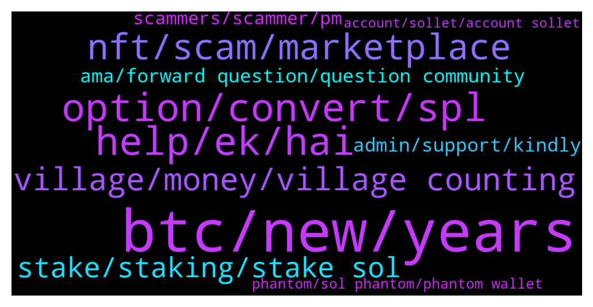

# **@solana**
 ## Analysis for **2022-01-02** - **2022-01-03**.

---

## 📊 **Basic Stats**

**n_messages_sent**: 325

---

---

## 🔝 **Top keywords and related messages**

1. **btc, new, years**

    @RexFactorem --- *Do anyone realistically believe Solana can overtake Ethereum?* **--->** [TG Discussion](https://t.me/solana/886747)

    @Folaross --- *Validators form the backbone of Solana’s network. By processing transactions and participating in consensus, each validator helps make Solana the most high-performance blockchain network in the world.  Check here for more details about Validator - https://solana.com/validators* **--->** [TG Discussion](https://t.me/solana/886824)

    @mahib45 --- *Hello! there is no docs or articles that talk about Solana roadmap. Check out docs.solana.com to get knowledge on the future goals and aims of the project.  You can also check out Solana latest releases here -  https://github.com/solana-labs/solana/releases for latest releases.* **--->** [TG Discussion](https://t.me/solana/887561)

    @Candis67 --- *Whales are promoting their project coin now , expect more dip in Bitcoin, sol and Ethereum* **--->** [TG Discussion](https://t.me/solana/886997)

    @ArbForLife --- *Hello everyone and happy new year. I would like to ask you if there is any roadmap or any thought about creating a light client in order to just run a local RPC node (without validation of the blocks) with very common PC specs. Thanks* **--->** [TG Discussion](https://t.me/solana/886372)

    @cryptolover1987 --- *Hello! there is no docs or articles that talk about Solana roadmap. Check out docs.solana.com to get knowledge on the future goals and aims of the project.  You can also check out Solana latest releases here -  https://github.com/solana-labs/solana/releases for latest releases.* **--->** [TG Discussion](https://t.me/solana/886659)

2. **option, convert, spl**

    @Folaross --- *Check it out link below on how you can buy SOL here - https://coinmarketcap.com/currencies/solana/markets/  Or https://www.coingecko.com/en/coins/solana#markets  You can also buy on DEXs by connecting your wallet with DEXs. For DEXs - https://t.me/solana/481292   Please note that our admins won't DM you first* **--->** [TG Discussion](https://t.me/solana/886924)

    @Tyranny5000 --- *i have eth.. how do i buy sol? with dex* **--->** [TG Discussion](https://t.me/solana/888303)

    @Monterrey_Rice --- *Solflare has a burn option https://twitter.com/solflare_wallet/status/1472200556596895746?s=21* **--->** [TG Discussion](https://t.me/solana/886298)

    @Tyranny5000 --- *can i use anyswap? to go from eth to sol* **--->** [TG Discussion](https://t.me/solana/888309)

    @Monterrey_Rice --- *Yeah it’s annoying. Solflare has a burn option https://twitter.com/solflare_wallet/status/1472200556596895746?s=21* **--->** [TG Discussion](https://t.me/solana/887183)

    @Bernardo --- *dose anybody know how to earn solana online? trying to buy a 50 in tv for my xbox* **--->** [TG Discussion](https://t.me/solana/887589)

3. **help, ek, hai**

    @Candis67 --- *Actually you know nothing, explaining to you will take my time. I'm busy actually* **--->** [TG Discussion](https://t.me/solana/888097)

    @Xabi --- *Maybe, or maybe you dont know how to explain your self aproppiately 🤷‍♂* **--->** [TG Discussion](https://t.me/solana/887994)

    @Mute --- *That's why i asked, trying to find something more suitable for me* **--->** [TG Discussion](https://t.me/solana/886898)

    @Nicholas --- *namaste bhaiyon. mujhe laabh kamaane aur apane jeevan ko behatar banaane ke lie ek samaadhaan mil gaya hai. krpaya mujhe ek sandesh bhejen yadi aisa hai to main aapako bhee dikha sakata hoon* **--->** [TG Discussion](https://t.me/solana/886767)

    @JenniferWiegand11 --- *And what makes you think I'm selling stuffs?* **--->** [TG Discussion](https://t.me/solana/887717)

    @Charles_lily --- *What do you need help for* **--->** [TG Discussion](https://t.me/solana/888210)

4. **nft, scam, marketplace**

    @mahib45 --- *Hello 👋  There is no NFT giveaway or event ongoing! Beware of scam* **--->** [TG Discussion](https://t.me/solana/886399)

    @mahib45 --- *Hello 👋  There is no NFT giveaway! Beware of scam* **--->** [TG Discussion](https://t.me/solana/886261)

    @MachoTyrant --- *Hey guys . I have a question. Just in advance I want to warn scammers I'll report them in 20 different ways  Did anyone receive a free Christmas/holidays NFT from solflare/solend ? It seems to be legit but is it worth anything ?* **--->** [TG Discussion](https://t.me/solana/886254)

    @cryptomandingo --- *Just noticed a Sol NFT gift in my wallet. Apparently they were sent out to 300k holders but only 1500 were minted. Is this legitimate?* **--->** [TG Discussion](https://t.me/solana/887879)

    @Yan --- *Hi someone send an nft mint from officialsoldrop to my phantom account, is it a legit solana team? Thanks* **--->** [TG Discussion](https://t.me/solana/888238)

    @mahib45 --- *Solana NFT marketplace :  1️⃣ Metaplex Metaplex is a decentralized protocol that will allow creators to mint and auction non-fungible tokens on the Solana blockchain.   🔗 https://www.metaplex.com  2️⃣ Lollapalooza  🔗 https://lollapalooza.live-nfts.com  3️⃣ Solanart Solanart is the first fully-fledged NFT marketplace on Solana. Get quick and easy access to digital collectibles and explore, buy and sell NFTs from different collections and artists.  🔗 https://solanart.io  4️⃣ Solarians The very first NFT on Solana   🔗 https://solarians.click/  5️⃣ Frakt FRAKT is the first generative art NFT collection on Solana.  🔗 https://frakt.art* **--->** [TG Discussion](https://t.me/solana/887426)

5. **village, money, village counting**

    @Sandra --- *Your village counting on you , cause of 2 Sol.* **--->** [TG Discussion](https://t.me/solana/888041)

    @Heybuddy6 --- *Hi I just got 2 solana is this a good investment? my whole village is counting on me* **--->** [TG Discussion](https://t.me/solana/888026)

    @Sven --- *You're Village is worth Only 2 Sol??* **--->** [TG Discussion](https://t.me/solana/888034)

    @Solamander --- *Canwe have 1000$ sol this month please 🥺* **--->** [TG Discussion](https://t.me/solana/886420)

    @Trader_leonardfx --- *There’s an opportunity for y’all to make 10x your money in few hours just massage me if interested thank you* **--->** [TG Discussion](https://t.me/solana/887042)

    @bbeccaria --- *Until your wife finds out where you are investing her money. Then it is game over and a force liquidation. 😂* **--->** [TG Discussion](https://t.me/solana/887128)

6. **stake, staking, stake sol**

    @dives12 --- *How do I stake my sol?* **--->** [TG Discussion](https://t.me/solana/888299)

    @cryptosnick --- *I stake on ftx, anyone know where the highest yield is?* **--->** [TG Discussion](https://t.me/solana/887594)

    @PapaPinkPanda --- *there's a number of DeFi options. I personally leverage stake SOL-USDC on Tulip and Francium but I also took that position at like $150.   Lower risk, you can stake sol to stSol (get like 6%) and then stake that stSol to Francium for another 7% on top of that. stSol I think takes like 3 days to get unstaked.  I'm experimenting with sol covered calls, pretty high return (30-40% APY) but looks like that's still pretty immature* **--->** [TG Discussion](https://t.me/solana/887606)

    @jcr712 --- *Read this but I don’t think you will loose your actual SOL coins in staking if it’s staked with a reputed Validator* **--->** [TG Discussion](https://t.me/solana/887364)

    @Dome --- *Theres liquidity and native sol staking which is to stake SOL* **--->** [TG Discussion](https://t.me/solana/886819)

    @alexDcrypto --- *Staking directly on chain with a decentralised validator, you will get the max APR. Right now is around 7% and if you haven't choose yet a validator, you can count on us, stake2earn 🌜🙌* **--->** [TG Discussion](https://t.me/solana/887877)

7. **ama, forward question, question community**

    @mahib45 --- *Hello 👋  What's the issue are you having?* **--->** [TG Discussion](https://t.me/solana/887560)

    @elsamnodey --- *Hello i want to submit ama proposal collaboration. Who can i contact?* **--->** [TG Discussion](https://t.me/solana/887327)

    @Xabi --- *What do you mean with their project? Which project are you speaking about?* **--->** [TG Discussion](https://t.me/solana/887117)

    @mahib45 --- *Please forward your question to their community* **--->** [TG Discussion](https://t.me/solana/888298)

    @mahib45 --- *Hello!  1️⃣ https://solana.com/ecosystem  2️⃣ https://twitter.com/Solana_Mates (Latest updates on new projects)  3️⃣ https://solanabeach.io/tokens* **--->** [TG Discussion](https://t.me/solana/887578)

    @BonkieBas --- *Hey good morning folks!! If you like to get a new passive stream of income📩me😃* **--->** [TG Discussion](https://t.me/solana/887679)

8. **admin, support, kindly**

    @mahib45 --- *Kindly submit a ticket for help from their support team!  https://help.phantom.app/hc/en-us/requests/new* **--->** [TG Discussion](https://t.me/solana/887860)

    @p_zal --- *Dear admin.  In this group full of hackers.  They want us to connect the wallet* **--->** [TG Discussion](https://t.me/solana/887900)

    @mahib45 --- *Hello 👋  I already replied to you! You should forward your issue to Huobi tech support* **--->** [TG Discussion](https://t.me/solana/887502)

    @cryptolover1987 --- *Kindly submit a ticket for help from their support team!  https://help.phantom.app/hc/en-us/requests/new* **--->** [TG Discussion](https://t.me/solana/888242)

    @cryptotripping --- *Is there any admin in this tg?* **--->** [TG Discussion](https://t.me/solana/886634)

    @Rohit1803 --- *Don't drop link here other you  are ban by admin* **--->** [TG Discussion](https://t.me/solana/886563)

9. **scammers, scammer, pm**

    @Folaross --- *Please beware of scammers and impersonators account that PM you first. Our admins will never PM you first.* **--->** [TG Discussion](https://t.me/solana/887917)

    @mahib45 --- *They are scammers! Never DM! This is a new way of scam! ❤* **--->** [TG Discussion](https://t.me/solana/886412)

    @Charles_lily --- *Be careful because of the scammers* **--->** [TG Discussion](https://t.me/solana/888215)

    @jcr712 --- *Get out from here and learn some manners first you’re a SCAMMER* **--->** [TG Discussion](https://t.me/solana/886637)

    @cryptotripping --- *This guy is a known scammer* **--->** [TG Discussion](https://t.me/solana/886628)

    @mahib45 --- *This is a scam! Just don't fall into it!* **--->** [TG Discussion](https://t.me/solana/886413)

10. **phantom, sol phantom, phantom wallet**

    @Q100RD --- *Whitch exchange is best to use to send SOL to my phantom wallet* **--->** [TG Discussion](https://t.me/solana/888173)

    @Frenkie2020 --- *When phantom wallet on phone ?* **--->** [TG Discussion](https://t.me/solana/886458)

    @PapaPinkPanda --- *Phantom is my wallet of choice* **--->** [TG Discussion](https://t.me/solana/887402)

    @soad8888 --- *Unserstood. I will place my SOL on Phantom then. Thanks for the quick reply. :)* **--->** [TG Discussion](https://t.me/solana/887248)

    @thinks_deep4742 --- *Hmm i tried to send usdc to my phantom via metamask and convert it back to sol. But direct is cheaper.* **--->** [TG Discussion](https://t.me/solana/886899)

    @KowalskiJNR --- *What is unstaking time for SOL on Phantom wallet?* **--->** [TG Discussion](https://t.me/solana/886875)

