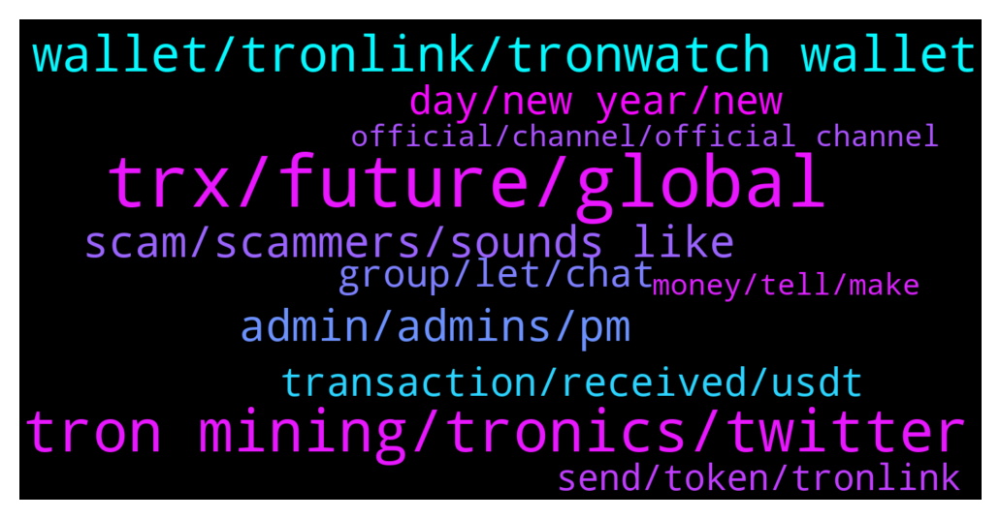

# **@tronnetworkEN**
 ## Analysis for **2022-01-02** - **2022-01-03**.

---

## 📊 **Basic Stats**

**n_messages_sent**: 294

---

---

## 🔝 **Top keywords and related messages**

1. **trx, future, global**

    @Hannibalbp --- *I saw that: In order to raise and promote the global TRX consensus quickly, increase the occupation ratio of global TRX coin holding addresses, and bring higher value to TRX fans, TRONIX community is launching a 20000000000 U coin mining plan to global effective address holders, and the people holding effective and active addresses can obtain corresponding TRX assets.* **--->** [TG Discussion](https://t.me/tronnetworkEN/3805959)

    @Tobby --- *Can somebody tell me what is future prospect of tron* **--->** [TG Discussion](https://t.me/tronnetworkEN/3803906)

    @kthakar44 --- *In future any value or not??* **--->** [TG Discussion](https://t.me/tronnetworkEN/3804007)

    @Kong kong --- *Yes, it's annoying. Asking if they are also investing in TRX, everyone is silent.🤣* **--->** [TG Discussion](https://t.me/tronnetworkEN/3804860)

    @thebigguns --- *Most of the TRX community doesn’t know that this is even happening* **--->** [TG Discussion](https://t.me/tronnetworkEN/3803815)

    @Konstantin --- *Hello!) Where i can find the roadmap and future plans ?* **--->** [TG Discussion](https://t.me/tronnetworkEN/3804428)

2. **tron mining, tronics, twitter**

    @Winklancer11 --- *Is it not good to aware tronics of Scammers on twitter. That promotes tron mining.* **--->** [TG Discussion](https://t.me/tronnetworkEN/3806154)

    @Winklancer11 --- *This person is advertising tron mining on twitter. Tronics donot fall into his scams.. There is no tron mining* **--->** [TG Discussion](https://t.me/tronnetworkEN/3806137)

    @Excellent --- *OK thanks. How do we stop them from going against the integrity of Tron? We have to cuz people are being victimized...* **--->** [TG Discussion](https://t.me/tronnetworkEN/3802968)

    @Mickel --- *is the tron guardian a bot or is it a scam?* **--->** [TG Discussion](https://t.me/tronnetworkEN/3804949)

    @agentpiki --- *Tron is legit. Don't cry here when you got scammed elsewhere* **--->** [TG Discussion](https://t.me/tronnetworkEN/3806340)

    @violetgypsie --- *A youtuber I follow game that link to get 500 free tron to "stake", I thought it looked weird.  Can't trust anyone.* **--->** [TG Discussion](https://t.me/tronnetworkEN/3803565)

3. **wallet, tronlink, tronwatch wallet**

    @Carlos_TRX --- *No  buy all that u need and open a wallet in tronlink, 1.1 TRX is needed to activate the account* **--->** [TG Discussion](https://t.me/tronnetworkEN/3804054)

    @Travis --- *Jason.. you must be new bro. lol.  Tronwatch wallet was shit.* **--->** [TG Discussion](https://t.me/tronnetworkEN/3803625)

    @Travis --- *also,  the tronwatch wallet was completely shelved by the same developers as the tronlink wallet but the integration of the two is non existent.  too bad i forgot to get back to this issue a year or so ago and it would be easier but as it stands, tronwatch wallet gave shitty mnemonics and the keystore or the private key will not unlock my tokens.* **--->** [TG Discussion](https://t.me/tronnetworkEN/3803556)

    @xPommepote --- *Tron is decentralized, no one has any control on wallets on the network 😅* **--->** [TG Discussion](https://t.me/tronnetworkEN/3803037)

    @Travis --- *well then you know the problem w the tronwatch wallet.* **--->** [TG Discussion](https://t.me/tronnetworkEN/3803630)

    @Travis --- *hi.  im having issues because i didnt get tron off the old old tronwatch wallet and now i cant seem to integrate to tronlink with any mnemonic or anything. i need some tech help.  please* **--->** [TG Discussion](https://t.me/tronnetworkEN/3803510)

4. **scam, scammers, sounds like**

    @xPommepote --- *Yeah all scammers, report and block, and do it again 😂* **--->** [TG Discussion](https://t.me/tronnetworkEN/3804862)

    @randhawajutt --- *This group did scam with more than 10k peoples* **--->** [TG Discussion](https://t.me/tronnetworkEN/3806334)

    @MilNoslen --- *Sounds like a scam, so don't bother* **--->** [TG Discussion](https://t.me/tronnetworkEN/3803566)

    @Excellent --- *Thanks. I see why scammers are on the rise... KYC should be looked into in connection to every wallet address...* **--->** [TG Discussion](https://t.me/tronnetworkEN/3803039)

    @Phine_has --- *I am seriously lost for words when people want to sell but they have no idea the purpose of an exchange. Where are these people coming from???* **--->** [TG Discussion](https://t.me/tronnetworkEN/3805007)

    @Hannibalbp --- *I am just telling what I am doing and asking because I am new in this , probably that is a scam...* **--->** [TG Discussion](https://t.me/tronnetworkEN/3806067)

5. **admin, admins, pm**

    @ClaraJacob1 --- *Okay, makes sense that why I referred to an admin who's most likely got better info than the rest of us.* **--->** [TG Discussion](https://t.me/tronnetworkEN/3803991)

    @maestrostoic --- *Admin minimum amount is required to start?* **--->** [TG Discussion](https://t.me/tronnetworkEN/3804032)

    @Carlos_TRX --- *He is impersonating me, an admin wont pm you* **--->** [TG Discussion](https://t.me/tronnetworkEN/3804094)

    @Đỗ --- *Who is admin. I need help . . .* **--->** [TG Discussion](https://t.me/tronnetworkEN/3806228)

    @maestrostoic --- *Yes admin can guide in better way about platform* **--->** [TG Discussion](https://t.me/tronnetworkEN/3803992)

    @maestrostoic --- *Ok then admin can help I think, because I myself a newbie* **--->** [TG Discussion](https://t.me/tronnetworkEN/3803210)

6. **day, new year, new**

    @OregonOrganics --- *Yes Peter lots of folks.  What up buddy. How’s the day going?  All good here.  Coffee and crypto for me so far this morning ☕️ 😁👍🏻.* **--->** [TG Discussion](https://t.me/tronnetworkEN/3804604)

    @Phine_has --- *Coffee and crypto updates my side too David* **--->** [TG Discussion](https://t.me/tronnetworkEN/3804627)

    @OregonOrganics --- *Happy New Year Fabs 👋🏻 😀.* **--->** [TG Discussion](https://t.me/tronnetworkEN/3804637)

    @Hesham --- *Hello everyone  How was your first day in 2022* **--->** [TG Discussion](https://t.me/tronnetworkEN/3803328)

    @MilNoslen --- *Happy New Year, Banhammer most high! @PiterSpain* **--->** [TG Discussion](https://t.me/tronnetworkEN/3803252)

    @PaulDelxy --- *Good Morning from this side everyone?* **--->** [TG Discussion](https://t.me/tronnetworkEN/3803655)

7. **transaction, received, usdt**

    @SYED --- *I have TRC 20 USDT How can I withdrawa in INR* **--->** [TG Discussion](https://t.me/tronnetworkEN/3806456)

    @tommy_jampick --- *TYJBPwSJieVhmmA8U64oTrdapCweSXFzxr this is my trc20 wallet but I cannot see my wallet transaction here* **--->** [TG Discussion](https://t.me/tronnetworkEN/3806394)

    @Đỗ --- *I have not received. in my transaction history also shows nothing* **--->** [TG Discussion](https://t.me/tronnetworkEN/3806361)

    @Đỗ --- *The transaction was successful but I still haven't received it* **--->** [TG Discussion](https://t.me/tronnetworkEN/3806351)

    @Carlos_TRX --- *Check the hash to know if the transaction has been made* **--->** [TG Discussion](https://t.me/tronnetworkEN/3806498)

    @Mrwhite4life --- *Please i made a successful transactions on the tron blackchain but the value was not added till date. Please how do I go about it?* **--->** [TG Discussion](https://t.me/tronnetworkEN/3806411)

8. **group, let, chat**

    @Umar Syed --- *People's are unboxing me from this group tell me that they are support* **--->** [TG Discussion](https://t.me/tronnetworkEN/3805645)

    @Carlos_TRX --- *I told you that @PiterSpain answered you, if u have change something pls let him to know. Likewise, to access the group you have to be a reliable and participative person in the group showing that you collaborate, it is not enough to have 100k TRX* **--->** [TG Discussion](https://t.me/tronnetworkEN/3804102)

    @Tytaninc --- *Thanks there isn’t a specific email for partnerships so I’ll just figure it out from here* **--->** [TG Discussion](https://t.me/tronnetworkEN/3804674)

    @A11997700 --- *They don't have a chat group, only announcements group* **--->** [TG Discussion](https://t.me/tronnetworkEN/3804484)

    @Fabs_trx --- *You can ask on their group. Not sure what you can do with it personally* **--->** [TG Discussion](https://t.me/tronnetworkEN/3804474)

    @S_m_r_nabavi --- *Is there a group to find members of the crypto team* **--->** [TG Discussion](https://t.me/tronnetworkEN/3806525)

9. **send, token, tronlink**

    @Carlos_TRX --- *If u used tronlink, check assets option and add the token* **--->** [TG Discussion](https://t.me/tronnetworkEN/3806426)

    @A11997700 --- *It's wierd to have on my TronLink a token that I can't send to another wallet 😁* **--->** [TG Discussion](https://t.me/tronnetworkEN/3804485)

    @Mrwhite4life --- *Yes I use tronlink, the token is there in my asset but my transaction value was not added* **--->** [TG Discussion](https://t.me/tronnetworkEN/3806439)

    @bjainkumar --- *How can i send APENFT trustwallet tokens to Tronlink ???* **--->** [TG Discussion](https://t.me/tronnetworkEN/3804827)

    @A11997700 --- *Please I am trying to send my PulseaPad to another wallet on Tron Network but its stuck on "Confirming", at the end it just dissapears... what to do to get my transfer done please?* **--->** [TG Discussion](https://t.me/tronnetworkEN/3804464)

    @Sixzzi --- *I should sign in in that link* **--->** [TG Discussion](https://t.me/tronnetworkEN/3804980)

10. **official, channel, official channel**

    @shermania --- *Anything not announced from official sources is and would always be a scam.!* **--->** [TG Discussion](https://t.me/tronnetworkEN/3805961)

    @mark0057 --- *I got smarter from now on, I will follow the official channels. Thanks* **--->** [TG Discussion](https://t.me/tronnetworkEN/3805548)

    @agentpiki --- *That is why we advise you guys to stay  in official channel* **--->** [TG Discussion](https://t.me/tronnetworkEN/3805543)

    @simon866 --- *We won, still waiting for Bitpay to update details regarding listing so let's keep an eye on them and make sure it's done 👊* **--->** [TG Discussion](https://t.me/tronnetworkEN/3804089)

    @agentpiki --- *This is the legit official channel. Don't blame the real one when you got scammed in other* **--->** [TG Discussion](https://t.me/tronnetworkEN/3806338)

    @PiterSpain --- *They have to announce it yet* **--->** [TG Discussion](https://t.me/tronnetworkEN/3803406)

