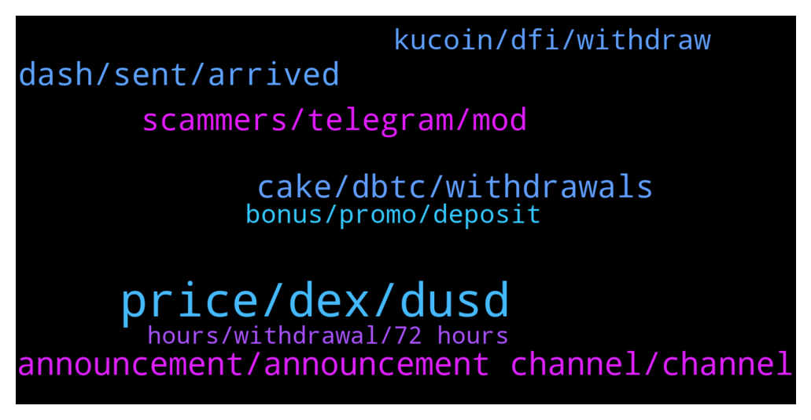

# **@CakeDeFi_EN**
 ## Analysis for **2022-01-03** - **2022-01-04**.

---

## 📊 **Basic Stats**

**n_messages_sent**: 596

---

---

## 🔝 **Top keywords and related messages**

1. **price, dex, dusd**

    @klausnoris --- *Are you referring to a dTSLA-LM-Pool?  Both DEX- and Oracle-Prices are also up: https://www.brandlhuber.de/defichain_charts/TSLA.html* **--->** [TG Discussion](https://t.me/CakeDeFi_EN/160041)

    @Kassius84 --- *They have a connection to real stocks while minting of new dTokens. After that, if you buy or providing liquidity, the price only depends on supply and demand on the DeFiChain DEX. Here you can find some more informations https://blog.defichain.com/what-are-decentralised-stock-tokens-and-how-do-they-work/* **--->** [TG Discussion](https://t.me/CakeDeFi_EN/160083)

    @Kassius84 --- *What are you expecting to happen with your dTSLA Tokens? Price of the Tokens depends on supply and demand of dTSLA on the DeFiChain DEX and is not depending on the price outside DeFiChain.* **--->** [TG Discussion](https://t.me/CakeDeFi_EN/160059)

    @resinio --- *One question: why is the price of dfi within the cake system not coherent with dex price when it comes to exchange? I was just checking the price vs. dusd, usdc, and I don’t come to 3.58 $ where it is now on the Dex.* **--->** [TG Discussion](https://t.me/CakeDeFi_EN/160415)

    @resinio --- *The correct Dex price if it’s not 3.57* **--->** [TG Discussion](https://t.me/CakeDeFi_EN/160451)

    @mm_phoenix --- *to calculate the credit they take an average price. what price would you prefer to see that* **--->** [TG Discussion](https://t.me/CakeDeFi_EN/160423)

2. **announcement, announcement channel, channel**

    @fabioandreatta --- *There will be a Twitter Space in around 5 hours where this is discussed* **--->** [TG Discussion](https://t.me/CakeDeFi_EN/159654)

    @Dcshel --- *Nope. Just gotta wait for this dang forked node upgrade to complete* **--->** [TG Discussion](https://t.me/CakeDeFi_EN/159919)

    @AnimalLover91 --- *Hi guys-> Any update so far?* **--->** [TG Discussion](https://t.me/CakeDeFi_EN/159254)

    @cwhNick --- *Where can i read up more on this?* **--->** [TG Discussion](https://t.me/CakeDeFi_EN/160589)

    @Michael_Schredl --- *Yes, please check the DeFiChain Announcement Channel: https://t.me/defichain_announcements* **--->** [TG Discussion](https://t.me/CakeDeFi_EN/159729)

    @BerndMack --- *just follow the announcement channel for the actual news https://t.me/CakeDeFi_EN_announcements* **--->** [TG Discussion](https://t.me/CakeDeFi_EN/159306)

3. **cake, dbtc, withdrawals**

    @LikelyCrunchy --- *Any idea when deposits will begin to credit at Cake. I would like at least the option to return my dBTC to my Defichain wallet for liquidity mining investment if withdrawals from Cake will be pauses for a while.  Currently my transfer from last night has no even been acknowledged by Cake.* **--->** [TG Discussion](https://t.me/CakeDeFi_EN/159954)

    @MaveJ --- *Hi - chain is running. Why does not cake open deposits/withdrawals?* **--->** [TG Discussion](https://t.me/CakeDeFi_EN/159463)

    @emrexdxd --- *@DmgBautista selamun alaikum bro, when money transactions come back? i need to pay electricity tomorrow. all my money in cake app. help me pls.  kind regards and alaikuma asallaum* **--->** [TG Discussion](https://t.me/CakeDeFi_EN/159997)

    @eud --- *Hey there, I've made a DFI deposit on CAKE like I usually do, but it's not showing as either pending or completed despite having 35+ confirmations. Is this normal? I've double checked everything and it should be good* **--->** [TG Discussion](https://t.me/CakeDeFi_EN/159867)

    @DmgBautista --- *Considering what has been said in the twitter space, i would say that Cake will not resume deposits and withdrawals until a voting from the masternodes or community is held and feedback provided to Cake about the direction the community seems to wish to proceed.* **--->** [TG Discussion](https://t.me/CakeDeFi_EN/159957)

    @L --- *can cake receive dbtc from dex now?* **--->** [TG Discussion](https://t.me/CakeDeFi_EN/160525)

4. **dash, sent, arrived**

    @emirrrrrrrrrrrrrrr --- *hello, i tryed depozit but my depozit is not showing in my cakedefi account. please help me* **--->** [TG Discussion](https://t.me/CakeDeFi_EN/159905)

    @emirrrrrrrrrrrrrrr --- *bro my dashs has not arrived to my wallet aq caktirma ben de turkum* **--->** [TG Discussion](https://t.me/CakeDeFi_EN/159342)

    @emirrrrrrrrrrrrrrr --- *my dash has not arrived to my dash wallet   i start the proces in 31 december at 9pm  it took 72hours but my dashs has not arrived yet.* **--->** [TG Discussion](https://t.me/CakeDeFi_EN/159347)

    @emirrrrrrrrrrrrrrr --- *i sent some dash to my cakedefi dash wallet but my dashs is not showing on my cakedefi account please help me* **--->** [TG Discussion](https://t.me/CakeDeFi_EN/159923)

    @Kassius84 --- *!support That sounds wrong. Here in the chat are some people struggling problems with dash deposits. I would suggest to contact the support* **--->** [TG Discussion](https://t.me/CakeDeFi_EN/160138)

    @Kassius84 --- *Be aware of scammers, if someone sends a direct message to you, don't answer. Dash needs at least 10 confirmations. Which status has the transaction id in a blockchain explorer? Which network did you choosed at Cake DeFi for the deposit?* **--->** [TG Discussion](https://t.me/CakeDeFi_EN/159932)

5. **scammers, telegram, mod**

    @DmgBautista --- *Yes, he was correct. I already explained that here to another user. If you wish to help in making a faster ban, you can DM a mod here with that printscreen. The mod will go and ban the scammer. If you place that directly here, the scammer sees it and gets out of the group, just to come back a few minutes later under a new identity. Posting directly here thus not help much. Thats why it was deleted. Nothing more than that :)* **--->** [TG Discussion](https://t.me/CakeDeFi_EN/160697)

    @FreeMerman --- *Yesterday another modo deleated my printscreen of a scammer :/ saying that it is not the place for that 🤷well I'll leave it here if I see that you're around.* **--->** [TG Discussion](https://t.me/CakeDeFi_EN/160689)

    @DmgBautista --- *Seriouly? Well surelly was not me, but thank you for doing that! I swear, those scammers like more of me than my own mother 🤦‍♂️   Never trust DM's and not answer to any call either, even if it looks a mod. If you wish, when that happens you can contact me here directly, just send me a printscreen of the scammer telegram username (the one that appears when you click in the name he presents while impersonating a mod or other user) so I can go and ban him immediatelly.  Thank you! 👐* **--->** [TG Discussion](https://t.me/CakeDeFi_EN/160686)

    @FreeMerman --- *Why deleting scammers screenshots? We only want to protect people by sharing...* **--->** [TG Discussion](https://t.me/CakeDeFi_EN/159481)

    @DmgBautista --- *The same way I know you are saying  "how do he know it was turkish". Google translator told me, simple as that. I may not understand Turkish language, but trust one thing, I am not stupid. I am here helping the community the best I can. So if you find that mocking with someone who is helping is correct, maybe a temporary ban can make you think twice.   Please be respectfull in this community. We have guidelines in the pinned messages, clearly saying that mods dont DM users and that any direct contact should always be blocked and reported, precisely so that users dont fall in the hands os scammers. If you join a public  community without reading carefully through its rules, you cannot complain later.   They exist for the users protection. Follow them, simple as that.* **--->** [TG Discussion](https://t.me/CakeDeFi_EN/160046)

    @DmgBautista --- *Sorry, had to go to translator to understand what you were saying. I believe you are Turkish? I am sorry but I dont understand turkish language. But from what the translator showed, you seem to need to make a withdrawal.   Cake has withdrawals for DFI and BTC suspended temporarily due to the bug detected on Defichain and also, other withdrawals of other tokens may take extra time since the network is still going through upgrades.   I dint think today will be possible yet to make withdraws. You best chance will be probably to contact Cakr support, as there is no official support on telegram, mods cannot influence that.   Be aware of scammers by the way, as they may try to impersonate community members or mods, and the kind of request you made is the perfect target for them to contact you pretending to help. If anyone contacts you directly, please just block and report. Any DM, from whoever may be  is against the community rules and must be considered always as a scam attempt. Cake official channels and support are the only ones where communications should flow. Best regards!* **--->** [TG Discussion](https://t.me/CakeDeFi_EN/160019)

6. **kucoin, dfi, withdraw**

    @papai699 --- *Are the nodes updated? Cannot transfer on DFI network from Kucoin* **--->** [TG Discussion](https://t.me/CakeDeFi_EN/159439)

    @Michael_Schredl --- *Yes, but you have to wait for your DFI until Kucoin opens again* **--->** [TG Discussion](https://t.me/CakeDeFi_EN/160646)

    @rodolfo --- *I´m trying to add to the pair BTC-DFI, but is noy possible on cakedefi ...* **--->** [TG Discussion](https://t.me/CakeDeFi_EN/160474)

    @papai699 --- *Can i transfer DFI tokens from KuCoin to cake DeFi now?* **--->** [TG Discussion](https://t.me/CakeDeFi_EN/159960)

    @Kassius84 --- *Which coin do you want to withdraw? Unfortunately at the moment it's not possible to withdraw DFI from Cake. And if it would possible, I guess all exchanges are also in maintenance mode. https://t.me/CakeDeFi_EN_announcements/348* **--->** [TG Discussion](https://t.me/CakeDeFi_EN/160001)

    @random43210 --- *Hi - I swapped my DFI to dGLD on Cake. Why isn't it possible to swap it back?* **--->** [TG Discussion](https://t.me/CakeDeFi_EN/160665)

7. **bonus, promo, deposit**

    @Tyaslevesely --- *Thanks Daniel, ive not deposited yet so wanted to know if i need to deposit 25 or 50 to get the bonus now* **--->** [TG Discussion](https://t.me/CakeDeFi_EN/159738)

    @Michael_Schredl --- *This bonus is only for new users* **--->** [TG Discussion](https://t.me/CakeDeFi_EN/159669)

    @eruditeben --- *Admin, there's something I don't understand please. After making a deposit of 50 usdt, is it the bonus of 30 usdt that will be locked for 180 days or my deposit of 50 usdt* **--->** [TG Discussion](https://t.me/CakeDeFi_EN/159985)

    @Lazydictator --- *I referred 2 friends last month , followed every step, and got bonus locked for 6 months and now i checked but bonus is gone , now im doubting it is not so genuine site* **--->** [TG Discussion](https://t.me/CakeDeFi_EN/159971)

    @Michael_Schredl --- *Correct, then you will get the sign up bonus* **--->** [TG Discussion](https://t.me/CakeDeFi_EN/159888)

    @Michael_Schredl --- *Then you will also get the bonus* **--->** [TG Discussion](https://t.me/CakeDeFi_EN/159348)

