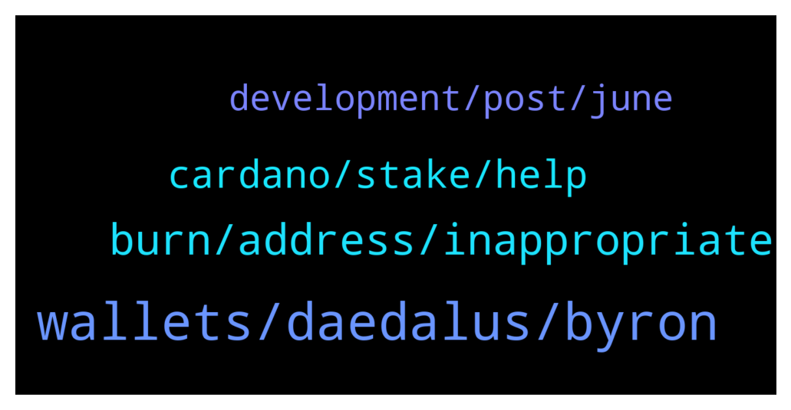

# **@Cardano**
 ## Analysis for **2022-01-03** - **2022-01-04**.

---

## 📊 **Basic Stats**

**n_messages_sent**: 74

---

---

## 🔝 **Top keywords and related messages**

1. **wallets, daedalus, byron**

    @Rabbitholepools --- *#daedalus and #yoroi are by far the most commonly used wallets. They need multidelegation.  They would also greatly benefit from staking URIs being finally implemented.* **--->** [TG Discussion](https://t.me/Cardano/764982)

    @Mr_Mont420 --- *Does Yoroi have multi-pool delegation feature? Or do I need to create a separate wallet to delegate to a second pool?* **--->** [TG Discussion](https://t.me/Cardano/764952)

    @apex_pool_spo --- *Daedalus is only working on PCs and needs to download the whole blockchain. Adalite.io can also restore 12 words wallets. It is an official wallet, but be careful.* **--->** [TG Discussion](https://t.me/Cardano/765484)

    @siamstudio --- *I tried to use the wallet Adalite.io, but it does not display funds as they were before Daedalus. I cant upload all blockchain 🙁* **--->** [TG Discussion](https://t.me/Cardano/765501)

    @apex_pool_spo --- *it is probably a Byron wallet.* **--->** [TG Discussion](https://t.me/Cardano/765473)

    @siamstudio --- *Hello I have ADA from ICO and only 12 word recovery phrase. How I can recover my wallet ? For Yoroi wallet recover need minimal 15 word but I have only 12 word* **--->** [TG Discussion](https://t.me/Cardano/765470)

2. **burn, address, inappropriate**

    @PipSqueak --- *What if gifting is not an option? I am pointing to NFTs and tokens which are deemed inappropriate. Could be an abusive letter sent to the recipient, etc.* **--->** [TG Discussion](https://t.me/Cardano/765330)

    @glitch04 --- *There are a few created burn addresses but that also burns your own ada that is bound to those transfers..* **--->** [TG Discussion](https://t.me/Cardano/765141)

    @PipSqueak --- *Just a thought, how do we burn tokens we don’t want. I claimed a lot on dripdropz, I am not sure I want to keep all of them as some seem useless. Basically, I know CH is against burning ada but I am thinking in terms of burning things like inappropriate tokens or abusive NFTs.* **--->** [TG Discussion](https://t.me/Cardano/765138)

    @tham3rr --- *Why is it legit, I mean the 90%of the tokens distributed is quistionable?* **--->** [TG Discussion](https://t.me/Cardano/765012)

    @glitch04 --- *👆 there are no official "airdrops" for ada those are generally scams* **--->** [TG Discussion](https://t.me/Cardano/765422)

    @glitch04 --- *Can be sent to one of those burn addresses created by smart contracts that just is a storage for these or just a general burn address a user creates to lock them away* **--->** [TG Discussion](https://t.me/Cardano/765358)

3. **cardano, stake, help**

    @ivan_Koloff --- *Why people continue to say that Cardano is a ghost chain ?* **--->** [TG Discussion](https://t.me/Cardano/765023)

    @Melly014 --- *Where can I stake cardano token* **--->** [TG Discussion](https://t.me/Cardano/765416)

    @Amrith --- *Can anyone help me go stake ada in binance* **--->** [TG Discussion](https://t.me/Cardano/765393)

    @Amrith --- *Ok , yoroi is the best to stake ada right?* **--->** [TG Discussion](https://t.me/Cardano/765400)

    @CryptoHorsey --- *Hi team,   Any updates on the native Cardano NFTs competition from the Cardano Summit? I've received them in my Terra account but haven't heard much of the next stage/competition.  Any updates would be good!   Thanks! Peter 😊* **--->** [TG Discussion](https://t.me/Cardano/765040)

    @Iohkcharles --- *Well-Typed is still working on cardano* **--->** [TG Discussion](https://t.me/Cardano/765051)

4. **development, post, june**

    @yutazzz --- *“Whiteboard: DApps and Development”  i wrote a summary and a detailed post!!! 🎉 (Please refer to the linked article for details!)  https://forum.cardano.org/t/dapps-3/90683* **--->** [TG Discussion](https://t.me/Cardano/765014)

    @mindmisled --- *@Iohkcharles Ardana have delayed their release due to optimisation requirements that will not be ready until at least June. I beleive it's something to do with file size/ CIP-33.  I was wondering if the same CIP is related to Djed in any way and if it would mean that we might not get a Djed launch until June?  Aplogies for the lack of detail. I don't fully understand everything just yet. Keep up the good work though.   Would rather get it right than get it rushed!* **--->** [TG Discussion](https://t.me/Cardano/765285)

    @ExInfernis --- *Still not sure when will start* **--->** [TG Discussion](https://t.me/Cardano/765258)

    @glitch04 --- *That's for their team to announce and best to find information in their support channels* **--->** [TG Discussion](https://t.me/Cardano/765038)

    @glitch04 --- *Forwarded the question if I hear back will post the update.* **--->** [TG Discussion](https://t.me/Cardano/765043)

    @Rabbitholepools --- *That's fair enough. But some development milestones can be discussed.* **--->** [TG Discussion](https://t.me/Cardano/764989)

