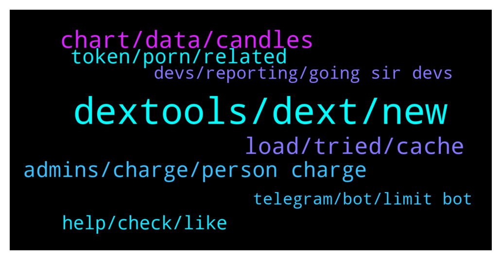

# **@DEXToolsCommunity**
 ## Analysis for **2022-01-02** - **2022-01-04**.

---

## 📊 **Basic Stats**

**n_messages_sent**: 328

---

---

## 🔝 **Top keywords and related messages**

1. **dextools, dext, new**

    @JoeyDieleman --- *Yeah thats sad, the whole purpose of DexTools if to give you info to not fall for scams, only buys, low score no public contract should give people red flags, of course even then dextools can never be 100% accurate, there will always be a fight between detecting scams and scammers comming up with new things. Please use dextools as intended and always do extra research on top of that. See the socials and check those too (and don'y fall for bots saying all the time the project is awesome and 100x is the only way). But for the tokens you gave, Dextools is pretty clear.* **--->** [TG Discussion](https://t.me/DEXToolsCommunity/321274)

    @stanes --- *Yes you can set price alerts. Standard users can even get alerts on TG and email. Indeed devs are working on a native mobile app.* **--->** [TG Discussion](https://t.me/DEXToolsCommunity/321150)

    @jmorfeo --- *on the same project dextscore is different if I see a pair or another ...* **--->** [TG Discussion](https://t.me/DEXToolsCommunity/321782)

    @stanes --- *Free users can only set alerts for ETH pairs.* **--->** [TG Discussion](https://t.me/DEXToolsCommunity/321152)

    @RhoToken --- *Hello, dextools search and pair explorer is not loading for me, everything else is working and showing. Any chance anyone knows how to solve this. It's been 2 days.* **--->** [TG Discussion](https://t.me/DEXToolsCommunity/321488)

    @stanes --- *Please send all the relevant info concerning this DEX to @pablojan* **--->** [TG Discussion](https://t.me/DEXToolsCommunity/321146)

2. **chart, data, candles**

    @napascual --- *Nothing to fix there. A candle normalization has already been done, those candles just cannot be avoided. That's just blockchain data. You can still stretch the candles to display the chart dates you're interested in.* **--->** [TG Discussion](https://t.me/DEXToolsCommunity/320928)

    @wealthyhobo --- *If you zoom out of the chart you will see a massive red candle way before that current chart. The first green candle you see is the actual day the project was launched* **--->** [TG Discussion](https://t.me/DEXToolsCommunity/320931)

    @Reza --- *Please look at the full chart... There is a big red candle that occurred prior to launching. It's inaccurate and misleading. Please take appropriate action, as this can be detrimental.* **--->** [TG Discussion](https://t.me/DEXToolsCommunity/321044)

    @Fejkolini --- *There you have it. Distortion of data were pre launch* **--->** [TG Discussion](https://t.me/DEXToolsCommunity/321049)

    @gumbercules --- *usually if someone adds small amounts of liquidity before the team it can create some wild candles* **--->** [TG Discussion](https://t.me/DEXToolsCommunity/321054)

    @Dom1234 --- *i mean if you fix the chart to when we officially launched, this will be resolved* **--->** [TG Discussion](https://t.me/DEXToolsCommunity/321071)

3. **load, tried, cache**

    @bastardganpunk --- *Still not working? Check you have a stable internet connection and your cache cleared. It should work then. Maybe even restarting your computer.* **--->** [TG Discussion](https://t.me/DEXToolsCommunity/321610)

    @psummj --- *I have tried many times no response* **--->** [TG Discussion](https://t.me/DEXToolsCommunity/321840)

    @H0nKl3R --- *Tried all that. First thing I did. I have 1GB internet no its not that* **--->** [TG Discussion](https://t.me/DEXToolsCommunity/321653)

    @bastardganpunk --- *have you cleared your cashe already and tried loading again? this should solve the issue* **--->** [TG Discussion](https://t.me/DEXToolsCommunity/321489)

    @cl1mb3rs --- *and not beeing able to use them aty* **--->** [TG Discussion](https://t.me/DEXToolsCommunity/321455)

    @Mojomagick --- *Can this be fixed please ?* **--->** [TG Discussion](https://t.me/DEXToolsCommunity/321098)

4. **admins, charge, person charge**

    @stanes --- *Please DM @guillermorodriguez78 he is the person-in-charge.  Be aware of scammers, HE WILL NEVER DM YOU FIRST.* **--->** [TG Discussion](https://t.me/DEXToolsCommunity/321921)

    @otot99 --- *Can your ads manager respond to my dm please?* **--->** [TG Discussion](https://t.me/DEXToolsCommunity/321681)

    @psummj --- *Can your ads manager respond to my dm please?* **--->** [TG Discussion](https://t.me/DEXToolsCommunity/321839)

    @stanes --- *The real one is @guillermorodriguez78 you can check he is admin in this group.* **--->** [TG Discussion](https://t.me/DEXToolsCommunity/321436)

    @stanes --- *ADMINS NEVER DM FIRST. You probably received a lot of DMs from scammers.* **--->** [TG Discussion](https://t.me/DEXToolsCommunity/321548)

    @psummj --- *Why are you asking it left for you and and admin not here okay* **--->** [TG Discussion](https://t.me/DEXToolsCommunity/321830)

5. **token, porn, related**

    @cl1mb3rs --- *no i have swapped from ethereum to porn in order to by some when it was very low price* **--->** [TG Discussion](https://t.me/DEXToolsCommunity/321442)

    @pranaysanghavi --- *The price was stuck at $7.5 since many days* **--->** [TG Discussion](https://t.me/DEXToolsCommunity/321762)

    @FredericDEXT --- *And never invest on a token before researching it* **--->** [TG Discussion](https://t.me/DEXToolsCommunity/321199)

    @Dom1234 --- *but how does a token get to a 130BILLION dollar marketcap on launch? it makes no sense* **--->** [TG Discussion](https://t.me/DEXToolsCommunity/321051)

    @MJayCrypto --- *What is the exact issue with XET? All other presales got their token already* **--->** [TG Discussion](https://t.me/DEXToolsCommunity/320758)

    @stanes --- *A part of it is, indeed, related to the token itself like the socials linked to it. But some other parts are related to the pair.* **--->** [TG Discussion](https://t.me/DEXToolsCommunity/321791)

6. **help, check, like**

    @MarkusLangebraun --- *like for example 1 Shibaswap 2 Uniswap* **--->** [TG Discussion](https://t.me/DEXToolsCommunity/321213)

    @Ajlabist --- *Anyproblem I can help you with* **--->** [TG Discussion](https://t.me/DEXToolsCommunity/321703)

    @Max10kX --- *@iamtommyn Check dm  pls. thanks.* **--->** [TG Discussion](https://t.me/DEXToolsCommunity/321651)

    @Elcocote --- *ok thanks, if you need more info I'm available* **--->** [TG Discussion](https://t.me/DEXToolsCommunity/321554)

    @stanes --- *ahah I would like to be able to help you then you could give me a tip 😉* **--->** [TG Discussion](https://t.me/DEXToolsCommunity/321456)

    @MR_CRYPTO70 --- *Please help me if you can* **--->** [TG Discussion](https://t.me/DEXToolsCommunity/321205)

7. **devs, reporting, going sir devs**

    @gumbercules --- *Not going to say it again sir. Devs have answered you* **--->** [TG Discussion](https://t.me/DEXToolsCommunity/321100)

    @stanes --- *It's currently 10 o'clock on January 1st in Spain 😅 but be sure devs will take care of it as soon as they can. Just give them couple hours should be fine.* **--->** [TG Discussion](https://t.me/DEXToolsCommunity/320799)

    @pranaysanghavi --- *where do we log a bug* **--->** [TG Discussion](https://t.me/DEXToolsCommunity/321759)

    @stanes --- *Ok, forwarding that to the devs rn, thanks for reporting.* **--->** [TG Discussion](https://t.me/DEXToolsCommunity/321553)

    @Elcocote --- *@stanes tell dev that I received notification now. Maybe they have changed something* **--->** [TG Discussion](https://t.me/DEXToolsCommunity/321563)

    @AJ --- *any ETAs please so that I can remind you after that again !* **--->** [TG Discussion](https://t.me/DEXToolsCommunity/320797)

