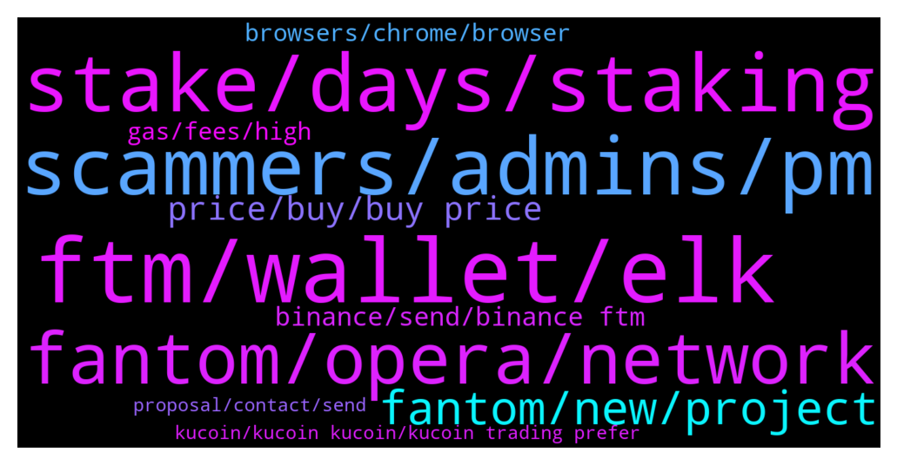

# **@Fantom_English**
 ## Analysis for **2022-01-03** - **2022-01-04**.

---

## 📊 **Basic Stats**

**n_messages_sent**: 329

---

---

## 🔝 **Top keywords and related messages**

1. **ftm, wallet, elk**

    @MindLabAfrica --- *Need an advice pls... I am on FTM short which is on loss with -123 I have been holding the trade for long. Any chance of it retracing soon or I should close the trade at loss?* **--->** [TG Discussion](https://t.me/Fantom_English/621548)

    @Danny --- *I tried to bridge ftm bep20 to ftm from spookyswap buy not yes received it back since 30mins now* **--->** [TG Discussion](https://t.me/Fantom_English/622459)

    @maximilg --- *Guys what was the link for newly bridged users to get some ftm for tx fees* **--->** [TG Discussion](https://t.me/Fantom_English/622567)

    @Janevietani --- *FTM token? FTM ICO are on 2018* **--->** [TG Discussion](https://t.me/Fantom_English/622364)

    @lifesgoodman --- *hi guys where do you buy ftm* **--->** [TG Discussion](https://t.me/Fantom_English/620806)

    @NO1BOSS6969 --- *Pls can someone put me through on ftm farming. I'll really appreciate* **--->** [TG Discussion](https://t.me/Fantom_English/620928)

2. **stake, days, staking**

    @pajamasfreak --- *Officially you can stake on fwallet* **--->** [TG Discussion](https://t.me/Fantom_English/620959)

    @domdeg11 --- *Hey guys! Anyone know how the tomb-FTM staking works?* **--->** [TG Discussion](https://t.me/Fantom_English/622505)

    @Mcjig --- *if you lock for 14 days and the timer is finished. you would be on no lock at 4% interest. still have a 7 day wait if you undelegate* **--->** [TG Discussion](https://t.me/Fantom_English/620550)

    @Mcjig --- *of course there are no rewards for 7 days. because your no longer staking* **--->** [TG Discussion](https://t.me/Fantom_English/620554)

    @Mcjig --- *some chains have 30 day unbonding times* **--->** [TG Discussion](https://t.me/Fantom_English/620556)

    @Mahfouz --- *Ive never staked anything before, do I have to lock it in for a set period?* **--->** [TG Discussion](https://t.me/Fantom_English/620751)

3. **scammers, admins, pm**

    @gobluecrypto --- *Wow 10 DM's. Is this scammer central?* **--->** [TG Discussion](https://t.me/Fantom_English/621370)

    @Fjody --- *And don't trust anyone who is DMing you, those are all scammers.* **--->** [TG Discussion](https://t.me/Fantom_English/622121)

    @Johnnyfantom --- *Scammers are everywhere, nothing we can do about it, just remember Admins will never DM first* **--->** [TG Discussion](https://t.me/Fantom_English/621375)

    @Ziga --- *admins dont pm, whoever is messaging you is scammer* **--->** [TG Discussion](https://t.me/Fantom_English/620627)

    @slickrick6 --- *I do hope you know it’s not me and it’s a scammer impersonating me* **--->** [TG Discussion](https://t.me/Fantom_English/620674)

    @Enginevc --- *I don't understand who really wants to help. too many scammers. how did you solve the problem* **--->** [TG Discussion](https://t.me/Fantom_English/622160)

4. **fantom, opera, network**

    @Andronice05 --- *How to add fantom network on metamask admin help* **--->** [TG Discussion](https://t.me/Fantom_English/622018)

    @Tongpo --- *Figured out a cheaper method of swapping/bridging from erc20 to opera :)* **--->** [TG Discussion](https://t.me/Fantom_English/622254)

    @Janevietani --- *if you wanna buy it on bsc network , info i got from user , liquidity are on apeswap not pancake but you will not be able to use your FTM on Fantom defi ecosystem* **--->** [TG Discussion](https://t.me/Fantom_English/622534)

    @Niels --- *Just set up my first Fantom Wallet! I want to transfer FTM from Kucoin to this wallet. i can only select I’m receiving from ‘Fantom Opera’* **--->** [TG Discussion](https://t.me/Fantom_English/621024)

    @Cryp2guy --- *I sent ftm token which were on fantom network from meta mask to ledger x fantom erc20 address. Yah, I messed up. Is there a way I can retrieve them back? The meta mask wallet is mine and so is the ledger nano x.* **--->** [TG Discussion](https://t.me/Fantom_English/620880)

    @hsvajx --- *I'm trying to bridge with xPollinate and it says Fantom subgraph is out of sync, is there something I can do?* **--->** [TG Discussion](https://t.me/Fantom_English/621312)

5. **fantom, new, project**

    @Miguel --- *I completely did not know Fantom ran on a dag, that's actually the most impressive technology with y'all* **--->** [TG Discussion](https://t.me/Fantom_English/622573)

    @Victor --- *I'm not seeing anywhere on the fantom foundation website to get a hold of them other than here and discord or twitter, reddit.  just the social icons.  looking for an email address* **--->** [TG Discussion](https://t.me/Fantom_English/620678)

    @Peaky_23_Blinders --- *Hey everyone, I'm new to fantom, what are the biggest launchpads on ftm? thanks* **--->** [TG Discussion](https://t.me/Fantom_English/620549)

    @robinxjace --- *Just had the Hector DAO AMA with some really bullish perspectives for 2022 >> you will still be early in this project. Hector and fantom will dominate this year* **--->** [TG Discussion](https://t.me/Fantom_English/620730)

    @Cryp2guy --- *Hey admins and fantomers 👋. I need expert help and would appreciate if anyone of you can address this.* **--->** [TG Discussion](https://t.me/Fantom_English/620879)

    @MizoHosry --- *There is a new project will be launched on Fantom chain* **--->** [TG Discussion](https://t.me/Fantom_English/621084)

6. **price, buy, buy price**

    @AgentK8421 --- *I don't necessarily have a preference on where I buy, just want to make sure I am maximizing my buy in* **--->** [TG Discussion](https://t.me/Fantom_English/622536)

    @morexwell --- *Is it too late to buy and what's the price target* **--->** [TG Discussion](https://t.me/Fantom_English/621919)

    @Danny --- *I meant what was the launching price* **--->** [TG Discussion](https://t.me/Fantom_English/622358)

    @Fjody --- *Because TWAP was less than 1.01.* **--->** [TG Discussion](https://t.me/Fantom_English/622415)

    @Danny --- *And what was the pre-sale price* **--->** [TG Discussion](https://t.me/Fantom_English/622354)

    @Joseph --- *Best time to buy it now* **--->** [TG Discussion](https://t.me/Fantom_English/621374)

7. **binance, send, binance ftm**

    @Kaputski --- *How long can I take to send FTM from MetaMask to Binance? Transaction is completed address are correct but doesn’t show up in Binance ( 50 mins ago )* **--->** [TG Discussion](https://t.me/Fantom_English/622227)

    @Archie --- *I think the last time I transferred from Binance, I used bep2. But that gave me bep2 fantom in my trustwallet which it seems I can't use to stake. If I transfer my bep2 tokens back to Binance, then what should I do? I have a metamask and a trustwallet.* **--->** [TG Discussion](https://t.me/Fantom_English/622115)

    @Fjody --- *Send back to Binance and withdraw as FTM native coins.* **--->** [TG Discussion](https://t.me/Fantom_English/622099)

    @Janevietani --- *then it should be already on the address that you sent to. contact Binance* **--->** [TG Discussion](https://t.me/Fantom_English/622273)

    @Jack887 --- *yes i have raised query to Binance, Thanks* **--->** [TG Discussion](https://t.me/Fantom_English/622276)

    @MrW0lff --- *I tried with a small amount about 20 minutes ago and i didn't get any notification from binance* **--->** [TG Discussion](https://t.me/Fantom_English/622179)

8. **gas, fees, high**

    @M. --- *it looks like we already are falling to those high gas fees traps...* **--->** [TG Discussion](https://t.me/Fantom_English/621239)

    @Janevietani --- *team are working on fast sync which can lower gas fee* **--->** [TG Discussion](https://t.me/Fantom_English/621192)

    @WolfWithin --- *@Janevietani hey how are we looking with keeping the fees low as the workload increases on the network?* **--->** [TG Discussion](https://t.me/Fantom_English/621190)

    @M. --- *Anyone know why the gas price is so high? any problems with the network?* **--->** [TG Discussion](https://t.me/Fantom_English/621218)

    @pajamasfreak --- *It follows eth network gas fees* **--->** [TG Discussion](https://t.me/Fantom_English/622211)

    @pajamasfreak --- *Users are using higher gas fees* **--->** [TG Discussion](https://t.me/Fantom_English/622189)

9. **browsers, chrome, browser**

    @Edric --- *I downloaded this one  But it is running in chrome  So I thought it is the fake one* **--->** [TG Discussion](https://t.me/Fantom_English/621994)

    @Janevietani --- *Its pwa so its running on browser* **--->** [TG Discussion](https://t.me/Fantom_English/621996)

    @Janevietani --- *have you check it on explorer?* **--->** [TG Discussion](https://t.me/Fantom_English/622267)

    @Victor --- *and yall are seeing it on your browsers?   I'm not seeing it on 3 different browsers.  let me try on brave browser* **--->** [TG Discussion](https://t.me/Fantom_English/620685)

    @Mcjig --- *dont show on chrome. for some reason* **--->** [TG Discussion](https://t.me/Fantom_English/620682)

    @Victor --- *I'll change browsers.  not showing up on chrome for me. thanks* **--->** [TG Discussion](https://t.me/Fantom_English/620681)

10. **kucoin, kucoin kucoin, kucoin trading prefer**

    @KoinLuc --- *I don't have this wtf kucoin* **--->** [TG Discussion](https://t.me/Fantom_English/620820)

    @smashingdollars --- *mine is on kucoin. u can check on cmc* **--->** [TG Discussion](https://t.me/Fantom_English/620807)

    @lifesgoodman --- *So whats the difference between Kucoin and kucoin s ?* **--->** [TG Discussion](https://t.me/Fantom_English/620810)

    @smashingdollars --- *but on kucoin s you can also do trading I prefer it more now tbh you can see various things too* **--->** [TG Discussion](https://t.me/Fantom_English/620813)

    @smashingdollars --- *kucoin only exhcange kucoin s is social platform* **--->** [TG Discussion](https://t.me/Fantom_English/620812)

    @lifesgoodman --- *what is kucoin s you were talking above?* **--->** [TG Discussion](https://t.me/Fantom_English/620808)

