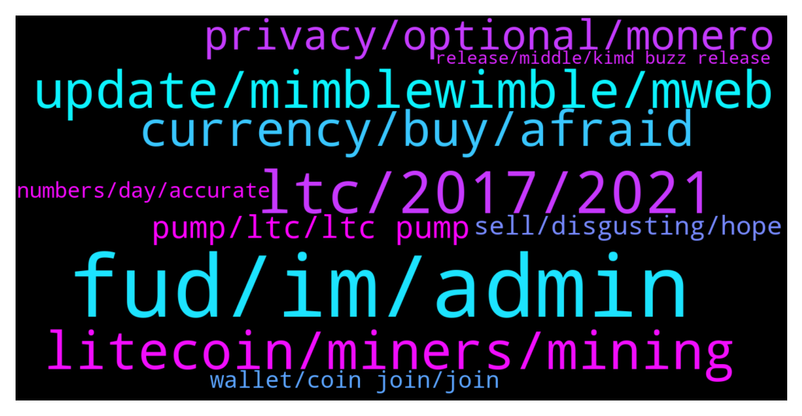

# **@Litecoin**
 ## Analysis for **2022-01-03** - **2022-01-04**.

---

## 📊 **Basic Stats**

**n_messages_sent**: 303

---

---

## 🔝 **Top keywords and related messages**

1. **fud, im, admin**

    @bake_Crypto --- *first day has profile picture and askin for bam on others??? VN ferb* **--->** [TG Discussion](https://t.me/Litecoin/2039899)

    @JIMMY G --- *I’m noticing a lot of people with very little brain power on this chat.* **--->** [TG Discussion](https://t.me/Litecoin/2039851)

    @JIMMY G --- *The whole chat is spammed by them* **--->** [TG Discussion](https://t.me/Litecoin/2039890)

    @Musashi_Kansai --- *The problem is we are seeing very specific and repeated FUD talking points that are obvious manipulation. Someone who complains or gets frustrated once in a while isn't the problem. Repeatedly FUDing is a bannable offense.* **--->** [TG Discussion](https://t.me/Litecoin/2039924)

    @TonyNakamoto --- *Wow ur mask fell off sjr* **--->** [TG Discussion](https://t.me/Litecoin/2039079)

    @kevinpita --- *I don't know if I write more than 2 sentences they get deleted* **--->** [TG Discussion](https://t.me/Litecoin/2039598)

2. **ltc, 2017, 2021**

    @Musashi_Kansai --- *All the people who profit from FUDing LTC will now appear to object.* **--->** [TG Discussion](https://t.me/Litecoin/2039900)

    @PepeTheFrog --- *it's time to move on with ltc. don't be like those feathercoin guys* **--->** [TG Discussion](https://t.me/Litecoin/2039336)

    @RorschachTesst --- *How convenient that you treat  2013-2017 and 2018-2021 as two separate eras. Ltc just retraced its 2017 price in 2021. It did not shatter records* **--->** [TG Discussion](https://t.me/Litecoin/2039020)

    @TrojanHorshe --- *Even Charlie prediction was wrong on making new ATH in December 2021 . I think LTC is pretty much frocked* **--->** [TG Discussion](https://t.me/Litecoin/2039405)

    @zxCuahdF --- *as shown by data. LTC is the currency with the lowest increase in the top 20 cryptocurrencies last year* **--->** [TG Discussion](https://t.me/Litecoin/2039328)

    @TonyNakamoto --- *Still a stunning fall in 1x yr* **--->** [TG Discussion](https://t.me/Litecoin/2039446)

3. **litecoin, miners, mining**

    @xinxi_wang --- *Flood this guy https://twitter.com/paoloardoino with USDT on Litecoin requests. Push him hard. Make him aware about the demand.* **--->** [TG Discussion](https://t.me/Litecoin/2039824)

    @moonsie --- *litecoin performed worst than feathercoin last year* **--->** [TG Discussion](https://t.me/Litecoin/2039361)

    @silverjxy --- *Have Litecoin got any partnerships in the pipeline?* **--->** [TG Discussion](https://t.me/Litecoin/2039810)

    @bogdan15xor --- *hi gents. new to Litecoin. how does the Litecoin protocol react to miner reward halvings every 4 years? does the difficulty to mine change too to prevent miners from leaving? how does it work?* **--->** [TG Discussion](https://t.me/Litecoin/2039106)

    @bogdan15xor --- *what incentivizes miners to stay on the network as the number of rewards per block decrease?* **--->** [TG Discussion](https://t.me/Litecoin/2039137)

    @moonsie --- *lol litecoin is now position #21* **--->** [TG Discussion](https://t.me/Litecoin/2039368)

4. **update, mimblewimble, mweb**

    @moonsie --- *MimbleWimble won't make a difference anymore; people have known it's coming for years and price is still 70% down.* **--->** [TG Discussion](https://t.me/Litecoin/2040013)

    @silverjxy --- *I remember being in litcoin at start of 2021 and hearing them talk about releasing mimble wimble* **--->** [TG Discussion](https://t.me/Litecoin/2039644)

    @pls369 --- *I think this month. But dont count on timeline. Building software is a bitch.* **--->** [TG Discussion](https://t.me/Litecoin/2039642)

    @trustbtc --- *Mimblewimble exact date for activate in January?* **--->** [TG Discussion](https://t.me/Litecoin/2039867)

    @RorschachTesst --- *How about updating the pinned messages from time to time reflecting the latest work being done? Any newbie is gonna be turned off that the last major update was last year* **--->** [TG Discussion](https://t.me/Litecoin/2039392)

    @silverjxy --- *How will mimblewimble effect ltc price when  they have their own native token?* **--->** [TG Discussion](https://t.me/Litecoin/2039637)

5. **currency, buy, afraid**

    @moonsie --- *this is how fast things can change. within 1 year a well-established ancient coin can go from relevant to irrelevant and stomped into the dirt shitcoin* **--->** [TG Discussion](https://t.me/Litecoin/2039372)

    @kuntpuncher --- *Sooooo……this is the pitch for crypto currency. Let’s say I want to buy some bread. Instead of just swiping my bank card, I go make an account on coin base, link my bank account, send real money to coin base, buy a currency coin like litecoin, learn how to use wallets, send litecoin to wallet, then find a shop that sells bread and accepts litecoin, open my phone, and then send litecoin payment. Did I get the gist of using crypto currency?* **--->** [TG Discussion](https://t.me/Litecoin/2039288)

    @Jim --- *People are afraid of lockdowns and all the situation... thats why they dont invest now. If i remember right inflation in usa this year is 6.3 or 6.7%* **--->** [TG Discussion](https://t.me/Litecoin/2039179)

    @Jim --- *What do they say on news about corona. I see every day going down on the same hours. They must saying something really bad like lockdown?* **--->** [TG Discussion](https://t.me/Litecoin/2039145)

    @Amelia1983 --- *Now every country is studying digital currency. This is a good trend. In the future, digital currency will replace traditional currencies and move towards a new world and new field.* **--->** [TG Discussion](https://t.me/Litecoin/2039493)

    @standard211 --- *Yes bro I want you to tell me more about cryptocurrency* **--->** [TG Discussion](https://t.me/Litecoin/2039194)

6. **privacy, optional, monero**

    @bogdan15xor --- *how would optional privacy work? I assume sending from a personal wallet to a personal wallet can be private, but as soon as you interact with an exchange the privacy goes away, no?* **--->** [TG Discussion](https://t.me/Litecoin/2039721)

    @RabbitL0v3r --- *Monero is build from scratch with privacy in mind Mweb add optional privacy to litecoin They don't serve the same purpose* **--->** [TG Discussion](https://t.me/Litecoin/2039960)

    @RabbitL0v3r --- *Optional privacy =/= optional transparency And monero is still on the biggest exchange and got atomic swap with btc* **--->** [TG Discussion](https://t.me/Litecoin/2039717)

    @RabbitL0v3r --- *@kevinpita was asking about privacy feature in the litecoin network* **--->** [TG Discussion](https://t.me/Litecoin/2039805)

    @pls369 --- *I really respect developers who care about privacy and freedom. They are and will always be at the forefront of human rights and freedom. Unfortunately there are really only a handful.* **--->** [TG Discussion](https://t.me/Litecoin/2039648)

    @bogdan15xor --- *I know Monero and Litecoin MW do not have the same privacy, but could Litecoin achieve the same level of privacy by adding multiple steps?* **--->** [TG Discussion](https://t.me/Litecoin/2039943)

7. **pump, ltc, ltc pump**

    @Zocan2 --- *Wow. Ltc will pump 5% and then dump 10% 😅😂😃* **--->** [TG Discussion](https://t.me/Litecoin/2039764)

    @RorschachTesst --- *On a bear market, ltc will pump by 0.5% get ready for the biggest roller coaster in history ever* **--->** [TG Discussion](https://t.me/Litecoin/2039626)

    @JIMMY G --- *Yes and LTC is always the last one to pump ..* **--->** [TG Discussion](https://t.me/Litecoin/2039329)

    @ken_xmas --- *Hidden div on LTC chart Let’s pump it* **--->** [TG Discussion](https://t.me/Litecoin/2039233)

    @pls369 --- *Man i can clearly see the whales really want to suppress the ltc price. This means pump will come soon. Just be patient people* **--->** [TG Discussion](https://t.me/Litecoin/2039612)

    @saikokomonZ9 --- *Ok does this mean they could pump LTC ?* **--->** [TG Discussion](https://t.me/Litecoin/2039826)

8. **sell, disgusting, hope**

    @RabbitL0v3r --- *Sell at pamp buy at damp* **--->** [TG Discussion](https://t.me/Litecoin/2039777)

    @bake_Crypto --- *And if somebody dear to say it looks expensive* **--->** [TG Discussion](https://t.me/Litecoin/2039918)

    @JIMMY G --- *Cool sell up and go away then* **--->** [TG Discussion](https://t.me/Litecoin/2039858)

    @N --- *Buy the top sell the dip* **--->** [TG Discussion](https://t.me/Litecoin/2039508)

    @Carlos_PRO_Holder --- *Disgusting, I hope this shit does the last breath to $400 and I will sell everything!* **--->** [TG Discussion](https://t.me/Litecoin/2039404)

    @Forexjunkie --- *i cant wait to throw more $ at this at $148.87* **--->** [TG Discussion](https://t.me/Litecoin/2039227)

9. **wallet, coin join, join**

    @kevinpita --- *but I need a wallet that has coin join or a good mixer* **--->** [TG Discussion](https://t.me/Litecoin/2039574)

    @kevinpita --- *Will I need an specific wallet to use it? if yes would it be ltc core?* **--->** [TG Discussion](https://t.me/Litecoin/2039795)

    @kevinpita --- *Hi! I have been using dash for a time since I have a coin join feature, is there any updated LTC wallet that has it? or is there any good mixer out of there?* **--->** [TG Discussion](https://t.me/Litecoin/2039568)

    @kevinpita --- *I have found Mustard Wallet but it hasn't been updated since a year ago* **--->** [TG Discussion](https://t.me/Litecoin/2039602)

    @kevinpita --- *I need coinjoin and those wallets doesnt offer it* **--->** [TG Discussion](https://t.me/Litecoin/2039578)

    @ken_xmas --- *Every wallet supporting LTC  Trust wallet  Safepal  Atomic  Blockchain  Tron link pro ...* **--->** [TG Discussion](https://t.me/Litecoin/2039577)

10. **numbers, day, accurate**

    @ArchSter --- *Numbers are only accurate if people are testing. Coming up to end of year people are more concerned about meeting up and therefore testing more so numbers are probably more accurate in terms of cases...* **--->** [TG Discussion](https://t.me/Litecoin/2039166)

    @ArchSter --- *Chrimbo and new year over so expect numbers to go down until schools and people go back to work make numbers go up again.* **--->** [TG Discussion](https://t.me/Litecoin/2039147)

    @Jim --- *Guys just wait covid cases fall and then here we go up* **--->** [TG Discussion](https://t.me/Litecoin/2039028)

    @Jim --- *We dont if people test more or not. This mountain some day it will start going down thats what i am trying to say with it. And price goes up. 🙂* **--->** [TG Discussion](https://t.me/Litecoin/2039168)

    @ArchSter --- *One day up then another day down.* **--->** [TG Discussion](https://t.me/Litecoin/2039146)

    @Carlos_PRO_Holder --- *Volume is low, we are going down* **--->** [TG Discussion](https://t.me/Litecoin/2039471)

