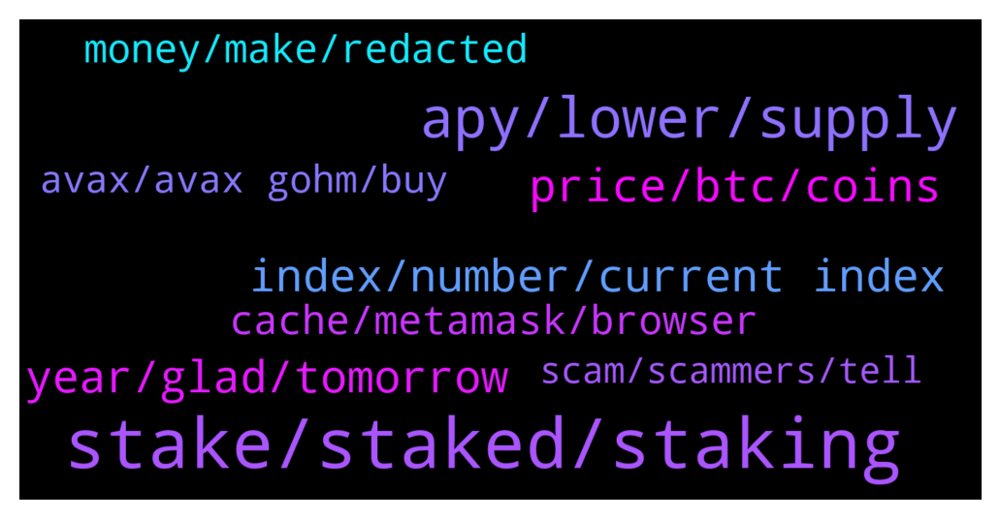

# **@OlympusTG**
 ## Analysis for **2022-01-03** - **2022-01-04**.

---

## 📊 **Basic Stats**

**n_messages_sent**: 709

---

---

## 🔝 **Top keywords and related messages**

1. **stake, staked, staking**

    @dragonsaints --- *which one is beneficial.. both should be same i guess. but why have two sOhm and gOhm to stake.. ?? i guess i need to re read the paper.. 😊* **--->** [TG Discussion](https://t.me/OlympusTG/141015)

    @Solomon --- *Please how can I go about in staking* **--->** [TG Discussion](https://t.me/OlympusTG/140838)

    @nfwaple --- *no, gohm is alreaady wrapped and staked, so you don't need to stake it  Second pic: https://twitter.com/dopex_intern/status/1473439395999068162/photo/1* **--->** [TG Discussion](https://t.me/OlympusTG/140782)

    @Robbert --- *Do see it in metamask, not on stake page* **--->** [TG Discussion](https://t.me/OlympusTG/141448)

    @SkipFib --- *Sorry to keep bothering i have gOHM in my wallet and trying to staking now but the staking page doesn’t see them and is asking me to transform wsOHM to gOHM , I already have gOHM hiw can INSTAKE them now* **--->** [TG Discussion](https://t.me/OlympusTG/141138)

    @Djcrypto_23 --- *So If I buy gohm I don't need to go to the website and staked it* **--->** [TG Discussion](https://t.me/OlympusTG/141442)

2. **apy, lower, supply**

    @hootie1233 --- *will a drop in apy to a 1000 not have people cashing out and looking for the higher ones elsewhere? I get it needs to happen in time but what happens if there is a mass exodus once the apy doesn't look as attractive* **--->** [TG Discussion](https://t.me/OlympusTG/141184)

    @crypticcrypto_0 --- *No I havent been making what the apy is* **--->** [TG Discussion](https://t.me/OlympusTG/141710)

    @nfwaple --- *not 100% but have you considered the possibility that APY reduction may be bullish as it means reduced supply inflation* **--->** [TG Discussion](https://t.me/OlympusTG/140931)

    @crypticcrypto_0 --- *The apy for my token yeild is no where near whats stated* **--->** [TG Discussion](https://t.me/OlympusTG/141717)

    @moonordust24 --- *So the apy is decreasing even though the price of token is down?* **--->** [TG Discussion](https://t.me/OlympusTG/141586)

    @GameChangerr_07 --- *Ok. What will happen with APY when available suply will touch max suply? APY will go lower, right?* **--->** [TG Discussion](https://t.me/OlympusTG/141197)

3. **price, btc, coins**

    @bike4peace --- *I think, correct me, its like halving at BTC  I think people leaving OHM, should go. They dont see the bigger image.  It means for us, that our investment will double up (not in Dollars, but in OHM) every 100 days, instead of now around 60 days.  So the reduction is not that dramatic and people who understood that, were never worried about it.* **--->** [TG Discussion](https://t.me/OlympusTG/141812)

    @chitangxxx --- *Actually, you don't need to do that... Just see how many times in the last 5 weeks btc has tried to break resistance but failed... Maybe 20x now? It's there in front of your eyes* **--->** [TG Discussion](https://t.me/OlympusTG/141189)

    @noof_zx --- *Both have same reaction to btc anyway* **--->** [TG Discussion](https://t.me/OlympusTG/140678)

    @chitangxxx --- *Yes true... That's why all other coins have fallen up to 90 pc but btc and eth have been relatively strong in this bear market* **--->** [TG Discussion](https://t.me/OlympusTG/141195)

    @chitangxxx --- *And 30k from 68k ath is not too bad considering most coins have dumped 90pc* **--->** [TG Discussion](https://t.me/OlympusTG/141191)

    @andywang1 --- *Then bitcoin is biggest crypto scam, no value at all but wasting electricity and destroy the earth 😂* **--->** [TG Discussion](https://t.me/OlympusTG/141481)

4. **index, number, current index**

    @Heberdugo --- *Question how do we calculate ohms within Gohm example let's say yoy want to sell 20 ohms how do you calculate it in ohms from gohm* **--->** [TG Discussion](https://t.me/OlympusTG/140894)

    @FitenFast --- *Sorry I’m confused. My rebase is lower than the index so I’m not understanding why the gOHM can stay the same in numbers but the value increased even though my rebase is lower than the rebase of the index.* **--->** [TG Discussion](https://t.me/OlympusTG/142126)

    @nfwaple --- *Second pic: https://twitter.com/dopex_intern/status/1473439395999068162/photo/1  gohm does not increase, number of gohm x current index = number of sohm, gOHM price = OHM price x current index, current index increases every rebase* **--->** [TG Discussion](https://t.me/OlympusTG/141433)

    @montana550 --- *Let me see if I understood correctly, my gOhm doesn't increase but if I choose to change my gOhm to Ohm it will multiply that number to current index?* **--->** [TG Discussion](https://t.me/OlympusTG/140874)

    @FitenFast --- *Gotcha thank you. So if your rebase is less than the index your value can even go down?* **--->** [TG Discussion](https://t.me/OlympusTG/142113)

    @nfwaple --- *gOHM today would still be 0.1, number of gOHM = number of sOHM/current index or 0.1 = 4/40* **--->** [TG Discussion](https://t.me/OlympusTG/142130)

5. **year, glad, tomorrow**

    @dragonsaints --- *well see you all in an year unless there is someother change and we need to manually do something 😊* **--->** [TG Discussion](https://t.me/OlympusTG/141029)

    @brendanmkav --- *That’s phenomenal to be fair 🤣* **--->** [TG Discussion](https://t.me/OlympusTG/141723)

    @nfwaple --- *Im glad you're asking this question though 🙏* **--->** [TG Discussion](https://t.me/OlympusTG/140944)

    @Liu2699 --- *The road of life needs to be walked step by step* **--->** [TG Discussion](https://t.me/OlympusTG/141562)

    @Dean --- *Looking forward to tomorrow 🙏🏾 2022 🚀🚀🙌🏾💎* **--->** [TG Discussion](https://t.me/OlympusTG/140686)

    @theMagicUnicorn --- *but sometimes a car is convenient 🤓* **--->** [TG Discussion](https://t.me/OlympusTG/141565)

6. **cache, metamask, browser**

    @Robbert --- *I will try Firefox browser now* **--->** [TG Discussion](https://t.me/OlympusTG/141490)

    @Ap0l1o --- *The page should connect to metamask. Try clearing the cache or use another browser* **--->** [TG Discussion](https://t.me/OlympusTG/141772)

    @chogdelasudrie --- *Thank you for your reply. However, on this page you sent, you have to be connected with a wallet, but it doesn't work with Metamask and my OHM's are in this wallet. That's why I asked for help. Can you tell me how to do ? Thank you 😊* **--->** [TG Discussion](https://t.me/OlympusTG/141726)

    @Ap0l1o --- *I connect to the site from the metamask browser* **--->** [TG Discussion](https://t.me/OlympusTG/141804)

    @nfwaple --- *Not sure why, usually clearing cache solves the problem given that you're connected to the right wallet and the right network* **--->** [TG Discussion](https://t.me/OlympusTG/141491)

    @nfwaple --- *are you using Metamask? have you tried disconnecting, clear browser cache and reconnecting?* **--->** [TG Discussion](https://t.me/OlympusTG/142011)

7. **money, make, redacted**

    @Rumple4skin71 --- *OHM has been dropping like a stone and I want to try to make up some losses.* **--->** [TG Discussion](https://t.me/OlympusTG/141089)

    @marcus_long --- *It’s worth the same amount of ohm* **--->** [TG Discussion](https://t.me/OlympusTG/141896)

    @jotagarci96 --- *what are the benefits then of buying OHM by itself?* **--->** [TG Discussion](https://t.me/OlympusTG/141846)

    @Adrian --- *Hi, new here. As ohm looks like a very low price, I have the feeling this is the perfect time to buy my first bag of ohm and stake it. Any opinions whether it’s a good idea to start, now that ohm is relatively low? Not looking for official financial advice, just trying to broaden my perspective with other more experienced ohm users. Cheers!* **--->** [TG Discussion](https://t.me/OlympusTG/141638)

    @NeonFlow --- *What's the realistic ROI for ohm in the next 6 months?* **--->** [TG Discussion](https://t.me/OlympusTG/141329)

    @Nitin --- *What does  backing per ohm mean on the app?* **--->** [TG Discussion](https://t.me/OlympusTG/141972)

8. **avax, avax gohm, buy**

    @theMagicUnicorn --- *if you buy avax from binance, you may have to switch the avax from x chain to c chain before you can buy gohm with avax on traderjoe, you can use this to switch chains: https://wallet.avax.network* **--->** [TG Discussion](https://t.me/OlympusTG/141862)

    @jotagarci96 --- *can you please help me how yo buy gohm with avalanche? from binance what should i do?* **--->** [TG Discussion](https://t.me/OlympusTG/141852)

    @Rumple4skin71 --- *Anyone farming the Gohm-Avax LP on avalanche? I want to but I’m worried about IL.* **--->** [TG Discussion](https://t.me/OlympusTG/141088)

    @Arthur_0102 --- *try gohm instead maybe? or use another dex or an aggregator on avax?* **--->** [TG Discussion](https://t.me/OlympusTG/140703)

    @nfwaple --- *Buy Avax withdraw to a wallet, then go to traderjoe swap avax to gohm* **--->** [TG Discussion](https://t.me/OlympusTG/141853)

    @Ap0l1o --- *Or, you could’ve swap for avax, move it to avalanche on metamask and buy gOhm directly from traderjoe* **--->** [TG Discussion](https://t.me/OlympusTG/140772)

