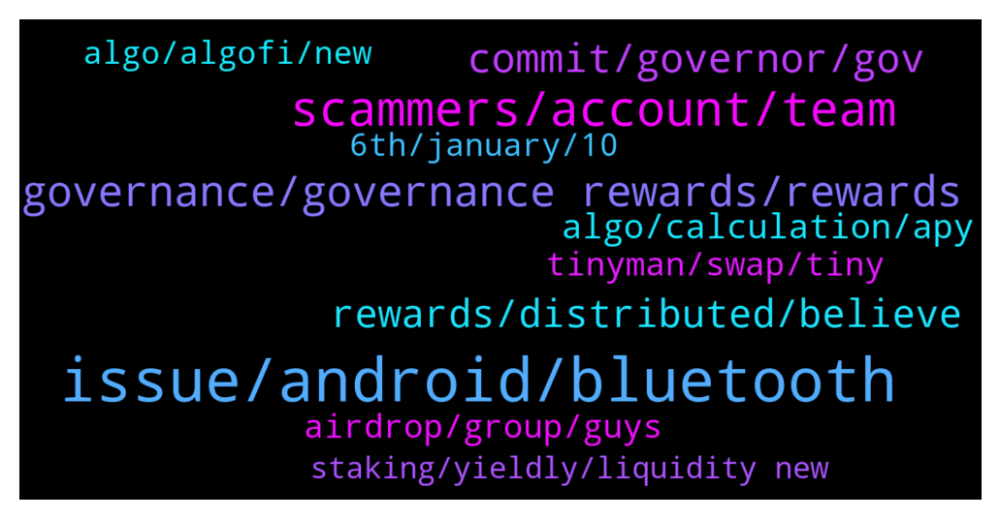

# **@algorand**
 ## Analysis for **2022-01-03** - **2022-01-04**.

---

## 📊 **Basic Stats**

**n_messages_sent**: 304

---

---

## 🔝 **Top keywords and related messages**

1. **issue, android, bluetooth**

    @NightAlgorand --- *Hey, one member shared a solution previously, can you try and see if it works? https://www.reddit.com/r/ledgerwallet/comments/rp3oh8/custom_windowss_ledger_live_patch_for_algorand/* **--->** [TG Discussion](https://t.me/algorand/329090)

    @xyzxyzxyzxyzxyzxyzxyzxy --- *In the URL just replace the part that says 'G1' with 'G2'. That's how i found it* **--->** [TG Discussion](https://t.me/algorand/328929)

    @MackDenver --- *Sorry to hear about your experience, Pav. I will share the issue with the team for fixing, hopefully it will be working again soon* **--->** [TG Discussion](https://t.me/algorand/329441)

    @Borosniper77 --- *Cheers when I was searching for it nothing was coming up i will use this method thank.you* **--->** [TG Discussion](https://t.me/algorand/328971)

    @NightAlgorand --- *Apologize for that, let me check to the team regarding the issue.* **--->** [TG Discussion](https://t.me/algorand/329347)

    @Edward_York --- *Hello guys anyone having problems committing algos with ledger?* **--->** [TG Discussion](https://t.me/algorand/329400)

2. **scammers, account, team**

    @Khaled --- *Hi Team, is this account Twitter account Team_Algorand legit ?* **--->** [TG Discussion](https://t.me/algorand/329499)

    @MackDenver --- *Thanks for the heads up. I'll ban them. Please be aware of scammers.* **--->** [TG Discussion](https://t.me/algorand/329119)

    @NightAlgorand --- *Just block and report, PM are mostly scammers.* **--->** [TG Discussion](https://t.me/algorand/329096)

    @Edward_York --- *Scammers are going to dm u bro... Never reply* **--->** [TG Discussion](https://t.me/algorand/329410)

    @bernijw --- *this is attempted scam, admin please delete and ban !!* **--->** [TG Discussion](https://t.me/algorand/329307)

    @bernijw --- *The catfishing scammer bots are out in full force again today.* **--->** [TG Discussion](https://t.me/algorand/329185)

3. **governance, governance rewards, rewards**

    @cleitonrasta --- *would that be the rewards for voting for governance?* **--->** [TG Discussion](https://t.me/algorand/329038)

    @Nicksof --- *I read a thread on Reddit that explain how the winning option was better for long term* **--->** [TG Discussion](https://t.me/algorand/329507)

    @The Dude --- *It’s a shame the first governance poll didn’t pass or we would be getting more rewards* **--->** [TG Discussion](https://t.me/algorand/329490)

    @chad --- *I got my governance rewards about 15 minutes ago. A little more than expected.* **--->** [TG Discussion](https://t.me/algorand/329358)

    @Matias2k --- *Is it too late to stake and earn rewards from this governance?* **--->** [TG Discussion](https://t.me/algorand/329076)

    @defirlkp --- *Just got my governance rewards hallelujah!* **--->** [TG Discussion](https://t.me/algorand/329359)

4. **commit, governor, gov**

    @Adders28 --- *You can change the amount as long as you do it before sign up closes* **--->** [TG Discussion](https://t.me/algorand/329277)

    @danhtran123 --- *What are the conditions to be accepted?* **--->** [TG Discussion](https://t.me/algorand/329364)

    @pedronelumba --- *@MackDenver I sent yesterday 0.0001 algos to be a governor but my address does not show on the governor list* **--->** [TG Discussion](https://t.me/algorand/329456)

    @cryptotuna --- *Ok, tnx sorry maybe I express wrong. And whay there is written that they advise not to committing all algos?* **--->** [TG Discussion](https://t.me/algorand/329574)

    @Sardon70 --- *Do we have to do anything to receive first Governor vote result?* **--->** [TG Discussion](https://t.me/algorand/329014)

    @Tommy --- *I want to re commit so hoping they come soon* **--->** [TG Discussion](https://t.me/algorand/329304)

5. **rewards, distributed, believe**

    @NightAlgorand --- *Nope, reward will be distributed to your wallet.* **--->** [TG Discussion](https://t.me/algorand/329015)

    @VAR_JUAN_NULL --- *then, the rewards are long overdue.* **--->** [TG Discussion](https://t.me/algorand/329266)

    @Cesar --- *Man, if I ser another message regarding gobernance rewards I will shoot myself... 😂* **--->** [TG Discussion](https://t.me/algorand/329230)

    @chad --- *Put them in gov and hold until the ending period. Rewards automatically distributed.* **--->** [TG Discussion](https://t.me/algorand/329370)

    @deepan179 --- *When will we recieve the rewards* **--->** [TG Discussion](https://t.me/algorand/329181)

    @kramercrypto --- *You literally don't have to do anything, just wait, reward will be sent to you* **--->** [TG Discussion](https://t.me/algorand/329295)

6. **algo, calculation, apy**

    @grigio74 --- *Hello everyone..... A question I had participated in the gov. 1 with 21 5 Algo. This morning I received 7.55 Algo of rewards. Is it right as a calculation? I thought in something more.* **--->** [TG Discussion](https://t.me/algorand/329590)

    @AlgoDad --- *I had a few different wallets using gov - wallet B was  1300 commitment with around 40.5 ALGO in rewards. - around 30% :D* **--->** [TG Discussion](https://t.me/algorand/329394)

    @KingMark --- *This is about 3% no 30%...* **--->** [TG Discussion](https://t.me/algorand/329401)

    @Nicksof --- *In the second period I’m gonna get double the rewards compared to the first according to the calculator a fellow Algorand user created* **--->** [TG Discussion](https://t.me/algorand/329517)

    @MackDenver --- *The reward looks correct. Gov-1 APY was 16%~, so it would break down to 4%~ on your committed ALGO* **--->** [TG Discussion](https://t.me/algorand/329594)

    @kramercrypto --- *Not admin, but you should have rec'd about 3.5%* **--->** [TG Discussion](https://t.me/algorand/329427)

7. **tinyman, swap, tiny**

    @KAPIBAYSIDE --- *Is there another dex available though?* **--->** [TG Discussion](https://t.me/algorand/329151)

    @Olami0920 --- *Is there any dex apart from tinyman to swap on algorand* **--->** [TG Discussion](https://t.me/algorand/329664)

    @cryptomanmachine --- *Very soon and tiny will be rolling v2* **--->** [TG Discussion](https://t.me/algorand/329186)

    @MackDenver --- *Other DEXes will live on the mainnet soon.* **--->** [TG Discussion](https://t.me/algorand/329153)

    @Gknows --- *I'm swapping on tiny man. Trying to take my assets off for now* **--->** [TG Discussion](https://t.me/algorand/329007)

    @gribabas999 --- *Are there any dexes up besides tinyman? Ty* **--->** [TG Discussion](https://t.me/algorand/329425)

8. **airdrop, group, guys**

    @Samueltumiseh --- *my community is launching our airdrop this week, i want you guys to be part* **--->** [TG Discussion](https://t.me/algorand/329165)

    @APhulwadkar1 --- *Airdrop will be airdroped today??? Im i right??* **--->** [TG Discussion](https://t.me/algorand/329444)

    @chad --- *There is no airdrop. Do not answer DM's saying there is. Do not reply to any DM's better* **--->** [TG Discussion](https://t.me/algorand/329377)

    @chainebloque --- *Mainly the Reddit. I think there’s a website which covers airdrops across all chains but it’s name escapes me* **--->** [TG Discussion](https://t.me/algorand/329321)

    @MackDenver --- *We are not doing any airdrop* **--->** [TG Discussion](https://t.me/algorand/329445)

    @yar2000000 --- *Will AirDrop be announced in this group?* **--->** [TG Discussion](https://t.me/algorand/329373)

9. **6th, january, 10**

    @kramercrypto --- *Will be distributed soon. 5th is the latest* **--->** [TG Discussion](https://t.me/algorand/329317)

    @Sardon70 --- *Ok thank. Will it be done before the 6th of January?* **--->** [TG Discussion](https://t.me/algorand/329016)

    @TinyBit --- *Why there is no new versions in updates? right now we are on 4.10.10 https://www.algorandwallet.com/news* **--->** [TG Discussion](https://t.me/algorand/329085)

    @pedronelumba --- *How long does it take to confirm ?* **--->** [TG Discussion](https://t.me/algorand/329481)

    @NightAlgorand --- *Hi there, the distribution will continue until January 5, please check your wallet frequently.* **--->** [TG Discussion](https://t.me/algorand/329305)

    @NightAlgorand --- *Yes, according to the instructions, it will be distributed before 6th.* **--->** [TG Discussion](https://t.me/algorand/329018)

10. **algo, algofi, new**

    @cryptodadpreneur --- *where is the best place to stake algo* **--->** [TG Discussion](https://t.me/algorand/329550)

    @MackDenver --- *With the recent launch of Algofi, users can now lend and borrow against their ALGO, USDC, goBTC & more.   Learn more about their simple-to-use platform and a new initiative that will distribute 2M ALGO to Algofi users in Q1 2022: https://blog.algofi.org/673aaaf8d662* **--->** [TG Discussion](https://t.me/algorand/329101)

    @cryptotuna --- *So no interaction with algofi etc....* **--->** [TG Discussion](https://t.me/algorand/329582)

    @defirlkp --- *Personally I preferred that option as it doesn't release too many algos too early and voted accordingly* **--->** [TG Discussion](https://t.me/algorand/329508)

    @bobbybanks --- *Thank you bro!! And I definitely believe in Algo tbh, I research heavily before I put loot into anything ya know. Just buy and hold that’s all I do.* **--->** [TG Discussion](https://t.me/algorand/329398)

    @Khaled --- *which is posting on the behalf of Algo Foundation* **--->** [TG Discussion](https://t.me/algorand/329503)

