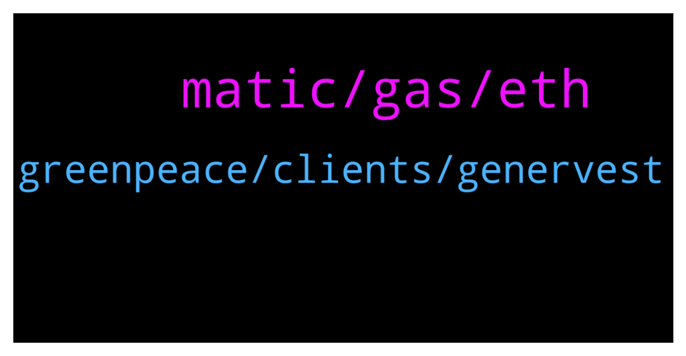

# **@ampnetapxchat**
 ## Analysis for **2021-12-30** - **2022-01-04**.

---

## 📊 **Basic Stats**

**n_messages_sent**: 73

---

---

## 🔝 **Top keywords and related messages**

1. **matic, gas, eth**

    @E_Don --- *We need more pairs on Matic. Eth gas fee is crazy  Matic/AAPX. Eth/AAPX* **--->** [TG Discussion](https://t.me/ampnetapxchat/36085)

    @<UNK> --- *Here is the aapx network address  https://polygonscan.com/token/0x3fc8bd9b0d8054cbdc174c4ed4b41a95d3c6a427* **--->** [TG Discussion](https://t.me/ampnetapxchat/36087)

    @Lord of the --- *Nice but wen exchange listings ?* **--->** [TG Discussion](https://t.me/ampnetapxchat/36029)

    @BMontana3 --- *You guys should allow us to stake, the price has completely got destroyed. Atleast get some people hope again and reward them for still holding the coin..* **--->** [TG Discussion](https://t.me/ampnetapxchat/35971)

    @iamdiarrhoea --- *can you confirm me your username just in case its a scammer. thanks!* **--->** [TG Discussion](https://t.me/ampnetapxchat/35891)

    @arikthereal --- *Hi Team, who would I be able to disucss listing opportunity on BitMart with ? Verification will be provided if requested.* **--->** [TG Discussion](https://t.me/ampnetapxchat/35900)

2. **greenpeace, clients, genervest**

    @Bob_Fosse --- *That was basically a very long winded statement that reads, “ampnet did nothing wrong, it’s everyone else’s fault”. Just awful (and not surprising).* **--->** [TG Discussion](https://t.me/ampnetapxchat/36017)

    @mislavjavor --- *I agree, and the team finds ourselves more than accountable for things in and beyond our control. In the history of our company, there has never been an attitde of - “it must be somebody elses fault”. We should have acted sooner on red flags by Greenpeace, we should have moved on to Ethereum sooner, etc… Trust me when I say that we do not pat ourselves on the back saying “good job, it’s the fault of the clients”. On the other hand - it’s easy to look on things from hindsight - with all the extra information that hindsight provides.   The post was meant as an update to the community, that we are working hard, exploring new business models and new clients and that AAPX will be the token that’s backing these new developments.* **--->** [TG Discussion](https://t.me/ampnetapxchat/36027)

    @IncogSen --- *Maybe they already knew about the greenpeace deal falling through behind the scenes* **--->** [TG Discussion](https://t.me/ampnetapxchat/36013)

    @mislavjavor --- *Hey @IncogSen - the breakdown of Greenpeace partnership and the Aeternity attacks were all announced as they happened. The onboarding of new clients and the decision to develop AMPnet v2 was also communicated when it happened. There was no hiding of information from our side - when we had nothing to say, we stayed silent. When we had new partners or developments - we announced them, as was expected from us.   The optimism in our announcements was how we felt at the time, it was a genuine excitement that we felt - but we couldn’t know how things would end before they ended.  I understand the frustrations, but information was not witheld.* **--->** [TG Discussion](https://t.me/ampnetapxchat/36007)

    @IncogSen --- *You guys knew you had problems with greenpeace, yet you were telling us buybacks will come again and again. You didn't let us know about the relationship breakdown. For you to use the word "fraudulent" shows how bad it must've been.* **--->** [TG Discussion](https://t.me/ampnetapxchat/36011)

    @IncogSen --- *We were given false narratives throughout* **--->** [TG Discussion](https://t.me/ampnetapxchat/36002)

