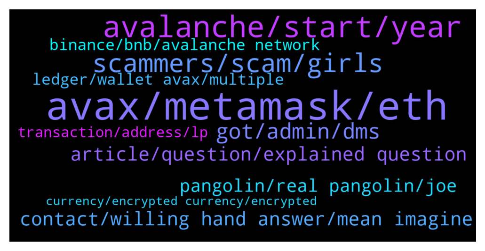

# **@avalancheavax**
 ## Analysis for **2022-01-03** - **2022-01-04**.

---

## 📊 **Basic Stats**

**n_messages_sent**: 234

---

---

## 🔝 **Top keywords and related messages**

1. **avax, metamask, eth**

    @Tigergold --- *I have always sent AVAX purchased on a CEX to the x chain wallet and then transfeered to C chain before sending to Metamsk to buy defi assets. Can I send direct to Metamask Avalanche address from my CEX?* **--->** [TG Discussion](https://t.me/avalancheavax/319231)

    @gmoney202 --- *does anyone know where to swap dai.e to usdt.e without crazy slippage* **--->** [TG Discussion](https://t.me/avalancheavax/319247)

    @denis99r5 --- *Hi. Can someone help me with bridge.Avax.network. I try transfer my DAI.e to ETH many times but always failed transactions. I’m already increasing gas fee to 60gwei but same result. Transaction status failed.[out of gas]* **--->** [TG Discussion](https://t.me/avalancheavax/319657)

    @Manu --- *Guys… I have a v off topic question…. For borrowing on aave or compound etc… or even curve for that matter,,, if we are to over-collateralise…. What is the point… I deposit 1 eth to borrow 0.75 eth and have to pay interest on it….. why not just use the initial 1 eth??  I know it is off topic.. but if someone knows please do tell me :) Thanks!* **--->** [TG Discussion](https://t.me/avalancheavax/319172)

    @rnrlihkg --- *How to transfer my USDC (in Binance & FTX pro) into Usdc.e in avalanche chain?* **--->** [TG Discussion](https://t.me/avalancheavax/319604)

    @Twitter accounts for sale --- *How to setup AVAX in metamask* **--->** [TG Discussion](https://t.me/avalancheavax/319675)

2. **avalanche, start, year**

    @Nicolas_A --- *They integrated Avalanche. Why not ? ^^* **--->** [TG Discussion](https://t.me/avalancheavax/319633)

    @Fibbow --- *Can you recommend a tutorial about Avalanche wallets, addresses,  and functionality?* **--->** [TG Discussion](https://t.me/avalancheavax/319543)

    @Or4ngeknot --- *Hi, I want to check where/who I should go to for enquiries for PR partnerships for the upcoming Avalanche Spring summit in Barcelona? Have sent emails regarding it a few weeks ago through the official site but with no response. Thank you appreciate the help 🙂🙏* **--->** [TG Discussion](https://t.me/avalancheavax/319573)

    @cryptomaxcrypto --- *Hey! Where can I find avalanche projects that launch today?* **--->** [TG Discussion](https://t.me/avalancheavax/319409)

    @Knoedlspezialist --- *Why is Web3 So Crucial for Avalanche Dapps? https://www.newsbtc.com/news/company/why-is-web3-so-crucial-for-avalanche-dapps/* **--->** [TG Discussion](https://t.me/avalancheavax/319627)

    @Vagabond Airdrop Support --- *I received an Invites to avalanche beta app 🎉😄 what a way to start the year.  Anyone else does?   https://play.google.com/store/apps/details?id=com.kamzadevs.avalanchewallet* **--->** [TG Discussion](https://t.me/avalancheavax/319312)

3. **scammers, scam, girls**

    @Altenna --- *btw scammers these days are really crazy i asked 1 question and i have like 20 pm and 5+ ppl calling me* **--->** [TG Discussion](https://t.me/avalancheavax/319337)

    @alrko616 --- *be aware frrom scammers. this is official https://wallet.avax.network/* **--->** [TG Discussion](https://t.me/avalancheavax/319464)

    @alrko616 --- *Accounts with girls profile should get banned* **--->** [TG Discussion](https://t.me/avalancheavax/319178)

    @sanse_sebastian --- *I did it on purpose, trying to attract scammers to bam them from groups where I'm admin* **--->** [TG Discussion](https://t.me/avalancheavax/319194)

    @ramziakram --- *that is scammer sir.plz block them* **--->** [TG Discussion](https://t.me/avalancheavax/319236)

    @Bruno_LGD --- *I wonder how many scammers are trying to get his seed haha* **--->** [TG Discussion](https://t.me/avalancheavax/319480)

4. **got, admin, dms**

    @Bruno_LGD --- *How many DM's you've got? Lol* **--->** [TG Discussion](https://t.me/avalancheavax/319478)

    @vercettitommyy --- *Can somebody from the team or an admin explain why there is a front ama here tomorrow?* **--->** [TG Discussion](https://t.me/avalancheavax/319632)

    @Marilyn_Egy --- *@el33th4x0r Answer the DM please sir!* **--->** [TG Discussion](https://t.me/avalancheavax/319697)

    @COMC3EX --- *STOP to send DMs will just BLOCK you - only here asking for solutions* **--->** [TG Discussion](https://t.me/avalancheavax/319526)

    @ramziakram --- *admin never DM first or call you* **--->** [TG Discussion](https://t.me/avalancheavax/319237)

    @Mark --- *Please stop all this messages, you already know admin will never DM you, why all this wrong messages inside group* **--->** [TG Discussion](https://t.me/avalancheavax/319196)

5. **contact, willing hand answer, mean imagine**

    @COMC3EX --- *That was what I thought as well  - but they are not willing to hand it over nor to do it* **--->** [TG Discussion](https://t.me/avalancheavax/319520)

    @AvaxArrogant --- *there is no answer besides, them doing it on their side manually as they control the priv key* **--->** [TG Discussion](https://t.me/avalancheavax/319516)

    @AvaxArrogant --- *i seem to remember the same thing happening, and they recovered it for someone else* **--->** [TG Discussion](https://t.me/avalancheavax/319500)

    @AvaxArrogant --- *to my understanding they can do it 100%, their will is the only issue there.* **--->** [TG Discussion](https://t.me/avalancheavax/319521)

    @AvaxArrogant --- *if they will or not will be up to them, I would bother their support.* **--->** [TG Discussion](https://t.me/avalancheavax/319507)

    @COMC3EX --- *No was in contact with them already* **--->** [TG Discussion](https://t.me/avalancheavax/319503)

6. **article, question, explained question**

    @HellenicAng3 --- *Is there anywhere I can read more on this?* **--->** [TG Discussion](https://t.me/avalancheavax/319411)

    @Nicolas_A --- *It's explained here https://docs.avax.network/learn/platform-overview/  :)* **--->** [TG Discussion](https://t.me/avalancheavax/319639)

    @Nicolas_A --- *This article explains it to some degree https://medium.com/vault0x/hd-wallets-structure-and-its-implementation-5897ab3da210* **--->** [TG Discussion](https://t.me/avalancheavax/319413)

    @Or4ngeknot --- *Hi sorry @oathtobarbatos , could you help me with this? Or direct me to someone who could? Thank you* **--->** [TG Discussion](https://t.me/avalancheavax/319620)

    @oathtobarbatos --- *You can discuss about it here: https://t.me/avalanche_trading* **--->** [TG Discussion](https://t.me/avalancheavax/319566)

    @Nicolas_A --- *Just look at the picture at the beginning of the article* **--->** [TG Discussion](https://t.me/avalancheavax/319641)

7. **pangolin, real pangolin, joe**

    @danielwerners --- *Avax to da mooon 🚀🚀🚀 non stop spiking.* **--->** [TG Discussion](https://t.me/avalancheavax/319555)

    @mod231 --- *Ogami na Hammed sir 😂😂…….ise nlo dede sir…..* **--->** [TG Discussion](https://t.me/avalancheavax/319510)

    @1 --- *Werey lo poju ninu gbogbo yin😂* **--->** [TG Discussion](https://t.me/avalancheavax/319508)

    @Maureen --- *Baba mi  Fun wa group nau* **--->** [TG Discussion](https://t.me/avalancheavax/319545)

    @Maureen --- *Ahhh walahi wo ti ja ju😂😂* **--->** [TG Discussion](https://t.me/avalancheavax/319544)

    @Luckymonkey14 --- *Yes everyone knows that the real OG is Pangolin 🤷🏽‍♂ but still they promote Joe over Pango ..don't be so ungrateful AVAX!!!* **--->** [TG Discussion](https://t.me/avalancheavax/319611)

8. **ledger, wallet avax, multiple**

    @Nicolas_A --- *No you login to the same wallet but have access to different addresses* **--->** [TG Discussion](https://t.me/avalancheavax/319402)

    @TheRealForever --- *Not complaining, but I connected my ledger with wallet.avax and I have 0.1 AVAX. No idea where it's from and there is no history of transfer. It's on C chain within the wallet.* **--->** [TG Discussion](https://t.me/avalancheavax/319373)

    @CryptoBotje --- *Your ledger has a passphrase. Someone could have the same.* **--->** [TG Discussion](https://t.me/avalancheavax/319387)

    @Nicolas_A --- *There is only 1 seed phrase. You can have multiple addresses with the HD wallet* **--->** [TG Discussion](https://t.me/avalancheavax/319397)

    @HellenicAng3 --- *multiple addresses means multiple wallets on say your wallet.avax?* **--->** [TG Discussion](https://t.me/avalancheavax/319398)

    @HellenicAng3 --- *Can you have more than one AVAX wallet on your ledger?* **--->** [TG Discussion](https://t.me/avalancheavax/319396)

9. **binance, bnb, avalanche network**

    @COMC3EX --- *Help needed  Transferred on the avalanche network in my Metamask by accidentally BNB to my Binance account - they never arrived - looks they are lost* **--->** [TG Discussion](https://t.me/avalancheavax/319484)

    @COMC3EX --- *That I did - it shows “success” the BNB were transferred but I do not have them in my Binance wallet* **--->** [TG Discussion](https://t.me/avalancheavax/319653)

    @Nicolas_A --- *You can’t deposit BNB to Binance from the Avalanche network :/* **--->** [TG Discussion](https://t.me/avalancheavax/319671)

    @AvaxArrogant --- *binance will be able to recover it for you* **--->** [TG Discussion](https://t.me/avalancheavax/319498)

    @Nix --- *Or more than to BNb burning?* **--->** [TG Discussion](https://t.me/avalancheavax/319213)

    @COMC3EX --- *Now I know that - try to find where the BNBs are now to get them back - I made it by mistake on the avalanche network* **--->** [TG Discussion](https://t.me/avalancheavax/319680)

10. **transaction, address, lp**

    @Fibbow --- *maybe you sent it over the bridge and it's a wrapped coin you need to add to your wallet to see it? the avalanche scanner should be able to show you the transaction details* **--->** [TG Discussion](https://t.me/avalancheavax/319534)

    @Fibbow --- *and look at the address in bscscan.com to see if the coins showed up.* **--->** [TG Discussion](https://t.me/avalancheavax/319656)

    @TheRealForever --- *Sorry, found the transaction, it was from myself on another wallet.* **--->** [TG Discussion](https://t.me/avalancheavax/319391)

    @TheRealForever --- *Are you sure something isn't up. I send this airdrop if it was that to my C chain address on MM and there is 0 transaction history on the platform.* **--->** [TG Discussion](https://t.me/avalancheavax/319386)

    @DeFiCenturion --- *You are probably putting the incorrect data in the field.* **--->** [TG Discussion](https://t.me/avalancheavax/319344)

    @sanse_sebastian --- *Hello guys, I need help with my wallet* **--->** [TG Discussion](https://t.me/avalancheavax/319192)

