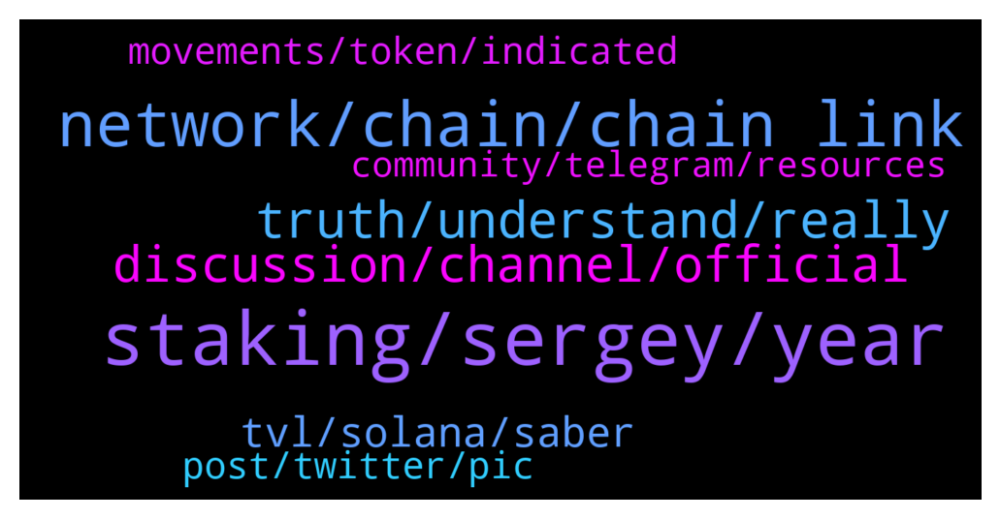

# **@chainlinkofficial**
 ## Analysis for **2022-01-03** - **2022-01-04**.

---

## 📊 **Basic Stats**

**n_messages_sent**: 150

---

---

## 🔝 **Top keywords and related messages**

1. **staking, sergey, year**

    @Motomaniac1 --- *Where will staking be announced first? Here or twitter?* **--->** [TG Discussion](https://t.me/chainlinkofficial/359439)

    @martinjancik --- *Hello, I am new here, is there any quick link to project roadmap? Particulary interested in LINK staking. Thx* **--->** [TG Discussion](https://t.me/chainlinkofficial/359194)

    @joaotraderbatuc --- *How can I put the coins to link pool?* **--->** [TG Discussion](https://t.me/chainlinkofficial/359245)

    @Linkederic --- *Staking LINK isn’t yet live, so you can’t stake LINK with LinkPool either. For more information relating to LinkPool you should join this group: https://t.me/linkpoolio* **--->** [TG Discussion](https://t.me/chainlinkofficial/359248)

    @Mirko --- *watched a youtube and they mentioned staking coming out any time now is expected.  i was hopping that the admin would be able to provide more info. admin???* **--->** [TG Discussion](https://t.me/chainlinkofficial/359068)

    @nam_nguyenson --- *Staking is not yet available but it will be some time this year.  Check out this video from Sergey where he discusses it: https://youtu.be/YShbzR7mlog* **--->** [TG Discussion](https://t.me/chainlinkofficial/359075)

2. **network, chain, chain link**

    @harrumphharrumph --- *I imagine that it will be a gradual roll out as a lot of features with Chainlink have been before like when the feeds came out a few at a time across multiple networks.* **--->** [TG Discussion](https://t.me/chainlinkofficial/359551)

    @athena_meigh --- *Chainlink will be more critical a backbone for the blockchain ecosystem in 2022* **--->** [TG Discussion](https://t.me/chainlinkofficial/359206)

    @Lidavv --- *Go look at you tube and find chainlink video* **--->** [TG Discussion](https://t.me/chainlinkofficial/359701)

    @Lidavv --- *It was mentioned chainlink sell its token to fund social project* **--->** [TG Discussion](https://t.me/chainlinkofficial/359642)

    @Mohit --- *Hello friends what is the future of chain-link when will chain-link pump?* **--->** [TG Discussion](https://t.me/chainlinkofficial/359264)

    @Deepak Kumar --- *Just look at the whale 🐋 statment for last 3 hours they are continuously accumulating link soon big pump within next few hours* **--->** [TG Discussion](https://t.me/chainlinkofficial/359270)

3. **truth, understand, really**

    @Lidavv --- *Ya i  like it. But i not quite sure your standards setting here* **--->** [TG Discussion](https://t.me/chainlinkofficial/359734)

    @Lidavv --- *That is whole truth and nothing but the truth* **--->** [TG Discussion](https://t.me/chainlinkofficial/359728)

    @Lidavv --- *That is really what good governance is* **--->** [TG Discussion](https://t.me/chainlinkofficial/359722)

    @Lidavv --- *Not really understand your definition of out of scope* **--->** [TG Discussion](https://t.me/chainlinkofficial/359715)

    @Lidavv --- *Its your own self interest or is that based on objectivity* **--->** [TG Discussion](https://t.me/chainlinkofficial/359680)

    @Lidavv --- *@Theroryshow @chrisbarrett please review what i have say* **--->** [TG Discussion](https://t.me/chainlinkofficial/359664)

4. **discussion, channel, official**

    @Wizard --- *Okay thank you. But why does a massive project like LINK don’t have an official price channel? Not difficult to have one, and all you need is a couple of admins to keep everything under control.* **--->** [TG Discussion](https://t.me/chainlinkofficial/359043)

    @Linkederic --- *The majority of serious projects prohibit price discussion in their official channels in my experience.   The official channels are intended to be high signal:noise ratio to serve curious people across all spectrums from third party developers leveraging Chainlink to enthusiasts looking to simply keep up to date on the project. Allowing price speculation is a surefire recipe for the exact opposite of that.* **--->** [TG Discussion](https://t.me/chainlinkofficial/359052)

    @Lidavv --- *There is a discussion with 200k view* **--->** [TG Discussion](https://t.me/chainlinkofficial/359705)

    @Shogun187 --- *I saw the video you're referring to and again, it's solely based on a price concern which is out of the scope of this channel.* **--->** [TG Discussion](https://t.me/chainlinkofficial/359710)

    @Wizard --- *I understand that and I agree. But I’m not talking about this main channel. I’m asking why there isn’t a separate price channel, which is made by the official team where people can talk price. There are only unofficial channels where people could get easily scammed. If we have an official separate price channel with a couple of admins, that would help a lot.* **--->** [TG Discussion](https://t.me/chainlinkofficial/359100)

    @Chad --- *Cause the founder doesn’t care about price* **--->** [TG Discussion](https://t.me/chainlinkofficial/359045)

5. **tvl, solana, saber**

    @MarcTillement --- *Hey guys Question coming to mind seeing this thread https://twitter.com/chainlink/status/1476961379231965196/photo/1 How does CL even claim Saber TVL while not being on Solana mainnet?* **--->** [TG Discussion](https://t.me/chainlinkofficial/359072)

    @nam_nguyenson --- *|| Saber helps facilitate the transfer of assets between Solana and other blockchains.  Maybe there’s something there since Saber is not limited to only Solana. And since Chainlink is blockchain-agnostic, they might be using price feeds through other means. I’ll leave it to the experts with more technical understanding of this, such as those on our Discord so don’t take my words for it.* **--->** [TG Discussion](https://t.me/chainlinkofficial/359113)

    @marcromeron --- *I don't even know but trust me that the highest ones.* **--->** [TG Discussion](https://t.me/chainlinkofficial/359735)

    @marcromeron --- *The TVL of Saber is 658 m . I don't think that affects to much the counting.* **--->** [TG Discussion](https://t.me/chainlinkofficial/359109)

    @MarcTillement --- *That does not explain counting as tvl at least to my understanding* **--->** [TG Discussion](https://t.me/chainlinkofficial/359108)

    @marcromeron --- *But let me ask how we count the TVL secured.* **--->** [TG Discussion](https://t.me/chainlinkofficial/359110)

6. **movements, token, indicated**

    @Linkederic --- *As William indicated the blockchain is a public record and you can draw your own conclusions from the information there.* **--->** [TG Discussion](https://t.me/chainlinkofficial/359441)

    @Linkederic --- *As William indicated, the team never has commented on token movements and I don’t expect they ever will.* **--->** [TG Discussion](https://t.me/chainlinkofficial/359435)

    @Shogun187 --- *The team has never commented on token transactions/movements.* **--->** [TG Discussion](https://t.me/chainlinkofficial/359426)

    @Wizard --- *Hi guys, is it true that the team announced they won’t sell any more tokens?* **--->** [TG Discussion](https://t.me/chainlinkofficial/359419)

    @Wizard --- *Thank you, but do you guys have any info about the team not selling anymore? Even if they didn’t say so themselves.* **--->** [TG Discussion](https://t.me/chainlinkofficial/359438)

    @MarcTillement --- *https://github.com/orgs/saber-hq/repositories?q=&type=all&language=&sort=  And it is not that hard to double check — they are open source* **--->** [TG Discussion](https://t.me/chainlinkofficial/359101)

7. **post, twitter, pic**

    @Memetic_polyalloy --- *I had someone message me the other day who had the same profile pic and name as you, too. They wished me a Merry Christmas and left the chat.* **--->** [TG Discussion](https://t.me/chainlinkofficial/359029)

    @Wizard --- *I don’t think if multiple 500K+ twitter accounts tweet something like that, that they just made it up. Maybe next time try helping out instead of being Mr. Smarty Pants* **--->** [TG Discussion](https://t.me/chainlinkofficial/359431)

    @PTournesol --- *Hello Éric someone send messages with thé same pic of you* **--->** [TG Discussion](https://t.me/chainlinkofficial/359023)

    @Shogun187 --- *Because Twitter is a public forum where anyone can post whatever they want?* **--->** [TG Discussion](https://t.me/chainlinkofficial/359428)

    @Lidavv --- *I might send a message binance ceo* **--->** [TG Discussion](https://t.me/chainlinkofficial/359732)

    @BrapreetLadysMan --- *Then probably post on Twitter and telegram* **--->** [TG Discussion](https://t.me/chainlinkofficial/359443)

8. **community, telegram, resources**

    @harrumphharrumph --- *Chainlink – Telegram communities:   Korea - @chainlink_korea   SE Asia - @chainlinkSEA   Indonesia - @ChainlinkID   Thai - @ChainlinkTH Vietnam - @chainlinkVIETNAM   Japan - @chainlinkJAPAN Spain/LatAm - @chainlinkedesp   Turkey - @chainlinkTR   Italian –  @Chainlink_italian   Finnish – @chainlinksuomi   Sweden - @chainlinkSWEDEN   France – @chainlinkFRA   German - @Chainlinkgerman   Dutch - @chainlinkNL   Middle East - @chainlinkME   Russia - @ChainlinkRussia India - @ChainlinkIN* **--->** [TG Discussion](https://t.me/chainlinkofficial/359051)

    @Joypokkamol --- *You can find some groups by searching Telegram for "Chainlink Community" but be aware that they are not operated or endorsed by the Chainlink team or admins of this chat. Thank you for your understanding.* **--->** [TG Discussion](https://t.me/chainlinkofficial/359039)

    @PTournesol --- *Pay attention there are a lot of scammer* **--->** [TG Discussion](https://t.me/chainlinkofficial/359020)

    @Sylvarantt --- *China has a telegram group, it’s called @chainlinkfans (unofficial) and please also feel free to check out our Chinese communities (official) here:  https://blog.chain.link/chainlink-chinese-communities/* **--->** [TG Discussion](https://t.me/chainlinkofficial/359189)

    @marcromeron --- *Welcome new members to the Official Chainlink Telegram Community!  Please review the pinned post for our community rules and resources.   Be aware that price/trading discussion is strictly prohibited.  New to Chainlink? Check out these resources:  - What is Chainlink? - Chainlink 2.0 Whitepaper Overview - The Community Factsheet - Explicit Staking in Chainlink 2.0 - 77 Smart Contract Use Cases Enabled By Chainlink - The Ultimate Chainlink Deep Dive: Completing The God Protocols: A Comprehensive Overview of Chainlink in 2021   ‼️Remember: We will not PM you first. We will never ask for your passwords, keys, or funds for any reason. We don’t have special deals to offer you and there is not now nor will there ever be a Chainlink airdrop. See this article to learn how to avoid the most common scams.* **--->** [TG Discussion](https://t.me/chainlinkofficial/359269)

    @Linkederic --- *Welcome new members to the Official Chainlink Telegram Community!  Please review the pinned post for our community rules and resources.   Be aware that price/trading discussion is strictly prohibited.  New to Chainlink? Check out these resources:  - What is Chainlink? - Chainlink 2.0 Whitepaper Overview - The Community Factsheet - Explicit Staking in Chainlink 2.0 - 77 Smart Contract Use Cases Enabled By Chainlink - The Ultimate Chainlink Deep Dive: Completing The God Protocols: A Comprehensive Overview of Chainlink in 2021   ‼️Remember: We will not PM you first. We will never ask for your passwords, keys, or funds for any reason. We don’t have special deals to offer you and there is not now nor will there ever be a Chainlink airdrop. See this article to learn how to avoid the most common scams.* **--->** [TG Discussion](https://t.me/chainlinkofficial/359021)

