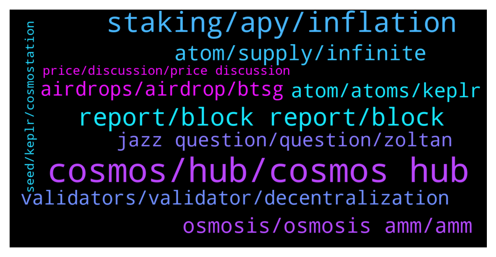

# **@cosmosproject**
 ## Analysis for **2022-01-03** - **2022-01-04**.

---

## 📊 **Basic Stats**

**n_messages_sent**: 561

---

---

## 🔝 **Top keywords and related messages**

1. **cosmos, hub, cosmos hub**

    @Rico --- *Unpopular Input: Lets say Cosmos would end up to be the one endstate where everything happens. Wouldnt that make it somehow centralized...?* **--->** [TG Discussion](https://t.me/cosmosproject/465588)

    @AtomJazz --- *I think the best place to start is by joining cosmos developers discord channel. https://discord.gg/vcExX9T* **--->** [TG Discussion](https://t.me/cosmosproject/466970)

    @KingKend --- *yea w/e , cosmos to rule them all imo , no bsc, eth 2.0 , ada, solana all useless* **--->** [TG Discussion](https://t.me/cosmosproject/465564)

    @ZoltanAtom --- *Prepare a draft of your proposal and publish it here;  https://forum.cosmos.network  Also join to Cosmos discord to ask it to devs.  https://discord.gg/vcExX9T* **--->** [TG Discussion](https://t.me/cosmosproject/465740)

    @Crypto --- *Here is a look at Agoric, looks to be sensational for the Cosmos.   https://www.youtube.com/watch?v=cXz9TlPsAmw&t=204s* **--->** [TG Discussion](https://t.me/cosmosproject/466274)

    @Fortunship --- *Please is cosmos.expert the nft platform of Cosmos. Admin please kindly reply me fast please* **--->** [TG Discussion](https://t.me/cosmosproject/465509)

2. **staking, apy, inflation**

    @shiva1508 --- *There is no information about staking here* **--->** [TG Discussion](https://t.me/cosmosproject/466928)

    @Stulc3 --- *Im new to atom staking,is there some option other than KEPLR wallet,where you can stake without 21 day unstaking period?* **--->** [TG Discussion](https://t.me/cosmosproject/467012)

    @AtomJazz --- *Well sure they have higher inflation atm 😁* **--->** [TG Discussion](https://t.me/cosmosproject/466935)

    @AtomJazz --- *APY is currently 14% per year* **--->** [TG Discussion](https://t.me/cosmosproject/465551)

    @AtomJazz --- *IDK what information you're looking.for tbh. Current inflation is 8.5%, staking APY is ~14%* **--->** [TG Discussion](https://t.me/cosmosproject/466930)

    @shiva1508 --- *Where did you find it is 14% in the link9* **--->** [TG Discussion](https://t.me/cosmosproject/466931)

3. **report, block report, block**

    @Cordtus --- *You have to DM admins they cannot DM you due to rampant scammers impersonating them outside the group* **--->** [TG Discussion](https://t.me/cosmosproject/467326)

    @Cordtus --- *Just checking... Scam bots will jump in very quickly* **--->** [TG Discussion](https://t.me/cosmosproject/467331)

    @ZoltanAtom --- *Hi there, you have two options;  -Reach to Trust wallet costumer service.  -import your mnemonics seed to recommended wallets such as Keprl or Cosmostation and try to redelegate your Atom.   (If someone DM to you,block and report it immediately ⚠️⚠️⚠️No wallet support on telegram. All scams.)* **--->** [TG Discussion](https://t.me/cosmosproject/466754)

    @Im Not A Cat --- *Hey guys make sure you enter our Twitter giveaway for the chance to win 5 SCRT - winner announced Friday   https://twitter.com/midnighttedclub/status/1478327265834545153?s=21* **--->** [TG Discussion](https://t.me/cosmosproject/467032)

    @ZoltanAtom --- *Yes you can. (If someone DM to you,block and report it immediately ⚠️⚠️⚠️)* **--->** [TG Discussion](https://t.me/cosmosproject/467343)

    @ZoltanAtom --- *Can you send to me a DM please. (If someone DM to you, block and report it immediately!)* **--->** [TG Discussion](https://t.me/cosmosproject/466790)

4. **atom, supply, infinite**

    @Soufiane --- *Any ATOM price predictions for 2022 ? 🙂* **--->** [TG Discussion](https://t.me/cosmosproject/466290)

    @Anothernoise --- *the turning in to ETH would be my concern but I think they can control the price of ATOM if it becomes the end game as there is an infinite supply* **--->** [TG Discussion](https://t.me/cosmosproject/465627)

    @sadra_hallaj --- *Hello every one , is there any one I can ask my development issues and problems about ATOM network ?* **--->** [TG Discussion](https://t.me/cosmosproject/465808)

    @not a name --- *Watcha gonna do with them atoms?* **--->** [TG Discussion](https://t.me/cosmosproject/466243)

    @KingKend --- *No it will become super expensive , because of voting, ibc router tx fee's , interchain staking service and everything else out there, probably atom is so valuable projects still airdrop to stakers like we are some eth whales with capital* **--->** [TG Discussion](https://t.me/cosmosproject/465618)

    @PerSecondAlpha --- *Where do I found TVL on Atom?* **--->** [TG Discussion](https://t.me/cosmosproject/466718)

5. **osmosis, osmosis amm, amm**

    @ZoltanAtom --- *Go to your Osmosis account and you will see there “defi lab” click there. That’s all* **--->** [TG Discussion](https://t.me/cosmosproject/466212)

    @ZoltanAtom --- *Are you using Osmosis Amm for this ?* **--->** [TG Discussion](https://t.me/cosmosproject/467335)

    @TicoJohnny --- *Unfortunately Keplr on pc is your best bet, Cosmostation might work but if you need to use Osmosis you’ll want to use the browser app* **--->** [TG Discussion](https://t.me/cosmosproject/466662)

    @Erickdrm --- *i have a question, i can use cosmostatio to participate in the osmosis pools?* **--->** [TG Discussion](https://t.me/cosmosproject/466205)

    @Erickdrm --- *ok ok so i need a osmosis account in cosmostation to interact whit it rigth?* **--->** [TG Discussion](https://t.me/cosmosproject/466217)

    @teachme123 --- *Better stake osmosis or Juno… higher APY* **--->** [TG Discussion](https://t.me/cosmosproject/466933)

6. **atom, atoms, keplr**

    @hilay00 --- *One last question! Can i transfer Atom from crypto.com directly to Keplr?* **--->** [TG Discussion](https://t.me/cosmosproject/466072)

    @hilay00 --- *i did now 1 h ago, just use your atom address from keplr and send it. first try 1 2 atom ... and after that send all to keplr* **--->** [TG Discussion](https://t.me/cosmosproject/466376)

    @AtomJazz --- *So do you have ATOMs in your Keplr wallet?* **--->** [TG Discussion](https://t.me/cosmosproject/466865)

    @hans331 --- *Is there a cooldown on unstaking Atom from Keplr wallet?* **--->** [TG Discussion](https://t.me/cosmosproject/465774)

    @hilay00 --- *The coin Atom direcly and receive Atom on Keplr?* **--->** [TG Discussion](https://t.me/cosmosproject/466074)

    @AtomJazz --- *Ok then you should be able to deposit your ATOMs, Dvpn and Regen* **--->** [TG Discussion](https://t.me/cosmosproject/466867)

7. **validators, validator, decentralization**

    @AtomJazz --- *Yeah I understand but don't stake with exchange validators on Keplr* **--->** [TG Discussion](https://t.me/cosmosproject/466392)

    @hilay00 --- *oh, ok brother... can you recomend any validators?* **--->** [TG Discussion](https://t.me/cosmosproject/466395)

    @John FeeAmac --- *Noob question, I have bought ATOM and now I want to stake in the Keplr wallet. What Validator do I have to select? does anyone have good validator experience?* **--->** [TG Discussion](https://t.me/cosmosproject/466530)

    @Robin --- *Is it better to use different validators? Or just one?* **--->** [TG Discussion](https://t.me/cosmosproject/467112)

    @JT --- *Guys, please advise for atom validator node* **--->** [TG Discussion](https://t.me/cosmosproject/466843)

    @AtomJazz --- *You mustn't use exchange validators like Binance Coinbase or Kraken* **--->** [TG Discussion](https://t.me/cosmosproject/466388)

8. **airdrops, airdrop, btsg**

    @sofbou --- *Is there some airdrops in coming ?* **--->** [TG Discussion](https://t.me/cosmosproject/465536)

    @sethi_shiv --- *Di I need to anything else to get airdrops?* **--->** [TG Discussion](https://t.me/cosmosproject/465984)

    @hilay00 --- *but I receive airdrops no matter what validators I use?* **--->** [TG Discussion](https://t.me/cosmosproject/466386)

    @ZoltanAtom --- *Btsg airdropped to Atom,Osmo and Juno stakers.* **--->** [TG Discussion](https://t.me/cosmosproject/467351)

    @Greemos --- *Hello, one question, I'm staking OSMO and ATOM but the BTSG airdrop was only available on the Osmosis chain and not the Cosmos one, is it normal?* **--->** [TG Discussion](https://t.me/cosmosproject/467350)

    @Wilder999 --- *airdrop tokens which are distributed to ATOM stakers,automatically come in our wallet or do we have to collect them by going on their website???* **--->** [TG Discussion](https://t.me/cosmosproject/466136)

9. **jazz question, question, zoltan**

    @AtomJazz --- *IDK to be honest. All I found was https://koinly.io/integrations/cosmostation-wallet/ but dunno if it helps* **--->** [TG Discussion](https://t.me/cosmosproject/466896)

    @mrsadr15 --- *hello zoltan ! i have question from you* **--->** [TG Discussion](https://t.me/cosmosproject/466214)

    @ZoltanAtom --- *Hi, how can I help you* **--->** [TG Discussion](https://t.me/cosmosproject/466215)

    @AtomJazz --- *So I'm not familiar with it* **--->** [TG Discussion](https://t.me/cosmosproject/466481)

    @hukaa --- *Wow, I’m curious. Thanks for the answer!* **--->** [TG Discussion](https://t.me/cosmosproject/466387)

    @Erickdrm --- *ooooh thak you so much zoltan!* **--->** [TG Discussion](https://t.me/cosmosproject/466238)

10. **price, discussion, price discussion**

    @AtomJazz --- *C'mon guys let's stay on topic. Price discussion are not allowed here. We have a dedicated channel for that* **--->** [TG Discussion](https://t.me/cosmosproject/465832)

    @Wave3TV --- *Hello. Are we allowed to post twitter thread for price chart technicals?* **--->** [TG Discussion](https://t.me/cosmosproject/465784)

    @ZoltanAtom --- *Not really and no price discussion here as you well know.* **--->** [TG Discussion](https://t.me/cosmosproject/466746)

    @AtomJazz --- *Pls no price discussions on this channel* **--->** [TG Discussion](https://t.me/cosmosproject/466333)

    @AtomJazz --- *Not here but we have a price chat for that* **--->** [TG Discussion](https://t.me/cosmosproject/465785)

    @Wave3TV --- *Okay, perfect will post in the price telegram. Appreciate the info!* **--->** [TG Discussion](https://t.me/cosmosproject/465787)

