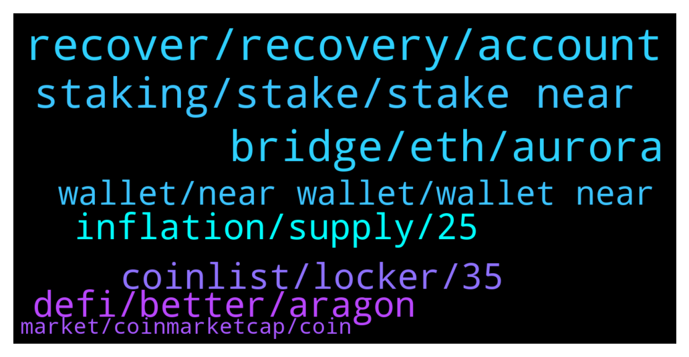

# **@cryptonear**
 ## Analysis for **2022-01-03** - **2022-01-04**.

---

## 📊 **Basic Stats**

**n_messages_sent**: 415

---

---

## 🔝 **Top keywords and related messages**

1. **recover, recovery, account**

    @V --- *Hello, i registered account and chose recovery by sms or email during registration but when I try to connect now it gives only two recovery options by mnemonic phrase or ledger.. what shall I do?* **--->** [TG Discussion](https://t.me/cryptonear/259615)

    @priyansh95u --- *How can I recover my account* **--->** [TG Discussion](https://t.me/cryptonear/259530)

    @kv9990 --- *Check your email ,there should be a mail containing magic link to recover your account from wallet@near.org,use that to recover account ✌️* **--->** [TG Discussion](https://t.me/cryptonear/259632)

    @priyansh95u --- *I don't know how but when searched my address on explorer it shows deleted* **--->** [TG Discussion](https://t.me/cryptonear/259525)

    @V --- *Well, i wanted to connect it after registering to mint..and it gives an option to create new account or import existing one. So when i choose import it gives above options…* **--->** [TG Discussion](https://t.me/cryptonear/259620)

    @Aidrop202 --- *Another question as you log out of the wallet. I can't find where to log out of the wallet.?* **--->** [TG Discussion](https://t.me/cryptonear/259088)

2. **bridge, eth, aurora**

    @Yaorock --- *Looks like rainbow bridge does not work for me.  And i cannot open Aurora explorer to check my transaction hash.* **--->** [TG Discussion](https://t.me/cryptonear/260074)

    @kv9990 --- *Sometimes there're delays 👀 for bridge queries you can ask here https://t.me/auroraisnear* **--->** [TG Discussion](https://t.me/cryptonear/260069)

    @NEARverse_xd --- *No i dont think so. Just send Near from cex to your near wallet and then connect your wallet with rainbow bridge and bridge from near to aurora. Thats it.   Is not it far better then paying high ETH gas fee without any reason? Why you want to pay high fees ;_;* **--->** [TG Discussion](https://t.me/cryptonear/260279)

    @kv9990 --- *Bridging from ETH takes time 🥲🥲 please restore your transaction from here later https://rainbowbridge.app/restore* **--->** [TG Discussion](https://t.me/cryptonear/260067)

    @y_bob --- *is there a derivative dex out there to long/short near?* **--->** [TG Discussion](https://t.me/cryptonear/260462)

    @crypto4life4eva --- *Where can I buy near on a dex?* **--->** [TG Discussion](https://t.me/cryptonear/260254)

3. **staking, stake, stake near**

    @SerhiIsz --- *Good morning everyone 😊 Guys, what does the validator commission mean for staking?* **--->** [TG Discussion](https://t.me/cryptonear/259369)

    @nategeier --- *what's the best visual tool to oversee staking  history?* **--->** [TG Discussion](https://t.me/cryptonear/260162)

    @iforbusiness2 --- *got it, please connect to Wallet and Staking Support: https://t.me/NEARSupport for the right technical help* **--->** [TG Discussion](https://t.me/cryptonear/260195)

    @iforbusiness2 --- *then you shoud connect to Wallet and Staking Support: https://t.me/NEARSupport* **--->** [TG Discussion](https://t.me/cryptonear/259441)

    @hjalalishad --- *thanks dear and is there any minimum token staked requirement ?* **--->** [TG Discussion](https://t.me/cryptonear/259385)

    @iforbusiness2 --- *for the appropriate reply please connect to wallet and staking support: https://t.me/NEARSupport  or can open a ticket at https://nearhelp.zendesk.com/hc/en-us/requests/new* **--->** [TG Discussion](https://t.me/cryptonear/259549)

4. **inflation, supply, 25**

    @covidfraud --- *5% inflation compared to what? coz if taking about NEAR value compared to US$, that's at at least 20% inflation (prob a lot more). So if NEAR value was reducing by 5%/year in US$, that means inflation is actually at least 25%* **--->** [TG Discussion](https://t.me/cryptonear/259943)

    @kv9990 --- *60% of that is in circulation so even after maths , that would be 8% inflation on circulating supply 🥲 how 20/25%* **--->** [TG Discussion](https://t.me/cryptonear/259951)

    @larry_lang --- *5% compared to the initial total supply* **--->** [TG Discussion](https://t.me/cryptonear/259947)

    @Infinitebacking --- *Can I ask why only 60% of Near's suppy is in circulation?* **--->** [TG Discussion](https://t.me/cryptonear/259249)

    @larry_lang --- *1 year later the total supply would be 1B* 105%= 1B and another 50M of NEAR* **--->** [TG Discussion](https://t.me/cryptonear/259949)

    @kv9990 --- *That doesn't makes any sense ..? How 5%=25% ;_;* **--->** [TG Discussion](https://t.me/cryptonear/259946)

5. **coinlist, locker, 35**

    @StephenShimel --- *We have officially locked our dev wallet tokens with #PolarisLock   The lock can be seen at https://polaristoken.io/Locker/0x631edd14bb0b2505c91176fEeDC5f082D27Dd5B8/0xac6d8E9Cc30131F574EDfd161c8B6Ac648B4b20D* **--->** [TG Discussion](https://t.me/cryptonear/259884)

    @StephenShimel --- *Correct, and with that the investors can look up the dev wallet and token address and validate on how much time is left and the amount used in the locker.* **--->** [TG Discussion](https://t.me/cryptonear/259888)

    @DizzyDaystop --- *Hello, is there a place where i can go to read the vesting unlock schedule for $near?* **--->** [TG Discussion](https://t.me/cryptonear/260276)

    @larry_lang --- *hmm is there a way for investors to see through the details of that locker?* **--->** [TG Discussion](https://t.me/cryptonear/259891)

    @larry_lang --- *hmm so the idea was to create a locker that dev team can look thier contract in it- am i getting it right?* **--->** [TG Discussion](https://t.me/cryptonear/259887)

    @Kripto_Raptor --- *and this lp locker thing makes sure developers dont misbehave right?* **--->** [TG Discussion](https://t.me/cryptonear/259879)

6. **defi, better, aragon**

    @ahvousdiraijemaman --- *hey guys anyone heard of Aragon here before? just wondering how do they differ compared to NEAR* **--->** [TG Discussion](https://t.me/cryptonear/260523)

    @ahvousdiraijemaman --- *which is better? is there a way to compare?* **--->** [TG Discussion](https://t.me/cryptonear/260530)

    @daplek --- *near is a protocol with a proof of stake consensus, while aragon is a yield farming that runs on defi. i see* **--->** [TG Discussion](https://t.me/cryptonear/260525)

    @larry_lang --- *hmm i think that there is indeed better farm, but better farm with better APR mean higher risk as well* **--->** [TG Discussion](https://t.me/cryptonear/259350)

    @ahvousdiraijemaman --- *but both aragon and near have similar utilities in the sense that they provide a plug to play experience for people to build a chain right?* **--->** [TG Discussion](https://t.me/cryptonear/260526)

    @Kripto_Raptor --- *more defi dApps are onboarding. more than 10 onboarded last month afaik https://awesomenear.com/categories/defi/* **--->** [TG Discussion](https://t.me/cryptonear/259770)

7. **wallet, near wallet, wallet near**

    @Odogwu_matto --- *Yes I do have a near wallet* **--->** [TG Discussion](https://t.me/cryptonear/259188)

    @l_webster --- *I can hold NEAR in Trustwallet right?* **--->** [TG Discussion](https://t.me/cryptonear/260188)

    @HRC314 --- *Near Wallet would be the wallet of choice to interact with the dapps, right?* **--->** [TG Discussion](https://t.me/cryptonear/259357)

    @FritzWagner --- *There is a lot, you already have a Near Wallet ?* **--->** [TG Discussion](https://t.me/cryptonear/259187)

    @snarbe --- *Will near continue with its way of dealing with wallets, like sending magic links to email addresses it just seems a bit full on like cmon,  it very crypto like* **--->** [TG Discussion](https://t.me/cryptonear/259455)

    @iforbusiness2 --- *but you can't get a NEAR id like XYZ.near* **--->** [TG Discussion](https://t.me/cryptonear/260197)

