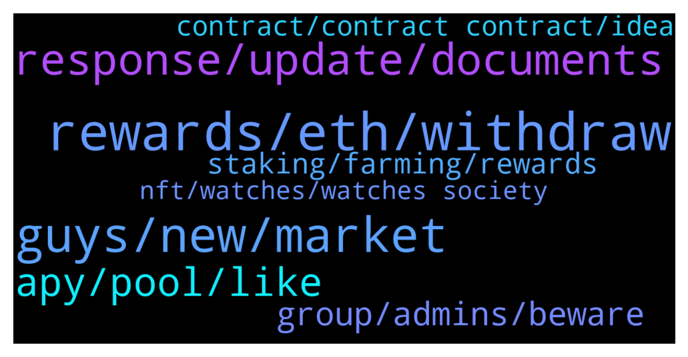

# **@dypfinance**
 ## Analysis for **2022-01-03** - **2022-01-04**.

---

## 📊 **Basic Stats**

**n_messages_sent**: 168

---

---

## 🔝 **Top keywords and related messages**

1. **rewards, eth, withdraw**

    @Manuel --- *90 days lock is now: 95%* **--->** [TG Discussion](https://t.me/dypfinance/236771)

    @Paulus --- *The dyp seem alittle low, i just thought withdraw it and swap it to WAVAX again to increase the LP* **--->** [TG Discussion](https://t.me/dypfinance/236501)

    @H4S2K --- *when can they be usually redeemed* **--->** [TG Discussion](https://t.me/dypfinance/236653)

    @marayamja --- *If you got the money, I feel you can* **--->** [TG Discussion](https://t.me/dypfinance/236725)

    @Paulus --- *I farm WAVAX and it slit 25% to DYP. What happen if i withdraw the DYP? Does the farm keep going?* **--->** [TG Discussion](https://t.me/dypfinance/236498)

    @interwebgorilla --- *when you reinvest rewards on locked stake, does the unlock date remain the same?* **--->** [TG Discussion](https://t.me/dypfinance/236464)

2. **guys, new, market**

    @Q --- *Hey Everyone. Im struggling to find out the difference between DYP and iDYP* **--->** [TG Discussion](https://t.me/dypfinance/236333)

    @hemanrock --- *DYP is native token of Defi yield Protocol.  iDYP you can read more about it from here  https://dypfinance.medium.com/the-new-contracts-and-idyp-token-snapshot-airdrop-and-community-allocation-760a2be599c* **--->** [TG Discussion](https://t.me/dypfinance/236334)

    @DhoniMSD516 --- *Hey this channel is related to DYP project you can start reading about DYP here  https://t.me/dypfinance/229271* **--->** [TG Discussion](https://t.me/dypfinance/236877)

    @hemanrock --- *DYP has audit from 3 security companies. https://dyp.finance/audit* **--->** [TG Discussion](https://t.me/dypfinance/236383)

    @Wen Hsiang --- *Does dyp have a Chinese telegram?* **--->** [TG Discussion](https://t.me/dypfinance/236695)

    @Disguy125 --- *I get that and thats fine but, regardless  someone can't come in and buy 1000eth of DYP could they?* **--->** [TG Discussion](https://t.me/dypfinance/236714)

3. **response, update, documents**

    @iamJubi --- *Rest assured that the team will get your query. hoping for your patience. 🙂* **--->** [TG Discussion](https://t.me/dypfinance/236648)

    @michaelder --- *@iamJubi Hey Jubi just wondering if there has been any feedback from my question early today? Cheers 😀* **--->** [TG Discussion](https://t.me/dypfinance/236719)

    @DhoniMSD516 --- *Will be very happy to see such feedback Thanks :)* **--->** [TG Discussion](https://t.me/dypfinance/236678)

    @Hello --- *Did the team get response back on follow up?* **--->** [TG Discussion](https://t.me/dypfinance/236744)

    @joesonm --- *Or still waiting on response form 8th December?* **--->** [TG Discussion](https://t.me/dypfinance/236799)

    @Cryptomommi --- *Ok thanks. And Tim...from admin tried to help a while back too.* **--->** [TG Discussion](https://t.me/dypfinance/236349)

4. **apy, pool, like**

    @ahuman516 --- *Facts mate, APY is dynamic and no one can from team can change it, consider the scenarios like marketprice people joining the pool etc* **--->** [TG Discussion](https://t.me/dypfinance/236783)

    @DhoniMSD516 --- *The APY is dynamic it might be low now but can increase in future* **--->** [TG Discussion](https://t.me/dypfinance/236442)

    @DhoniMSD516 --- *I am sure you are aware APY is dynamic and changes +/- :)* **--->** [TG Discussion](https://t.me/dypfinance/236774)

    @iamJubi --- *Hello. Let me check with the team as I am not sure with the right APY last night if it literally halved. But Number of users, TVL on the pool, and price of tokens involved affects the APY change.* **--->** [TG Discussion](https://t.me/dypfinance/236640)

    @michaelder --- *good morning team.....just wondering if someone can explain to me why the apy in BSC has litterally halved overnight....its gone from about 280% to 110%......not trying to FUD at all...just would like some clarification......ive been with DYP since mid last year and it was far better returns then compared to now.......as an investor just asking the simple question what has changed........unfortuately im now locked for 90 days ........knowing there are better returns available elsewhere is a bit frustrating.........whats in the pipeline thats going to pick all this up again? dont get me wrong the team does a great job but also at the end of the day performance returns for investors is what counts as well......have a great day all 🙂 cheers!!* **--->** [TG Discussion](https://t.me/dypfinance/236634)

    @michaelder --- *Hi Jubi, thanks for that......when I look at the pool my % share has not dropped at all......so if the number of users would of dropped i would expect my share to increase.....plus market pricing hasnt changed that much to warrant such a decrease in apy......im aware what affects apy but with such a large drop there has to be some other reason...cheers 🙂 !!* **--->** [TG Discussion](https://t.me/dypfinance/236647)

5. **group, admins, beware**

    @zw33669 --- *Hello administrator, about the promotion and cooperation of Chinese market, which person in charge should I contact.* **--->** [TG Discussion](https://t.me/dypfinance/236691)

    @Rodri2I --- *Olá pessoal, Por favor, se vocês souberem de alguma coisa sobre esta empresa, por favor, avise-me tanques.  Um amigo me apresentou hoje e eu disse: deixe-me tentar.   Espero que eles não nos enganem como os outros e fujam com todo o nosso dinheiro.* **--->** [TG Discussion](https://t.me/dypfinance/236381)

    @minnk3 --- *Who can tell me what investment group this is😊😊* **--->** [TG Discussion](https://t.me/dypfinance/236872)

    @iamJubi --- *❗️ BEWARE OF SCAMMERS ❗️  ❌Admins will NOT take the initiative to message you privately to solve problems. Never give your private keys to anyone, send tokens to addresses that they offer, or click on any links that they provide. ❌Don’t share confidential personal information in private chats, and don't make transactions of any kind at all.  ❗️ Be cautious of anyone who claims to be an admin! ❗️ DeFi Yield Protocol admins are @DhoniMSD516, @Tekkol, @timdyp, @iamJubi, @kleopatrad, and @hemanrock !* **--->** [TG Discussion](https://t.me/dypfinance/236726)

    @timdyp --- *Show some love to our founder 🙏* **--->** [TG Discussion](https://t.me/dypfinance/236493)

    @hemanrock --- *Also please let the chat be in English* **--->** [TG Discussion](https://t.me/dypfinance/236384)

6. **staking, farming, rewards**

    @hemanrock --- *Please check this for BSC  https://youtu.be/2pOUmRTMN1o FARM  https://youtu.be/sYkoxGbpBi4 STAKE* **--->** [TG Discussion](https://t.me/dypfinance/236346)

    @JTelegrams --- *Hi Defi Yield users/Admins, how is it possible that farming on V2, for example for USDT, can be annualised 440% APY?   Any explaination for that? If that's the case, everyone would come over to Defi Yield and 'farm' or 'stake'.* **--->** [TG Discussion](https://t.me/dypfinance/236840)

    @hemanrock --- *The staking/Farming works under POS(Proof of stake concept) there are many explanation regarding this already available on Google and Youtube so please check out them.* **--->** [TG Discussion](https://t.me/dypfinance/236392)

    @BlazingApe --- *Is there a group for DeFi yield farmers?* **--->** [TG Discussion](https://t.me/dypfinance/236852)

    @Marinecommandoz --- *Any tutorial video for the staking and farming?* **--->** [TG Discussion](https://t.me/dypfinance/236343)

    @Wen Hsiang --- *I only join the farm  Is it okay?* **--->** [TG Discussion](https://t.me/dypfinance/236704)

7. **contract, contract contract, idea**

    @dung865309 --- *0xbd100d061e120b2c67a24453cf6368e63f1be056 is this the real contract* **--->** [TG Discussion](https://t.me/dypfinance/236867)

    @DhoniMSD516 --- *The one you posted before is not our contract* **--->** [TG Discussion](https://t.me/dypfinance/236878)

    @DhoniMSD516 --- *Yes this is contract of iDYP* **--->** [TG Discussion](https://t.me/dypfinance/236869)

    @hemanrock --- *@gdayaon1025 hey, i don't have any idea about the one you said.* **--->** [TG Discussion](https://t.me/dypfinance/236400)

    @gdayaon1025 --- *Ohh okay my bad might be different then* **--->** [TG Discussion](https://t.me/dypfinance/236401)

    @DhoniMSD516 --- *We have same contract on all chains* **--->** [TG Discussion](https://t.me/dypfinance/236879)

8. **nft, watches, watches society**

    @Ye_Naing --- *Minting NFT with cat and watch or cat only?* **--->** [TG Discussion](https://t.me/dypfinance/236684)

    @timdyp --- *The #NFTs Marketplace together with the Cats and Watches Society collection will come to #Avalanche within two weeks. Metaverse and the Play to Earn #NFT concept will follow shortly!  Learn More👇 https://dyp.finance/nft  👉https://twitter.com/dypfinance/status/1478324493303091201* **--->** [TG Discussion](https://t.me/dypfinance/236775)

    @iamJubi --- *#NFTGiveaway time🐱  🔥10 lucky people will get a Cats and Watches Society #NFT which starts minting on January 17, 2022👇 https://dyp.finance/nft  Enter to win: ✅Retweet ✅Tag 3 friends that loves #NFTs ✅Follow @dypfinance ✅Join https://t.me/dypfinance  #NFTCommunity #NFTdrop  👉https://twitter.com/dypfinance/status/1475805248887439360* **--->** [TG Discussion](https://t.me/dypfinance/236674)

    @iamJubi --- *Discover the Cats and Watches Society #NFTs   The mint will start on January 17👇 https://dyp.finance/nft  Check out this video tutorial about the V2 Marketplace and the New Collection👇 https://youtu.be/07B5QsFqm-Q  #NFTCommunity #nftart #watches #DYP   👉https://twitter.com/dypfinance/status/1477622614961049600* **--->** [TG Discussion](https://t.me/dypfinance/236470)

    @DhoniMSD516 --- *If you mint a NFT it includes both cat and watch* **--->** [TG Discussion](https://t.me/dypfinance/236685)

    @timdyp --- *Had to taste the M1 serum 🧪 Welcome to the family Mutant Ape #12224  #MAYC #BAYC #BoredApeYachtClub #MutantApeYachtClub* **--->** [TG Discussion](https://t.me/dypfinance/236629)

