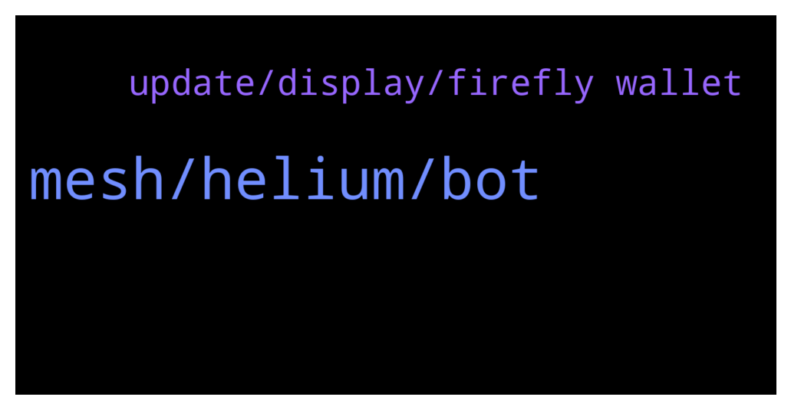

# **@iotatangle**
 ## Analysis for **2022-01-03** - **2022-01-04**.

---

## 📊 **Basic Stats**

**n_messages_sent**: 73

---

---

## 🔝 **Top keywords and related messages**

1. **mesh, helium, bot**

    @lalit1414 --- *Too many token with no use* **--->** [TG Discussion](https://t.me/iotatangle/305757)

    @PiernasLocas --- *Check their WhitePaper it is very interesting its technology and how it going to work* **--->** [TG Discussion](https://t.me/iotatangle/305766)

    @privat roth --- *Im in a coin the Group reaches 100k by 1 week* **--->** [TG Discussion](https://t.me/iotatangle/305634)

    @Tahmis --- *Damn lot of those nowadays... Can't understand if that really pays out for bots to say random things. It just makes people to notice them as bots* **--->** [TG Discussion](https://t.me/iotatangle/305784)

    @Basti --- *You mean like the 16000 cryptoa out there? Just inform yourself about mesh+.* **--->** [TG Discussion](https://t.me/iotatangle/305764)

    @PiernasLocas --- *Mesh+ is a project like Helium (HNT) from blockchain.  But Mesh+ going to use the Technology from Iota and LoRa to create a massive wireless network.  I recommend to read the Whitepaper from Mesh+ and later compare the project with Helium.  Right now they have open a Waitlist to participate in a private sale and ICO.* **--->** [TG Discussion](https://t.me/iotatangle/305756)

2. **update, display, firefly wallet**

    @jessie_rodrag --- *Hi everyone I have a problem with the firefly wallet, the network still disconnected and My friend can’t stake … do you have a solution for this ?* **--->** [TG Discussion](https://t.me/iotatangle/305711)

    @Tahmis --- *Firefly Desktop 1.3.1 has been released. This build contains a number of bug fixes and improvements. Update in app or download from https://firefly.iota.org.   Release is here: https://github.com/iotaledger/firefly/releases/tag/desktop-1.3.1 * Fix Ledger migration (#1900) * Update developer profile UX (#1908)         * Hide developer profile setting behind advanced option         * Warn when creating a developer profile          * Display informational banner in app when a dev profile is open          * Display current testnet name below receive address * Only display syncing block when staking if pending transaction can actually confirm (#1978) * Allow installation path selection on Windows (#1743) * Ensure partial stake merges don’t change staking address (#1918) * Display a warning when sending from a wallet that is below minimum rewards (#1918) * Ensure all node settings changes are saved when editing node url (#1910) * Fix staking time remaining display (#1826)  Fixes #1862, #1973* **--->** [TG Discussion](https://t.me/iotatangle/305600)

    @Jasziu --- *Hi. I have problems with syncing my Firefly while stacking Iota. Any idea how to solve that ?* **--->** [TG Discussion](https://t.me/iotatangle/305660)

    @Jasziu --- *Won't help. I had to install firefly on Linux and use recovery phrase. In logs there was problem with password and stronghold file. Thanks. Have few screens of fake "admins" - interested?* **--->** [TG Discussion](https://t.me/iotatangle/305673)

    @Dima --- *Hello to all… I have a old seed but cant megrate it to firefly what i can do now?* **--->** [TG Discussion](https://t.me/iotatangle/305788)

    @DMoneyShot --- *Updated my firefly wallet. Just released Update* **--->** [TG Discussion](https://t.me/iotatangle/305625)

