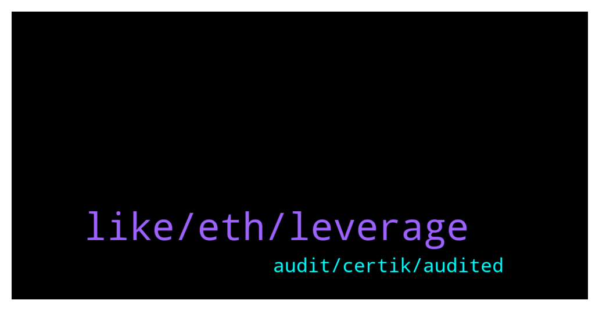

# **@lobsters_chat**
 ## Analysis for **2022-01-03** - **2022-01-04**.

---

## 📊 **Basic Stats**

**n_messages_sent**: 321

---

---

## 🔝 **Top keywords and related messages**

1. **like, eth, leverage**

    @enzosbo --- *wrote about this hsaka dude  https://twitter.com/fozzydiablo/status/1478138915961901057?s=20* **--->** [TG Discussion](https://t.me/lobsters_chat/312582)

    @corp399 --- *https://ftmscan.com/token/0xf6c038dd7034b79fac8b6164a713412ac2d8ce09#writeContract  Seems like sommone deploy scam 'FROG' already lol Don't handle with this shit* **--->** [TG Discussion](https://t.me/lobsters_chat/312399)

    @farm42 --- *Should work without Twitter api https://twitter.com/officer_cia/status/1478372319831760897?s=21* **--->** [TG Discussion](https://t.me/lobsters_chat/312748)

    @paulcr2009 --- *ponzi master, shotta_sk  77 eth, 287 days -> $83.9m (638x)  https://twitter.com/shotta_sk/status/1478268353038848000  https://zapper.fi/ru/account/0x134489b826a3a899b8bbe7243f77292f95aa65fa  decent ride  all way ohm -> redacted* **--->** [TG Discussion](https://t.me/lobsters_chat/312662)

    @johan_ct --- *can I write the event name inside the filter ? Been looking at both ethers and web3 library* **--->** [TG Discussion](https://t.me/lobsters_chat/312229)

    @RYUSSX --- *is the frog that’s up 100x now? crazy* **--->** [TG Discussion](https://t.me/lobsters_chat/312467)

2. **audit, certik, audited**

    @Oxc4t --- *Is multiple audits from Certik worse or better than one audit from them? Can't decide.* **--->** [TG Discussion](https://t.me/lobsters_chat/312268)

    @ivangbi --- *Ctrl+f on audit discussions here please [others can’t answer cause this was talked over many times].  And aave is audited by certik as just “one of” they don’t rely on those at all.* **--->** [TG Discussion](https://t.me/lobsters_chat/312318)

    @ivangbi --- *@awnyrvan ser please tone down the shilling, it’s a bit too much now. There is valid cticism that certik is shit ass fuckery moronic auditing team, and if you make an audit with it even 10 times - it doesn’t change that fact. If that’s your reasoning to say that is good security approach - you are digging one for yourself. Otherwise, all fine* **--->** [TG Discussion](https://t.me/lobsters_chat/312300)

    @awnyrvan --- *Haha. Jokes aside, multiple audits come because this project follows a strict practice of full audit every time they release an upgraded contract. Scores have been very high - I think among top 5 or top 10 audit scores on certik website* **--->** [TG Discussion](https://t.me/lobsters_chat/312297)

    @Joel_john --- *nothng againt certik, its the same from all audit firms* **--->** [TG Discussion](https://t.me/lobsters_chat/312272)

    @FaevDaniel --- *The fact that the audit(s) are from Certik is bad enough* **--->** [TG Discussion](https://t.me/lobsters_chat/312269)

