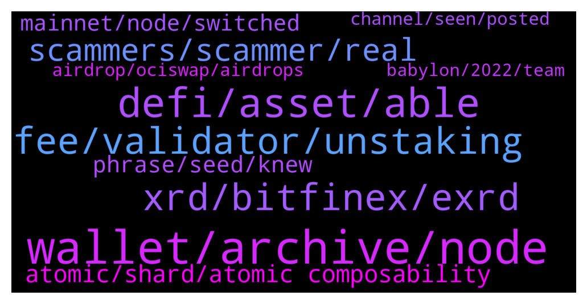

# **@radix_dlt**
 ## Analysis for **2022-01-03** - **2022-01-04**.

---

## 📊 **Basic Stats**

**n_messages_sent**: 762

---

---

## 🔝 **Top keywords and related messages**

1. **wallet, archive, node**

    @pastet89 --- *Sorry but I can't disagree more. I can not access my wallet for days now, in any way, as I can not even change the node to an alternative one and there are many people like me. A crypto with no working explorer and wallet with users with locked funds in case they need them does not speak well about the crypto. The purpose of bitcoin was: your keys, your coins. Now it seems even though I have the keys (seed) I am dependent on the team and their priority plans in order to access my funds. Reminds me of banks - your keys, but not your funds.* **--->** [TG Discussion](https://t.me/radix_dlt/332439)

    @mx471 --- *There is a problem with the wallet that if you haven't set it up yet, you can't do anything. Unfortunately, not even to change the archive node. Could the development team perhaps provide a small hotfix, with which one can still change the archive node before the initial setup?* **--->** [TG Discussion](https://t.me/radix_dlt/332343)

    @fpieper --- *Okay if you really want to jump into the rabbit hole  This is how you decode the wallet.json https://docs.radixpool.com/decoding-the-radix-wallet  And this is how you can send transactions (I wrote a small Python wallet lib a small wrapper around the rest API) - you can use that to connect to any archive node (community or your own) https://t.me/RadixDevelopers/16246  (Assuming you did not use the Ledger Nano S)* **--->** [TG Discussion](https://t.me/radix_dlt/332474)

    @fpieper --- *No, I am from Germany 😜.  Also this is the documentation regarding the archive API https://docs.radixdlt.com/main/node-api/introduction.html  (The docs are just a bit thin on how to sign exactly, but that's already implemented by my wallet lib). You will find the action to send in the documentation there 👍* **--->** [TG Discussion](https://t.me/radix_dlt/332477)

    @mx471 --- *When the official archive nodes are running again you can update the wallet, set it up and then add more archive nodes (which I recommend). All probably tomorrow.* **--->** [TG Discussion](https://t.me/radix_dlt/332466)

    @Tokyorider1611 --- *However, I assume that the wallet will be available again just fine tomorrow probably.  This is coming from Russel (CTO) a few minutes ago: The issue impacting the Wallet and Explorer is the archive nodes being unable to service the load.  The people who have the technical wherewithal to investigate and bring on additional capacity on short notice are on holiday.  The designated on-call person who would normally handle this is dealing with unexpected problems unrelated to work and is unavailable.  Most will be back at work tomorrow, at which time they'll take a look.  When the Gateway Service goes live, which is expected to be this month, this will greatly expand the load capacity.  Until that time, we will bring additional archive nodes on to manage the traffic.* **--->** [TG Discussion](https://t.me/radix_dlt/332582)

2. **defi, asset, able**

    @Jacob_XRD --- *Babylon release, coming later in 2022.  Radix will not be EVM compatible, will be powered by Radix Engine.* **--->** [TG Discussion](https://t.me/radix_dlt/333172)

    @Marco --- *I would like to make a #suggestion. The communication regarding the wallets etc. is not going very well. Still no status update on the website and so on. In various groups, users are disappointed and that is understandable. To prevent this in the future, how about a group with 2-3 official users of Radix plus admins of the various Radix communities. This way, problems can be quickly passed on to all groups.* **--->** [TG Discussion](https://t.me/radix_dlt/332570)

    @Buchi --- *i am in the uk and unfortunately there are no exchanhes for radix* **--->** [TG Discussion](https://t.me/radix_dlt/332613)

    @Jazzer9F --- *🎉NEW RADIX REPORT IS NOW LIVE!🎉  In the last Radix Report of 2021 we have some juicy updates from the marketing and development teams, plus news on the latest efforts from the Radix Marketing Council.  Full Report: https://www.radixdlt.com/post/radix-report-9th-december* **--->** [TG Discussion](https://t.me/radix_dlt/332490)

    @K --- *Did someone hear about SAITO? How does Radix compete to it, what are the pros and cons?* **--->** [TG Discussion](https://t.me/radix_dlt/332921)

    @Metacheez --- *If I'm honest I don't really know, I'm fairly new to the space and not from a technical background. If blockchains are broken would radix either replace them or be able to sync with them? Bitcoin for example?* **--->** [TG Discussion](https://t.me/radix_dlt/332317)

3. **fee, validator, unstaking**

    @millionaire308 --- *Hello admin, the 2 weeks unstaking period of Radix takes too long. Is there any improvement plan? On other platforms, 3 days is a long time, but I don't understand why Radix designed it this way. This time, I also unstaking, but it's not something I wanted to do. Validators suddenly raise their blood to 1.48%, which is ridiculous from a delegator's point of view. If it's 1%, I understand and leave it alone, but if I raise it from 0 like that, of course I want to change it. If the validators behave unilaterally, I think it is right for the delegators to change their delegation so that the unstaking can be done right away.* **--->** [TG Discussion](https://t.me/radix_dlt/333427)

    @mx471 --- *do you mean validators? either https://www.radixdashboard.com/ or https://www.radixscan.io/ValidatorTable.shtml* **--->** [TG Discussion](https://t.me/radix_dlt/332297)

    @crypt_punk --- *sorry  validator fee is fixed on staking? or both of staking and unstaking?* **--->** [TG Discussion](https://t.me/radix_dlt/332139)

    @Martin --- *Hey guys. What should I look for when choosing validators?* **--->** [TG Discussion](https://t.me/radix_dlt/332902)

    @millionaire308 --- *This isn't a complaint, it's a right that delegates can claim. Does 0.17% seem small? Then why can other projects cancel the validator right away? How does the Radix project, which claims to be developed recently, take 2 weeks to unstake?* **--->** [TG Discussion](https://t.me/radix_dlt/333441)

    @Shane_Larson --- *The unbearable pressure and anxiety behind choosing a validator will have me putting this off for weeks to come lol* **--->** [TG Discussion](https://t.me/radix_dlt/332889)

4. **xrd, bitfinex, exrd**

    @Jonn --- *Are Algo or XLM cheaper to send than TRX?* **--->** [TG Discussion](https://t.me/radix_dlt/333005)

    @Dee --- *Is there an ETA when RDX will be available to purchase on more exchanges than just Bitfinex?* **--->** [TG Discussion](https://t.me/radix_dlt/332427)

    @Mleekko --- *you don't have enough XRD to sell. There are some weird rounding errors on Bitfinex, try removing the fractional part* **--->** [TG Discussion](https://t.me/radix_dlt/332884)

    @Shane_Larson --- *Hey y'all. I'm trying to find a guide on how to swap EXRD for XRD on bitfinex.  Currently my ERXD is sitting on Kucoin, but I have decided it's time to convert to XRD and stake it. I'd love some help from anyone willing to offer.* **--->** [TG Discussion](https://t.me/radix_dlt/332505)

    @Lost_in_town --- *Ok @Magal36 thanks a lot for the answer. And also, I remember that e-xrd is the ERC-20 token version of the XRD coin, right ? How is it that market caps of both e-rxd and xrd are different ? For example the market cap of the xrd coin looks like this* **--->** [TG Discussion](https://t.me/radix_dlt/333374)

    @DukiMKD --- *Hello, i have EXRD on Kucoin, i want to convert them to XRD so i can stake. I live in Usa so I can’t use bitfinex. What would be the cheapest way to convert them to xrd ?  Thank you* **--->** [TG Discussion](https://t.me/radix_dlt/332084)

5. **scammers, scammer, real**

    @mx471 --- *@Jacob_XRD this scammer is telling me if I delete my message in the main channel the team members will come back. Is this true?* **--->** [TG Discussion](https://t.me/radix_dlt/332236)

    @mx471 --- *Types of scammers: - imitators of moderators - "Radix DLT Support" scammers - scammers who don't even imitate the team or moderators - Real Bean* **--->** [TG Discussion](https://t.me/radix_dlt/332112)

    @Jacob_XRD --- *We keep all support out of DM’s as it can be a risk to future users who become susceptible to scams from DM.   You can ask here, Discord, or email hello@radixdlt.com* **--->** [TG Discussion](https://t.me/radix_dlt/332181)

    @WardNijmegen --- *Someones is trying to scam under the name of @Jazzer9F, so be aware!* **--->** [TG Discussion](https://t.me/radix_dlt/333330)

    @mx471 --- *And then the scammer simply deletes the chat. Impudent.* **--->** [TG Discussion](https://t.me/radix_dlt/332429)

    @mmznemati --- *First go block and report that scammers on your DM They Should be there now* **--->** [TG Discussion](https://t.me/radix_dlt/332316)

6. **atomic, shard, atomic composability**

    @fpieper --- *Well there were other problems like that IOTA is still centralised because of their coordinator. Also a DAG is not that easily shardable.* **--->** [TG Discussion](https://t.me/radix_dlt/332843)

    @mx471 --- *https://t.me/radix_dlt/263661 "Avalanche supports atomic multi-asset transactions." Is this actually the case by now?* **--->** [TG Discussion](https://t.me/radix_dlt/332147)

    @fpieper --- *Wouldn't necessarily say that, but the thing is with Cerberus that it allows an unlimited amount of transactions through parallelism.* **--->** [TG Discussion](https://t.me/radix_dlt/332131)

    @momoreina --- *So one of the first things that I saw back in 2017 was that IOTA solved this by requiring that before a transaction was validated you had to validate two other transactions, scaling horizontally automatically. I thought it was quite elegant* **--->** [TG Discussion](https://t.me/radix_dlt/332777)

    @fpieper --- *It sounds nice in theory, but in reality still IOTA was and is unsharded and therefore every node needs to process every transaction and this limits it's scalability.* **--->** [TG Discussion](https://t.me/radix_dlt/332834)

    @fpieper --- *Problem is without cross-shard atomic composability you get a bunch of isolated islands and not one unified ledger* **--->** [TG Discussion](https://t.me/radix_dlt/332849)

7. **phrase, seed, knew**

    @mx471 --- *That was before I knew that more people had the problem than expected.* **--->** [TG Discussion](https://t.me/radix_dlt/332458)

    @Buchi --- *is it wise to share my 12 phrase with someone else* **--->** [TG Discussion](https://t.me/radix_dlt/332576)

    @M5M400 --- *(bring on the "ok, boomer" jokes)* **--->** [TG Discussion](https://t.me/radix_dlt/333250)

    @mx471 --- *How do you actually know so much?* **--->** [TG Discussion](https://t.me/radix_dlt/332186)

    @MassieFur --- *I feel the same way, as most people* **--->** [TG Discussion](https://t.me/radix_dlt/332577)

    @Magal36 --- *There's much much more that I don't actually* **--->** [TG Discussion](https://t.me/radix_dlt/332187)

8. **mainnet, node, switched**

    @giskard_rich --- *Still can’t connect to the mainnet. Interesting…* **--->** [TG Discussion](https://t.me/radix_dlt/333198)

    @BlAzAk --- *Not the mainnet, only the radix node is quite busy. Try with another one like https://node.radixscan.io* **--->** [TG Discussion](https://t.me/radix_dlt/332248)

    @yoplay --- *same thing again. mainnet not working. its just on and off at the moment right?* **--->** [TG Discussion](https://t.me/radix_dlt/332411)

    @MiguelBHM --- *Hey guys!  My wallet has stopped working some time after my first staking. It prompts me to choose node/network as mainnet is not available. But on the status page it seems to have no issues, so I'm thinking it may be my account* **--->** [TG Discussion](https://t.me/radix_dlt/333360)

    @Osterzone007 --- *I can't access to my wallet, I am receiving the following message : cannot currently connect to mainnet* **--->** [TG Discussion](https://t.me/radix_dlt/332312)

    @Jonn --- *I'm in Australia too, I switched from a community node to the mainnet today and it works, but it is still a bit slower than usual.* **--->** [TG Discussion](https://t.me/radix_dlt/333246)

9. **airdrop, ociswap, airdrops**

    @angryforest --- *is the airdrop automatic or do you have to apply?* **--->** [TG Discussion](https://t.me/radix_dlt/332633)

    @1Q84 --- *Any other validator nodes giving airdrop or free stuff? (ociswap aside).* **--->** [TG Discussion](https://t.me/radix_dlt/333401)

    @Buchi --- *how can i get the 2022 airdrop* **--->** [TG Discussion](https://t.me/radix_dlt/332599)

    @Buchi --- *some one from this group sent me a link asking me to authenticate my wallet for airdrops tommorrow, if not that i did my due deligence,i would have been a victim* **--->** [TG Discussion](https://t.me/radix_dlt/332584)

    @MassieFur --- *there are no official XRD airdrops. Where did you find this?* **--->** [TG Discussion](https://t.me/radix_dlt/332600)

    @lwtel --- *Devs cant comment on any of that, but as a measure the ocinode airdrop for the community got 101k impressions.* **--->** [TG Discussion](https://t.me/radix_dlt/332864)

10. **channel, seen, posted**

    @luke55 --- *Any sneak peek about your CES booth? @Jacob_XRD* **--->** [TG Discussion](https://t.me/radix_dlt/333217)

    @Jacob_XRD --- *Post away, I’m looking forward to seeing it!* **--->** [TG Discussion](https://t.me/radix_dlt/332991)

    @Jacob_XRD --- *No, but heard it’s amazing. Will be watching in next couple days* **--->** [TG Discussion](https://t.me/radix_dlt/332261)

    @pastet89 --- *This looks like a lot of fun! I will definitely look into it tomorrow, thanks! Are you from Romania BTW?* **--->** [TG Discussion](https://t.me/radix_dlt/332476)

    @Magal36 --- *Do you preffer Hermes or Channel?* **--->** [TG Discussion](https://t.me/radix_dlt/332948)

    @mx471 --- *both the main & announcement channel are good https://t.me/RadixAnnouncements* **--->** [TG Discussion](https://t.me/radix_dlt/332081)

