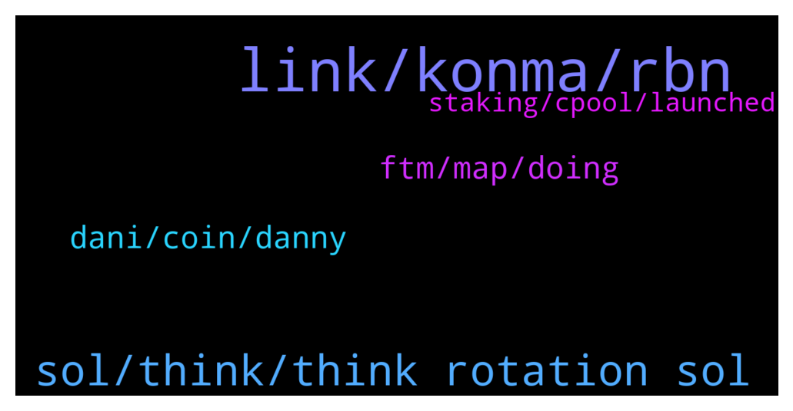

# **@shitpool**
 ## Analysis for **2022-01-03** - **2022-01-04**.

---

## 📊 **Basic Stats**

**n_messages_sent**: 117

---

---

## 🔝 **Top keywords and related messages**

1. **link, konma, rbn**

    @Gregoranus --- *Makes sense, pretty much what RBN is though I believe, check it out, correct me if I’m wrong ser.* **--->** [TG Discussion](https://t.me/shitpool/713624)

    @MoneroPal --- *LOL, there is no money in his platform, TIME is getting rekt, they’re not money managers, but clowns, nobody should entrust those slobs with managing $850M and distributing it out as if they were a asset management firm. They’re clueless, currently it’s essentially a ponzi, except for the fact they don’t actually pay out with investors funds, just with inflation.* **--->** [TG Discussion](https://t.me/shitpool/713901)

    @Antonioalcantara --- *im reading on twitter that link team stopped selling tokens* **--->** [TG Discussion](https://t.me/shitpool/713815)

    @R0mster --- *Take profit. Nothing organically 10 xs in a week without some kind of pull back.* **--->** [TG Discussion](https://t.me/shitpool/713810)

    @MoneroPal --- *The amount of investment and development trumps any temporary issues. Far more so then Twitter and Discord clowns that are investing $150 in Avax. Total apples to flank stank comparison.* **--->** [TG Discussion](https://t.me/shitpool/713887)

    @DappGod --- *Konma is a venture that is being built on Blockchain for many different use cases. We have bootstrapped all projects under Konma for 3 years now and it is time to raise funds which we are doing on Project Catalyst Fund 7 by Cardano. We have submitted 7 different proposals under Konma and the funding comes to projects that have the most votes. We have come past all the stages and now we are at the final voting stage and that is where we need your support.   What we are looking for now is your support for voting our project.  *Kindly take a few minutes to read our proposals* https://linktr.ee/KonmaCatalystFund7  *Here is a link to get more details on Konma*  https://linktr.ee/konma  *Get information on how to vote in the link below* -  https://iohk.zendesk.com/hc/en-us/articles/900005679386  *Still need more information?*  We catch up *everyday* at *7:00 PM IST* for a virtual meet called *Konma United*. Come join us, meet new people and know all about Konma and updates https://konmahood.konma.community/posts/19438959?utm_source=manual  Your support would make a huge difference. You can also forward this to your friends and family who might be active in the crypto or blockchain space. Wishing you and your family a very Happy New Year!!* **--->** [TG Discussion](https://t.me/shitpool/713714)

2. **sol, think, think rotation sol**

    @kevvy_wevvy --- *thats like 1 SOl failure a month each of the last 6 months* **--->** [TG Discussion](https://t.me/shitpool/713880)

    @kevvy_wevvy --- *SOL... has been trash for like half a year. good marketing to be associated i guess* **--->** [TG Discussion](https://t.me/shitpool/713869)

    @AsianFever --- *SolLunAvax squeezed already, fantom atom and near time* **--->** [TG Discussion](https://t.me/shitpool/713860)

    @kevvy_wevvy --- *i think thats just marketing shit like almost everything with SOL* **--->** [TG Discussion](https://t.me/shitpool/713891)

    @Horselorde --- *Oh man I thought hegic was kinda ded* **--->** [TG Discussion](https://t.me/shitpool/713634)

    @kevvy_wevvy --- *again, i think next rotation will prob be into SOL* **--->** [TG Discussion](https://t.me/shitpool/713902)

3. **dani, coin, danny**

    @yesbutalsono --- *Dani coins and new Dani project on ftm* **--->** [TG Discussion](https://t.me/shitpool/713886)

    @AsianFever --- *Is fantom a danny coin now @yesbutalsono ? :)* **--->** [TG Discussion](https://t.me/shitpool/713781)

    @BearishWhale --- *ahoy, whats your take of Dani gettin on sushi train* **--->** [TG Discussion](https://t.me/shitpool/713865)

    @Deathbal1 --- *lol at ftm being a danny coin* **--->** [TG Discussion](https://t.me/shitpool/713791)

    @yesbutalsono --- *Associated but not a Dani coin per say* **--->** [TG Discussion](https://t.me/shitpool/713782)

    @MoneroPal --- *Not at all, but greatly dislike Dani and his ecosystem, believe he is a total clown. Loves to spread hopium, but is clealy clueless, his projects are dog shit too. MIM has no utility but looping in his fun house of projects. TIME is hyper inflationary worthless shit with no plan for the future just infighting and frog memes. Price is down 70% and that is relevent because price is all that matters…* **--->** [TG Discussion](https://t.me/shitpool/713910)

4. **ftm, map, doing**

    @yesbutalsono --- *FTM ecosystem will flourish this week. Harmony too* **--->** [TG Discussion](https://t.me/shitpool/713873)

    @yesbutalsono --- *FTM $2.96|0.00006337₿ Ξ: 0.00076865 H|L: 3.02|2.65 1h    -0.74%   😕 24h    9.68%   🍻 7d    34.84%   🌙 Cap: 28th | $7.6B FDV: $9.5B Vol:  $1.7B @WhaleBotAlerts* **--->** [TG Discussion](https://t.me/shitpool/713897)

    @gonubie --- *and will it be distributed to ftm holders.. hence le pump* **--->** [TG Discussion](https://t.me/shitpool/713749)

    @yesbutalsono --- *gonna be of ftm tho obviously* **--->** [TG Discussion](https://t.me/shitpool/713746)

    @reamBay --- *Why tf is ftm pumping btc is shifting & this shitcoin is on day high* **--->** [TG Discussion](https://t.me/shitpool/713687)

    @MoneroPal --- *Why is FTM even on the map what is it doing that Avalanche, ETH, SOL, Cardano, Terrra, and others are not?* **--->** [TG Discussion](https://t.me/shitpool/713875)

5. **staking, cpool, launched**

    @fololomololo --- *Thats a precursor to staking and CCIP which is their cross chain service thing that will be launched with aave v3* **--->** [TG Discussion](https://t.me/shitpool/713827)

    @IndianTonic --- *Instead of selling Sergio is staking* **--->** [TG Discussion](https://t.me/shitpool/713825)

    @IndianTonic --- *Staking coming anytime between now and 31 Dec 2022 😂* **--->** [TG Discussion](https://t.me/shitpool/713819)

    @Scotty G! --- *VeChain now that they are introducing VeUSD* **--->** [TG Discussion](https://t.me/shitpool/713774)

    @R0mster --- *CPOOL staking will be a required action for borrowers, who must stake an amount of CPOOL to access the area of the protocol where they can make a proposal to be whitelisted.* **--->** [TG Discussion](https://t.me/shitpool/713772)

