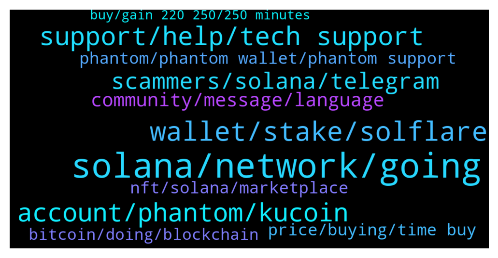

# **@solana**
 ## Analysis for **2022-01-03** - **2022-01-04**.

---

## 📊 **Basic Stats**

**n_messages_sent**: 367

---

---

## 🔝 **Top keywords and related messages**

1. **solana, network, going**

    @DeepThoughtFortyTwo --- *Transactions per second: 1,187 on Solana main page. Is the network under DDoS attack again? All farms are not processing any transactions across the board.* **--->** [TG Discussion](https://t.me/solana/888623)

    @goodsamosamo --- *a few wallets sending a lot of tx, network slow atm. nothing to be alarmed by. temp slowdown on the network.* **--->** [TG Discussion](https://t.me/solana/888483)

    @Rwilsonnow --- *Please post a link to  some solana officials  or administration  or someone as I'm freaking out and really woke up with millions of sol  I swear to God* **--->** [TG Discussion](https://t.me/solana/888743)

    @Happy_Corbin --- *Another DDOS attack? This isn't good* **--->** [TG Discussion](https://t.me/solana/888901)

    @C --- *Someone sent a DoS attack by spamming transactions with too low a transaction fee which led to a congestion of the network in which the Solana developers made a Twitter status saying they were restarting the network.* **--->** [TG Discussion](https://t.me/solana/888461)

    @LeonVktr --- *Check out Babylon DAO on Twitter, still relatively unknown but they are currently trying to launch their DeFi 2.0 protocol on Solana, and I think people trying to bot their launch caused the Solana network now to have some issues. Once the network issues are resolved, Babylon will launch on Raydium and I have a strong conviction where this is headed… 👀* **--->** [TG Discussion](https://t.me/solana/888629)

2. **wallet, stake, solflare**

    @cryptolover1987 --- *Bridge   ❇️ Option 1 : Sollet wallet  Sollet allows you to convert ERC20 to SPL and vice versa using your MetaMask Wallet.  You can deposit ERC20 tokens and convert them to SPL tokens using the convert function of Sollet.io and Metamask (to learn how to convert ERC20 to SPL.  🔗 https://www.sollet.io  How to use: https://solpadfinance.medium.com/convert-usdt-from-erc-20-blockchain-to-solana-blockchain-4871780493af  Telegram : https://t.me/ProjectSerum  ❇️ Option 2: FTX exchange  You can use FTX to deposit tokens (ERC20, XRP, BTC etc) and withdraw from FTX to Sollet.io. FTX will automatically wrap your crypto in an SPL token to be used with the Serum DEX. Please note that to convert wrapped SPL assets back into their native chain, you can deposit into FTX and withdraw the unwrapped assets.  🔗 https://ftx.com  Telegram: https://t.me/FTX_Official  ❇️ Option 3: Wormhole  🔗 www.wormholebridge.com  🔗 https://github.com/certusone/wormhole  Telegram: https://t.me/wormholecrypto  ❇️ Option 4: Allbridge  🔗 https://app.solbridge.io/bridge  Telegram: https://t.me/allbridge_official* **--->** [TG Discussion](https://t.me/solana/888877)

    @Customer --- *How do I stake my sol?* **--->** [TG Discussion](https://t.me/solana/888299)

    @cryptosnick --- *I stake on ftx, anyone know where the highest yield is?* **--->** [TG Discussion](https://t.me/solana/887594)

    @Tyranny5000 --- *i have eth.. how do i buy sol? with dex* **--->** [TG Discussion](https://t.me/solana/888303)

    @jcr712 --- *Through Phantom wallet you can choose a Validator and stake your SOL* **--->** [TG Discussion](https://t.me/solana/887329)

    @Semmylor --- *Please someone answer the first part of the question. How to convert bep20 to sol* **--->** [TG Discussion](https://t.me/solana/888758)

3. **support, help, tech support**

    @mahib45 --- *Kindly submit a ticket for help from their support team!  https://help.phantom.app/hc/en-us/requests/new* **--->** [TG Discussion](https://t.me/solana/887860)

    @RealPrinceOla --- *Kindly reach out to the exchange support team for more help about this. Sorry about the inconvenience.* **--->** [TG Discussion](https://t.me/solana/888635)

    @mahib45 --- *Its clearly stated that you need to contact Their tech support!* **--->** [TG Discussion](https://t.me/solana/888383)

    @Julia100k --- *Hi any admin or help team here* **--->** [TG Discussion](https://t.me/solana/888636)

    @RealPrinceOla --- *Hello EG, can you please make me understand the issue, I will be glad to help you more with it.* **--->** [TG Discussion](https://t.me/solana/888622)

    @Candis67 --- *Actually you know nothing, explaining to you will take my time. I'm busy actually* **--->** [TG Discussion](https://t.me/solana/888097)

4. **account, phantom, kucoin**

    @Jatoshi1 --- *Hi is anyone having problems transferring SOL? Im sending from Kraken to my Phantom wallet. heres the TX Hash:* **--->** [TG Discussion](https://t.me/solana/888365)

    @Jenny --- *Sent my Sol from Coinbase pro to my new Phantom account 4 hours ago … still not there ? Does it usually take this long ?* **--->** [TG Discussion](https://t.me/solana/888239)

    @medivici --- *Why can’t I withdraw SOL from phantom to Binance? Is solana down again?* **--->** [TG Discussion](https://t.me/solana/889162)

    @TheRossB --- *Hi guys,  i have a question.   Maybe some of the admins could help me out? Yesterday i transferred some SOL from kucoin to a phantom wallet but it never came. Kucoin says the transfer is completed but the tx hash gives an error on sol scan.. the amount is never received at the wallet..  A friend of mine had exactly the same problem yesterday.   Anybody who could help or has the same experience?  Thanks!* **--->** [TG Discussion](https://t.me/solana/888968)

    @doh1188 --- *Hi Admin, need some help with a transaction. Tried sending SOL from Kucoin to phantom wallet. It shows completed with trx ID on kucoin but the SOL has not arrived.* **--->** [TG Discussion](https://t.me/solana/888627)

    @Jatoshi1 --- *Transaction BSP2BP7-OQOGSU-3B22OL Withdrawal AMOUNT 1.84387349 SOL FEE 0.01000 SOL STATUS Failed Type Withdraw Error Transaction failed, please contact customer support or try again Ref-ID BSP2BP7-OQOGSU-3B22OL Transaction ID 5QoJ16ushDzEs7DcCMNUv3Ft3Rn7P6xN2Q1g3w9i9F8eBddzd9a4xyFKp3xgACbDtKkKq1uCdLoWFNj88W3w515d  Asset Solana SOL Date 01-03-2022 10:33:15 -08:00 Address 5sQCmrJNeW1f...XitRS3dYRpd6* **--->** [TG Discussion](https://t.me/solana/888380)

5. **scammers, solana, telegram**

    @Ricardo --- *Seriously!? I ask 1 question... then tons of scammers come along...  think this grp/channel shoould shut down and open new clean fresh start* **--->** [TG Discussion](https://t.me/solana/889400)

    @lordpilko --- *Scammers please f**k off. I won't be talking to people who dm. Me.* **--->** [TG Discussion](https://t.me/solana/888543)

    @Folaross --- *Please beware of scammers and impersonators account that PM you first. Our admins will never PM you first.* **--->** [TG Discussion](https://t.me/solana/887917)

    @sol22289d --- *if a stranger messages you something stupid/random just block and report spam. it's a scammer 100% of the time.* **--->** [TG Discussion](https://t.me/solana/888772)

    @AJlegend1 --- *Pls can someone send the solana airdrop bot for me* **--->** [TG Discussion](https://t.me/solana/889387)

    @ligenj --- *ok, only scammers are saying that it is, haha* **--->** [TG Discussion](https://t.me/solana/888768)

6. **community, message, language**

    @Mark --- *If you want to speak your language, ask the admin for your language group, don’t come on here be acting somehow.* **--->** [TG Discussion](https://t.me/solana/887497)

    @MijailR --- *OMG all my messages are deleted automatically, why? Admin?* **--->** [TG Discussion](https://t.me/solana/888735)

    @mahib45 --- *Please forward your question to their community* **--->** [TG Discussion](https://t.me/solana/888298)

    @ouyang_1027 --- *I can speak multiple languages and communicate in different language groups, can’t it?* **--->** [TG Discussion](https://t.me/solana/887498)

    @mahib45 --- *Hello! ▫️Join us in the Discord for support from the dev team 🔗 https://discord.gg/solana  ✅Click on #role and select the emoji "Community " 👨‍🌾 on Carl -bot. And then go back to the general section again.  Then you will able to send message!* **--->** [TG Discussion](https://t.me/solana/888465)

    @mahib45 --- *Let's join your local community 🌐 INTERNATIONAL GROUPS  🇸🇦🇵🇸 Arabic: @SolanaArabic 🇦🇺 Australian : @SolanaAustralia 🇧🇩 Bangladesh: @SolanaBangladesh 🇧🇷 Brazil: @SolanaBrasil 🇨🇳 Chinese: @SolanaCHN 🇨🇳 https://weibo.com/SolanaNews 🇨🇳 Chinese WeChat ID: Solana_SOLdier 🇫🇷 France https://discord.gg/5KPMCCgau6 🇮🇳 Indian: @SolanaIndia 🇮🇩 Indonesian: @SolanaIndonesian 🇯🇵 Japanese: @SolanaJapan 🇰🇷 Korean: @SolanaKor 🇵🇰 Pakistan: @SolanaPakistan 🇵🇭 Philippines: @SolanaFilipino 🇷🇺 Russian: @SolanaRus 🇹🇭 Thailand: @Solanathaicommunity 🇹🇷 Turkish: @SolanaTurkish 🇪🇸 Spanish: @SolanaSpanish 🇻🇳 Vietnamese: @SolanaVietnam* **--->** [TG Discussion](https://t.me/solana/889282)

7. **price, buying, time buy**

    @Satish --- *The day you idiots stop selling and let people go on buying  it will go more than 1 k . Traders screw the price ..* **--->** [TG Discussion](https://t.me/solana/889317)

    @cryptolover1987 --- *Hello everyone!   Price discussion is not allowed here!  It would be ideal to have this conversation (price discussion)on trading channel! Please join our trading room 📊  Thanks for your understanding 🙏🏻* **--->** [TG Discussion](https://t.me/solana/888826)

    @Tobiloba7161143420 --- *Could anyone talk about a token worth buying during this period, Because I believe the dip is the best time to buy* **--->** [TG Discussion](https://t.me/solana/888791)

    @JLopez1976 --- *Market is so quiet in the last days, that I'm afraid about this stillness. Let's wait and see what happens! Only two options: 1. Total chaos! 2. Up to 2x-5x in the next weeks... What do you think?* **--->** [TG Discussion](https://t.me/solana/887955)

    @Monterrey_Rice --- *Hey guys, I love the enthusiasm for Sol, but this is not the channel to discuss price.* **--->** [TG Discussion](https://t.me/solana/889370)

    @suzane10 --- *Don't forget dip is the best time to buy and that time is now I hope you all are buying dip 😎 do not miss out this weekend will be bullish..* **--->** [TG Discussion](https://t.me/solana/887965)

8. **phantom, phantom wallet, phantom support**

    @Tyranny5000 --- *i cant find phantom on android store* **--->** [TG Discussion](https://t.me/solana/888379)

    @mahib45 --- *Hello 👋  Phantom is an extension wallet !  Download link 🔗  https://phantom.app/download* **--->** [TG Discussion](https://t.me/solana/888386)

    @Tyranny5000 --- *is phantom useable with a phone* **--->** [TG Discussion](https://t.me/solana/888396)

    @ursubear --- *Phantom is not available on iOS or Android* **--->** [TG Discussion](https://t.me/solana/888384)

    @PapaPinkPanda --- *Phantom is my wallet of choice* **--->** [TG Discussion](https://t.me/solana/887402)

    @Cranky1988 --- *Thank you, it will be phantom .app  ??* **--->** [TG Discussion](https://t.me/solana/887403)

9. **nft, solana, marketplace**

    @mahib45 --- *Solana NFT marketplace :  1️⃣ Metaplex Metaplex is a decentralized protocol that will allow creators to mint and auction non-fungible tokens on the Solana blockchain.   🔗 https://www.metaplex.com  2️⃣ Lollapalooza  🔗 https://lollapalooza.live-nfts.com  3️⃣ Solanart Solanart is the first fully-fledged NFT marketplace on Solana. Get quick and easy access to digital collectibles and explore, buy and sell NFTs from different collections and artists.  🔗 https://solanart.io  4️⃣ Solarians The very first NFT on Solana   🔗 https://solarians.click/  5️⃣ Frakt FRAKT is the first generative art NFT collection on Solana.  🔗 https://frakt.art* **--->** [TG Discussion](https://t.me/solana/887426)

    @fabiomatos_23 --- *anyone knows more free NFTs in solana?* **--->** [TG Discussion](https://t.me/solana/888331)

    @Cranky1988 --- *i have one more question, what is the biggest solana marketplace for NFT ?* **--->** [TG Discussion](https://t.me/solana/887425)

    @mahib45 --- *Hello 👋  There is no NFT giveaway! Beware of scam* **--->** [TG Discussion](https://t.me/solana/888332)

    @Adobe1337 --- *Who knows the services for creating nft, list all that you know, I’m really looking for a convenient service, who will tell me the service that suits me will receive $ 100 Besides: holaplex, solminter, novalaunch, digitaleyes. solsea, sonarwatch.* **--->** [TG Discussion](https://t.me/solana/889225)

    @Jameszm --- *Official Solana NFT Launch | Only 1500 NFTs!* **--->** [TG Discussion](https://t.me/solana/889117)

10. **bitcoin, doing, blockchain**

    @Candis67 --- *You don't know much about cryptocurrency* **--->** [TG Discussion](https://t.me/solana/887993)

    @Mayukism --- *Bitcoin is a remarkable cryptographic achievement… The ability to create something which is not duplicable in the digital world has enormous value…Lot’s of people will build businesses on top of that.* **--->** [TG Discussion](https://t.me/solana/888807)

    @Han_euna --- *Blockchain is the tech. Bitcoin is merely the first mainstream manifestation of its potential.* **--->** [TG Discussion](https://t.me/solana/888779)

    @Ivvtea --- *Bitcoin may be the TCP/IP of money,  Entire classes of bugs are missing.* **--->** [TG Discussion](https://t.me/solana/888577)

    @Vivianander --- *There's some truth to this I mean alot of people in this crypto sector don't even know what they are doing* **--->** [TG Discussion](https://t.me/solana/887363)

    @Hent --- *Well, everyone isn't meant to be doing crypto Some people are supposed to be standing behind a counter in a local pub somewhere* **--->** [TG Discussion](https://t.me/solana/887370)

