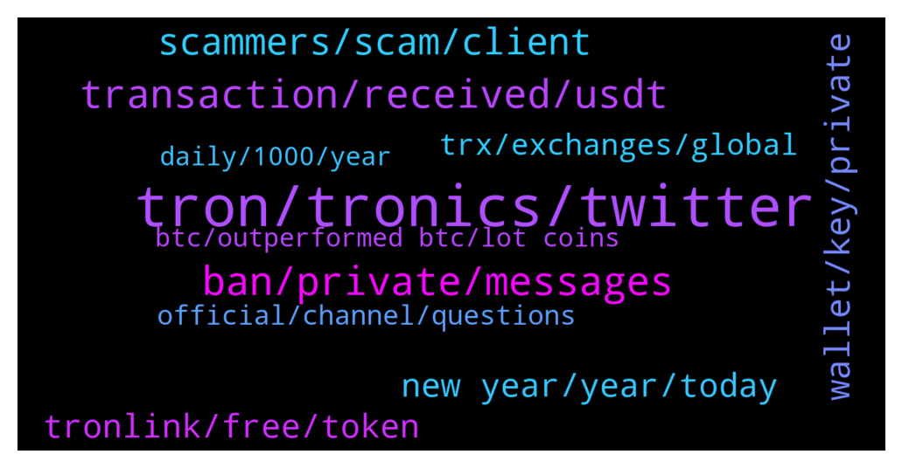

# **@tronnetworkEN**
 ## Analysis for **2022-01-03** - **2022-01-04**.

---

## 📊 **Basic Stats**

**n_messages_sent**: 348

---

---

## 🔝 **Top keywords and related messages**

1. **tron, tronics, twitter**

    @PiterSpain --- *⚒️Since the #TRON Foundation has settled to dissolve itself on July 25, 2021. #TRON network is sufficiently self-sustainable as a decentralized autonomous organization (#DAO), having completed this historical mission.🚀  🙌As the #TRON blockchain protocol is now essentially decentralized. Please follow TRON DAO and get more updates.  🥰Big thanks to our incredible #TRONICS for your continued support.  https://twitter.com/trondao/status/1478298336184926215* **--->** [TG Discussion](https://t.me/tronnetworkEN/3808069)

    @Winklancer11 --- *Is it not good to aware tronics of Scammers on twitter. That promotes tron mining.* **--->** [TG Discussion](https://t.me/tronnetworkEN/3806154)

    @agentpiki --- *Tron is legit. Don't cry here when you got scammed elsewhere* **--->** [TG Discussion](https://t.me/tronnetworkEN/3806340)

    @firmam12 --- *so we try together to hold tron, for our target* **--->** [TG Discussion](https://t.me/tronnetworkEN/3808110)

    @Carlos_TRX --- *TRON is guided by the decisions and votes of the SRs so if you want to be attentive to the news of TRON, I recommend that you enter their proposals.* **--->** [TG Discussion](https://t.me/tronnetworkEN/3808148)

    @agentpiki --- *Huh??? Admins can't ban using tronlink address* **--->** [TG Discussion](https://t.me/tronnetworkEN/3807826)

2. **ban, private, messages**

    @agentpiki --- *Admins and mods never message you first. They all stay in channel to help* **--->** [TG Discussion](https://t.me/tronnetworkEN/3808001)

    @xPommepote --- *Oh yea I know I was just trolling the bot. I’m was tired of seeing these random messages 😂 Good job sir* **--->** [TG Discussion](https://t.me/tronnetworkEN/3808296)

    @agentpiki --- *Sorry, had to ban fake profile* **--->** [TG Discussion](https://t.me/tronnetworkEN/3807881)

    @agentpiki --- *They let you earn first, then site close down. Then you cry* **--->** [TG Discussion](https://t.me/tronnetworkEN/3808086)

    @Kong kong --- *Why do you have so many private messages when you speak...😓* **--->** [TG Discussion](https://t.me/tronnetworkEN/3804841)

    @ccmedianetwork --- *What? People spam, i write (ban).* **--->** [TG Discussion](https://t.me/tronnetworkEN/3805544)

3. **transaction, received, usdt**

    @Carlos_TRX --- *Check the hash to know if the transaction has been made* **--->** [TG Discussion](https://t.me/tronnetworkEN/3806498)

    @Đỗ --- *I have not received. in my transaction history also shows nothing* **--->** [TG Discussion](https://t.me/tronnetworkEN/3806361)

    @Đỗ --- *@agentpiki My transaction history is completely empty. I have never received any transaction.* **--->** [TG Discussion](https://t.me/tronnetworkEN/3807313)

    @Mrwhite4life --- *Yes I have checked the hash and the transaction has been made pls what do I need to now* **--->** [TG Discussion](https://t.me/tronnetworkEN/3806723)

    @Đỗ --- *The transaction was successful but I still haven't received it* **--->** [TG Discussion](https://t.me/tronnetworkEN/3806351)

    @Đỗ --- *Oh my God. I did not make that USDT transfer. Since my friend sent it to me, I've been checking my balance repeatedly but it's not showing. Why is there this transaction 2 hours later?* **--->** [TG Discussion](https://t.me/tronnetworkEN/3807522)

4. **scammers, scam, client**

    @xPommepote --- *Yeah all scammers, report and block, and do it again 😂* **--->** [TG Discussion](https://t.me/tronnetworkEN/3804862)

    @agentpiki --- *There are legit users.  Scammers are active, but if we are smart, scammers will stay hungry and die* **--->** [TG Discussion](https://t.me/tronnetworkEN/3808641)

    @Hannibalbp --- *I am just telling what I am doing and asking because I am new in this , probably that is a scam...* **--->** [TG Discussion](https://t.me/tronnetworkEN/3806067)

    @F4NTXME --- *Scammers are like trans prostitutes ... They wait for the client on the sidewalks ... don't be the client who will be tricked into things that are too beautiful to be those of a woman 😁* **--->** [TG Discussion](https://t.me/tronnetworkEN/3808669)

    @Greg --- *Hey @agentpiki there are new scammers in BitTorrent BTT group* **--->** [TG Discussion](https://t.me/tronnetworkEN/3806087)

    @sim_bil --- *Mostly users are scammers over here 🤦🏻‍♂️* **--->** [TG Discussion](https://t.me/tronnetworkEN/3808639)

5. **wallet, key, private**

    @Hannibalbp --- *Aghhh I signed  something but I changed my password, in this moment I have all my funds and earnings* **--->** [TG Discussion](https://t.me/tronnetworkEN/3806033)

    @Hannibalbp --- *😳 ah ok, if they know my wallet number is endanger to my wallet?* **--->** [TG Discussion](https://t.me/tronnetworkEN/3806001)

    @Fabs_trx --- *This is the first rule when you open a wallet. Write your private key/mnemonic on a paper and put it in a safe place* **--->** [TG Discussion](https://t.me/tronnetworkEN/3807394)

    @Fabs_trx --- *No, you need the private key of a wallet if you want to control the wallet. If you are in watch mode it means you didn’t enter the private key or mnemonic* **--->** [TG Discussion](https://t.me/tronnetworkEN/3807386)

    @Carlos_TRX --- *No, the blockchain is public and your address too.  However, do not sign smart contracts that you do not know and do not share your private keys, you do not have to be afraid of anything.* **--->** [TG Discussion](https://t.me/tronnetworkEN/3806008)

    @Carlos_TRX --- *receiving random tokens does not endanger your wallet, that happens in any blockchain, dsr your private keys endanger your wallet.* **--->** [TG Discussion](https://t.me/tronnetworkEN/3805980)

6. **new year, year, today**

    @sim_bil --- *Its 4th of Jan today 😅* **--->** [TG Discussion](https://t.me/tronnetworkEN/3808520)

    @OregonOrganics --- *Yes Peter lots of folks.  What up buddy. How’s the day going?  All good here.  Coffee and crypto for me so far this morning ☕️ 😁👍🏻.* **--->** [TG Discussion](https://t.me/tronnetworkEN/3804604)

    @Evelyn --- *Lol is still part of the new year congratulations* **--->** [TG Discussion](https://t.me/tronnetworkEN/3808524)

    @simon866 --- *😂 so true, a very nasty surprise is waiting for them* **--->** [TG Discussion](https://t.me/tronnetworkEN/3808680)

    @Phine_has --- *Coffee and crypto updates my side too David* **--->** [TG Discussion](https://t.me/tronnetworkEN/3804627)

    @F4NTXME --- *A hard and painful surprise 😏* **--->** [TG Discussion](https://t.me/tronnetworkEN/3808686)

7. **tronlink, free, token**

    @n_97970 --- *Hi How much trx i can deposit in tronlink to paying fee for adding trc20 or trc10 tokens  for example btt?!* **--->** [TG Discussion](https://t.me/tronnetworkEN/3806579)

    @Carlos_TRX --- *If u used tronlink, check assets option and add the token* **--->** [TG Discussion](https://t.me/tronnetworkEN/3806426)

    @bjainkumar --- *How can i send APENFT trustwallet tokens to Tronlink ???* **--->** [TG Discussion](https://t.me/tronnetworkEN/3804827)

    @Mrwhite4life --- *Yes I use tronlink, the token is there in my asset but my transaction value was not added* **--->** [TG Discussion](https://t.me/tronnetworkEN/3806439)

    @Exemplifyd --- *Is there a specific wallet for TRX with maximum security like the one of WICC wallet have for thiers. Make more sense. I honestly want to keep my assets safe.* **--->** [TG Discussion](https://t.me/tronnetworkEN/3806553)

    @agentpiki --- *You copy and paste your wallet address in tronscan.org* **--->** [TG Discussion](https://t.me/tronnetworkEN/3806386)

8. **trx, exchanges, global**

    @Hannibalbp --- *I saw that: In order to raise and promote the global TRX consensus quickly, increase the occupation ratio of global TRX coin holding addresses, and bring higher value to TRX fans, TRONIX community is launching a 20000000000 U coin mining plan to global effective address holders, and the people holding effective and active addresses can obtain corresponding TRX assets.* **--->** [TG Discussion](https://t.me/tronnetworkEN/3805959)

    @Kong kong --- *Yes, it's annoying. Asking if they are also investing in TRX, everyone is silent.🤣* **--->** [TG Discussion](https://t.me/tronnetworkEN/3804860)

    @MilNoslen --- *Imagine exchanges voting for themselves with the TRX they have lolol* **--->** [TG Discussion](https://t.me/tronnetworkEN/3807170)

    @敏 --- *Buy more TRX and you'll be rich in a few years* **--->** [TG Discussion](https://t.me/tronnetworkEN/3805182)

    @PiterSpain --- *TRX has no contract, it's a cryptocurrency* **--->** [TG Discussion](https://t.me/tronnetworkEN/3804821)

    @guo_r_av --- *Trx is going well or not* **--->** [TG Discussion](https://t.me/tronnetworkEN/3804794)

9. **official, channel, questions**

    @agentpiki --- *He might not be referring to official website,* **--->** [TG Discussion](https://t.me/tronnetworkEN/3808194)

    @agentpiki --- *This is the legit official channel. Don't blame the real one when you got scammed in other* **--->** [TG Discussion](https://t.me/tronnetworkEN/3806338)

    @mark0057 --- *I got smarter from now on, I will follow the official channels. Thanks* **--->** [TG Discussion](https://t.me/tronnetworkEN/3805548)

    @agentpiki --- *That is why we advise you guys to stay  in official channel* **--->** [TG Discussion](https://t.me/tronnetworkEN/3805543)

    @shermania --- *Anything not announced from official sources is and would always be a scam.!* **--->** [TG Discussion](https://t.me/tronnetworkEN/3805961)

    @Giulio --- *The timeline on website is stopped to 2021* **--->** [TG Discussion](https://t.me/tronnetworkEN/3808139)

10. **daily, 1000, year**

    @WindsofChange92 --- *Yes or divide $60 by 365 days and you will get the daily return* **--->** [TG Discussion](https://t.me/tronnetworkEN/3807965)

    @sim_bil --- *Its $60 a year for $1000 staked for a year 👍🏼* **--->** [TG Discussion](https://t.me/tronnetworkEN/3807917)

    @WindsofChange92 --- *7% apy on 1 million usd is a nice amount.* **--->** [TG Discussion](https://t.me/tronnetworkEN/3808014)

    @sim_bil --- *What would be the calculation for $1000 daily profits ?* **--->** [TG Discussion](https://t.me/tronnetworkEN/3807815)

    @sim_bil --- *Buying some currencies for a million would be more nice than 7%* **--->** [TG Discussion](https://t.me/tronnetworkEN/3808055)

    @WindsofChange92 --- *Annual, 6% per year. 365 days* **--->** [TG Discussion](https://t.me/tronnetworkEN/3807855)

