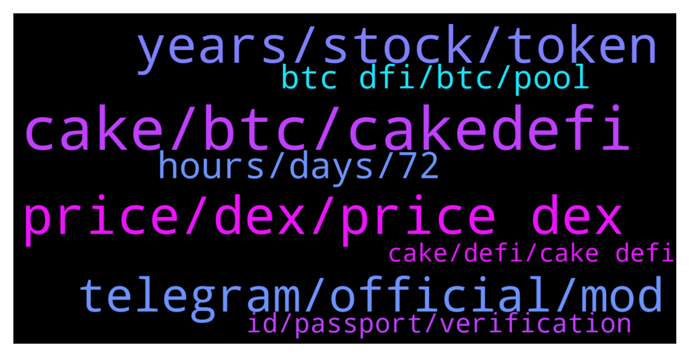

# **@CakeDeFi_EN**
 ## Analysis for **2022-01-04** - **2022-01-05**.

---

## 📊 **Basic Stats**

**n_messages_sent**: 540

---

---

## 🔝 **Top keywords and related messages**

1. **cake, btc, cakedefi**

    @LikelyCrunchy --- *Any idea when deposits will begin to credit at Cake. I would like at least the option to return my dBTC to my Defichain wallet for liquidity mining investment if withdrawals from Cake will be pauses for a while.  Currently my transfer from last night has no even been acknowledged by Cake.* **--->** [TG Discussion](https://t.me/CakeDeFi_EN/159954)

    @emrexdxd --- *@DmgBautista selamun alaikum bro, when money transactions come back? i need to pay electricity tomorrow. all my money in cake app. help me pls.  kind regards and alaikuma asallaum* **--->** [TG Discussion](https://t.me/CakeDeFi_EN/159997)

    @YunTao --- *hi may i transfer ltc to cakedefi already? Or are there still problems with the deposit* **--->** [TG Discussion](https://t.me/CakeDeFi_EN/160989)

    @Yehuda --- *Do you planning to do an easier way to withdraw money from cake?* **--->** [TG Discussion](https://t.me/CakeDeFi_EN/160997)

    @Seeekdeal --- *Hello!! 1st time using Cake Defi. If i send Usdt trc20 or bep20 to defichain, will i lose my money or see it in balance??* **--->** [TG Discussion](https://t.me/CakeDeFi_EN/160650)

    @Christophe_Calis --- *Hi all, I swapped from BCH to dUSD about an hour ago on cakedefi. I'm reading about some issues now in the DeFiChain-channel. Could I have a problem with my swap? What waiting time should I expect? Thank you.* **--->** [TG Discussion](https://t.me/CakeDeFi_EN/160480)

2. **price, dex, price dex**

    @Kassius84 --- *What are you expecting to happen with your dTSLA Tokens? Price of the Tokens depends on supply and demand of dTSLA on the DeFiChain DEX and is not depending on the price outside DeFiChain.* **--->** [TG Discussion](https://t.me/CakeDeFi_EN/160059)

    @klausnoris --- *Are you referring to a dTSLA-LM-Pool?  Both DEX- and Oracle-Prices are also up: https://www.brandlhuber.de/defichain_charts/TSLA.html* **--->** [TG Discussion](https://t.me/CakeDeFi_EN/160041)

    @Kassius84 --- *They have a connection to real stocks while minting of new dTokens. After that, if you buy or providing liquidity, the price only depends on supply and demand on the DeFiChain DEX. Here you can find some more informations https://blog.defichain.com/what-are-decentralised-stock-tokens-and-how-do-they-work/* **--->** [TG Discussion](https://t.me/CakeDeFi_EN/160083)

    @DmgBautista --- *It's how money works, wether its cripto or fiat. You always have slight differences in price, considering the source, fruit of its liquidity and volume. That's why arbitrage oportunities exist, were you can buy low in one exchange and sell high on another. The price of DFI in the DEX may be showing some inconsistencies I dont know, result of the current issue. But that fact is irrelevant for the point I would say, you get the price that the exchange were you sell or buy is willing to pay. So small differences might occur.* **--->** [TG Discussion](https://t.me/CakeDeFi_EN/160450)

    @resinio --- *If I see a high price on the Dex I want to trade for this price…and not an average between Dex and Cex* **--->** [TG Discussion](https://t.me/CakeDeFi_EN/160425)

    @mm_phoenix --- *to calculate the credit they take an average price. what price would you prefer to see that* **--->** [TG Discussion](https://t.me/CakeDeFi_EN/160423)

3. **years, stock, token**

    @Reggie --- *Can anybody please explain why my dTSLA token is not moving with the price of the Tesla stock ?   It's up 12% today but nothing happened to my dTSLA😢* **--->** [TG Discussion](https://t.me/CakeDeFi_EN/160027)

    @Hannes --- *Thanks Michael. But theres only one single price for each stock. I want to know where the prive was three days ago for example.🤔* **--->** [TG Discussion](https://t.me/CakeDeFi_EN/160905)

    @YSL --- *🤔 is it how crypto work or just Dfi ?* **--->** [TG Discussion](https://t.me/CakeDeFi_EN/160438)

    @Reggie --- *So what you saying is all this Tokenized stocks do not mirror the price of the actual Stock which is (Tesla) in my case?   So this Decentralized assets don't have any connection with the actual Stock ?🤕* **--->** [TG Discussion](https://t.me/CakeDeFi_EN/160074)

    @resinio --- *Bad or not…It would be true though* **--->** [TG Discussion](https://t.me/CakeDeFi_EN/160465)

    @Michael_Schredl --- *No it would not be, because they can sell Bitcoin anywhere else to the real price - please stop arguing now* **--->** [TG Discussion](https://t.me/CakeDeFi_EN/160466)

4. **telegram, official, mod**

    @DmgBautista --- *Sorry, had to go to translator to understand what you were saying. I believe you are Turkish? I am sorry but I dont understand turkish language. But from what the translator showed, you seem to need to make a withdrawal.   Cake has withdrawals for DFI and BTC suspended temporarily due to the bug detected on Defichain and also, other withdrawals of other tokens may take extra time since the network is still going through upgrades.   I dint think today will be possible yet to make withdraws. You best chance will be probably to contact Cakr support, as there is no official support on telegram, mods cannot influence that.   Be aware of scammers by the way, as they may try to impersonate community members or mods, and the kind of request you made is the perfect target for them to contact you pretending to help. If anyone contacts you directly, please just block and report. Any DM, from whoever may be  is against the community rules and must be considered always as a scam attempt. Cake official channels and support are the only ones where communications should flow. Best regards!* **--->** [TG Discussion](https://t.me/CakeDeFi_EN/160019)

    @FreeMerman --- *Yesterday another modo deleated my printscreen of a scammer :/ saying that it is not the place for that 🤷well I'll leave it here if I see that you're around.* **--->** [TG Discussion](https://t.me/CakeDeFi_EN/160689)

    @DmgBautista --- *Seriouly? Well surelly was not me, but thank you for doing that! I swear, those scammers like more of me than my own mother 🤦‍♂️   Never trust DM's and not answer to any call either, even if it looks a mod. If you wish, when that happens you can contact me here directly, just send me a printscreen of the scammer telegram username (the one that appears when you click in the name he presents while impersonating a mod or other user) so I can go and ban him immediatelly.  Thank you! 👐* **--->** [TG Discussion](https://t.me/CakeDeFi_EN/160686)

    @DmgBautista --- *To be always sure, I would say 100% of DM's are scamm. Better safe than sorry.   Only official channels should be considered to look for information and clarification. Anyone who wants to help does that here, in the community  not hidding behind a DM!   No mods will ever DM you, as well as there is no direct support in telegram. Stay safe! 👍* **--->** [TG Discussion](https://t.me/CakeDeFi_EN/160815)

    @DmgBautista --- *You should have received an email with the reason. What does it says?  Also, ignore any DM offering help. There is no direct support in telegram! Any unsolicited DM must always be considered as a scam attempt!* **--->** [TG Discussion](https://t.me/CakeDeFi_EN/160156)

    @FreeMerman --- *Oh and guys don't forget that customer service will not contact you directly on telegram.* **--->** [TG Discussion](https://t.me/CakeDeFi_EN/160661)

5. **hours, days, 72**

    @emrexdxd --- *hi as far as i know, if it takes more than 25 minutes it means you are banned* **--->** [TG Discussion](https://t.me/CakeDeFi_EN/160121)

    @emrexdxd --- *i was banned 1 year ago and they checked it in 50 business days. i don’t know if it’s the same case. it may be different* **--->** [TG Discussion](https://t.me/CakeDeFi_EN/160129)

    @Michael_Schredl --- *They can take up to 72 hours* **--->** [TG Discussion](https://t.me/CakeDeFi_EN/160337)

    @Kain --- *Thanks mate is it possible to tell me how many days approximately?* **--->** [TG Discussion](https://t.me/CakeDeFi_EN/160780)

    @William --- *I transferred BTC to my account only to find BTC transactions have been suspended. Does anyone know if this is permanent?* **--->** [TG Discussion](https://t.me/CakeDeFi_EN/160683)

    @Samuel --- *It's just a tiny unit of 2.0 also taking this much hours to let it through ?* **--->** [TG Discussion](https://t.me/CakeDeFi_EN/160308)

6. **btc dfi, btc, pool**

    @aaaliska --- *Hi! What is the reason BTC-DFI LM is disabled?* **--->** [TG Discussion](https://t.me/CakeDeFi_EN/160331)

    @noname123123789 --- *Hey, can you tell me when it will be possible to invest in btc-DFI again (liquidity mining) 😇* **--->** [TG Discussion](https://t.me/CakeDeFi_EN/161069)

    @WilliamCHughes --- *Anyone know how long BTC deposits to Liquidity Mining will be off?* **--->** [TG Discussion](https://t.me/CakeDeFi_EN/161133)

    @qweigand --- *When can we expect BTC - DFI LM to be working properly again?* **--->** [TG Discussion](https://t.me/CakeDeFi_EN/160329)

    @Jan-Niklas --- *When can I swap my dfi to BTC?* **--->** [TG Discussion](https://t.me/CakeDeFi_EN/160551)

    @digabr --- *someone else who can't swap btc >dfi* **--->** [TG Discussion](https://t.me/CakeDeFi_EN/160149)

7. **id, passport, verification**

    @Opti_Mystik --- *Having trouble with identity verification. My document keep being denied. Please help* **--->** [TG Discussion](https://t.me/CakeDeFi_EN/160153)

    @RevoMediaCCO --- *I live at a house, so all my info are the street and the number of it, i put all the information from my id on the adress and i get rejected because i didn't put all the necessary information* **--->** [TG Discussion](https://t.me/CakeDeFi_EN/160792)

    @apvenkat24 --- *Use your passport as ID…in the rejection reason they should have mentioned what to do further* **--->** [TG Discussion](https://t.me/CakeDeFi_EN/160596)

    @Nith --- *Thanks for the reply ,but I don't have passport will they accept aadhar?(Rejection reason was not valid ID I had give PAN)* **--->** [TG Discussion](https://t.me/CakeDeFi_EN/160597)

    @Nith --- *Hey sorry to disturb,but any Indian users there?  wanted to know what ID they used to get the verification done as mine was rejected .* **--->** [TG Discussion](https://t.me/CakeDeFi_EN/160595)

    @Oliver --- *you have my data document and id* **--->** [TG Discussion](https://t.me/CakeDeFi_EN/160960)

