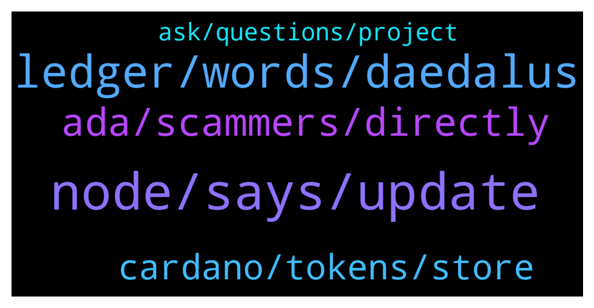

# **@Cardano**
 ## Analysis for **2022-01-04** - **2022-01-05**.

---

## 📊 **Basic Stats**

**n_messages_sent**: 112

---

---

## 🔝 **Top keywords and related messages**

1. **node, says, update**

    @glitch04 --- *if you get another node crash try a reboot and see if that helps something might be stuck in the background* **--->** [TG Discussion](https://t.me/Cardano/765860)

    @Julius --- *I see. How do i avoid the hung state?  It just says stopping cardano node...* **--->** [TG Discussion](https://t.me/Cardano/765847)

    @Julius --- *Must just be one of those days.  Usually it fixes itself after a day or so.  First time getting a crash on closure though.* **--->** [TG Discussion](https://t.me/Cardano/765856)

    @glitch04 --- *Right but it can still exit in a hung state, if it does that means it was killed before the process was cleanly exited which causes the extended check on startup* **--->** [TG Discussion](https://t.me/Cardano/765844)

    @AskCryptoViking --- *thanks for the help @Lgbeano appreciate it* **--->** [TG Discussion](https://t.me/Cardano/765883)

    @glitch04 --- *Full nodes don't have those quick load/functions they need to be fully synced* **--->** [TG Discussion](https://t.me/Cardano/765840)

2. **ledger, words, daedalus**

    @AskCryptoViking --- *I only ever really use daedalus wallet personally I've not gotten into using any light wallets yet tbh* **--->** [TG Discussion](https://t.me/Cardano/765903)

    @glitch04 --- *If you had a wallet added on Yoroi or another light wallet client you may have to remove the other device first for the new device to function they will have different signatures* **--->** [TG Discussion](https://t.me/Cardano/765896)

    @apex_pool_spo --- *Daedalus is only working on PCs and needs to download the whole blockchain. Adalite.io can also restore 12 words wallets. It is an official wallet, but be careful.* **--->** [TG Discussion](https://t.me/Cardano/765484)

    @siamstudio --- *Hello I have ADA from ICO and only 12 word recovery phrase. How I can recover my wallet ? For Yoroi wallet recover need minimal 15 word but I have only 12 word* **--->** [TG Discussion](https://t.me/Cardano/765470)

    @siamstudio --- *I tried to use the wallet Adalite.io, but it does not display funds as they were before Daedalus. I cant upload all blockchain 🙁* **--->** [TG Discussion](https://t.me/Cardano/765501)

    @apex_pool_spo --- *you re not doing anything wrong. actually introducing the recovery words in Yoroi was a mistake. if the device is broken, you need to buy another Ledger and use the recovery words on that device to recover your wallet.* **--->** [TG Discussion](https://t.me/Cardano/765615)

3. **ada, scammers, directly**

    @PipSqueak --- *What if gifting is not an option? I am pointing to NFTs and tokens which are deemed inappropriate. Could be an abusive letter sent to the recipient, etc.* **--->** [TG Discussion](https://t.me/Cardano/765330)

    @Giovanni --- *I mean when I want to liquidate my ADAs and convert them into fiat* **--->** [TG Discussion](https://t.me/Cardano/765925)

    @KN959595 --- *I read something about Liqwid, a project on ADA* **--->** [TG Discussion](https://t.me/Cardano/765810)

    @Albert --- *Well I was looking for an admin couse a couple members of this group are trying to scam me and wanted to report them couse I have pictures. I can't even find the message I sent I guess someone deleted it* **--->** [TG Discussion](https://t.me/Cardano/765726)

    @Giovanni --- *Do I have to transfer my ADAs to an exchange to sell my ADAs? Can't sell directly from the wallet? Isn't it better to use exchanges directly at this point?* **--->** [TG Discussion](https://t.me/Cardano/765921)

    @CryptoXgroup --- *Hey guys sending ADA from crypto.com to exodus, how long will it take? Been over 1 hour and yes adress is correct* **--->** [TG Discussion](https://t.me/Cardano/765664)

4. **cardano, tokens, store**

    @Melly014 --- *Where can I stake cardano token* **--->** [TG Discussion](https://t.me/Cardano/765416)

    @CTLN91 --- *Are there any AirDrops for Cardano based projects?* **--->** [TG Discussion](https://t.me/Cardano/765867)

    @NoFomo319 --- *How do I know which tokens I can store in Daedalus?* **--->** [TG Discussion](https://t.me/Cardano/765696)

    @mindmisled --- *can anyone list the TG groups for cardano pls* **--->** [TG Discussion](https://t.me/Cardano/765755)

    @ExInfernis --- *Every pool there is eligible for sundae tokens* **--->** [TG Discussion](https://t.me/Cardano/765257)

    @Bohemian4 --- *You can store any Cardano native token* **--->** [TG Discussion](https://t.me/Cardano/765709)

5. **ask, questions, project**

    @KEONGLEEE --- *Have you donated to this project?   https://ito.veritree.com* **--->** [TG Discussion](https://t.me/Cardano/765715)

    @glitch04 --- *That is a question for those projects each one handles them differently it's best to ask them direct* **--->** [TG Discussion](https://t.me/Cardano/765874)

    @glitch04 --- *if you were part of their discord, but for more information you need to ask in their support channels as those are project specific questions.* **--->** [TG Discussion](https://t.me/Cardano/765826)

    @CarlesMa --- *Not sure if this is the right place to ask, so, apologize if I’m mistaken.* **--->** [TG Discussion](https://t.me/Cardano/765821)

    @LibraLives --- *No, trying to discuss the LQ mooning situation* **--->** [TG Discussion](https://t.me/Cardano/765766)

    @Melly014 --- *Thanks if I have any more questions I’ll ask* **--->** [TG Discussion](https://t.me/Cardano/765423)

