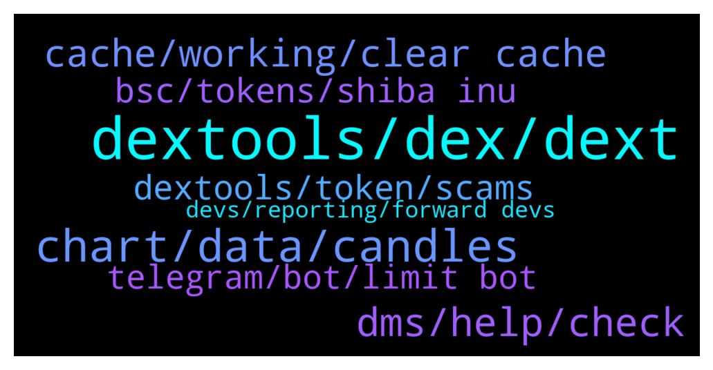

# **@DEXToolsCommunity**
 ## Analysis for **2022-01-03** - **2022-01-05**.

---

## 📊 **Basic Stats**

**n_messages_sent**: 450

---

---

## 🔝 **Top keywords and related messages**

1. **dextools, dex, dext**

    @hmk18990 --- *if liq. is added in pancake then you'll see it soon in dextools. did you try to search for your contract in the search bar? (no need to add anything in dextools)* **--->** [TG Discussion](https://t.me/DEXToolsCommunity/322108)

    @stanes --- *Fixed. You can now find your pair on Dextools. Sorry for the delay.* **--->** [TG Discussion](https://t.me/DEXToolsCommunity/322292)

    @Ayim --- *Okk I know  Let me start by asking if i can swap or buy token frm dextool* **--->** [TG Discussion](https://t.me/DEXToolsCommunity/322203)

    @Birds --- *Hello, could you explain how can I withdraw my cryptos in my DEXTools Wallet? I bought DEXT on Uniswap, and I see my balance on Metamask as well. Thanks.* **--->** [TG Discussion](https://t.me/DEXToolsCommunity/321957)

    @stanes --- *Please send all the relevant info concerning this DEX to @pablojan* **--->** [TG Discussion](https://t.me/DEXToolsCommunity/321146)

    @JoeyDieleman --- *Dextools will get the info from these services when it picks up the pair. The pair of course has to be supported by dextools.* **--->** [TG Discussion](https://t.me/DEXToolsCommunity/322005)

2. **chart, data, candles**

    @napascual --- *Nothing to fix there. A candle normalization has already been done, those candles just cannot be avoided. That's just blockchain data. You can still stretch the candles to display the chart dates you're interested in.* **--->** [TG Discussion](https://t.me/DEXToolsCommunity/320928)

    @Mojomagick --- *Please can you fix or tell me what the issue is:  The chart for AVT a few times wicks have been removed after a few days. This has happened on several different occassions for a few weeks.  For example yesterday  Price went to $1.82 But today that price was removed from the chart. Even though 2 transactions at that price are still on the transaction log under the chart.  https://www.dextools.io/app/ether/pair-explorer/0xcdff6ddfc9e4807c9927fd58708c2ef3484cc305  @napascual* **--->** [TG Discussion](https://t.me/DEXToolsCommunity/321028)

    @wealthyhobo --- *Fix the chart for ANTIS Inu, someone added liquidity before the launch date to sabotage it, and we need that resolved ASAP.* **--->** [TG Discussion](https://t.me/DEXToolsCommunity/320916)

    @Reza --- *Please look at the full chart... There is a big red candle that occurred prior to launching. It's inaccurate and misleading. Please take appropriate action, as this can be detrimental.* **--->** [TG Discussion](https://t.me/DEXToolsCommunity/321044)

    @wealthyhobo --- *If you zoom out of the chart you will see a massive red candle way before that current chart. The first green candle you see is the actual day the project was launched* **--->** [TG Discussion](https://t.me/DEXToolsCommunity/320931)

    @Dom1234 --- *i mean if you fix the chart to when we officially launched, this will be resolved* **--->** [TG Discussion](https://t.me/DEXToolsCommunity/321071)

3. **dms, help, check**

    @rpoole69 --- *Ok great, any particular contact information I can pass on?* **--->** [TG Discussion](https://t.me/DEXToolsCommunity/322305)

    @stanes --- *I will pass that to the team, they will have a look, thanks.* **--->** [TG Discussion](https://t.me/DEXToolsCommunity/322311)

    @stanes --- *Ahahaha how many of you in this chat + in DM? 😅* **--->** [TG Discussion](https://t.me/DEXToolsCommunity/322275)

    @stanes --- *Can you send me some links with with this issue in DM please?* **--->** [TG Discussion](https://t.me/DEXToolsCommunity/322322)

    @大可不必 --- *If someone can help tell me, I will be very grateful to you. Thank you😘😘😘* **--->** [TG Discussion](https://t.me/DEXToolsCommunity/322334)

    @Ajlabist --- *Anyproblem I can help you with* **--->** [TG Discussion](https://t.me/DEXToolsCommunity/321703)

4. **cache, working, clear cache**

    @borntochas3 --- *yea it worked after clearing cache and restarting my pc, i had it on for a few weeks now that might be the issue* **--->** [TG Discussion](https://t.me/DEXToolsCommunity/322286)

    @bastardganpunk --- *Still not working? Check you have a stable internet connection and your cache cleared. It should work then. Maybe even restarting your computer.* **--->** [TG Discussion](https://t.me/DEXToolsCommunity/321610)

    @stanes --- *Please try to clear your cache.* **--->** [TG Discussion](https://t.me/DEXToolsCommunity/322283)

    @darkstorns --- *hey admin, please fix the following error on both pc and phone, I f5 the link as shown in the picture but the stats table still shows ETH stats, I have to exit and re-enter the menu very annoying, please fix it* **--->** [TG Discussion](https://t.me/DEXToolsCommunity/321264)

    @BlockchainPadawan --- *That has not been effective so far.* **--->** [TG Discussion](https://t.me/DEXToolsCommunity/322174)

    @bastardganpunk --- *have you cleared your cashe already and tried loading again? this should solve the issue* **--->** [TG Discussion](https://t.me/DEXToolsCommunity/321489)

5. **dextools, token, scams**

    @JoeyDieleman --- *Yeah thats sad, the whole purpose of DexTools if to give you info to not fall for scams, only buys, low score no public contract should give people red flags, of course even then dextools can never be 100% accurate, there will always be a fight between detecting scams and scammers comming up with new things. Please use dextools as intended and always do extra research on top of that. See the socials and check those too (and don'y fall for bots saying all the time the project is awesome and 100x is the only way). But for the tokens you gave, Dextools is pretty clear.* **--->** [TG Discussion](https://t.me/DEXToolsCommunity/321274)

    @大可不必 --- *Well, because that project has been banned since its launch. But its twitter said that it had paid dext marketing to advertise the project, so I was very worried about whether it was a scam* **--->** [TG Discussion](https://t.me/DEXToolsCommunity/322347)

    @CliffordGrows --- *Is there anyone who has a youtube link or info on how to do a dextools pairing for a token? Thank you!* **--->** [TG Discussion](https://t.me/DEXToolsCommunity/322073)

    @Katana_Crypto --- *You're right. I'm usually diligent and always warn others. It was new... And I couldn't check it on the usual sites. I don't remember where I saw it, but there was a check next to HONEYPOT SAFE, and I believed it. There were so many others dropping large ETH into it.   Etherscan showed people selling it to Uniswap...through POOL.  I couldn't figure how to do that, though.   Live and learn... The hard way.   Once Dextools notices a scam, do they remove it from the feed? Hate to see others start their New Year of the same as I did. 😭  👋💰🚽* **--->** [TG Discussion](https://t.me/DEXToolsCommunity/321275)

    @大可不必 --- *I met a project whose twitter screenshot has paid dext on December 15, but there is no news now. I want to confirm whether this is a scam* **--->** [TG Discussion](https://t.me/DEXToolsCommunity/322333)

    @xiaolei1234 --- *I bought a token, they said they have bought DEXT’s advertising position and paid, I want to verify if it really exists* **--->** [TG Discussion](https://t.me/DEXToolsCommunity/321704)

6. **bsc, tokens, shiba inu**

    @jon --- *It is  BSCB  BSCBITCOIN  Thank you* **--->** [TG Discussion](https://t.me/DEXToolsCommunity/321333)

    @bastardganpunk --- *this is the bsc link to the tokenpair https://www.dextools.io/app/bsc/pair-explorer/0x4b729d5d871057f3a9c424792729217cde72410d* **--->** [TG Discussion](https://t.me/DEXToolsCommunity/320893)

    @JoeyDieleman --- *Apply on etherscan/bscscan/etc, coingecko and coinmarketcap* **--->** [TG Discussion](https://t.me/DEXToolsCommunity/321992)

    @stanes --- *Np, just let few hours for our devs to take care of it.  Others tokens with the same name can't be considered as "fraudulent" because anybody is free to list a token with this name. We never remove anything, we display what is available on the blockchain.  But once your token is live on our website it will be on the first result if it's the one with the most txs.* **--->** [TG Discussion](https://t.me/DEXToolsCommunity/322129)

    @jon --- *Hi, selling of bscbitcoin seems impossible to me. Is there someone ever sold bscbitcoin?* **--->** [TG Discussion](https://t.me/DEXToolsCommunity/321311)

    @Steve --- *Thank you for the help. If they want to verify anything on the project they can look it up on the web spaceshibainu dot com or contact me.   Do you know why those other fraudulent looking tokens came up in the search when I typed in space Shiba Inu? Is there any recourse to remove those others?* **--->** [TG Discussion](https://t.me/DEXToolsCommunity/322127)

7. **telegram, bot, limit bot**

    @jamesharris279 --- *Still won't work, my account doesn't have the instructions on my setting, it's just a on/off switch for telegram that doesn't stay on. but I did get to the dext bot just don't know what my user key is where can I find that* **--->** [TG Discussion](https://t.me/DEXToolsCommunity/321909)

    @Elcocote --- *All networks, seems to have a problem with the telegram bot* **--->** [TG Discussion](https://t.me/DEXToolsCommunity/321551)

    @RedPanda94 --- *🤔 And that will connect the telegram?* **--->** [TG Discussion](https://t.me/DEXToolsCommunity/321997)

    @jamesharris279 --- *anyone having massive trouble ever getting telegram alerts for their account* **--->** [TG Discussion](https://t.me/DEXToolsCommunity/321864)

    @Elcocote --- *It shows "Issued on telegram" but I don't receive it on telegram* **--->** [TG Discussion](https://t.me/DEXToolsCommunity/321552)

    @stanes --- *mmmh strange... then remove it from the group.* **--->** [TG Discussion](https://t.me/DEXToolsCommunity/322175)

