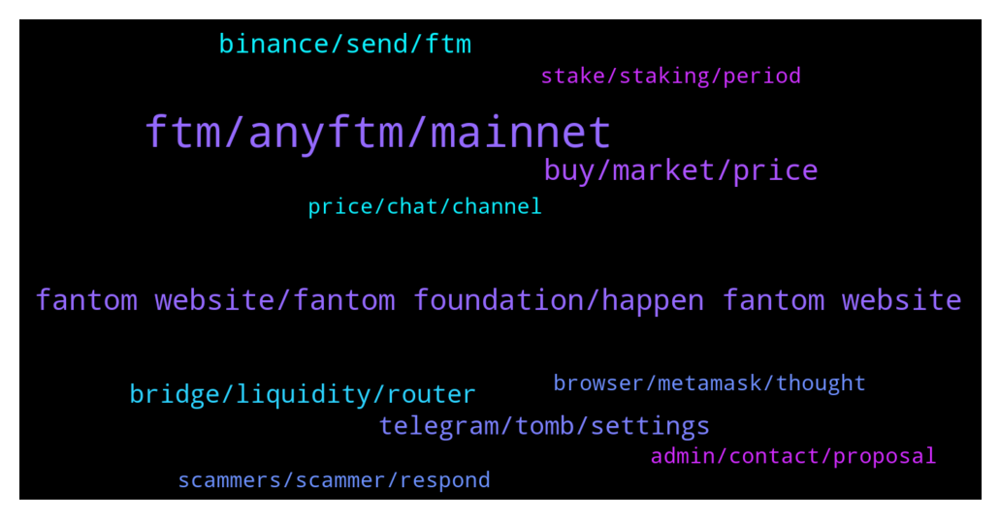

# **@Fantom_English**
 ## Analysis for **2022-01-04** - **2022-01-05**.

---

## 📊 **Basic Stats**

**n_messages_sent**: 384

---

---

## 🔝 **Top keywords and related messages**

1. **ftm, anyftm, mainnet**

    @Janevietani --- *Hello, yes liquidity   Atm you are getting anyFTM   go to anyswap.exchange click router -> pool > choose FTM > click remove and choose anyFTM ( FTM Mainnet ) to FTM ( FTM mainnet/other mainnet that have liquidity )* **--->** [TG Discussion](https://t.me/Fantom_English/621989)

    @huan123li --- *Hi bro, is there any channel that recommends ftm's new projects? Or a Twitter influencer, I want to invest in a project that hasn’t been launched, haha* **--->** [TG Discussion](https://t.me/Fantom_English/623404)

    @MindLabAfrica --- *Need an advice pls... I am on FTM short which is on loss with -123 I have been holding the trade for long. Any chance of it retracing soon or I should close the trade at loss?* **--->** [TG Discussion](https://t.me/Fantom_English/621548)

    @ravamie --- *I found the news of FTM about the coming projects on other channel and community. Want to fact check the it is real or not. For example new defi tool on FTM will be launching on Q1 and the FVM. Thanks* **--->** [TG Discussion](https://t.me/Fantom_English/622137)

    @nilsix --- *Everyone for all information related to the FTM ecosystem you can go and join: https://t.me/FantomLoungeOfficial  For anything price related/trading you can go and join: https://t.me/FantomTrading* **--->** [TG Discussion](https://t.me/Fantom_English/623397)

    @Waferone --- *Can anyone help me get my FTM ? It never arrived to the wallet.* **--->** [TG Discussion](https://t.me/Fantom_English/622915)

2. **fantom website, fantom foundation, happen fantom website**

    @Miguel --- *I completely did not know Fantom ran on a dag, that's actually the most impressive technology with y'all* **--->** [TG Discussion](https://t.me/Fantom_English/622573)

    @oigsignals_owner --- *Which dex is the leading on the fantom network.* **--->** [TG Discussion](https://t.me/Fantom_English/622913)

    @hsvajx --- *I'm trying to bridge with xPollinate and it says Fantom subgraph is out of sync, is there something I can do?* **--->** [TG Discussion](https://t.me/Fantom_English/621312)

    @FoxiCrumpet --- *Hey guys. New to the group. I want to buy some Fantom! Woo hoo. Should I wait for it to consolidate?* **--->** [TG Discussion](https://t.me/Fantom_English/622997)

    @bushleaguebill --- *Great work to the Fantom team!* **--->** [TG Discussion](https://t.me/Fantom_English/622620)

    @Josh_mck --- *Been with Fantom since 0.20, top 10 project this year or next let’s go🙌* **--->** [TG Discussion](https://t.me/Fantom_English/623789)

3. **buy, market, price**

    @wagmibr0s --- *Is tx price gone up today? It asks for 7 ftm to unstake @ beefi* **--->** [TG Discussion](https://t.me/Fantom_English/623752)

    @Darth_Tr4der --- *I am wondering similar....where to set buy order????* **--->** [TG Discussion](https://t.me/Fantom_English/623002)

    @AgentK8421 --- *I don't necessarily have a preference on where I buy, just want to make sure I am maximizing my buy in* **--->** [TG Discussion](https://t.me/Fantom_English/622536)

    @Fjody --- *Because TWAP was less than 1.01.* **--->** [TG Discussion](https://t.me/Fantom_English/622415)

    @morexwell --- *Is it too late to buy and what's the price target* **--->** [TG Discussion](https://t.me/Fantom_English/621919)

    @Mcjig --- *because fusd is not pegged at this time to the dollar* **--->** [TG Discussion](https://t.me/Fantom_English/623033)

4. **binance, send, ftm**

    @Kaputski --- *How long can I take to send FTM from MetaMask to Binance? Transaction is completed address are correct but doesn’t show up in Binance ( 50 mins ago )* **--->** [TG Discussion](https://t.me/Fantom_English/622227)

    @Janevietani --- *then it should be already on the address that you sent to. contact Binance* **--->** [TG Discussion](https://t.me/Fantom_English/622273)

    @Fjody --- *Send back to Binance and withdraw as FTM native coins.* **--->** [TG Discussion](https://t.me/Fantom_English/622099)

    @Janevietani --- *please wait until Binance reopen FTM network withdrawal or you can bridge USDT/ USDC BEP20 to Fantom then swap it to FTM later* **--->** [TG Discussion](https://t.me/Fantom_English/623250)

    @Archie --- *I think the last time I transferred from Binance, I used bep2. But that gave me bep2 fantom in my trustwallet which it seems I can't use to stake. If I transfer my bep2 tokens back to Binance, then what should I do? I have a metamask and a trustwallet.* **--->** [TG Discussion](https://t.me/Fantom_English/622115)

    @Comgabo --- *Good day, I can't withdraw my ftm token from binance to my fantom wallet* **--->** [TG Discussion](https://t.me/Fantom_English/623248)

5. **telegram, tomb, settings**

    @ibnabz --- *if you have plans to launch a Russian-speaking group in telegram, I can help, I have experience in running telegram communities, and I speak 3 languages.* **--->** [TG Discussion](https://t.me/Fantom_English/622736)

    @spencerpickett --- *Hi all, does anyone know why TSHARE is not printing TOMB at the moment?* **--->** [TG Discussion](https://t.me/Fantom_English/622408)

    @theblokchainbaker --- *Is there a Latin chat room or Esperanto.* **--->** [TG Discussion](https://t.me/Fantom_English/623146)

    @Janevietani --- *we dont have plan to open new telegram group* **--->** [TG Discussion](https://t.me/Fantom_English/622737)

    @vesqm --- *Yeah Telegram settings allow calling to you by default, go to Settings - Privacy and dont allow anyone to call you ✌️* **--->** [TG Discussion](https://t.me/Fantom_English/622649)

    @Johnnyfantom --- *Go to Tomb Telegram please https://t.me/tombfinance* **--->** [TG Discussion](https://t.me/Fantom_English/622424)

6. **bridge, liquidity, router**

    @GoldenPock3t --- *and than the router ? bridge is there strange ^^ what is the different between router and bridge ?* **--->** [TG Discussion](https://t.me/Fantom_English/623552)

    @mastroalex25 --- *I didn't find any bridges, that's why I asked you for help😐* **--->** [TG Discussion](https://t.me/Fantom_English/623576)

    @Janevietani --- *https://discord.gg/connext you can ask it here or use other bridge* **--->** [TG Discussion](https://t.me/Fantom_English/621320)

    @Janevietani --- *which bridge do you use before ?* **--->** [TG Discussion](https://t.me/Fantom_English/623135)

    @Janevietani --- *send to are for if you wanna send your bridge token to different address. if you dont put address on send to, the bridge token will stay on same address just different network* **--->** [TG Discussion](https://t.me/Fantom_English/623575)

    @Danny --- *I tried to bridge ftm bep20 to ftm from spookyswap buy not yes received it back since 30mins now* **--->** [TG Discussion](https://t.me/Fantom_English/622459)

7. **admin, contact, proposal**

    @Shadi --- *hello guys im shadi from themarketingidol team. we have a list of verified instagram influencers that are ready to promote you on instagram, who might i contact in this regard?* **--->** [TG Discussion](https://t.me/Fantom_English/622924)

    @Waferone --- *Please dm me. I don’t know how to dm you.* **--->** [TG Discussion](https://t.me/Fantom_English/623001)

    @abioduny --- *Don't... Admin will never dm u first* **--->** [TG Discussion](https://t.me/Fantom_English/622726)

    @Mcjig --- *you see admin by my name. you can either pm me or ask your question in the open. whatever makes you feel more comfortable* **--->** [TG Discussion](https://t.me/Fantom_English/622654)

    @james_s11 --- *Add me to your contact so I can DM you* **--->** [TG Discussion](https://t.me/Fantom_English/622369)

    @Kyy_nn --- *Yes. Check with the adminis before you make a decision* **--->** [TG Discussion](https://t.me/Fantom_English/621387)

8. **price, chat, channel**

    @K --- *But this is not the price chat* **--->** [TG Discussion](https://t.me/Fantom_English/623830)

    @pajamasfreak --- *No price talk here, links above* **--->** [TG Discussion](https://t.me/Fantom_English/622174)

    @Johnnyfantom --- *Guys please no price chat in here* **--->** [TG Discussion](https://t.me/Fantom_English/621435)

    @Eleven_Black --- *Is there a price talk group?* **--->** [TG Discussion](https://t.me/Fantom_English/623379)

    @Enrique126 --- *Where is the price discussion group??* **--->** [TG Discussion](https://t.me/Fantom_English/623307)

    @Johnnyfantom --- *Guys no price chat, or you will be removed* **--->** [TG Discussion](https://t.me/Fantom_English/621563)

9. **stake, staking, period**

    @Fjody --- *The same you used for withdrawal before and now your tokens are on.* **--->** [TG Discussion](https://t.me/Fantom_English/622102)

    @domdeg11 --- *Hey guys! Anyone know how the tomb-FTM staking works?* **--->** [TG Discussion](https://t.me/Fantom_English/622505)

    @lorotoro --- *HI1 I'm new in FANTOM. If I stake FTM I can mint sFTM. Can I stake anywhere this sFTM?* **--->** [TG Discussion](https://t.me/Fantom_English/623776)

    @Juan --- *You have to get the LP token and then you stake it on tomb finance* **--->** [TG Discussion](https://t.me/Fantom_English/622521)

    @Simba_5 --- *What’s the best place to stake ftm* **--->** [TG Discussion](https://t.me/Fantom_English/621905)

    @Simba_5 --- *Hi  Where the best place to stake ada* **--->** [TG Discussion](https://t.me/Fantom_English/621902)

10. **scammers, scammer, respond**

    @gobluecrypto --- *Wow 10 DM's. Is this scammer central?* **--->** [TG Discussion](https://t.me/Fantom_English/621370)

    @Fjody --- *And don't trust anyone who is DMing you, those are all scammers.* **--->** [TG Discussion](https://t.me/Fantom_English/622121)

    @Johnnyfantom --- *Scammers are everywhere, nothing we can do about it, just remember Admins will never DM first* **--->** [TG Discussion](https://t.me/Fantom_English/621375)

    @ChunKiet --- *And there you go. Scammer start private message you.* **--->** [TG Discussion](https://t.me/Fantom_English/623263)

    @vesqm --- *All the people who PM you are scammers.* **--->** [TG Discussion](https://t.me/Fantom_English/622645)

    @C++ --- *Be warned you will ONLY be messaged by scammers* **--->** [TG Discussion](https://t.me/Fantom_English/621569)

