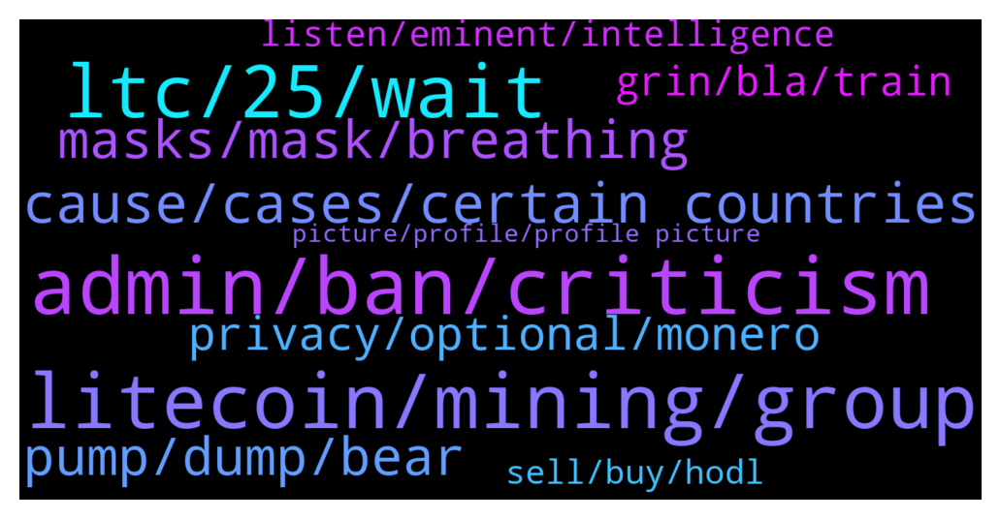

# **@Litecoin**
 ## Analysis for **2022-01-04** - **2022-01-05**.

---

## 📊 **Basic Stats**

**n_messages_sent**: 402

---

---

## 🔝 **Top keywords and related messages**

1. **admin, ban, criticism**

    @ken_xmas --- *You will get ban soon because you promoting xmr* **--->** [TG Discussion](https://t.me/Litecoin/2040058)

    @JIMMY G --- *The whole chat is spammed by them* **--->** [TG Discussion](https://t.me/Litecoin/2039890)

    @Forexjunkie --- *Telegram, lol, they don't give a shitttt* **--->** [TG Discussion](https://t.me/Litecoin/2040356)

    @kevinpita --- *Im ok with you blocking me, I don't care, I don't want to scam you and I wont ask anyone to send me shit or to use any app, Im looking for help to myself* **--->** [TG Discussion](https://t.me/Litecoin/2039599)

    @Musashi_Kansai --- *Exactly and intended to harm the community.* **--->** [TG Discussion](https://t.me/Litecoin/2039940)

    @RabbitL0v3r --- *Imagine gettin ban for promotin another group* **--->** [TG Discussion](https://t.me/Litecoin/2040725)

2. **litecoin, mining, group**

    @xinxi_wang --- *Flood this guy https://twitter.com/paoloardoino with USDT on Litecoin requests. Push him hard. Make him aware about the demand.* **--->** [TG Discussion](https://t.me/Litecoin/2039824)

    @silverjxy --- *Have Litecoin got any partnerships in the pipeline?* **--->** [TG Discussion](https://t.me/Litecoin/2039810)

    @jw418 --- *makes no sense, litecoin being merge-mined with doge makes the network extremely secure. And Charlie Lee has a $1M bounty on $LTC LN that still no one has been able to steal, after people said similar things about that  this sounds more like monero, zcash et al defending themselves against irrelevance tbh :P* **--->** [TG Discussion](https://t.me/Litecoin/2040165)

    @JohnTheApostle --- *Basically since machines (Asics) have been made to mine way more quickly than any normal computer the hashing algorithms of Bitcoin and Litecoin, there are a few mining 'pools' (groups) who control the majority of the hashrate* **--->** [TG Discussion](https://t.me/Litecoin/2040289)

    @moonsie --- *Litecoin has clearly failed if we consider price as the most important metric, which in this space is a fair thing to do.* **--->** [TG Discussion](https://t.me/Litecoin/2040011)

    @bogdan15xor --- *can you read? i just said Litecoin could potentially overtake Monero wtf* **--->** [TG Discussion](https://t.me/Litecoin/2040059)

3. **ltc, 25, wait**

    @Musashi_Kansai --- *All the people who profit from FUDing LTC will now appear to object.* **--->** [TG Discussion](https://t.me/Litecoin/2039900)

    @marceloxr3 --- *Cosmos and Near will step up LTC...   top 25 is the end...* **--->** [TG Discussion](https://t.me/Litecoin/2040303)

    @ken_xmas --- *I suggest you don’t all in LTC  Sell half now and buy others* **--->** [TG Discussion](https://t.me/Litecoin/2040788)

    @marceloxr3 --- *I wnat change my Ltc x Eth...   25 Ltc = 1 eth... UAU!    ok, I waiting for 20x1* **--->** [TG Discussion](https://t.me/Litecoin/2040036)

    @K_arlso_n --- *Today all LTC network cost 500ml $, we can dropped to 50$* **--->** [TG Discussion](https://t.me/Litecoin/2040558)

    @syonfive --- *🙈🙉🙊 n i can hodl ltc for long time , no fud letting new entries lower , just hodl 4 x10* **--->** [TG Discussion](https://t.me/Litecoin/2040362)

4. **cause, cases, certain countries**

    @BennyBennyBlanco --- *We’re sick of covid. But having certain countries go on lockdown will cause dooms day to happen and cause food prices to keep Soring up cause of limited of suppliers* **--->** [TG Discussion](https://t.me/Litecoin/2040478)

    @JIMMY G --- *I disagree. I think lockdowns are being used to help curb inflation. They don’t want to raise the rates so are using lockdown to slow economic activity.* **--->** [TG Discussion](https://t.me/Litecoin/2040479)

    @JIMMY G --- *I predict there will be a violent revolution soon. The globalists are pushing too hard. The people have had enough.* **--->** [TG Discussion](https://t.me/Litecoin/2040465)

    @bake_Crypto --- *must happen a french revolution and heads should roll!! F++++ S___ !!! 2002, 2008, 2012, comooooon man!!!!! my gen gets an entire correction wave. since my economic activity has started i am alover REKT!!! i dont want to think about this shit now. need to do some momei with real work, otherwise, when the fuders come i will lose my lifesaveing.* **--->** [TG Discussion](https://t.me/Litecoin/2040462)

    @RabbitL0v3r --- *If we continue with a capitalistic system, it gonna just be end of world very soonish* **--->** [TG Discussion](https://t.me/Litecoin/2040562)

    @BennyBennyBlanco --- *China is not doing well by the way after you read this* **--->** [TG Discussion](https://t.me/Litecoin/2040440)

5. **masks, mask, breathing**

    @BennyBennyBlanco --- *Hand Sanitizer everything u touch outside and N95 masks* **--->** [TG Discussion](https://t.me/Litecoin/2040501)

    @JIMMY G --- *Bro you gonna be wearing a mask forever ? Or until your govt tell you it’s not needed? You might be waiting a while.  It’s sad to see how so many people have been brainwashed into believing that their fellow man is a walking killer virus. It’s fucking genius actually.* **--->** [TG Discussion](https://t.me/Litecoin/2040526)

    @BennyBennyBlanco --- *If I chose not to wear mask outside I could do that but not taking the risk of catching infectious disease in the air especially people breathing right next to you with terrible infectious caugh* **--->** [TG Discussion](https://t.me/Litecoin/2040524)

    @BennyBennyBlanco --- *N95 are the best to protect from germs in the air causing infections to go into your mouth while breathing* **--->** [TG Discussion](https://t.me/Litecoin/2040512)

    @JIMMY G --- *Stay safe everyone. Don’t forget to wear your mask.* **--->** [TG Discussion](https://t.me/Litecoin/2040493)

    @JIMMY G --- *So man up take off your stupid mask and get on with life.* **--->** [TG Discussion](https://t.me/Litecoin/2040520)

6. **pump, dump, bear**

    @Zocan2 --- *Wow. Ltc will pump 5% and then dump 10% 😅😂😃* **--->** [TG Discussion](https://t.me/Litecoin/2039764)

    @TonyNakamoto --- *historically it has pump'd leading up 2 de halving* **--->** [TG Discussion](https://t.me/Litecoin/2040248)

    @FCKtheBULLrun --- *Halving is a good reason for it to pump* **--->** [TG Discussion](https://t.me/Litecoin/2040247)

    @FCKtheBULLrun --- *It’s due for a mega pump early 2023* **--->** [TG Discussion](https://t.me/Litecoin/2040244)

    @FCKtheBULLrun --- *It’ll do the same this time. That’s prob why it didn’t pump* **--->** [TG Discussion](https://t.me/Litecoin/2040243)

    @moonsie --- *we got duped hard. we bought the one thing that wouldnt pump.* **--->** [TG Discussion](https://t.me/Litecoin/2040586)

7. **privacy, optional, monero**

    @bogdan15xor --- *how would optional privacy work? I assume sending from a personal wallet to a personal wallet can be private, but as soon as you interact with an exchange the privacy goes away, no?* **--->** [TG Discussion](https://t.me/Litecoin/2039721)

    @RabbitL0v3r --- *Optional privacy =/= optional transparency And monero is still on the biggest exchange and got atomic swap with btc* **--->** [TG Discussion](https://t.me/Litecoin/2039717)

    @RabbitL0v3r --- *Monero is build from scratch with privacy in mind Mweb add optional privacy to litecoin They don't serve the same purpose* **--->** [TG Discussion](https://t.me/Litecoin/2039960)

    @bogdan15xor --- *yes it’s optional privacy, but so is Monero’s when your XMR his an exchange* **--->** [TG Discussion](https://t.me/Litecoin/2040055)

    @bogdan15xor --- *I know Monero and Litecoin MW do not have the same privacy, but could Litecoin achieve the same level of privacy by adding multiple steps?* **--->** [TG Discussion](https://t.me/Litecoin/2039943)

    @JohnTheApostle --- *I think he meant regarding the possibility to discover the 'hidden' transactions only* **--->** [TG Discussion](https://t.me/Litecoin/2040170)

8. **grin, bla, train**

    @moonsie --- *apologize and i will retract report* **--->** [TG Discussion](https://t.me/Litecoin/2040698)

    @kevinpita --- *I don't know if I write more than 2 sentences they get deleted* **--->** [TG Discussion](https://t.me/Litecoin/2039598)

    @JIMMY G --- *You never heard this word before or something? You need help?* **--->** [TG Discussion](https://t.me/Litecoin/2040583)

    @morningzone --- *David has previously worked on Grin (or grin related projects), ya can read more @ https://litecointalk.io/t/mweb-progress-update-thread/26678 & https://github.com/DavidBurkett/lips/blob/master/lip-0003.mediawiki* **--->** [TG Discussion](https://t.me/Litecoin/2040066)

    @FCKtheBULLrun --- *Oh yah ok I know that* **--->** [TG Discussion](https://t.me/Litecoin/2040290)

    @Jim --- *🤔 update wil nothing change bla bla bla will see thats first and then tell whatever you want.* **--->** [TG Discussion](https://t.me/Litecoin/2040137)

9. **listen, eminent, intelligence**

    @JIMMY G --- *No I’m describing them as eminent because they are.* **--->** [TG Discussion](https://t.me/Litecoin/2040591)

    @RabbitL0v3r --- *I'm just laughin how you put whoever goes on your way as "eminent"* **--->** [TG Discussion](https://t.me/Litecoin/2040584)

    @JIMMY G --- *I’m noticing a lot of people with very little brain power on this chat.* **--->** [TG Discussion](https://t.me/Litecoin/2039851)

    @RabbitL0v3r --- *Yeah as great as your stupidity* **--->** [TG Discussion](https://t.me/Litecoin/2040576)

    @RabbitL0v3r --- *Looooool I love how you assume just bullshit Tell much about your intelligence (:* **--->** [TG Discussion](https://t.me/Litecoin/2040596)

    @JIMMY G --- *It’s interesting you are unable to debate my points or listen to the eminent Doctors I have told you are speaking out. You choose to laugh and insult. Shows your level of intelligence.* **--->** [TG Discussion](https://t.me/Litecoin/2040579)

10. **sell, buy, hodl**

    @RabbitL0v3r --- *Sell at pamp buy at damp* **--->** [TG Discussion](https://t.me/Litecoin/2039777)

    @ken_xmas --- *Exchanges showing you the fake price* **--->** [TG Discussion](https://t.me/Litecoin/2040049)

    @Sell_Off --- *But I have already sold. That's why it has to be cheaper. That's why I'm so depressed.* **--->** [TG Discussion](https://t.me/Litecoin/2040791)

    @Alexia558 --- *It’s better to buy well than to sell well* **--->** [TG Discussion](https://t.me/Litecoin/2040393)

    @jrx486 --- *You sell first or be quiet 🧐* **--->** [TG Discussion](https://t.me/Litecoin/2040217)

    @ken_xmas --- *They will start the party when you sell* **--->** [TG Discussion](https://t.me/Litecoin/2039981)

