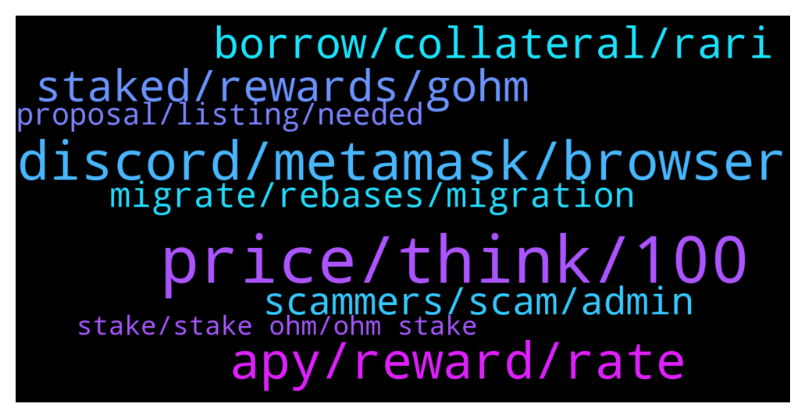

# **@OlympusTG**
 ## Analysis for **2022-01-04** - **2022-01-05**.

---

## 📊 **Basic Stats**

**n_messages_sent**: 423

---

---

## 🔝 **Top keywords and related messages**

1. **price, think, 100**

    @bike4peace --- *I think, correct me, its like halving at BTC  I think people leaving OHM, should go. They dont see the bigger image.  It means for us, that our investment will double up (not in Dollars, but in OHM) every 100 days, instead of now around 60 days.  So the reduction is not that dramatic and people who understood that, were never worried about it.* **--->** [TG Discussion](https://t.me/OlympusTG/141812)

    @bike4peace --- *does not matter, as we are not talking about 5 years ago... OHM is young, read this and understand in what you are investing, its important. https://mirror.xyz/0x06fbd4d74D1d2aE0f438B52256D2b03dADE9DdD7/5ferr5CDMzrguKyeEsOaocloig-zC92fa3RUPZszZwY* **--->** [TG Discussion](https://t.me/OlympusTG/142218)

    @bike4peace --- *I want you to check this out, as it means a lot to me to be in OHM since very very early and I know many of you think its too late or not that amazing, but family, OHM is KING and the new article of ZEUS is a nice moment, to see what we OHMies achieved last year https://twitter.com/bike4peace_/status/1478455942794596361?s=20* **--->** [TG Discussion](https://t.me/OlympusTG/142241)

    @Heberdugo --- *that last artlce was amazinghttps://ohmzeus.medium.com/an-outlook-at-the-turn-of-2021-ec66a8f39a6e   read this guys its an amazing OHM article to rally US as a community!* **--->** [TG Discussion](https://t.me/OlympusTG/142348)

    @Crypto_junkiee --- *What I have is ohm (erc 20) one* **--->** [TG Discussion](https://t.me/OlympusTG/142538)

    @marcus_long --- *It’s worth the same amount of ohm* **--->** [TG Discussion](https://t.me/OlympusTG/141896)

2. **discord, metamask, browser**

    @Ap0l1o --- *I connect to the site from the metamask browser* **--->** [TG Discussion](https://t.me/OlympusTG/141804)

    @chogdelasudrie --- *Thank you for your reply. However, on this page you sent, you have to be connected with a wallet, but it doesn't work with Metamask and my OHM's are in this wallet. That's why I asked for help. Can you tell me how to do ? Thank you 😊* **--->** [TG Discussion](https://t.me/OlympusTG/141726)

    @Ap0l1o --- *The page should connect to metamask. Try clearing the cache or use another browser* **--->** [TG Discussion](https://t.me/OlympusTG/141772)

    @Agus --- *Anyone has the discord link? The one I found here doesnt work* **--->** [TG Discussion](https://t.me/OlympusTG/142592)

    @nfwaple --- *Yes I just looked it up in the Discord, you're definitely not alone. Best to join the Discord and ask again in case they have any update. You can search the error in the Discord to view related previous messages.* **--->** [TG Discussion](https://t.me/OlympusTG/142028)

    @GameChangerr_07 --- *Is it there a Polygon network issue? It dose not work on Metamask* **--->** [TG Discussion](https://t.me/OlympusTG/142250)

3. **apy, reward, rate**

    @Mathew211 --- *When apy reductionn is estimated ?* **--->** [TG Discussion](https://t.me/OlympusTG/142674)

    @bike4peace --- *if you think that the APY reduction is not good for us... https://compassings.substack.com/p/olympus-dao-2021-wrapped?r=14iyb0&utm_campaign=post&utm_medium=web* **--->** [TG Discussion](https://t.me/OlympusTG/141949)

    @assimj --- *Assuming price and APY stay the same* **--->** [TG Discussion](https://t.me/OlympusTG/142634)

    @nfwaple --- *lower APY - lower emission - potentially lower sell pressure* **--->** [TG Discussion](https://t.me/OlympusTG/142684)

    @SMNFT7 --- *Yeah but this is apy chaser point of view, it is not sustainable. OHM is seeking long term sucess, so APY has to be lowered. But for the past 2 months it's been around the 0.35% every 8 hours more or less.* **--->** [TG Discussion](https://t.me/OlympusTG/141733)

    @Ap0l1o --- *Exactly, also with each previous APY reduction we saw increase in price* **--->** [TG Discussion](https://t.me/OlympusTG/141813)

4. **staked, rewards, gohm**

    @diobosco1 --- *Am I right that in the end its no difference for a staker whether he stakes in sOHM or gOHM? Thanks for your help.* **--->** [TG Discussion](https://t.me/OlympusTG/142540)

    @diobosco1 --- *What kind of trap are they laying?* **--->** [TG Discussion](https://t.me/OlympusTG/142493)

    @nfwaple --- *nothing you need to do, gOHM is staked and earning rewards, no further action required* **--->** [TG Discussion](https://t.me/OlympusTG/142437)

    @FitenFast --- *Oké. Why would you keep your gOHM staked if that’s the case?* **--->** [TG Discussion](https://t.me/OlympusTG/142115)

    @riskind2 --- *Staked my ohm and it appeared in sOHM section, then I went and wrapped it to gOHM now what else should I do* **--->** [TG Discussion](https://t.me/OlympusTG/142435)

    @HoldersNotTraders --- *if i buy gOHM does the token keep growing with just me holding it without stake?* **--->** [TG Discussion](https://t.me/OlympusTG/142224)

5. **borrow, collateral, rari**

    @chitangxxx --- *Is the interest rates high? I don't want to give back 2 gohm to borrow equivalent of 1 lol* **--->** [TG Discussion](https://t.me/OlympusTG/142387)

    @nfwaple --- *this one is cool ^, using gOHM as collateral to borrow at 0% interest* **--->** [TG Discussion](https://t.me/OlympusTG/142604)

    @chitangxxx --- *even though what i borrow is only 28% of my collateral - weird - will get my credit card instead lol* **--->** [TG Discussion](https://t.me/OlympusTG/142578)

    @theMagicUnicorn --- *rari itself is safe to use, they are a long standing partner with ohm : https://docs.olympusdao.finance/main/partnership/rari-partnership* **--->** [TG Discussion](https://t.me/OlympusTG/142382)

    @chitangxxx --- *Is there a way to use gohm as collateral to borrow?* **--->** [TG Discussion](https://t.me/OlympusTG/142372)

    @chitangxxx --- *So I can only borrow a minimum of 1 eth equivalent so my gohm collateral needs to be more than 1 eth, will i still get rebases if gohm used as collateral?* **--->** [TG Discussion](https://t.me/OlympusTG/142383)

6. **scammers, scam, admin**

    @brucoo --- *Scammers wont stop, dont stop because someone falls into the trap sadly.* **--->** [TG Discussion](https://t.me/OlympusTG/142491)

    @diobosco1 --- *Why would that bait scammers? I dont understand. Thx fir educating me.* **--->** [TG Discussion](https://t.me/OlympusTG/142525)

    @nfwaple --- *pretending to be admin using the same name and profile picture, dming you asking you to click links, connect to something, asking for seed phrases* **--->** [TG Discussion](https://t.me/OlympusTG/142498)

    @nfwaple --- *they're spammers 😂 they have spammed the same thing hundreds of times* **--->** [TG Discussion](https://t.me/OlympusTG/142559)

    @Dave_881010 --- *Real 🤡. 😅 pretty sad when you hear someone got scammed by these ppl* **--->** [TG Discussion](https://t.me/OlympusTG/142560)

    @nfwaple --- *usually people say this, the scammers will instantly private message them, then you can report the person to the admin here or forward their message to @notoscam* **--->** [TG Discussion](https://t.me/OlympusTG/142529)

7. **migrate, rebases, migration**

    @Fixdakat --- *I heard they might migrate because of high gas fees* **--->** [TG Discussion](https://t.me/OlympusTG/141832)

    @PLcr0w --- *Any idea about when migration will conclude?* **--->** [TG Discussion](https://t.me/OlympusTG/141865)

    @Jonathantalavera --- *Thank you, is there a max date we can migrate?* **--->** [TG Discussion](https://t.me/OlympusTG/141786)

    @zk_snarks --- *When does the migration end? Tried unstaking my ohm and swapping in metamask but it wouldnt appear on my metamask balance* **--->** [TG Discussion](https://t.me/OlympusTG/141943)

    @Catalyst141 --- *So keen for migration to be completed 👌* **--->** [TG Discussion](https://t.me/OlympusTG/141806)

    @nfwaple --- *yes, the transactions cost ETH gas, you can wait until gas is low to convert though. Have you done the migrationn? If not, see pinned message for migration step* **--->** [TG Discussion](https://t.me/OlympusTG/142142)

8. **proposal, listing, needed**

    @nfwaple --- *yes, 'it was' in a way. Because there were a lot of market makers that approached the protocol and in the end only GSR made it to the proposal stage, so yea I agree there was already one round of selection pre-proposal in a way* **--->** [TG Discussion](https://t.me/OlympusTG/142074)

    @TurboLaserClip --- *its not about disagreement nor 3 wallets making a major vote. its the general feeling I got reading through comment section, as why this is needed.  It FELT like it was already decided and just needed a fiction voting. Thats it. Anyway its done now. Hopefully this is the dip, not the start of it.* **--->** [TG Discussion](https://t.me/OlympusTG/142067)

    @nfwaple --- *how so though? The disagreement is part of being in a DAO, it's not possible that every proposal is passed with 90 to 100%* **--->** [TG Discussion](https://t.me/OlympusTG/142066)

    @nfwaple --- *GSR did talk to the team before the proposal though, it makes sense because this is something major, why would they just submit a proposal without knowing the sentiment. Apparently there were other market makers that approached the team as well* **--->** [TG Discussion](https://t.me/OlympusTG/142051)

    @TurboLaserClip --- *I agree on expanding, but this proposal seemed like it was forced on us* **--->** [TG Discussion](https://t.me/OlympusTG/142065)

    @nfwaple --- *yes but those wallets do have the right to vote so it is what it is, that's how it works with snapshot voting 😆* **--->** [TG Discussion](https://t.me/OlympusTG/142049)

