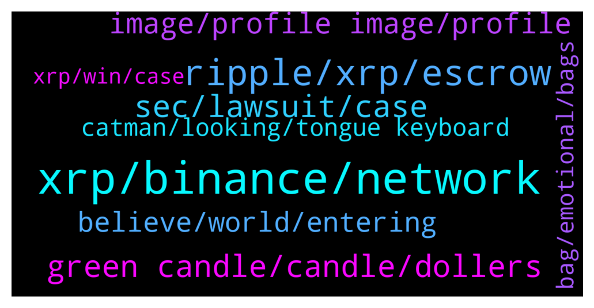

# **@Ripple**
 ## Analysis for **2022-01-04** - **2022-01-05**.

---

## 📊 **Basic Stats**

**n_messages_sent**: 185

---

---

## 🔝 **Top keywords and related messages**

1. **xrp, binance, network**

    @JustNNM --- *Contact Luno support for help.  Be very careful about transferring XRP to certain wallets which SA consider “out of the country” Read up on SA crypto regulations they have implemented.* **--->** [TG Discussion](https://t.me/Ripple/3035428)

    @Danjee_Crypto --- *And it's listed on klever wallet  as xrptrc10..* **--->** [TG Discussion](https://t.me/Ripple/3035465)

    @jaywillizigah --- *All I am saying is it would be nice if XRP has many network* **--->** [TG Discussion](https://t.me/Ripple/3035483)

    @jaywillizigah --- *Being available on different network wouldn't be bad for the project* **--->** [TG Discussion](https://t.me/Ripple/3035461)

    @Danjee_Crypto --- *Please I want to ask?   Does xrp exist in tron network?   I want to confirm this* **--->** [TG Discussion](https://t.me/Ripple/3035459)

    @Exemplifyd --- *Is there a way to mine xrp? I haven't seen such.* **--->** [TG Discussion](https://t.me/Ripple/3034955)

2. **ripple, xrp, escrow**

    @Skaninho --- *Hope it will, why do ripple sell a lot of xrp many times? I dont get it.. Not that Good for the Price.. ripple is Made for big value. Can someone explain?* **--->** [TG Discussion](https://t.me/Ripple/3035257)

    @saddique1998 --- *How do I start mining ripples* **--->** [TG Discussion](https://t.me/Ripple/3034935)

    @Isolemnlyswear --- *There's some arguements over if xrp is  decentrelized or not. If more the half is controlled by one party they could manipulate it quite a bit. There has been speculation lately on xrp pages of ripple burning the escrow coins as part of settlement. Hopefully it happens.* **--->** [TG Discussion](https://t.me/Ripple/3034965)

    @Russty007 --- *Also can somebody explain to me how the price is kept so low if it’s not centralized ( when half is owned by Ripple) I mean that’s how you keep control of a company - by keeping 50% of the shares so you keep the power to decide everything (including price?) correct me if I’m wrong please* **--->** [TG Discussion](https://t.me/Ripple/3035102)

    @Jake_ripple_XRP --- *No one knows with any certainty... but the SEC's case against Ripple/XRP is considered very flimsy... and it seems to me at least one of the judges recognizes this... There will likely be a settlement of some sort... to redeem XRP's place in the market and the SEC's credibility (if that's possible at this point!). Ripple might have to pay a serious fine... might even have to divest of some XRP hodlings... but in the end, I don't see Ripple at all giving in to whatever demands come forth, UNLESS XRP receives full regulatory clarity and is deemed legally compliant... What happens next? There will virtually be no other crypto that has this standing in the market... Coinbase will likely re-list... US buyers will get on board... Big Money that has been waiting on the sidelines will get in the market... traditional financial institutions will see a green light... It all looks good for XRP... IMO... better than any other crypto...* **--->** [TG Discussion](https://t.me/Ripple/3034796)

    @Isolemnlyswear --- *Ripple is the company. Xrp is the coin. All the xrp has already been made. Less then half has been sold to consumers. The rest is in escrow.* **--->** [TG Discussion](https://t.me/Ripple/3034963)

3. **sec, lawsuit, case**

    @Danjee_Crypto --- *It's had value and was traded in the.past* **--->** [TG Discussion](https://t.me/Ripple/3035470)

    @JesusJames --- *well it went from almost 2 dollars to .17 cents when the lawsuit was filed so ....* **--->** [TG Discussion](https://t.me/Ripple/3035614)

    @Voltaire123 --- *Why selling if it goes 🚀🚀 after lawsuit.* **--->** [TG Discussion](https://t.me/Ripple/3035189)

    @Voltaire123 --- *Why he is selling again?? Why?* **--->** [TG Discussion](https://t.me/Ripple/3035147)

    @Zwijgrecht0515 --- *You guys think ripple wil win the lawsuit?* **--->** [TG Discussion](https://t.me/Ripple/3035549)

    @EML1993 --- *Just a heads up. YouTube video uploaded by Attorney Jeremy Hogan where he analyzes sec vs ripple case and what is its likely outcome.* **--->** [TG Discussion](https://t.me/Ripple/3035641)

4. **green candle, candle, dollers**

    @marianmp --- *If it goes to 3 IL triple my money so I'm good* **--->** [TG Discussion](https://t.me/Ripple/3035171)

    @yassinetrades --- *The tougher would be for heavy bagged investors to resist when seeing 3 - 6$ and not HODL    - I am struggling virtually with this myself* **--->** [TG Discussion](https://t.me/Ripple/3035130)

    @megahitte --- *10 dollars before you know it* **--->** [TG Discussion](https://t.me/Ripple/3035122)

    @DiegoferDF --- *Remember if: In this game the whales only win and for that the price has to go up* **--->** [TG Discussion](https://t.me/Ripple/3034992)

    @cdouglas277 --- *Hopefully it goes to 50 cents! I want to buy more* **--->** [TG Discussion](https://t.me/Ripple/3034908)

    @dZaTom --- *Ok here we go. If continuation on the current ascending triangle a breakout to $1.3x, see top august (green candle) is possible. A breakout to the opposite side will take us back to around $0.3 (bottom big green candle January 2021).* **--->** [TG Discussion](https://t.me/Ripple/3035623)

5. **image, profile image, profile**

    @kramercrypto --- *Source on some of this? I love it, but I'd just like more than an anonymous telegram message* **--->** [TG Discussion](https://t.me/Ripple/3035292)

    @JustNNM --- *Right there in the pinned message* **--->** [TG Discussion](https://t.me/Ripple/3035452)

    @Tinkabellagal --- *Make it public We can’t see it* **--->** [TG Discussion](https://t.me/Ripple/3035591)

    @Tinkabellagal --- *Allahu You need a profile image to chat in this group* **--->** [TG Discussion](https://t.me/Ripple/3035587)

    @GreenGecko --- *There is also a search function in chats ... psssssst! (secret)* **--->** [TG Discussion](https://t.me/Ripple/3035455)

    @specialpatrolgroup --- *Yeah you will get a profile image* **--->** [TG Discussion](https://t.me/Ripple/3035420)

6. **believe, world, entering**

    @Riiggo --- *We are entering a world of control by the elites.......agenda 2030* **--->** [TG Discussion](https://t.me/Ripple/3035011)

    @JustNNM --- *Yes people buy stupid worthless stuff all the time.* **--->** [TG Discussion](https://t.me/Ripple/3035472)

    @gianni146 --- *Forget about the past.... We are entering a new world* **--->** [TG Discussion](https://t.me/Ripple/3035010)

    @marianmp --- *I bet you people don't know what to believe anymore* **--->** [TG Discussion](https://t.me/Ripple/3034993)

    @Riiggo --- *Wont happen the elites of the world won't want all these millionaires and billionaires* **--->** [TG Discussion](https://t.me/Ripple/3035007)

    @gianni146 --- *Well ok, we are free to believe whatever we want to* **--->** [TG Discussion](https://t.me/Ripple/3035012)

7. **catman, looking, tongue keyboard**

    @Riiggo --- *I'm on your side but its not looking good hence the pandemic* **--->** [TG Discussion](https://t.me/Ripple/3035013)

    @radicaliconoclast --- *catman how did you like my T/A?* **--->** [TG Discussion](https://t.me/Ripple/3034812)

    @JesusJames --- *lol no we're not good joke though made me look* **--->** [TG Discussion](https://t.me/Ripple/3035629)

    @dZaTom --- *I tried to stay on the positive side* **--->** [TG Discussion](https://t.me/Ripple/3035616)

    @nluukk --- *Yes, was fun to see! 🤣* **--->** [TG Discussion](https://t.me/Ripple/3035349)

    @EML1993 --- *Lol. Slip of the tongue (keyboard)?* **--->** [TG Discussion](https://t.me/Ripple/3035352)

8. **bag, emotional, bags**

    @JustNNM --- *Him hodling for so long was unnerving but now that is back to selling, its like we back to normal business. It would be nice for his bags to be finished so we can get on with things.* **--->** [TG Discussion](https://t.me/Ripple/3035126)

    @chuckwagon --- *Just have to realize if you were to put your bag in a 1 year time capsule and skip the emotional roller coaster by jumping in your theoretical Delorean, you would pull your bag out one very happy person. IMO.* **--->** [TG Discussion](https://t.me/Ripple/3035059)

    @dZaTom --- *It’s all in this channel. Just scroll and read. Afterwards make your own decision to invest or grow an already available bag* **--->** [TG Discussion](https://t.me/Ripple/3035676)

    @Exemplifyd --- *I'm sure of that too. Keeping my bags still* **--->** [TG Discussion](https://t.me/Ripple/3035121)

    @yassinetrades --- *Good point indeed. The emotional factor is a tough one to control, but certainly doable* **--->** [TG Discussion](https://t.me/Ripple/3035091)

    @Lallulu --- *What is your wish list make or break* **--->** [TG Discussion](https://t.me/Ripple/3035164)

9. **xrp, win, case**

    @EML1993 --- *A lawsuit win for Xrp might be the catalyst needed for “589”. Lol.* **--->** [TG Discussion](https://t.me/Ripple/3034975)

    @Russty007 --- *Just hoping xrp hits a new ATH when Bitcoin skyrockets again* **--->** [TG Discussion](https://t.me/Ripple/3035139)

    @Trey young --- *What are the chance to XRP win the case?* **--->** [TG Discussion](https://t.me/Ripple/3034789)

    @ronnuke --- *XRP wins SEC suit + ISO 20022 adoption + SWIFT replacement = MOON!!!* **--->** [TG Discussion](https://t.me/Ripple/3035433)

    @EML1993 --- *Read the tweets of lawyers John deaton and Jeremy hogan. They also have good interviews in YouTube. IMO, xrp will win based on what I’ve read so far. At the very least the case might be settled.* **--->** [TG Discussion](https://t.me/Ripple/3035556)

    @Kbron123 --- *I wonder how high will xrp go after this* **--->** [TG Discussion](https://t.me/Ripple/3035446)

