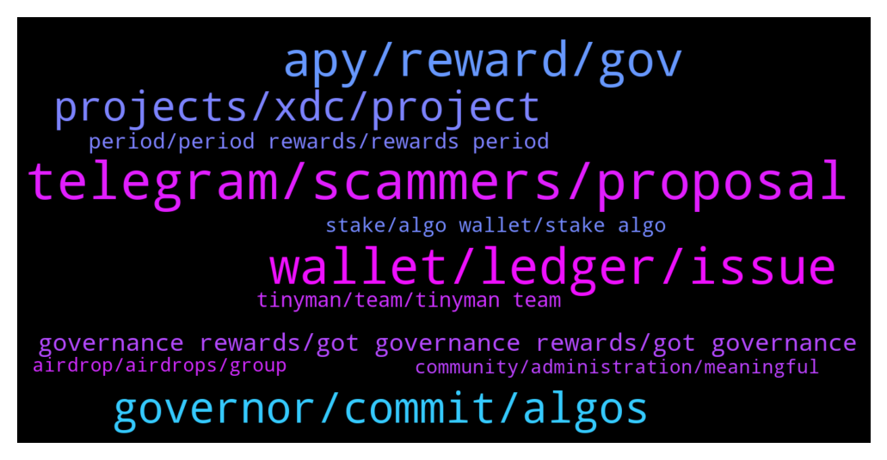

# **@algorand**
 ## Analysis for **2022-01-04** - **2022-01-05**.

---

## 📊 **Basic Stats**

**n_messages_sent**: 315

---

---

## 🔝 **Top keywords and related messages**

1. **telegram, scammers, proposal**

    @MackDenver --- *It's not legit. The only official twitter is https://twitter.com/Algorand* **--->** [TG Discussion](https://t.me/algorand/329514)

    @Cbi_6 --- *Hello  I Have a business proposal about creating an Arabic telegram community for $ALGO WHO should i pm?* **--->** [TG Discussion](https://t.me/algorand/329954)

    @kramercrypto --- *^ Do not DM this person* **--->** [TG Discussion](https://t.me/algorand/329796)

    @Edward_York --- *Scammers are already texting me gonna have some fun though ...* **--->** [TG Discussion](https://t.me/algorand/329763)

    @Edward_York --- *Scammers are going to dm u bro... Never reply* **--->** [TG Discussion](https://t.me/algorand/329410)

    @pedronelumba --- *Sent u my tx on DM* **--->** [TG Discussion](https://t.me/algorand/329457)

2. **wallet, ledger, issue**

    @Edward_York --- *Hello guys anyone having problems committing algos with ledger?* **--->** [TG Discussion](https://t.me/algorand/329400)

    @TinyBit --- *Well that's going to be again 2 days craziness 🤪 for support team, especially when Official Algorand android mobile wallet has still trouble connecting to ledger 🙄* **--->** [TG Discussion](https://t.me/algorand/329334)

    @TinyBit --- *@NightAlgorand  I've already replied to you. Unsure you've understand the issue is on Android wallet.* **--->** [TG Discussion](https://t.me/algorand/329345)

    @Edward_York --- *Hello any admin? Want to report still a problem with ledger nano x* **--->** [TG Discussion](https://t.me/algorand/329762)

    @TinyBit --- *Same issue as per first period. Sadly Algorand didn't fix the issue of the only hardware supported mobile wallet with multiple accounts in 3 months and we are approaching new governing period where I have to beg twice (commiting+ voting) my friend with Iphone 🤬 #notcool* **--->** [TG Discussion](https://t.me/algorand/329438)

    @pedronelumba --- *Then I clicked commit algos, then it gave an address and note to send* **--->** [TG Discussion](https://t.me/algorand/329471)

3. **apy, reward, gov**

    @KingMark --- *This is about 3% no 30%...* **--->** [TG Discussion](https://t.me/algorand/329401)

    @AlgoDad --- *I had a few different wallets using gov - wallet B was  1300 commitment with around 40.5 ALGO in rewards. - around 30% :D* **--->** [TG Discussion](https://t.me/algorand/329394)

    @grigio74 --- *Hello everyone..... A question I had participated in the gov. 1 with 21 5 Algo. This morning I received 7.55 Algo of rewards. Is it right as a calculation? I thought in something more.* **--->** [TG Discussion](https://t.me/algorand/329590)

    @Nicksof --- *In the second period I’m gonna get double the rewards compared to the first according to the calculator a fellow Algorand user created* **--->** [TG Discussion](https://t.me/algorand/329517)

    @Niikmoor --- *I noticed this recently. I hold some algo in Atomic wallet. But in recent, the rewards have halved. Will this increase again?* **--->** [TG Discussion](https://t.me/algorand/329852)

    @Tommy --- *I'm still waiting for my rewards from period 1. Does the official algo wallet inform you when they arrive?* **--->** [TG Discussion](https://t.me/algorand/329303)

4. **governor, commit, algos**

    @cryptopherobin --- *Hi Edison -  If Algorand is a project with fundamentals that you believe in, then being a governor helps you dictate the future of the program. The Algorand foundation will present topics to governors to vote on.* **--->** [TG Discussion](https://t.me/algorand/329993)

    @cryptopherobin --- *Algo wallet will enable you to participate in governance.* **--->** [TG Discussion](https://t.me/algorand/329677)

    @danhtran123 --- *How many algos have you committed to governance period* **--->** [TG Discussion](https://t.me/algorand/329369)

    @pedronelumba --- *@MackDenver I sent yesterday 0.0001 algos to be a governor but my address does not show on the governor list* **--->** [TG Discussion](https://t.me/algorand/329456)

    @cryptopherobin --- *So at the top of the Algorand wallet app there should be a message that says "Become a governor. Vote on Algorand's future. Earn rewards. The registration window  for Governance Period #2 ends on Jan 6" Something like that.  You'll have to commit to locking up your Algo for a certain lock up period. If you lock it up and leave it alone during the governance period, you'll be paid governor rewards when the period closes.* **--->** [TG Discussion](https://t.me/algorand/330000)

    @cryptotuna --- *Ok, tnx sorry maybe I express wrong. And whay there is written that they advise not to committing all algos?* **--->** [TG Discussion](https://t.me/algorand/329574)

5. **projects, xdc, project**

    @enochmarcs --- *hello  please what's the major utility of Algorand? (the website is a bit confusing 🥲)* **--->** [TG Discussion](https://t.me/algorand/329687)

    @PetitsPois --- *Built-in layer 1 i am talking about. Not familiar with xdc* **--->** [TG Discussion](https://t.me/algorand/329741)

    @PetitsPois --- *Not sure if those u mentioned all have smart contract* **--->** [TG Discussion](https://t.me/algorand/329738)

    @<UNK> --- *Hi, love this project, really!!! Does anyone know where I can find cool projects like that?* **--->** [TG Discussion](https://t.me/algorand/329522)

    @Crypt0Playa --- *Is there any projects on the ALGORAND Blockchain that aims to tokenize stocks, bonds, commodities, derivatives and other financial instruments?* **--->** [TG Discussion](https://t.me/algorand/329710)

    @MackDenver --- *If you are looking for Algorand projects, you can check out the link below  https://www.algorand.com/ecosystem/use-cases* **--->** [TG Discussion](https://t.me/algorand/329531)

6. **governance rewards, got governance rewards, got governance**

    @chad --- *I got my governance rewards about 15 minutes ago. A little more than expected.* **--->** [TG Discussion](https://t.me/algorand/329358)

    @REV --- *Good morning Algonites!,received late last night 90 Algos from governance! Feels good too get rewarded.* **--->** [TG Discussion](https://t.me/algorand/329560)

    @The Dude --- *It’s a shame the first governance poll didn’t pass or we would be getting more rewards* **--->** [TG Discussion](https://t.me/algorand/329490)

    @bobbybanks --- *I just looked after reading last message and I got my governance rewards!!* **--->** [TG Discussion](https://t.me/algorand/329380)

    @zentaurion --- *I can confirm. Just received my governance reward 🥳* **--->** [TG Discussion](https://t.me/algorand/329341)

    @defirlkp --- *Just got my governance rewards hallelujah!* **--->** [TG Discussion](https://t.me/algorand/329359)

7. **period, period rewards, rewards period**

    @VAR_JUAN_NULL --- *then, the rewards are long overdue.* **--->** [TG Discussion](https://t.me/algorand/329266)

    @Cesar --- *Man, if I ser another message regarding gobernance rewards I will shoot myself... 😂* **--->** [TG Discussion](https://t.me/algorand/329230)

    @defirlkp --- *More rewards means more dumping in my experience* **--->** [TG Discussion](https://t.me/algorand/329504)

    @Sayithowitis --- *Thank you. How does this work ? What's the reward ?* **--->** [TG Discussion](https://t.me/algorand/329950)

    @defirlkp --- *You'll only know for sure right at the end of the period what the rewards will be* **--->** [TG Discussion](https://t.me/algorand/329526)

    @The Dude --- *And we can commit the rewards to period 2 which is even better* **--->** [TG Discussion](https://t.me/algorand/329433)

8. **tinyman, team, tinyman team**

    @Olami0920 --- *Is there any dex apart from tinyman to swap on algorand* **--->** [TG Discussion](https://t.me/algorand/329664)

    @auronsan --- *did it safe to add algo lp on tinyman?* **--->** [TG Discussion](https://t.me/algorand/329881)

    @KKM --- *Any update on Tinyman been attack?* **--->** [TG Discussion](https://t.me/algorand/329979)

    @MackDenver --- *Please check in with Tinyman team about this  https://t.me/tinymanofficial* **--->** [TG Discussion](https://t.me/algorand/329981)

    @gribabas999 --- *Are there any dexes up besides tinyman? Ty* **--->** [TG Discussion](https://t.me/algorand/329425)

    @khunpon --- *I'm waiting for Tinyman V2, stronger than V1. they use immutable contracts.* **--->** [TG Discussion](https://t.me/algorand/329253)

9. **stake, algo wallet, stake algo**

    @cryptodadpreneur --- *where is the best place to stake algo* **--->** [TG Discussion](https://t.me/algorand/329550)

    @MackDenver --- *You can stake it just by holding ALGO in your wallet. For extra APY you can join the governance as well* **--->** [TG Discussion](https://t.me/algorand/329551)

    @enochmarcs --- *is that all the Algo coin can be used for?* **--->** [TG Discussion](https://t.me/algorand/329694)

    @Niikmoor --- *Which would you recommend please. I continue to hold my algo in Atomic wallet or I stake algo for other coins in the ecosystem. I need better rewards system.* **--->** [TG Discussion](https://t.me/algorand/329855)

    @KasyWillss --- *You can stake in Algo wallet, Atomicwallet and a few other wallets. Automatic stake, automatic rewards!* **--->** [TG Discussion](https://t.me/algorand/329430)

    @bobbybanks --- *Thank you bro!! And I definitely believe in Algo tbh, I research heavily before I put loot into anything ya know. Just buy and hold that’s all I do.* **--->** [TG Discussion](https://t.me/algorand/329398)

10. **airdrop, airdrops, group**

    @nokaretaaam --- *admin where can find algorand airdrops?   please help me* **--->** [TG Discussion](https://t.me/algorand/329774)

    @APhulwadkar1 --- *Airdrop will be airdroped today??? Im i right??* **--->** [TG Discussion](https://t.me/algorand/329444)

    @NightAlgorand --- *There is no airdrop. Please dont get scam.* **--->** [TG Discussion](https://t.me/algorand/329776)

    @MackDenver --- *We are not doing any airdrop* **--->** [TG Discussion](https://t.me/algorand/329445)

    @chainebloque --- *Mainly the Reddit. I think there’s a website which covers airdrops across all chains but it’s name escapes me* **--->** [TG Discussion](https://t.me/algorand/329321)

    @chad --- *There is no airdrop. Do not answer DM's saying there is. Do not reply to any DM's better* **--->** [TG Discussion](https://t.me/algorand/329377)

