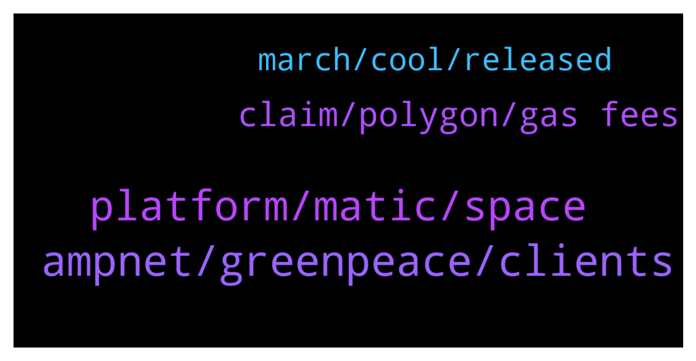

# **@ampnetapxchat**
 ## Analysis for **2021-12-31** - **2022-01-05**.

---

## 📊 **Basic Stats**

**n_messages_sent**: 98

---

---

## 🔝 **Top keywords and related messages**

1. **ampnet, greenpeace, clients**

    @Bob_Fosse --- *That was basically a very long winded statement that reads, “ampnet did nothing wrong, it’s everyone else’s fault”. Just awful (and not surprising).* **--->** [TG Discussion](https://t.me/ampnetapxchat/36017)

    @IncogSen --- *Maybe they already knew about the greenpeace deal falling through behind the scenes* **--->** [TG Discussion](https://t.me/ampnetapxchat/36013)

    @mislavjavor --- *Hey @IncogSen - the breakdown of Greenpeace partnership and the Aeternity attacks were all announced as they happened. The onboarding of new clients and the decision to develop AMPnet v2 was also communicated when it happened. There was no hiding of information from our side - when we had nothing to say, we stayed silent. When we had new partners or developments - we announced them, as was expected from us.   The optimism in our announcements was how we felt at the time, it was a genuine excitement that we felt - but we couldn’t know how things would end before they ended.  I understand the frustrations, but information was not witheld.* **--->** [TG Discussion](https://t.me/ampnetapxchat/36007)

    @mislavjavor --- *I agree, and the team finds ourselves more than accountable for things in and beyond our control. In the history of our company, there has never been an attitde of - “it must be somebody elses fault”. We should have acted sooner on red flags by Greenpeace, we should have moved on to Ethereum sooner, etc… Trust me when I say that we do not pat ourselves on the back saying “good job, it’s the fault of the clients”. On the other hand - it’s easy to look on things from hindsight - with all the extra information that hindsight provides.   The post was meant as an update to the community, that we are working hard, exploring new business models and new clients and that AAPX will be the token that’s backing these new developments.* **--->** [TG Discussion](https://t.me/ampnetapxchat/36027)

    @Bob_Fosse --- *Nope, I just thought that was a very bland message from Mislav that read, “greenpeace was at fault not us, trust us”* **--->** [TG Discussion](https://t.me/ampnetapxchat/36021)

    @mislavjavor --- *@IncogSen - I said before that I understand your frustrations, but the accusations truly are unfounded. If we had not believed in the Genervest story ourselves we would not have sunk so much time and money into it. The breakdown of reationships with Genervest was not a simple or short process - as we were constantly under the impression that they will gain access to the mailing lists and marketing which, imho - would make the campaigns a success.   We have previously muted or banned anyone insinuating stories of insider manipulation or providing false info. We have always worked with the facts we knew and presented them in such a way. There were no insider trades, no special knowledge we had about the project. We, the team, do not trade AAPX and hold it on a long term basis, locked in vesting (which starts unlocking in 2023). Because of the nature of these things, you can always doubt that something like this happened. It’s not true, it’s never been true and AMPnet is not that type of company, nor that type of project.   These things will not be repeated again and again ad-nauseum. It’s easy to get conspiratorial and find patterns when you’re losing money - everyone trading crypto has succumbed to it at some point. But this will be the end of these discussions because they serve absolutely zero purpose other than to pollute the discussion. Any further insinuations of this nature will be deleted.* **--->** [TG Discussion](https://t.me/ampnetapxchat/36020)

2. **platform, matic, space**

    @<UNK> --- *This is due to the fact that AAPX unlocks linearly and sites like CMC or CoinGecko have "unlock date" which we cannot use, cuz appx is unlocking every moment instead of a set date  But anyone can check circ. supply/max supply here -  https://claim.ampnet.io/app/dist/index.html* **--->** [TG Discussion](https://t.me/ampnetapxchat/36149)

    @E_Don --- *We need more pairs on Matic. Eth gas fee is crazy  Matic/AAPX. Eth/AAPX* **--->** [TG Discussion](https://t.me/ampnetapxchat/36085)

    @<UNK> --- *Here is the aapx network address  https://polygonscan.com/token/0x3fc8bd9b0d8054cbdc174c4ed4b41a95d3c6a427* **--->** [TG Discussion](https://t.me/ampnetapxchat/36087)

    @matejmz --- *Matic/AAPX exists. You can swap ETH to Matic and then swap it for AAPX* **--->** [TG Discussion](https://t.me/ampnetapxchat/36086)

    @whimofnature --- *having a large partner helps a lot of course, but crypto-space itself can be fund-raising .. even for fund-raising technologies. IMO the main problem what keeps people from looking at AAPX is that there is no circulating supply visible for the AAPX token. this causes the token to be ranked somewhere in the >10000 rank area. nobody looks at this. if there was a circ. supply information it would be immediately ranked lower, and people would look what the project is about. and then they would be fascinated, because everyone knows real estate / equities on blockchain is the future. and then they would buy AAPX.* **--->** [TG Discussion](https://t.me/ampnetapxchat/36136)

    @BMontana3 --- *You guys should allow us to stake, the price has completely got destroyed. Atleast get some people hope again and reward them for still holding the coin..* **--->** [TG Discussion](https://t.me/ampnetapxchat/35971)

3. **claim, polygon, gas fees**

    @<UNK> --- *You just need to provide transaction hash and you'll be compensated   https://docs.google.com/forms/d/e/1FAIpQLSf4GCX62RAfb0oZvGNPzNynTdHFlvoIw9KZqA0o1VOkEwG_Kw/viewform* **--->** [TG Discussion](https://t.me/ampnetapxchat/36040)

    @<UNK> --- *Sorry that was automatic, use this link to claim tokens 😅 https://claim.ampnet.io/app/dist/index.html* **--->** [TG Discussion](https://t.me/ampnetapxchat/36172)

    @BlinkmothNexus --- *Yeah I know this page. My question was If I can claim with polygon network, not eth mainnet* **--->** [TG Discussion](https://t.me/ampnetapxchat/36173)

    @iamdiarrhoea --- *can you confirm me your username just in case its a scammer. thanks!* **--->** [TG Discussion](https://t.me/ampnetapxchat/35891)

    @rickbryan330 --- *Hi everyone!  I am a promotor and i can add real members to your telegram groups and channels, twitter , instagram and facebook followers,  retweets and youtube subscribers.* **--->** [TG Discussion](https://t.me/ampnetapxchat/36119)

    @arikthereal --- *Hi Team, who would I be able to disucss listing opportunity on BitMart with ? Verification will be provided if requested.* **--->** [TG Discussion](https://t.me/ampnetapxchat/35900)

4. **march, cool, released**

    @PFCBLic --- *Can we put final date and final ammount of released tokens? Mcap wont be correct but it is better than nothing* **--->** [TG Discussion](https://t.me/ampnetapxchat/36153)

    @MarcusVieiraCosta --- *will there be the promised tokens for us that made the cryptobond with Sync?* **--->** [TG Discussion](https://t.me/ampnetapxchat/36114)

    @JGM_0 --- *How about the cryptobonds created and matured?* **--->** [TG Discussion](https://t.me/ampnetapxchat/36038)

    @<UNK> --- *As @matejmz said, when all tokens are released in March, we will solve this vesting problem* **--->** [TG Discussion](https://t.me/ampnetapxchat/36168)

    @matejmz --- *Only few unreleased tokens are remaining til March so it would make sense to do that...* **--->** [TG Discussion](https://t.me/ampnetapxchat/36165)

    @whimofnature --- *yeah, or just provide daily/weekly unlock dates to CMC & co, that mimic the linear release schedule ...* **--->** [TG Discussion](https://t.me/ampnetapxchat/36162)

