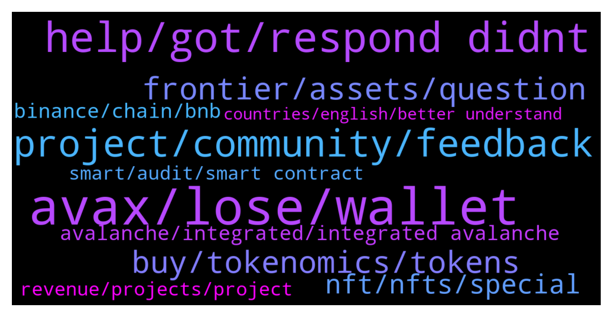

# **@avalancheavax**
 ## Analysis for **2022-01-04** - **2022-01-05**.

---

## 📊 **Basic Stats**

**n_messages_sent**: 414

---

---

## 🔝 **Top keywords and related messages**

1. **avax, lose, wallet**

    @dees_tech --- *Hey admin, was there a hack to the avax wallets recently. Please let us know, some wallets are missing tokens..* **--->** [TG Discussion](https://t.me/avalancheavax/319681)

    @jackdboo --- *Anyone here a solidity dev looking for some extra work ? Some projects I know are looking to expand on avax* **--->** [TG Discussion](https://t.me/avalancheavax/319596)

    @Nicolas_A --- *You need 1 avax as a deposit afaik. So I would count around 2 avax in total. Remember than when participation starts everyone rushes to participate (resulting in gas spike) when in fact you have like a day to participate* **--->** [TG Discussion](https://t.me/avalancheavax/319693)

    @port505 --- *Thank you. Wow, that’s quite a lot. If I won’t manage to get sale allocation for more than $20, depositing $215 (2 AVAX) is quite insane.* **--->** [TG Discussion](https://t.me/avalancheavax/319696)

    @Nicolas_A --- *You receive the 1 avax back. and the other one for fees is quite generous* **--->** [TG Discussion](https://t.me/avalancheavax/319701)

    @M0ckey --- *Does anyone know of any promising project on the Avax network, focused on P2earn and Nft? I think this segment will be very atractive to different blockchains from now on, just see harmony network pumping after the succesful of p2earn project "Defi Kingdoms".* **--->** [TG Discussion](https://t.me/avalancheavax/320186)

2. **help, got, respond didnt**

    @Or4ngeknot --- *Hi sorry @oathtobarbatos , could you help me with this? Or direct me to someone who could? Thank you* **--->** [TG Discussion](https://t.me/avalancheavax/319620)

    @AvaxArrogant --- *I can do that too, he just didnt respond and i didnt want to be rude in channel* **--->** [TG Discussion](https://t.me/avalancheavax/319493)

    @Bruno_LGD --- *How many DM's you've got? Lol* **--->** [TG Discussion](https://t.me/avalancheavax/319478)

    @luisao8788 --- *I tried but is not possible, because now is like disable* **--->** [TG Discussion](https://t.me/avalancheavax/319807)

    @AvaxArrogant --- *there is no answer besides, them doing it on their side manually as they control the priv key* **--->** [TG Discussion](https://t.me/avalancheavax/319516)

    @COMC3EX --- *That was what I thought as well  - but they are not willing to hand it over nor to do it* **--->** [TG Discussion](https://t.me/avalancheavax/319520)

3. **project, community, feedback**

    @NIm0671 --- *Could you tell us about Unifront SDK support?* **--->** [TG Discussion](https://t.me/avalancheavax/320033)

    @rena_ricker_28 --- *What are the competitive advantages of your project? What advantages do you have that other competitors dont have ? What would be your project secure most similar contender in the market today in terms of scalability, security, features, and adaptability????* **--->** [TG Discussion](https://t.me/avalancheavax/320061)

    @grossman15 --- *What are the attractive features in your project? What is the vision and goals in your project that you want to achieve in 2021 and beyond?* **--->** [TG Discussion](https://t.me/avalancheavax/320055)

    @long_wakefield_30 --- *How can users stay updated with this project? Are there channels, including local communities where users can get the latest updates?* **--->** [TG Discussion](https://t.me/avalancheavax/320128)

    @AldaJose --- *Are you afraid some day there will be another project with more innovative technology can replace your project ?* **--->** [TG Discussion](https://t.me/avalancheavax/320015)

    @sasxxsnip3rxx --- *Can you share some Details about Recent Major Achievements done by your project? Also, what are the Future Roadmap & Targets of your project?* **--->** [TG Discussion](https://t.me/avalancheavax/320134)

4. **frontier, assets, question**

    @Nicolas_A --- *Second question by AshaVaadi: What makes Frontier different from all the other DeFi Aggregators out there in the block chain space?* **--->** [TG Discussion](https://t.me/avalancheavax/319960)

    @Nicolas_A --- *Question 4 by andre_shifu: I read on the website that Frontier doesn't charge any fee for users. So, how can Frontier generate profits for the business and make sure this project will be a long term project?* **--->** [TG Discussion](https://t.me/avalancheavax/319970)

    @Nicolas_A --- *Last question we take from Twitter comes from AEmreKeless: There are a lot of DeFi and apps available nowadays. Why should I bring my assets to Frontier?* **--->** [TG Discussion](https://t.me/avalancheavax/319994)

    @Nicolas_A --- *Fifth question is asked by TekilBilge on Twitter: What I'm wondering is how many people in total are using the #Frontier app right now.* **--->** [TG Discussion](https://t.me/avalancheavax/319972)

    @ravidsrk --- *As of today we have more than 350K users using Frontier across Android and iOS.* **--->** [TG Discussion](https://t.me/avalancheavax/319974)

    @Nicolas_A --- *Okay question 6 by EPwnage on Twitter:  Can you share more details about the goals that Frontier aim to achieve in the market? Which main products are you focusing at the moment?* **--->** [TG Discussion](https://t.me/avalancheavax/319982)

5. **buy, tokenomics, tokens**

    @Nicolas_A --- *Native stablecoin and native project token will continue to be listed.   You already have stables withdrawals on several exchanges. Crypto.com has USDC for example if I’m not mistaken* **--->** [TG Discussion](https://t.me/avalancheavax/319911)

    @valueablesauce --- *Can you share to us your tokenomics? How much is the total and circulation supply of your tokens? Will there be buy back system or token burning in the future?* **--->** [TG Discussion](https://t.me/avalancheavax/320141)

    @Altheahollingsworth2003 --- *Can you share to us your tokenomics? How much is the total and circulation supply of your tokens? Will there be buy back system or token burning in the future?* **--->** [TG Discussion](https://t.me/avalancheavax/320010)

    @Barraza23 --- *Can you share to us your tokenomics? How much is the total and circulation supply of your tokens? Will there be buy back system or token burning in the future?* **--->** [TG Discussion](https://t.me/avalancheavax/320095)

    @zielinski_49 --- *Can you give an overview of your Tokenomics, and the UTILITY of Token?* **--->** [TG Discussion](https://t.me/avalancheavax/320046)

    @Rossieblanton --- *Can you give an overview of your Tokenomics, and the UTILITY of Token?* **--->** [TG Discussion](https://t.me/avalancheavax/320078)

6. **nft, nfts, special**

    @aodaimsc --- *Since NFT is popular nowadays, is there a plan for NFT integration?* **--->** [TG Discussion](https://t.me/avalancheavax/320065)

    @iwouldbediogenes --- *Imperium Empires, TaleCraft, Heros of NFT, Heros Chained, Dogeon* **--->** [TG Discussion](https://t.me/avalancheavax/320187)

    @ravidsrk --- *We already have NFT Integration on AVAX, ETH, Polygon and BSC.* **--->** [TG Discussion](https://t.me/avalancheavax/320162)

    @ravidsrk --- *Frontier is releasing first app to track NFTs on AVAX network. We would be releasing NFT APIs specific to AVAX.* **--->** [TG Discussion](https://t.me/avalancheavax/319984)

    @ravidsrk --- *Biggest advantage is we have a native way to manage entire DeFi and NFTs.* **--->** [TG Discussion](https://t.me/avalancheavax/319958)

    @STaSHZILLA420 --- *Since NFT is popular nowadays, is there a plan for NFT integration?* **--->** [TG Discussion](https://t.me/avalancheavax/320146)

7. **avalanche, integrated, integrated avalanche**

    @Nicolas_A --- *They integrated Avalanche. Why not ? ^^* **--->** [TG Discussion](https://t.me/avalancheavax/319633)

    @Nicolas_A --- *Those are great differentiation factors I must say. Question #3 by dodoavax on Twitter: Can you tell me one of the reasons for choosing Avalanche?* **--->** [TG Discussion](https://t.me/avalancheavax/319965)

    @Knoedlspezialist --- *Why is Web3 So Crucial for Avalanche Dapps? https://www.newsbtc.com/news/company/why-is-web3-so-crucial-for-avalanche-dapps/* **--->** [TG Discussion](https://t.me/avalancheavax/319627)

    @Or4ngeknot --- *Hi, I want to check where/who I should go to for enquiries for PR partnerships for the upcoming Avalanche Spring summit in Barcelona? Have sent emails regarding it a few weeks ago through the official site but with no response. Thank you appreciate the help 🙂🙏* **--->** [TG Discussion](https://t.me/avalancheavax/319573)

    @Fibbow --- *Can you recommend a tutorial about Avalanche wallets, addresses,  and functionality?* **--->** [TG Discussion](https://t.me/avalancheavax/319543)

    @elizabeth_baker --- *Avalanche's future and 2022 will be good. It's not an investment advice* **--->** [TG Discussion](https://t.me/avalancheavax/319574)

8. **binance, chain, bnb**

    @COMC3EX --- *That I did - it shows “success” the BNB were transferred but I do not have them in my Binance wallet* **--->** [TG Discussion](https://t.me/avalancheavax/319653)

    @COMC3EX --- *Help needed  Transferred on the avalanche network in my Metamask by accidentally BNB to my Binance account - they never arrived - looks they are lost* **--->** [TG Discussion](https://t.me/avalancheavax/319484)

    @AvaxArrogant --- *binance will be able to recover it for you* **--->** [TG Discussion](https://t.me/avalancheavax/319498)

    @Fibbow --- *and look at the address in bscscan.com to see if the coins showed up.* **--->** [TG Discussion](https://t.me/avalancheavax/319656)

    @Nicolas_A --- *You can’t deposit BNB to Binance from the Avalanche network :/* **--->** [TG Discussion](https://t.me/avalancheavax/319671)

    @COMC3EX --- *Now I know that - try to find where the BNBs are now to get them back - I made it by mistake on the avalanche network* **--->** [TG Discussion](https://t.me/avalancheavax/319680)

9. **revenue, projects, project**

    @RosendaP --- *Marketing is a central element for every project, so that everyone knows the potential that a project can bring is vital to achieve the goals set. What is your strategy to attract new users and Investor to your platform and keep them long term.* **--->** [TG Discussion](https://t.me/avalancheavax/320057)

    @Jani_Rudd_1998 --- *What are the ways for your project to generate revenue in the long run? What is the progress of business development and what are some of your commercial partnerships?* **--->** [TG Discussion](https://t.me/avalancheavax/320145)

    @Iluminada_pitre --- *Too many projects promise magic but never release any working product or prove any revenue, Within a short/long time of release. Is your project also like this? If not can u tell us, What makes your project different from other projects?* **--->** [TG Discussion](https://t.me/avalancheavax/320118)

    @ah_helton_66 --- *What are the ways for your project to generate revenue in the long run? What is the progress of business development and what are some of your commercial partnerships?* **--->** [TG Discussion](https://t.me/avalancheavax/320083)

    @naldo_foret --- *Revenue is an important aspect for all projects to survive and maintain the project/company. How have you been able to build a complete project and what is the way to generate profit/revenue of the token? What is the income model?* **--->** [TG Discussion](https://t.me/avalancheavax/320047)

    @sadie_miner_1994 --- *Revenue is an important aspect for all projects to survive and maintain the project/company. How have you been able to build a complete project and what is the way to generate profit/revenue of the token? What is the income model?* **--->** [TG Discussion](https://t.me/avalancheavax/320018)

10. **smart, audit, smart contract**

    @Leisa_Francois_28 --- *Smart contracts are susceptible to failure and many projects fall victim to this, costing users money and the project discrediting. How reliable and secure is your smart contract? Have you tested it through any of the parties?* **--->** [TG Discussion](https://t.me/avalancheavax/320106)

    @magwalter --- *Regarding the safety and security of your platform what are the security measures adopted and have you done any audit of smart contracts?* **--->** [TG Discussion](https://t.me/avalancheavax/320110)

    @emabender --- *On your website you don't mention that you have done any internal or external audit of your smart contract, so can you give us details if you have done any audit before? And in case you haven't, would you plan to perform any review of your smart contract in the near future?* **--->** [TG Discussion](https://t.me/avalancheavax/320084)

    @Reynaboland95 --- *AUDIT play an IMPORTANT role in enhancing the stability of any PROJECT. Do you have AUDIT CERTIFICATES . Or are you working to AUDIT your project to make it more secure and reliable?* **--->** [TG Discussion](https://t.me/avalancheavax/320038)

    @rheba_partridge --- *On your website you don't mention that you have done any internal or external audit of your smart contract, so can you give us details if you have done any audit before? And in case you haven't, would you plan to perform any review of your smart contract in the near future?* **--->** [TG Discussion](https://t.me/avalancheavax/320043)

    @li --- *I developer of solidity smart constract* **--->** [TG Discussion](https://t.me/avalancheavax/319600)

