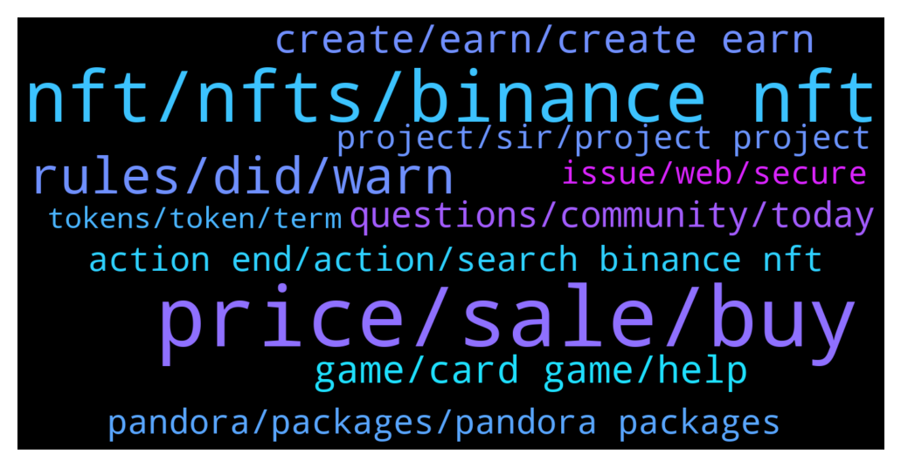

# **@binancenfts**
 ## Analysis for **2022-01-04** - **2022-01-05**.

---

## 📊 **Basic Stats**

**n_messages_sent**: 418

---

---

## 🔝 **Top keywords and related messages**

1. **price, sale, buy**

    @Seller767 --- *I wanna invest in monkey , give me advice what will be best before 300$* **--->** [TG Discussion](https://t.me/binancenfts/424374)

    @Forta0i --- *Not avalable at 5 they are bids😅😅😅* **--->** [TG Discussion](https://t.me/binancenfts/424683)

    @Seller767 --- *U think I can buy this ? My max for Ape 400$* **--->** [TG Discussion](https://t.me/binancenfts/424376)

    @Motlaq --- *Because i bought 😉 and I bought just the unique one* **--->** [TG Discussion](https://t.me/binancenfts/423660)

    @Forta0i --- *Tell me in how much $  do you want to buy this all four* **--->** [TG Discussion](https://t.me/binancenfts/424527)

    @captainbnb --- *don't ask for personal offering in dm* **--->** [TG Discussion](https://t.me/binancenfts/424572)

2. **nft, nfts, binance nft**

    @Kenikky --- *2022 is going to be huge on Binance NFT, each day the marketplace gets better and better, this Subscription Mechanism is another huge step that we look forward to sharing with you all 😄* **--->** [TG Discussion](https://t.me/binancenfts/424758)

    @alifaqe --- *I have NFT on opensea can someone help me* **--->** [TG Discussion](https://t.me/binancenfts/424286)

    @gomichan123 --- *hello angels, can you help me. Im just deposit my nft on wallet to binance. I already follow all instruction on binance. Tx hash already success on my wallet. But my nft didn't come on binance.* **--->** [TG Discussion](https://t.me/binancenfts/423693)

    @sophianyc --- *Who needs this unique NFT at $999? DM me for link* **--->** [TG Discussion](https://t.me/binancenfts/424160)

    @semeerkv --- */report other platform nft’S not allowed. Only BINANCE* **--->** [TG Discussion](https://t.me/binancenfts/424641)

    @MysteryChason --- *Hi ADMIN, When running the new system NFT* **--->** [TG Discussion](https://t.me/binancenfts/424759)

3. **rules, did, warn**

    @semeerkv --- *Not allow Bad wards @Sahib_BNB @Dean_khan @Jarvisbnb* **--->** [TG Discussion](https://t.me/binancenfts/424729)

    @oziiiceyy --- *ok say it like that. remove the warn* **--->** [TG Discussion](https://t.me/binancenfts/424574)

    @Preetkaur202 --- *But my words are not bad  Then why did you delete my sticker 🧐* **--->** [TG Discussion](https://t.me/binancenfts/424733)

    @semeerkv --- *No . I said rules of here* **--->** [TG Discussion](https://t.me/binancenfts/424039)

    @Maxgreen2 --- *It's okay I delete it sir, Thank you* **--->** [TG Discussion](https://t.me/binancenfts/424343)

    @oziiiceyy --- *what a friend, but what did I say, you give warn according to your head* **--->** [TG Discussion](https://t.me/binancenfts/424565)

4. **create, earn, create earn**

    @Sonersonerx --- *I saw an article on your site called "create your own god".  Wow this looks so fantastic.  How can we create our own God?  what should we do? Thanks for AMA sir* **--->** [TG Discussion](https://t.me/binancenfts/424924)

    @irfanecruz --- *Since Mytheria is the first ever Create-to-Earn TCG game, how does Create-to-Earn differ from the different Play-to-Earn games right now? @keiinhangia #Mytheria* **--->** [TG Discussion](https://t.me/binancenfts/424890)

    @keiinhangia --- *I have pursued my passion for digital drawing and have been a game artist for 10 years, having worked for Hikers Game Studio, DeNA, Valve..* **--->** [TG Discussion](https://t.me/binancenfts/424796)

    @zyuan_c --- *I am impressed with this whole new concept of bringing artists and gamers together, may I know how are the artists being rewarded when their artworks are being used in the game? Is it one-off or long term reward? #Mytheria* **--->** [TG Discussion](https://t.me/binancenfts/424893)

    @keiinhangia --- *Our first steps to reach out to the Creator Communities are an art competition called God Forge Contest going on until Jan 31st and a sharing revenue for artists under testing phase.  We are proud to get approval and support from world known artists like Ron Lemen, Dao Le, Jad Saber and Duc Truong in God Forge Contest.  Let us know if members of Binance NFTs would like to know more about God Forge Contest and Mytheria’s Creator Economy ^^* **--->** [TG Discussion](https://t.me/binancenfts/424859)

    @keiinhangia --- *As a game artist,  I value the freedom to create and earn without borders. And I think that's a great idea to introduce a platform that enables artists like me to build a business around themselves.   That's what we aim to - A Creator Economy, in which the Create-to-Earn mechanism exists and Creators in Godforge Community  create a Mythology world while earning financial benefits.* **--->** [TG Discussion](https://t.me/binancenfts/424858)

5. **game, card game, help**

    @ahsiT03 --- *I understand that both aesthetics and the concept behind Mytheria is simply phenomenal! Have you considered an ambassador program to help spread the amazing game features of Mytheria around the world? Do you have a referral programme that we can help bring more new users? #Mytheria* **--->** [TG Discussion](https://t.me/binancenfts/424954)

    @keiinhangia --- *Long story short, we want to develop Mytheria into the best digital Trading Card Game in the world, with ultimate fun for all participants, including players and creators.   Check out our trailers:  https://www.youtube.com/watch?v=vd5C-C9tp7E* **--->** [TG Discussion](https://t.me/binancenfts/424852)

    @Zoii_Khan --- *What role does the community play in the #Mytheria? What have you done and will do to attract people to join #Mytheria and build a thriving community? What was the team's inspiration for designing these characters & Is there any interesting story behind these characters?#Mytheria* **--->** [TG Discussion](https://t.me/binancenfts/424907)

    @dairymil --- *@keiinhangia I understand that both aesthetics and the concept behind #Mytheria is simply phenomenal! Have you considered an ambassador program to help spread the amazing game features of Mytheria around the world? Do you have a referral programme that we can help bring more new users? #Mytheria* **--->** [TG Discussion](https://t.me/binancenfts/424882)

    @semeerkv --- *I see that Mytheria has great ambitions to become E-sports and host International tournaments. Nowadays support from the community or the community is an important part of contributing to the success of any project. How does your team have a plan to attract and keep people engaged with the card game long term? #Mytheria   @keiinhangia* **--->** [TG Discussion](https://t.me/binancenfts/424884)

    @keiinhangia --- *Mytheria is a Trading card game inspired by the idea of ​​interference between the myths of many different countries, where powerful Gods combat in epic battles.* **--->** [TG Discussion](https://t.me/binancenfts/424799)

6. **questions, community, today**

    @keiinhangia --- *Thank you very much for the wonderful time with all the questions, and specialy thanks @Kenikky for such a great host today* **--->** [TG Discussion](https://t.me/binancenfts/424970)

    @keiinhangia --- *Woww, thanks for all the questions! I was blown away* **--->** [TG Discussion](https://t.me/binancenfts/424959)

    @Kenikky --- *Thank you @keiinhangia for joining us today! 🙂* **--->** [TG Discussion](https://t.me/binancenfts/424969)

    @keiinhangia --- *Since there are many questions, please allow me to take some time ^^* **--->** [TG Discussion](https://t.me/binancenfts/424960)

    @Kenikky --- *So we will now take some questions from the community* **--->** [TG Discussion](https://t.me/binancenfts/424872)

    @ChloeSofie --- *Okay Understood Many Many Thanks God bless you* **--->** [TG Discussion](https://t.me/binancenfts/423582)

7. **action end, action, search binance nft**

    @dohbs --- *action will end in 2 hours and 30 minutes search on binance NFT by this name 👇👇👇* **--->** [TG Discussion](https://t.me/binancenfts/424764)

    @dohbs --- *Action will end in 8 hours   search on binance NFT by this name 👇👇👇👇👇* **--->** [TG Discussion](https://t.me/binancenfts/424478)

    @dohbs --- *Action will end in 17 hours   search on binance NFT by this name 👇👇👇👇👇* **--->** [TG Discussion](https://t.me/binancenfts/424359)

    @dohbs --- *Action will end in 1 day and 9 hours search on binance NFT by this name 👇👇👇👇👇* **--->** [TG Discussion](https://t.me/binancenfts/423761)

    @dohbs --- *Action will end in 1 day and 22 hours search on binance NFT by this name 👇👇👇👇👇* **--->** [TG Discussion](https://t.me/binancenfts/423533)

    @dernzaz --- *IRON MAN ▵ 50╳55 ▵ NFT PRIDE* **--->** [TG Discussion](https://t.me/binancenfts/424402)

8. **pandora, packages, pandora packages**

    @cocoteaaa --- *@keiinhangia Do we need to buy Pandora Packages in order to play Mytheria? Are there limited quantities for Pandora Packages? #Mytheria* **--->** [TG Discussion](https://t.me/binancenfts/424902)

    @keiinhangia --- *Yes! As a matter of fact, the buyers will be surprised when the packages are opened. This event of Pandora IGO is a must-not-miss event for the following reasons:* **--->** [TG Discussion](https://t.me/binancenfts/424823)

    @keiinhangia --- *Each Pandora Package contains 2 items:  1. Main Chests (Diamond or Gold) that contain cards, and  2. A lucky Bonus chest* **--->** [TG Discussion](https://t.me/binancenfts/424817)

    @keiinhangia --- *Well, we will issue Pandora Original Packages, which are special card packs exclusively for early adopters on Binance.  There will be Diamond Pandora Packages and Gold Pandora Packages.* **--->** [TG Discussion](https://t.me/binancenfts/424816)

    @Kenikky --- *Thanks for the details. I feel the hype too! Can you share about how to buy and claim these Pandora Packages?* **--->** [TG Discussion](https://t.me/binancenfts/424836)

    @Kenikky --- *Pandora Packages seem to include lots of mysteries there. Can you give a bit more hints? What should people expect from this IGO sales event?* **--->** [TG Discussion](https://t.me/binancenfts/424820)

9. **project, sir, project project**

    @Cryptolpm --- *Is there any ceo to launch a project? We can work as a team* **--->** [TG Discussion](https://t.me/binancenfts/423512)

    @Deejay_0011 --- *IMPORTANT Q: ✌️✌️✌️  How can we trust your project & we believe you are not a SCAM project? Nowadays so many Rug-Pulls and exit SCAM are happening now? Thanks sir..???#Mytheria* **--->** [TG Discussion](https://t.me/binancenfts/424951)

    @Dimvazi_674 --- *important question: ❓❓❓  A very good partnership is needed to strengthen a project. Do you have any other project partnerships with your project? Are you planning to partner to make your project stronger?, Thanks sir...* **--->** [TG Discussion](https://t.me/binancenfts/424946)

    @stargold_1999 --- *✌️ PARTNERSHIP & COLLABORATION ARE the Backbone in making every project more widespread. Can you give some of Your partners with us?  Thanks.✌️✌️✌️#Mytheria* **--->** [TG Discussion](https://t.me/binancenfts/424938)

    @mularjoss_674 --- *important question: ❓❓❓  A very good partnership is needed to strengthen a project. Do you have any other project partnerships with your project? Are you planning to partner to make your project stronger?, Thanks sir...* **--->** [TG Discussion](https://t.me/binancenfts/424885)

    @HridoyAhmed_007 --- *Q: Do you guys feel satisfied by seeing your progresses and achievements till now, when you look back to the day when you have started this project? Thanks 🟡════⚫️════🟡════⚫️* **--->** [TG Discussion](https://t.me/binancenfts/424953)

10. **issue, web, secure**

    @hierspace --- *Poor me idk in my browser it can't open... the web show issue that "this site is not secure"* **--->** [TG Discussion](https://t.me/binancenfts/423756)

    @keiinhangia --- *Make sure you register your account here:  https://accounts.binance.com/en/register* **--->** [TG Discussion](https://t.me/binancenfts/424843)

    @ChibiMaya_bnb --- *if you have an antivirus or cookies etc, but it is secure. it is a https* **--->** [TG Discussion](https://t.me/binancenfts/423757)

    @hierspace --- *I just search another domain alternatif, now i can open it* **--->** [TG Discussion](https://t.me/binancenfts/423760)

    @captainbnb --- *it maybe  issue from your isp* **--->** [TG Discussion](https://t.me/binancenfts/423758)

    @ChibiMaya_bnb --- *only authorized contracts, not yours, not any one. which type did you try? please check if authorized one.* **--->** [TG Discussion](https://t.me/binancenfts/423704)

