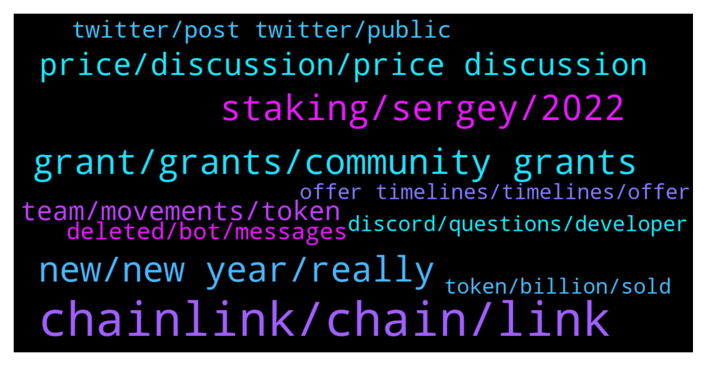

# **@chainlinkofficial**
 ## Analysis for **2022-01-04** - **2022-01-05**.

---

## 📊 **Basic Stats**

**n_messages_sent**: 176

---

---

## 🔝 **Top keywords and related messages**

1. **chainlink, chain, link**

    @BCdev95 --- *Am I allowed to ask about hiring process of Chainlink here?* **--->** [TG Discussion](https://t.me/chainlinkofficial/360013)

    @harrumphharrumph --- *I imagine that it will be a gradual roll out as a lot of features with Chainlink have been before like when the feeds came out a few at a time across multiple networks.* **--->** [TG Discussion](https://t.me/chainlinkofficial/359551)

    @marcromeron --- *Chainlink 2.0 is not really a "binary" transition, one day you switch off Chainlink and the next day you switch on Chainlink 2.0, but rather a set of capabilities that will develop independently to gradually make hybrid smart contracts go mainstream. Feeds using OCR or even smart contracts leveraging Chainlink Keepers are already "Chainlink 2.0" to some extent, as they leverage the hybrid nature of the oracle networks, given that they post information on-chain but part of the computation occurs off-chain.    This article provides an overview of Chainlink 2.0 https://blog.chain.link/chainlink-2-0-lays-foundation-for-adoption-of-hybrid-smart-contracts/* **--->** [TG Discussion](https://t.me/chainlinkofficial/359748)

    @rheeunion --- *Hi, Josh. I'm reading chainlink Docs right now, and I have few questions regarding VRF.* **--->** [TG Discussion](https://t.me/chainlinkofficial/360287)

    @marcromeron --- *Check this tweet from ChainlinkGod to a better understanding. https://twitter.com/ChainLinkGod/status/1370518093340971013?t=ZcJIBxuBoJAnT4GxZk8fXg&s=19* **--->** [TG Discussion](https://t.me/chainlinkofficial/359706)

    @Lidavv --- *Go look at you tube and find chainlink video* **--->** [TG Discussion](https://t.me/chainlinkofficial/359701)

2. **staking, sergey, 2022**

    @Motomaniac1 --- *Where will staking be announced first? Here or twitter?* **--->** [TG Discussion](https://t.me/chainlinkofficial/359439)

    @Arigato --- *Would there be a roadmap for 2022 with tentative timeline on staking announcement ? thanks.* **--->** [TG Discussion](https://t.me/chainlinkofficial/359372)

    @Sunny_V1 --- *Understood, staking in any capacity would be awesome* **--->** [TG Discussion](https://t.me/chainlinkofficial/359552)

    @bolegdeh_wonton --- *Does anyone know if staking has to be live for ccip to be live?* **--->** [TG Discussion](https://t.me/chainlinkofficial/359455)

    @jh3318 --- *So I have a question. I’d like to get more involved with the project is there anything I can do? Been researching running a node. I heard staking is eventually coming not sure if it’s true or not. Either way I’m looking for suggestions to get steered in the right direction. Any help or advice is appreciated. Tyia* **--->** [TG Discussion](https://t.me/chainlinkofficial/360140)

    @marcromeron --- *Staking and CCIP will come this year. It's explained on the video. Then you'll love it.* **--->** [TG Discussion](https://t.me/chainlinkofficial/359737)

3. **new, new year, really**

    @Lidavv --- *Ya i  like it. But i not quite sure your standards setting here* **--->** [TG Discussion](https://t.me/chainlinkofficial/359734)

    @Lidavv --- *That is whole truth and nothing but the truth* **--->** [TG Discussion](https://t.me/chainlinkofficial/359728)

    @JJ_D_RZ --- *Hello everyone I’m new to the channel  I wish you happy new year to each and everyone of you along with your respective family and loved ones  may 2022 bring you Health joy and prosperity 🎊🎊🥳🥳* **--->** [TG Discussion](https://t.me/chainlinkofficial/360264)

    @MarcTillement --- *Hey sers Any follow up on this?* **--->** [TG Discussion](https://t.me/chainlinkofficial/360121)

    @Lidavv --- *Accept the critics and be better* **--->** [TG Discussion](https://t.me/chainlinkofficial/359719)

    @marcromeron --- *But I think you'll change your mind for sure.* **--->** [TG Discussion](https://t.me/chainlinkofficial/359714)

4. **grant, grants, community grants**

    @harrumphharrumph --- *Any project can request a grant and will be reviewed. Take a look through https://chain.link/community/grants for categories and past recipients to understand what qualifies.* **--->** [TG Discussion](https://t.me/chainlinkofficial/359891)

    @Angelikov --- *Hello, Thanks a lot. I have reviewed but cannot find the terms and conditions and Of all the grants, the closest to our project is community grants. But, there is not much information. Do you have an information format?* **--->** [TG Discussion](https://t.me/chainlinkofficial/359894)

    @Angelikov --- *Hello thank you very much. Yes, we want Participation in community grants but we do not see on the page The specific milestones you mention we only see the form* **--->** [TG Discussion](https://t.me/chainlinkofficial/359909)

    @JoshSimenhoff --- *Hey Angelica, thanks for asking here. The terms and conditions vary depending on the grant and are decided during the application process. Each grant has specific milestones that need to be reached in order for the grantee to receive the grant. Does this answer your question? Have you already applied for a grant? If not DM me and I can help you decide if Chainlink Community grants can provide support for your team or project.* **--->** [TG Discussion](https://t.me/chainlinkofficial/359904)

    @Angelikov --- *Hello everyone. Happy New Year. I am new to the group. My team and me, are interested in participating in the community grants. Can anyone tell me which Blockchain project can participate?* **--->** [TG Discussion](https://t.me/chainlinkofficial/359858)

    @jh3318 --- *Also is there any classes that I should look into. That would fill one of the biggest needs? I work at night and I have lots of time during the day 😂* **--->** [TG Discussion](https://t.me/chainlinkofficial/360149)

5. **price, discussion, price discussion**

    @Lidavv --- *There is a discussion with 200k view* **--->** [TG Discussion](https://t.me/chainlinkofficial/359705)

    @Linkederic --- *Hey Jamie, price discussion of any kind is prohibited in this channel* **--->** [TG Discussion](https://t.me/chainlinkofficial/360208)

    @abraham055 --- *hello, that's not my point anyway.  In fact, I asked if the price has been increasing for a week, there is a news flow that I cannot follow.  or like a deal* **--->** [TG Discussion](https://t.me/chainlinkofficial/360283)

    @JoshSimenhoff --- *HI Ibrahim, thanks for joining us here. Price, trading, and market discussion is not allowed on the channel.* **--->** [TG Discussion](https://t.me/chainlinkofficial/360281)

    @Lidavv --- *I never state what exact price* **--->** [TG Discussion](https://t.me/chainlinkofficial/359670)

    @Jamie --- *Is there a link channel to discuss TA or price anywhere* **--->** [TG Discussion](https://t.me/chainlinkofficial/360218)

6. **team, movements, token**

    @Linkederic --- *As William indicated, the team never has commented on token movements and I don’t expect they ever will.* **--->** [TG Discussion](https://t.me/chainlinkofficial/359435)

    @Shogun187 --- *The team has never commented on token transactions/movements.* **--->** [TG Discussion](https://t.me/chainlinkofficial/359426)

    @Wizard --- *Hi guys, is it true that the team announced they won’t sell any more tokens?* **--->** [TG Discussion](https://t.me/chainlinkofficial/359419)

    @Wizard --- *Thank you, but do you guys have any info about the team not selling anymore? Even if they didn’t say so themselves.* **--->** [TG Discussion](https://t.me/chainlinkofficial/359438)

    @Linkederic --- *As William indicated the blockchain is a public record and you can draw your own conclusions from the information there.* **--->** [TG Discussion](https://t.me/chainlinkofficial/359441)

    @Vaww1 --- *Has this stopped?? Or just rumours* **--->** [TG Discussion](https://t.me/chainlinkofficial/360036)

7. **twitter, post twitter, public**

    @Wizard --- *I don’t think if multiple 500K+ twitter accounts tweet something like that, that they just made it up. Maybe next time try helping out instead of being Mr. Smarty Pants* **--->** [TG Discussion](https://t.me/chainlinkofficial/359431)

    @Shogun187 --- *Because Twitter is a public forum where anyone can post whatever they want?* **--->** [TG Discussion](https://t.me/chainlinkofficial/359428)

    @Wizard --- *Then why is it all over twitter? Is it true?* **--->** [TG Discussion](https://t.me/chainlinkofficial/359427)

    @Papasiro --- *Twitter. The source of absolute truth* **--->** [TG Discussion](https://t.me/chainlinkofficial/360038)

    @Lidavv --- *I might send a message binance ceo* **--->** [TG Discussion](https://t.me/chainlinkofficial/359732)

    @BrapreetLadysMan --- *Then probably post on Twitter and telegram* **--->** [TG Discussion](https://t.me/chainlinkofficial/359443)

8. **deleted, bot, messages**

    @Linkederic --- *@prahasithv bot deleted your comment, no need to apologize, I know you were just kidding!* **--->** [TG Discussion](https://t.me/chainlinkofficial/360222)

    @prahasithv --- *I am wondering ! How it got deleted ! Thought there is some content which is offensive ! However good to be a part of community. Cheers!* **--->** [TG Discussion](https://t.me/chainlinkofficial/360223)

    @juankaramoy --- *Welcome new members! Please review the pinned messages for rules and guide lines https://t.me/chainlinkofficial/325011* **--->** [TG Discussion](https://t.me/chainlinkofficial/359970)

    @juankaramoy --- *Hi there welcome!  Feel free to check out our pinned message for guides and chat rules  https://t.me/chainlinkofficial/325011* **--->** [TG Discussion](https://t.me/chainlinkofficial/359495)

    @Linkederic --- *our bot just deletes @'s and links from folks for a certain period after they join. We're glad to have you 🤝* **--->** [TG Discussion](https://t.me/chainlinkofficial/360226)

    @Linkederic --- *Seems like something a robot might say* **--->** [TG Discussion](https://t.me/chainlinkofficial/359782)

9. **offer timelines, timelines, offer**

    @abraham055 --- *I couldn't follow it in the last period, I wonder if there is a project or process transition or something.* **--->** [TG Discussion](https://t.me/chainlinkofficial/360277)

    @Sunny_V1 --- *‘This year’ sounds like a timeline to me ;)* **--->** [TG Discussion](https://t.me/chainlinkofficial/359548)

    @marcromeron --- *During this year. We don't offer timelines.* **--->** [TG Discussion](https://t.me/chainlinkofficial/359523)

    @marcromeron --- *Honestly not yet. I'll circle back in short.* **--->** [TG Discussion](https://t.me/chainlinkofficial/360124)

    @marcromeron --- *I’m sorry. We don’t offer timelines. Thanks for your understanding.* **--->** [TG Discussion](https://t.me/chainlinkofficial/359744)

    @marcromeron --- *To not mention Ari Juels for example.* **--->** [TG Discussion](https://t.me/chainlinkofficial/359726)

10. **token, billion, sold**

    @Lidavv --- *It was mentioned chainlink sell its token to fund social project* **--->** [TG Discussion](https://t.me/chainlinkofficial/359642)

    @juankaramoy --- *You can find the LINK token for purchase in various exchanges which have their own fee structure.* **--->** [TG Discussion](https://t.me/chainlinkofficial/359981)

    @Lidavv --- *Chainlink should reconsider its action in increasing supply of token unnecessarily* **--->** [TG Discussion](https://t.me/chainlinkofficial/359659)

    @Lidavv --- *1 billion over dollar of chainlink tokens sold* **--->** [TG Discussion](https://t.me/chainlinkofficial/359646)

    @Lidavv --- *RESULTING 1 BILLION OVER TOKEN SOLD* **--->** [TG Discussion](https://t.me/chainlinkofficial/359643)

    @MnemonicAA --- *what is the inflation rate of LINK tokens? Will there continuously be new coins created?* **--->** [TG Discussion](https://t.me/chainlinkofficial/360092)

