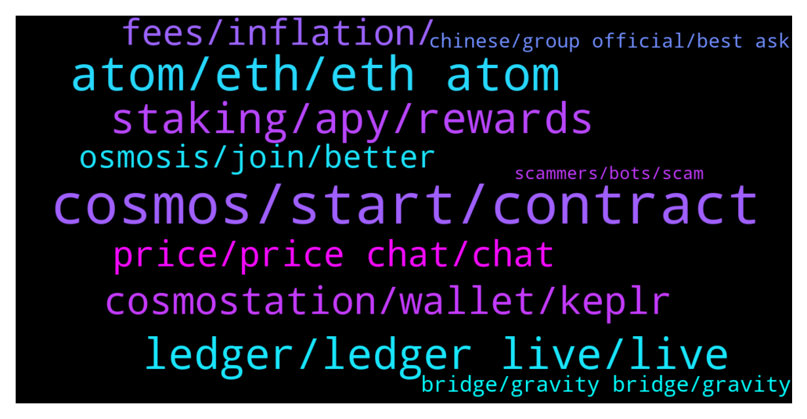

# **@cosmosproject**
 ## Analysis for **2022-01-04** - **2022-01-05**.

---

## 📊 **Basic Stats**

**n_messages_sent**: 593

---

---

## 🔝 **Top keywords and related messages**

1. **cosmos, start, contract**

    @AtomJazz --- *I think the best place to start is by joining cosmos developers discord channel. https://discord.gg/vcExX9T* **--->** [TG Discussion](https://t.me/cosmosproject/466970)

    @pasqualeBuonocore --- *The cosmos whitepaper as pdf file*, sorry I was not clear enough* **--->** [TG Discussion](https://t.me/cosmosproject/467401)

    @Graphicals --- *Awesome awesome, yeah cause i cant seem to understand how exactly to switch from matic to cosmos haha, rookie mode 🤣* **--->** [TG Discussion](https://t.me/cosmosproject/468214)

    @AtomJazz --- *It's not a myth in Cosmos* **--->** [TG Discussion](https://t.me/cosmosproject/467579)

    @ZoltanAtom --- *This is very important. All Based Cosmos projects should support each other’s.* **--->** [TG Discussion](https://t.me/cosmosproject/466820)

    @AtomJazz --- *Yes, they will launch their own Cosmos chain soon* **--->** [TG Discussion](https://t.me/cosmosproject/467496)

2. **atom, eth, eth atom**

    @Rshangareev --- *This means actually their users are obliged to buy atom first 😉 but its okay, good concept* **--->** [TG Discussion](https://t.me/cosmosproject/467563)

    @ZoltanAtom --- *You might buy more Atom after reading all 😎* **--->** [TG Discussion](https://t.me/cosmosproject/468249)

    @chlorophilly --- *Thanks! Time to stack up more ATOM then 😁* **--->** [TG Discussion](https://t.me/cosmosproject/467954)

    @Brad Abar --- *Atoms in the future can be rivals BNB* **--->** [TG Discussion](https://t.me/cosmosproject/467451)

    @AtomJazz --- *I doubt BNB will be able to keep up with ATOM for much longer tbh. BNB is a centralized token, while ATOM isn't* **--->** [TG Discussion](https://t.me/cosmosproject/467454)

    @Cordtus --- *They aren't. There are a number of on/offramp that don't involve atom at all.* **--->** [TG Discussion](https://t.me/cosmosproject/467574)

3. **ledger, ledger live, live**

    @ZoltanAtom --- *Yes. You always have an option to use your Ledger with Keplr.* **--->** [TG Discussion](https://t.me/cosmosproject/468183)

    @ZoltanAtom --- *I can’t help much. Ledger has been network or connetion issue nowadays. I can offer you to use Legder with Keplr.* **--->** [TG Discussion](https://t.me/cosmosproject/467312)

    @Vldmr31 --- *guys  i trying to send my atom from ledger to  exchange   and getting  some error* **--->** [TG Discussion](https://t.me/cosmosproject/467646)

    @Matijasny --- *Need help with ledger withdraw bc since few days i cant payout reward* **--->** [TG Discussion](https://t.me/cosmosproject/467307)

    @AtomJazz --- *Ledger live is not working properly. Use your ledger device with Keplr wallet and it will work like it should* **--->** [TG Discussion](https://t.me/cosmosproject/466494)

    @Cordtus --- *Yes because ledger is slow. You can claim through keplr using ledger though I did the other day.* **--->** [TG Discussion](https://t.me/cosmosproject/467093)

4. **staking, apy, rewards**

    @shiva1508 --- *There is no information about staking here* **--->** [TG Discussion](https://t.me/cosmosproject/466928)

    @satoshi_onamoto --- *Hi, I'm new here, just wanted to ask a few quick ones; with staking are my rewards restaked automatically?* **--->** [TG Discussion](https://t.me/cosmosproject/468267)

    @Satoshi_is_dead --- *Liquid staking is going to be interesting! Btw Got Any information on a month ratio on 2022 that this concept will be available?* **--->** [TG Discussion](https://t.me/cosmosproject/466767)

    @JT --- *am must in top 150 voting power/staking amount then only can be selected right? https://www.mintscan.io/cosmos/validators* **--->** [TG Discussion](https://t.me/cosmosproject/466845)

    @shadow_dweller --- *Can somebody explain to me how providing single LP assets work, if I only wish to add one asset and it’s the lesser in the pool does that help to balance the pool ? Also how does that affect the APR and potentially losses ? Thanks* **--->** [TG Discussion](https://t.me/cosmosproject/467652)

    @Robin --- *Guess I will keep staking a little longer then haha* **--->** [TG Discussion](https://t.me/cosmosproject/467109)

5. **cosmostation, wallet, keplr**

    @ZoltanAtom --- *Perfect. Then just connect your Keplr to Cosmos dexs. Here are the links;  https://t.me/osmosis_chat  https://t.me/EmerisHQ  https://t.me/sifchain* **--->** [TG Discussion](https://t.me/cosmosproject/467896)

    @ZoltanAtom --- *Hello,not recommended one. Keplr/Cosmostation wallets are the recommended* **--->** [TG Discussion](https://t.me/cosmosproject/467888)

    @AtomJazz --- *Keplr is Metamask like wallet for Cosmos* **--->** [TG Discussion](https://t.me/cosmosproject/466439)

    @Cowboy --- *Hey guys, anyone have a wallet similar to Keplr that works with multiple IBCs on mobile? I need to use osmosis bridge but can’t find a wallet that supports terra and cosmos* **--->** [TG Discussion](https://t.me/cosmosproject/466647)

    @Oskarito69 --- *I can see my cosmos balance in my keplr wallet in my browser extension but I have no option to send them away to another wallet? Do you have any Idea?* **--->** [TG Discussion](https://t.me/cosmosproject/466508)

    @Cordtus --- *of course. keplr wallet or cosmostation are the best choices for cosmos and all other ibc tokens* **--->** [TG Discussion](https://t.me/cosmosproject/467794)

6. **price, price chat, chat**

    @ZoltanAtom --- *@Atomprice please no price discussion here.* **--->** [TG Discussion](https://t.me/cosmosproject/468138)

    @ZoltanAtom --- *Not really and no price discussion here as you well know.* **--->** [TG Discussion](https://t.me/cosmosproject/466746)

    @ZoltanAtom --- *No price discussion on here please.* **--->** [TG Discussion](https://t.me/cosmosproject/467947)

    @ZoltanAtom --- *@Atomprice no price discussion on here* **--->** [TG Discussion](https://t.me/cosmosproject/467943)

    @ZoltanAtom --- *No problem. No price discussions here. We have a dedicated price chat for Atom.* **--->** [TG Discussion](https://t.me/cosmosproject/467848)

    @Cordtus --- *they generally dont like price chat in here but honestly im not planning on selling it anytime in the near future so while it is nice to see i dont get overly excited* **--->** [TG Discussion](https://t.me/cosmosproject/467813)

7. **fees, inflation, **

    @shiva1508 --- *Where did you find it is 14% in the link9* **--->** [TG Discussion](https://t.me/cosmosproject/466931)

    @Cordtus --- *Imagine your bank paying you 10% per year* **--->** [TG Discussion](https://t.me/cosmosproject/467230)

    @teachme123 --- *Even if? The price is rising :) the inflation doesn’t matter..* **--->** [TG Discussion](https://t.me/cosmosproject/466937)

    @AtomJazz --- *Well sure they have higher inflation atm 😁* **--->** [TG Discussion](https://t.me/cosmosproject/466935)

    @ZoltanAtom --- *Maybe. But I bet devs think of this. Anyway it won’t be like eth fees. No need to hurry up for now.* **--->** [TG Discussion](https://t.me/cosmosproject/467245)

    @Cordtus --- *52 cents is high lol? Also you can use low fee almost every time. I rarely have issues with low fee.* **--->** [TG Discussion](https://t.me/cosmosproject/467226)

8. **osmosis, join, better**

    @ZoltanAtom --- *Are you using Osmosis Amm for this ?* **--->** [TG Discussion](https://t.me/cosmosproject/467335)

    @TicoJohnny --- *Unfortunately Keplr on pc is your best bet, Cosmostation might work but if you need to use Osmosis you’ll want to use the browser app* **--->** [TG Discussion](https://t.me/cosmosproject/466662)

    @teachme123 --- *Better stake osmosis or Juno… higher APY* **--->** [TG Discussion](https://t.me/cosmosproject/466933)

    @Allexcs776 --- *@gonxua you are in a fake Osmosis group, please go to the real one:  https://t.me/osmosis_chat* **--->** [TG Discussion](https://t.me/cosmosproject/467719)

    @ZoltanAtom --- *Indeed. Why don’t you join Osmosis too ;  https://t.me/osmosis_chat* **--->** [TG Discussion](https://t.me/cosmosproject/467366)

    @ZoltanAtom --- *Please check this article and also join Osmosis channel ;  https://medium.com/osmosis-community-support-dao/transferring-ust-from-osmosis-to-terrastation-ffa0df3dc435   https://t.me/osmosis_chat* **--->** [TG Discussion](https://t.me/cosmosproject/467281)

9. **bridge, gravity bridge, gravity**

    @Rshangareev --- *So, what I am trying to understand now is the list of apps and projects stated on official web-site, but no bridges are built yet. But you have BSC stated on first page. Does it mean that tokens are being traded on it?* **--->** [TG Discussion](https://t.me/cosmosproject/467526)

    @AtomJazz --- *Wdym no bridges are built yet? IBC is live and it's making over 3M txs per month https://mapofzones.com/?period=24&testnet=false&tableOrderBy=totalIbcTxs&tableOrderSort=desc* **--->** [TG Discussion](https://t.me/cosmosproject/467528)

    @AtomJazz --- *BTC bridge will also be available soon* **--->** [TG Discussion](https://t.me/cosmosproject/467522)

    @AtomJazz --- *We also have Gravity bridge to ETH launching for end users any day now* **--->** [TG Discussion](https://t.me/cosmosproject/467521)

    @AtomJazz --- *Currently yes (if you want to avoid CEXes) Gravity bridge will be launched in the next few days and then it will become even easier* **--->** [TG Discussion](https://t.me/cosmosproject/466445)

    @AtomJazz --- *You can use Sifchain for now. Gravity bridge will be live any day now* **--->** [TG Discussion](https://t.me/cosmosproject/466371)

10. **chinese, group official, best ask**

    @SteveL5 --- *Thank you, but this Chinese group seems to be very few people. Is this the only official Chinese group?* **--->** [TG Discussion](https://t.me/cosmosproject/467403)

    @SteveL5 --- *Is there a Chinese version of this white paper?* **--->** [TG Discussion](https://t.me/cosmosproject/467408)

    @huyancheng --- *Is there a Chinese telegraph group* **--->** [TG Discussion](https://t.me/cosmosproject/467741)

    @AtomJazz --- *Hmm, don't think so. I can ask around but unless someone translated it to Chinese there probably isn't one* **--->** [TG Discussion](https://t.me/cosmosproject/467410)

    @mrsadr15 --- *i am iranian i do not know* **--->** [TG Discussion](https://t.me/cosmosproject/467089)

    @Luckyyy --- *hello do you have chinese atom channel？* **--->** [TG Discussion](https://t.me/cosmosproject/466673)

