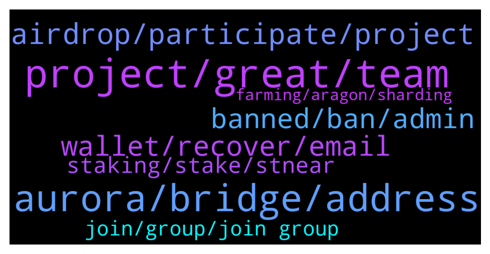

# **@cryptonear**
 ## Analysis for **2022-01-04** - **2022-01-05**.

---

## 📊 **Basic Stats**

**n_messages_sent**: 632

---

---

## 🔝 **Top keywords and related messages**

1. **project, great, team**

    @Maruf14128 --- *Nice project. This project will be big, because it includes a structured, creative, innovative, compact and transparent team. I hope I can be a part of this great project.* **--->** [TG Discussion](https://t.me/cryptonear/266563)

    @Kripto_Raptor --- *btw what's the project about 😊* **--->** [TG Discussion](https://t.me/cryptonear/259868)

    @cryptoappu --- *A good project and strong team in a predictable and transparent road map , planned and projected. I think in the near future we will see an unprecedented growth of this project.* **--->** [TG Discussion](https://t.me/cryptonear/271088)

    @Amahartt --- *This is a Fantastic project with great potential.The team's dedication and ingenuity with excellent fan support will make this the envy of the crypto world. I am so glad to be part of this.* **--->** [TG Discussion](https://t.me/cryptonear/262786)

    @JefriKwiz --- *Amazing project and management work keep going great work ❤️👍😊* **--->** [TG Discussion](https://t.me/cryptonear/264745)

    @AliSuperman --- *Awesome project with a great team and roadmap 🔥 so excited to see more successes from this amazing project ❤️* **--->** [TG Discussion](https://t.me/cryptonear/264072)

2. **aurora, bridge, address**

    @Yaorock --- *Looks like rainbow bridge does not work for me.  And i cannot open Aurora explorer to check my transaction hash.* **--->** [TG Discussion](https://t.me/cryptonear/260074)

    @NairdrophunterP --- *hello sir how to get Aurora address wich wallet should i use to get Aurora address* **--->** [TG Discussion](https://t.me/cryptonear/269162)

    @kv9990 --- *$NEAR on MetaMask is called wNear,it should be same as token address to $Near 👀 Can you tell which blockchain are you currently using on MetaMask ETH/BSC/Aurora* **--->** [TG Discussion](https://t.me/cryptonear/260453)

    @Serverroom404 --- *Admin please How to find aurora address* **--->** [TG Discussion](https://t.me/cryptonear/266491)

    @NEARverse_xd --- *No i dont think so. Just send Near from cex to your near wallet and then connect your wallet with rainbow bridge and bridge from near to aurora. Thats it.   Is not it far better then paying high ETH gas fee without any reason? Why you want to pay high fees ;_;* **--->** [TG Discussion](https://t.me/cryptonear/260279)

    @crypto4life4eva --- *Where can I buy near on a dex?* **--->** [TG Discussion](https://t.me/cryptonear/260254)

3. **airdrop, participate, project**

    @larry_lang --- *didnt trisolaris give out airdrop out of nowhere=0* **--->** [TG Discussion](https://t.me/cryptonear/260938)

    @Kripto_Raptor --- *No need to spam, hi, hello, good project, nice project! you're eligible for the airdrop 😊* **--->** [TG Discussion](https://t.me/cryptonear/270105)

    @wildfire007 --- *Yes. An airdrop for GitHub users* **--->** [TG Discussion](https://t.me/cryptonear/260509)

    @larry_lang --- *Heyy so we are aware that newcomers are flushing in due to the Crafting Finance Airdrop, will open up the group shortly after this https://twitter.com/CraftingFinance/status/1478667618886291458* **--->** [TG Discussion](https://t.me/cryptonear/261663)

    @larry_lang --- *hehe who told u that Ref. not gonna do an airdrop=))))* **--->** [TG Discussion](https://t.me/cryptonear/260944)

    @boomerc --- *Im referring to this airdrop. This channel is a useful resource for many. Now its unusable.* **--->** [TG Discussion](https://t.me/cryptonear/262249)

4. **wallet, recover, email**

    @V --- *Hello, i registered account and chose recovery by sms or email during registration but when I try to connect now it gives only two recovery options by mnemonic phrase or ledger.. what shall I do?* **--->** [TG Discussion](https://t.me/cryptonear/259615)

    @kv9990 --- *Check your email ,there should be a mail containing magic link to recover your account from wallet@near.org,use that to recover account ✌️* **--->** [TG Discussion](https://t.me/cryptonear/259632)

    @Bisma --- *if i forget my near wallet password how to solve it* **--->** [TG Discussion](https://t.me/cryptonear/259733)

    @V --- *Well, i wanted to connect it after registering to mint..and it gives an option to create new account or import existing one. So when i choose import it gives above options…* **--->** [TG Discussion](https://t.me/cryptonear/259620)

    @V --- *I chose sms or email during registration but the website doesn’t let me click on them but only mnemonic phrase or ledger* **--->** [TG Discussion](https://t.me/cryptonear/259621)

    @Kripto_Raptor --- *same with the SMS recovery option* **--->** [TG Discussion](https://t.me/cryptonear/259637)

5. **banned, ban, admin**

    @kv9990 --- *Hey ,if you're humans please reply to this msg with anything, or else we will ban u  :) if u cant join pls contact the mods and we would manually add u back in =))* **--->** [TG Discussion](https://t.me/cryptonear/262145)

    @cuongdcc --- *guys, please help me check this account @DonaldHwangVNR96, he said he got accidently banned from Near global group* **--->** [TG Discussion](https://t.me/cryptonear/261891)

    @larry_lang --- *hmm time to clean up bot again=))) if we happened to ban u guys by accident pls send me a DMs and i would open back ASAP* **--->** [TG Discussion](https://t.me/cryptonear/261647)

    @Rohan --- *Why my primary id is banning again and again* **--->** [TG Discussion](https://t.me/cryptonear/261890)

    @colindexter1990 --- *Admin I want to ask something* **--->** [TG Discussion](https://t.me/cryptonear/265976)

    @sami_mind4 --- *I have  a Question why auto Ban On from group when member join* **--->** [TG Discussion](https://t.me/cryptonear/263091)

6. **staking, stake, stnear**

    @larry_lang --- *stNEAR is the synthetic asset on NEAR that u get for staking NEAR with Metapool, so just by holding NEAR u have already stake in* **--->** [TG Discussion](https://t.me/cryptonear/260943)

    @butola_ravi --- *Yes and i was staking with ref at that time* **--->** [TG Discussion](https://t.me/cryptonear/260941)

    @lpquang --- *I mean that I can only receive the stake reward in metapool if I have stNear in my Near wallet. And mean that I can only receive the reward one side, not both side. That's my concern* **--->** [TG Discussion](https://t.me/cryptonear/261002)

    @larry_lang --- *oh and what do u mean by "not increase anymore"? may I have more details about it?* **--->** [TG Discussion](https://t.me/cryptonear/260996)

    @fynyc --- *Drop will be for staking near?* **--->** [TG Discussion](https://t.me/cryptonear/260759)

    @nategeier --- *what's the best visual tool to oversee staking  history?* **--->** [TG Discussion](https://t.me/cryptonear/260162)

7. **join, group, join group**

    @CryptoNerdyy --- *i need to connect with tech team not mod is there a way ..?* **--->** [TG Discussion](https://t.me/cryptonear/260199)

    @JsLowGMI --- *I think you should freeze newcomers from joining for 12hours first* **--->** [TG Discussion](https://t.me/cryptonear/261922)

    @rahulgoel007 --- *You can join again and clear your doubts with the team https://t.me/auroraisnear* **--->** [TG Discussion](https://t.me/cryptonear/260077)

    @Ubongj --- *Anyone got an invite for NEAR crowd?* **--->** [TG Discussion](https://t.me/cryptonear/260222)

    @FritzWagner --- *Ant this group: https://t.me/nearnftclub Let me know if it was helpful 🤘* **--->** [TG Discussion](https://t.me/cryptonear/260783)

    @larry_lang --- *can u tell him to join again?* **--->** [TG Discussion](https://t.me/cryptonear/261914)

