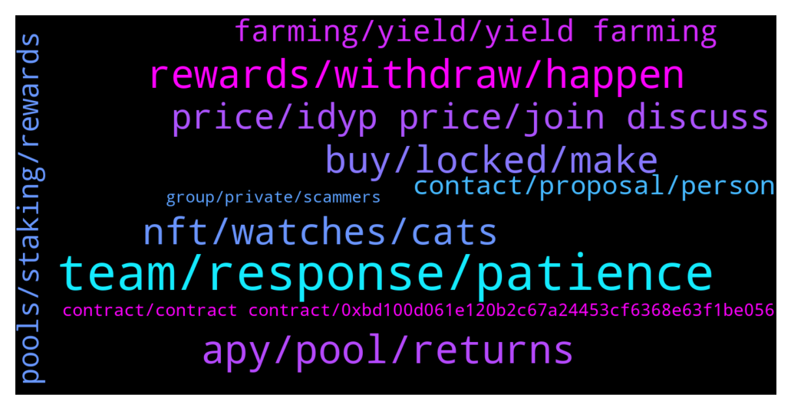

# **@dypfinance**
 ## Analysis for **2022-01-04** - **2022-01-05**.

---

## 📊 **Basic Stats**

**n_messages_sent**: 218

---

---

## 🔝 **Top keywords and related messages**

1. **team, response, patience**

    @iamJubi --- *Rest assured that the team will get your query. hoping for your patience. 🙂* **--->** [TG Discussion](https://t.me/dypfinance/236648)

    @DhoniMSD516 --- *Will be very happy to see such feedback Thanks :)* **--->** [TG Discussion](https://t.me/dypfinance/236678)

    @michaelder --- *@iamJubi Hey Jubi just wondering if there has been any feedback from my question early today? Cheers 😀* **--->** [TG Discussion](https://t.me/dypfinance/236719)

    @Vl_investor --- *Hi, cex first approved and then requested the documents again? Why did they do that?* **--->** [TG Discussion](https://t.me/dypfinance/236804)

    @Wen Hsiang --- *When will the first lauchpad be announced?* **--->** [TG Discussion](https://t.me/dypfinance/236697)

    @Hello --- *Did the team get response back on follow up?* **--->** [TG Discussion](https://t.me/dypfinance/236744)

2. **rewards, withdraw, happen**

    @DhoniMSD516 --- *If you didn't withdraw yet, you can continue without withdrawing and still earn rewards even after 30 days, if withdrawn and want to restake then yes you can do that.* **--->** [TG Discussion](https://t.me/dypfinance/237094)

    @H4S2K --- *when can they be usually redeemed* **--->** [TG Discussion](https://t.me/dypfinance/236653)

    @B --- *i continue without withdrawing but there is no rewards now* **--->** [TG Discussion](https://t.me/dypfinance/237095)

    @D0nkeyKong --- *Is there any way I can cash out my WBNB again despite lock time? Deposited a month ago at 450% APY and now lost half :/* **--->** [TG Discussion](https://t.me/dypfinance/236999)

    @Manuel --- *90 days lock is now: 95%* **--->** [TG Discussion](https://t.me/dypfinance/236771)

    @DhoniMSD516 --- *Hey This category of tokens can go to 0 in 2 ways 1. Either those will be burnt or disbursed (via a governance proposal).  2. The contract will try to use them also as rewards (including the base rewards which every contract has) until the 2.5% will be met* **--->** [TG Discussion](https://t.me/dypfinance/237018)

3. **apy, pool, returns**

    @Bahrulfik --- *V2 apy is so low 😢* **--->** [TG Discussion](https://t.me/dypfinance/237106)

    @DhoniMSD516 --- *I am sure you are aware APY is dynamic and changes +/- :)* **--->** [TG Discussion](https://t.me/dypfinance/236774)

    @iamJubi --- *Hello. Let me check with the team as I am not sure with the right APY last night if it literally halved. But Number of users, TVL on the pool, and price of tokens involved affects the APY change.* **--->** [TG Discussion](https://t.me/dypfinance/236640)

    @ahuman516 --- *Facts mate, APY is dynamic and no one can from team can change it, consider the scenarios like marketprice people joining the pool etc* **--->** [TG Discussion](https://t.me/dypfinance/236783)

    @Bahrulfik --- *when compared to v1 APY it's very much different* **--->** [TG Discussion](https://t.me/dypfinance/237110)

    @D0nkeyKong --- *That the APY goes down is clear, but that the LP token permanently crashes so fast and i have to watch that the money every day by 10% less is shit :(* **--->** [TG Discussion](https://t.me/dypfinance/237001)

4. **buy, locked, make**

    @RuuneL --- *Any news on DYP being listed on exchang* **--->** [TG Discussion](https://t.me/dypfinance/237006)

    @DhoniMSD516 --- *Hey welcome you start by reading here about DYP and its features https://t.me/dypfinance/229271* **--->** [TG Discussion](https://t.me/dypfinance/236985)

    @DhoniMSD516 --- *Hey this channel is related to DYP project you can start reading about DYP here  https://t.me/dypfinance/229271* **--->** [TG Discussion](https://t.me/dypfinance/236877)

    @Disguy125 --- *I get that and thats fine but, regardless  someone can't come in and buy 1000eth of DYP could they?* **--->** [TG Discussion](https://t.me/dypfinance/236714)

    @Wen Hsiang --- *Does dyp have a Chinese telegram?* **--->** [TG Discussion](https://t.me/dypfinance/236695)

    @timdyp --- *Hi, you can check these video tutorials https://youtube.com/playlist?list=PL8K0d30DJYVPKtu_gWiu7vm73k_TnZOs4* **--->** [TG Discussion](https://t.me/dypfinance/237045)

5. **nft, watches, cats**

    @Ye_Naing --- *Minting NFT with cat and watch or cat only?* **--->** [TG Discussion](https://t.me/dypfinance/236684)

    @timdyp --- *The #NFTs Marketplace together with the Cats and Watches Society collection will come to #Avalanche within two weeks. Metaverse and the Play to Earn #NFT concept will follow shortly!  Learn More👇 https://dyp.finance/nft  👉https://twitter.com/dypfinance/status/1478324493303091201* **--->** [TG Discussion](https://t.me/dypfinance/236775)

    @iamJubi --- *The #NFTs Marketplace together with the Cats and Watches Society collection will come to #Avalanche within two weeks. Metaverse and the Play to Earn #NFT concept will follow shortly!  Learn More👇 https://dyp.finance/nft  👉https://twitter.com/dypfinance/status/1478324493303091201* **--->** [TG Discussion](https://t.me/dypfinance/236976)

    @iamJubi --- *#NFTGiveaway time🐱  🔥10 lucky people will get a Cats and Watches Society #NFT which starts minting on January 17, 2022👇 https://dyp.finance/nft  Enter to win: ✅Retweet ✅Tag 3 friends that loves #NFTs ✅Follow @dypfinance ✅Join https://t.me/dypfinance  #NFTCommunity #NFTdrop  👉https://twitter.com/dypfinance/status/1475805248887439360* **--->** [TG Discussion](https://t.me/dypfinance/236674)

    @Hello --- *Are we in a bear trend?* **--->** [TG Discussion](https://t.me/dypfinance/236903)

    @nkemboxoffice --- *On 17th Jan,do we need DYP for minting paws on any chain?* **--->** [TG Discussion](https://t.me/dypfinance/236603)

6. **price, idyp price, join discuss**

    @Malthedk --- *Are there plans of getting idyp listed on any tracking pages? Not necessarily CMC, but something similar* **--->** [TG Discussion](https://t.me/dypfinance/237133)

    @Paulus --- *I saw iDYP price not fall to hard* **--->** [TG Discussion](https://t.me/dypfinance/237127)

    @hemanrock --- *hey there is no STAKE for iDYP.  iDYP is being used for deposit in in FARMS.* **--->** [TG Discussion](https://t.me/dypfinance/236930)

    @Wen Hsiang --- *you can see idyp price  you'll understand* **--->** [TG Discussion](https://t.me/dypfinance/237055)

    @Jorzico --- *Guys how to stack Idyp and also if i stack how to unstack it?* **--->** [TG Discussion](https://t.me/dypfinance/236929)

    @cryptocade --- *Shouldn’t the LP price increase when the price of idyp increases 108%?* **--->** [TG Discussion](https://t.me/dypfinance/236575)

7. **farming, yield, yield farming**

    @JTelegrams --- *Hi Defi Yield users/Admins, how is it possible that farming on V2, for example for USDT, can be annualised 440% APY?   Any explaination for that? If that's the case, everyone would come over to Defi Yield and 'farm' or 'stake'.* **--->** [TG Discussion](https://t.me/dypfinance/236840)

    @BlazingApe --- *Is there a group for DeFi yield farmers?* **--->** [TG Discussion](https://t.me/dypfinance/236852)

    @Wen Hsiang --- *I only join the farm  Is it okay?* **--->** [TG Discussion](https://t.me/dypfinance/236704)

    @timdyp --- *Maximize your Yield Farming Rewards!  Available multi-chain on #Avalanche #Ethereum #BinanceSmartChain  9161 #ETH, 9661 #BNB, and 22248 #AVAX worth $42,134,963 paid to farmers  Join farming by automatically adding liquidity and earn +490% APY https://dyp.finance/farmv2  👉https://twitter.com/dypfinance/status/1478663170898206720* **--->** [TG Discussion](https://t.me/dypfinance/237042)

    @DhoniMSD516 --- *No Farming, Staking and Buyback 3 different categories  You can read here https://link.medium.com/jCtilB5P0lb* **--->** [TG Discussion](https://t.me/dypfinance/236851)

    @Paulus --- *Seem can take profit from farming but the total asset decrease. Do you guys know why* **--->** [TG Discussion](https://t.me/dypfinance/237124)

8. **pools, staking, rewards**

    @Mzupic --- *Wow...first pools in dyp paid off well, one year ago i entered and farmed almost whole year. But this whole idyp story is just a huge fail. Losses will never be covered by reward, never. So sad it turned like this, had hige faith in project.* **--->** [TG Discussion](https://t.me/dypfinance/236574)

    @Raidering83 --- *Just looking through some of the docs and pools etc. is there single staking pools. I noticed V1 and V2 on site is like V1 the older pools that aren’t in use anymore.  Sorry for silly questions* **--->** [TG Discussion](https://t.me/dypfinance/237072)

    @DhoniMSD516 --- *Yes V1 pools are no longer active, we ran them for 1 year and they got expired so we launched V2* **--->** [TG Discussion](https://t.me/dypfinance/237074)

    @Manuel --- *Yes, but it doesn’t go in half of the underlying assets do not move and no one enters the pool* **--->** [TG Discussion](https://t.me/dypfinance/236776)

    @DhoniMSD516 --- *There will separate set of pools not current farming or staking pools* **--->** [TG Discussion](https://t.me/dypfinance/236705)

    @timdyp --- *Marko, you can send me a DM with your public address, the pools you joined, etc and someone from the team will be able to check. All of the above information can be verified on the blockchain. These numbers are 100% real, and the deposits have been made organic just like a normal user.* **--->** [TG Discussion](https://t.me/dypfinance/236600)

9. **contact, proposal, person**

    @King 2 --- *Hello everyone, I am happy to be here, I am the founder of an Arab community for cryptocurrency Who is the right person I can contact for my promotional proposal? Thanks.* **--->** [TG Discussion](https://t.me/dypfinance/236990)

    @valerian12138 --- *Hello, I want to ask who is in charge of community cooperation* **--->** [TG Discussion](https://t.me/dypfinance/236979)

    @zw33669 --- *Hello administrator, about the promotion and cooperation of Chinese market, which person in charge should I contact.* **--->** [TG Discussion](https://t.me/dypfinance/236691)

    @chainadoption --- *Hello everyone, I am with Chainadoption, who is the right person to discuss a mutually beneficial partnership? Thanks!* **--->** [TG Discussion](https://t.me/dypfinance/237139)

    @DhoniMSD516 --- *Hello please email your proposal to contact@dyp.finance* **--->** [TG Discussion](https://t.me/dypfinance/237140)

    @iamJubi --- *Hello you can send your proposal to contact@dyp.finance* **--->** [TG Discussion](https://t.me/dypfinance/236991)

10. **contract, contract contract, 0xbd100d061e120b2c67a24453cf6368e63f1be056**

    @dung865309 --- *0xbd100d061e120b2c67a24453cf6368e63f1be056 is this the real contract* **--->** [TG Discussion](https://t.me/dypfinance/236867)

    @hemanrock --- *It will remain on the contract* **--->** [TG Discussion](https://t.me/dypfinance/236916)

    @DhoniMSD516 --- *The one you posted before is not our contract* **--->** [TG Discussion](https://t.me/dypfinance/236878)

    @DhoniMSD516 --- *Yes this is contract of iDYP* **--->** [TG Discussion](https://t.me/dypfinance/236869)

    @DhoniMSD516 --- *We have same contract on all chains* **--->** [TG Discussion](https://t.me/dypfinance/236879)

    @dung865309 --- *and this is another contract ?* **--->** [TG Discussion](https://t.me/dypfinance/236873)

