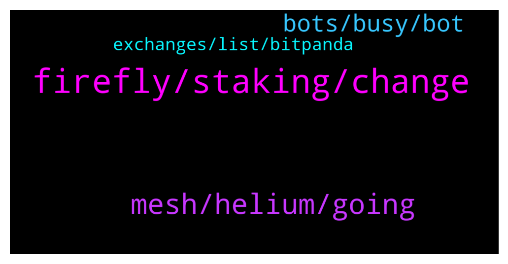

# **@iotatangle**
 ## Analysis for **2022-01-04** - **2022-01-05**.

---

## 📊 **Basic Stats**

**n_messages_sent**: 69

---

---

## 🔝 **Top keywords and related messages**

1. **firefly, staking, change**

    @jessie_rodrag --- *Hi everyone I have a problem with the firefly wallet, the network still disconnected and My friend can’t stake … do you have a solution for this ?* **--->** [TG Discussion](https://t.me/iotatangle/305711)

    @Osaaaa --- *what is wrong agan, my firefly dont stake  iota.* **--->** [TG Discussion](https://t.me/iotatangle/305872)

    @RutherfordTheBrave --- *I upgraded firefly from 1.3.0 to 1.3.2 using firefly. You guys made it so simple. Awesome job!* **--->** [TG Discussion](https://t.me/iotatangle/305825)

    @Jasziu --- *Won't help. I had to install firefly on Linux and use recovery phrase. In logs there was problem with password and stronghold file. Thanks. Have few screens of fake "admins" - interested?* **--->** [TG Discussion](https://t.me/iotatangle/305673)

    @Dima --- *Hello to all… I have a old seed but cant megrate it to firefly what i can do now?* **--->** [TG Discussion](https://t.me/iotatangle/305788)

    @Tahmis --- *If you have set it staking it is staking. Probably just a bad node you are connected to* **--->** [TG Discussion](https://t.me/iotatangle/305873)

2. **mesh, helium, going**

    @PiernasLocas --- *Check their WhitePaper it is very interesting its technology and how it going to work* **--->** [TG Discussion](https://t.me/iotatangle/305766)

    @Basti --- *You mean like the 16000 cryptoa out there? Just inform yourself about mesh+.* **--->** [TG Discussion](https://t.me/iotatangle/305764)

    @PiernasLocas --- *Mesh+ is a project like Helium (HNT) from blockchain.  But Mesh+ going to use the Technology from Iota and LoRa to create a massive wireless network.  I recommend to read the Whitepaper from Mesh+ and later compare the project with Helium.  Right now they have open a Waitlist to participate in a private sale and ICO.* **--->** [TG Discussion](https://t.me/iotatangle/305756)

    @PiernasLocas --- *Mesh+ is different i really recommend to you check their WhitePaper and later see the huge benefit that had Helium on its price  The same that happened on Helium going to happen on Mesh+ or almost it has good probabilities to grow up more than Helium* **--->** [TG Discussion](https://t.me/iotatangle/305762)

    @⠠⠵ Lucas! --- *Aside from the technology, which looks absolutely superior, what worries me is the fact that Helium has already grown up to becoming the biggest LoraWAN network in record time, and there is no real usage for it by now, being other open networks like TTN much more used and discussed in communities.* **--->** [TG Discussion](https://t.me/iotatangle/305774)

    @Basti --- *There is a difference in a token which is represented on the iota-network* **--->** [TG Discussion](https://t.me/iotatangle/305770)

3. **bots, busy, bot**

    @⠠⠵ Lucas! --- *Good morning Chen, are you a bot?* **--->** [TG Discussion](https://t.me/iotatangle/305783)

    @Tahmis --- *Damn lot of those nowadays... Can't understand if that really pays out for bots to say random things. It just makes people to notice them as bots* **--->** [TG Discussion](https://t.me/iotatangle/305784)

    @⠠⠵ Lucas! --- *This is the coolest one, clearly 😁* **--->** [TG Discussion](https://t.me/iotatangle/305848)

    @chenlin99 --- *I'm sorry I just finished busy, I'm not a robot🙄* **--->** [TG Discussion](https://t.me/iotatangle/305813)

    @⠠⠵ Lucas! --- *But they are so cute ... There may be people DM them 😂* **--->** [TG Discussion](https://t.me/iotatangle/305785)

    @Jul_Y5 --- *That thing is a bot 🤭😃* **--->** [TG Discussion](https://t.me/iotatangle/305780)

4. **exchanges, list, bitpanda**

    @Justme66666 --- *Does it mean you can stake iota directly on bitpanda?* **--->** [TG Discussion](https://t.me/iotatangle/305800)

    @Tahmis --- *So we can assume that Bitpanda will be one of the first exchanges to list Shimmer and assembly - probably* **--->** [TG Discussion](https://t.me/iotatangle/305798)

    @Blessing --- *They're currently on my bitfinex account* **--->** [TG Discussion](https://t.me/iotatangle/305721)

    @Tahmis --- *Though I recommend checking the current status with the exchange that you are planning to use as there might be outages with some exchanges* **--->** [TG Discussion](https://t.me/iotatangle/305682)

    @Tahmis --- *There you can find a good list of exchanges with withdrawals* **--->** [TG Discussion](https://t.me/iotatangle/305681)

