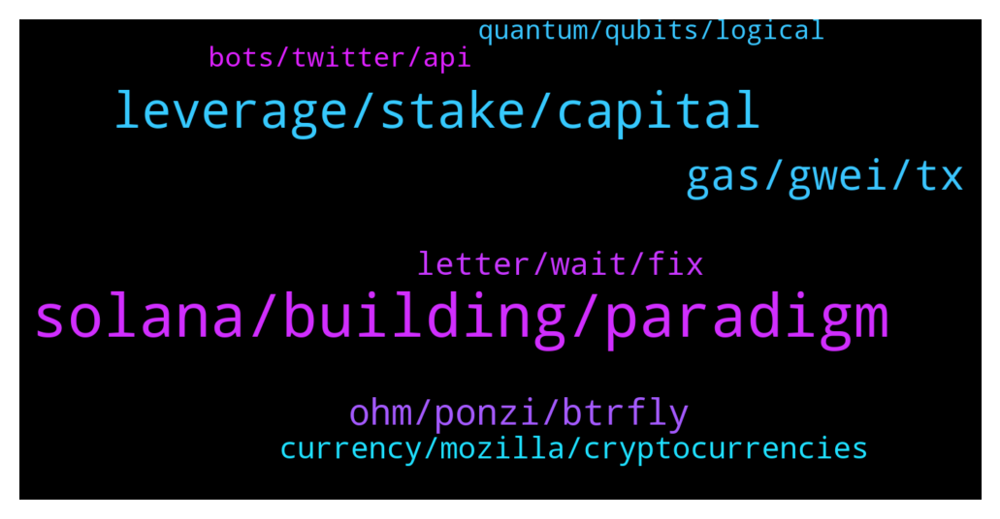

# **@lobsters_chat**
 ## Analysis for **2022-01-04** - **2022-01-05**.

---

## 📊 **Basic Stats**

**n_messages_sent**: 263

---

---

## 🔝 **Top keywords and related messages**

1. **solana, building, paradigm**

    @Agora --- *are there any newsletters/blogs that do weekly recaps on interesting DAO proposals/discussions?* **--->** [TG Discussion](https://t.me/lobsters_chat/312736)

    @deranzxc --- *iirc paradigm daily has one edit: https://medium.com/paradigm-fund/defi-in-ether-104b-in-defi-bancor-v3-unveiled-zapper-reaches-1m-maus-perpetual-protocol-v2-ea96dace9eaf  delphi has a DAO recap too i think?* **--->** [TG Discussion](https://t.me/lobsters_chat/312740)

    @william_s_4 --- *I haven't properly worked on it yet, word on the street is that it's a very different stack and coding paradigm compared to other smart contract development stacks, and in addition, there isn't always accurate docs and/or support. I don't mean to fud it, it sounds possible, just has a high overhead.* **--->** [TG Discussion](https://t.me/lobsters_chat/312631)

    @rudster --- *Honestly you can just look at coingecko s glossary’s* **--->** [TG Discussion](https://t.me/lobsters_chat/312973)

    @tatai_007 --- *Basically want to get familiar with the concepts and terms* **--->** [TG Discussion](https://t.me/lobsters_chat/312972)

    @rishabh_narang --- *anyone here building on top of solana? would love to get a high level on problems facing in implementation, I'm building sharpe.ai building multi-strategy asset management products onchain, looking at potentially building on top of polygon as an alternative.* **--->** [TG Discussion](https://t.me/lobsters_chat/312630)

2. **leverage, stake, capital**

    @spreek --- *I'm not sure. https://etherscan.io/find-similar-contracts?a=0xcbaff378442e70f587f65ac4abce603763816117&lvl=5 those are some of the contracts used if you want to take a look.* **--->** [TG Discussion](https://t.me/lobsters_chat/312861)

    @sixty10 --- *https://docs.gearbox.finance/overview/liquidations  Bots don't typically need their own price oracle to determine whether or not an account can be liquidated, they just read data from the contract they are calling.* **--->** [TG Discussion](https://t.me/lobsters_chat/312780)

    @PmRiviere --- *SOON https://twitter.com/thekeep3r/status/1478643116148207618  Although i m not sure which assets will have liquidity when it starts* **--->** [TG Discussion](https://t.me/lobsters_chat/312929)

    @DeadMeatHK --- *Vesta Finance forking Liquity to Arbitrum. Anyone here clear on the value prop? They're supposedly undoing the zero-gov feature of Liquity which I find counter-intuitive.* **--->** [TG Discussion](https://t.me/lobsters_chat/312600)

    @awnyrvan --- *Everybody is limited by some books. Point here is capital efficiency.   If all the trades’ PnL are settled by one unified pool, you have significantly increased capital efficiency.  In this specific case, there is a DAI vault (backed by GNS/DAI Lp) that acts as the settlement layer.  And you are right, the max position size is limited as a % of the DAI vault TVL. And for each individual trade, max profit is limited at 10x the base capital used.  Upto 150x leverage is working for 12months now. The stats page shows average leverage used is 57x (which is still higher than what other platforms offer).  You may just want to open a high leverage trade on it for testing and see.  Liquidation: the platform liquidation is run by a cluster of bots who liquidate when a trade is at -90% (the other 10% is paid out to the bots as compensation) At 100x leverage, underlying movement of 0.9% will liquidate you - but someone opening 100x position knowns that already. There is no surprise in terms liquidation price.  And as of now, the platform focuses on offering only the most liquid tokens, obviously to ensure platform safety. You have about 42 cryptos and 10 forex pairs listed there.* **--->** [TG Discussion](https://t.me/lobsters_chat/312623)

    @eldefijesus --- *Can anyone share a good implementation of how lending platforms mark accounts for liquidations? Does that happen on chain or do the bots need to keep track of wallets and price and then call a function that won’t revert if the user is available for liq* **--->** [TG Discussion](https://t.me/lobsters_chat/312778)

3. **gas, gwei, tx**

    @stevenhq --- *11 gwei as it replaces the 10 gwei one* **--->** [TG Discussion](https://t.me/lobsters_chat/312817)

    @ld206 --- *tx1 and tx2 with same nonce, where tx1 uses 1m gas @ 10 gwei (0.01eth total fee), but tx2 uses 900k gas at 11 gwei (0.0099eth total fee). which one do miners choose?* **--->** [TG Discussion](https://t.me/lobsters_chat/312812)

    @andrecronje --- *I notice you didn't mention FTM... tsk tsk* **--->** [TG Discussion](https://t.me/lobsters_chat/312944)

    @ivangbi --- *Is the gas is not used, it will just be given back. If the gas is not enough, even if has more gwei, it is then failed. The one with more gwei wins all things neutral?* **--->** [TG Discussion](https://t.me/lobsters_chat/312810)

    @river0x --- *botting gas for rewards seems to be the cause* **--->** [TG Discussion](https://t.me/lobsters_chat/312776)

    @yic_alex --- *Is there something going on with/on Polygon? Gas is >500 gwei on https://polygonscan.com/gastracker* **--->** [TG Discussion](https://t.me/lobsters_chat/312771)

4. **ohm, ponzi, btrfly**

    @paulcr2009 --- *ponzi master, shotta_sk  77 eth, 287 days -> $83.9m (638x)  https://twitter.com/shotta_sk/status/1478268353038848000  https://zapper.fi/ru/account/0x134489b826a3a899b8bbe7243f77292f95aa65fa  decent ride  all way ohm -> redacted* **--->** [TG Discussion](https://t.me/lobsters_chat/312662)

    @Ron_Kelly --- *Quite funny to call those ponzis but not klima😅* **--->** [TG Discussion](https://t.me/lobsters_chat/312601)

    @azeemkafridi --- *this person had around 10K ohm 200 days back, considering the insane apy, he made a killing with that single trade* **--->** [TG Discussion](https://t.me/lobsters_chat/312674)

    @calchulus --- *He's just angry he didn't do anything with a 3 year head start* **--->** [TG Discussion](https://t.me/lobsters_chat/312597)

    @ivangbi --- *One anon wallet earning 20% of the liquidity pool a day? Sure, healthy* **--->** [TG Discussion](https://t.me/lobsters_chat/312692)

    @ivangbi --- *M M was asked many times to not overshill, yet unfortunately kept doing it.* **--->** [TG Discussion](https://t.me/lobsters_chat/312531)

5. **letter, wait, fix**

    @midgetwhale --- *Ok, we will. I have nothing left to say. Cool group though, will keep lurking.* **--->** [TG Discussion](https://t.me/lobsters_chat/312570)

    @solgryn --- *uh oh, how do we fix against this?* **--->** [TG Discussion](https://t.me/lobsters_chat/312762)

    @lyngg --- *Although it was a letter from a protocol that could look like a soft shill, the letter itself worth a read as reflexionate about the whole web3 landscape and bad tactics other protocols are using.* **--->** [TG Discussion](https://t.me/lobsters_chat/312533)

    @ivangbi --- *Wait wtf [tweet was deleted here is the info] https://www.cftc.gov/PressRoom/PressReleases/8478-22* **--->** [TG Discussion](https://t.me/lobsters_chat/312562)

    @ld206 --- *oh wait, this siutation is actually nonsense* **--->** [TG Discussion](https://t.me/lobsters_chat/312807)

    @ivangbi --- *Ur messages were okay but u kept fking shilling non stop, so permamute. Doei.* **--->** [TG Discussion](https://t.me/lobsters_chat/312629)

6. **currency, mozilla, cryptocurrencies**

    @t1mur --- *BTC too, according to this study https://github.com/XuTPoBaH/Crypto-Research-Papers/blob/main/2021/2021%20Vulnerability%20Of%20Blockchain%20Technologies%20To%20Quantum%20Attacks.pdf* **--->** [TG Discussion](https://t.me/lobsters_chat/312758)

    @phil_muhbags --- *>cryptocurrencies are not currencies >Websites are allowing users to pay via crypto   Well...Which one is it?  Why is that people who hate something so much barely do any sort of research. You know if I want to talk shit about something I really dig deep into it.* **--->** [TG Discussion](https://t.me/lobsters_chat/312963)

    @svenblockchain --- *"The cryptocurrency industry, whose business model would seem unrealistic and ham-handed if it was a villain on Captain Planet: they manufacture only POLLUTION, nothing else, and they turn that into money.  They call it a "currency" but the only thing you can do with it is pay ransom after your computer was hacked! You can't even use it to buy porn!  And make no mistake, if you can't use a thing to buy porn, that thing is not a currency."* **--->** [TG Discussion](https://t.me/lobsters_chat/312907)

    @Justin --- *how do you know about this. I guess crypto has grown more than I know to be this complex* **--->** [TG Discussion](https://t.me/lobsters_chat/312558)

    @Swader --- *This bothers him but not Mozilla's profiteering off the free labor of 2.5th world countries, or their pretense of a non profit while shoving ads down your throat in q browser that takes half a minute to load. People are strange.* **--->** [TG Discussion](https://t.me/lobsters_chat/312903)

    @MaxRoszko --- *Fucking, and all the resulting babies, has lead to way more global warming than crypto* **--->** [TG Discussion](https://t.me/lobsters_chat/312969)

7. **bots, twitter, api**

    @farm42 --- *Should work without Twitter api https://twitter.com/officer_cia/status/1478372319831760897?s=21* **--->** [TG Discussion](https://t.me/lobsters_chat/312748)

    @cooper3456 --- *Yes ser it's tricky we would need a polling mechanism or push mechanism to retrieve the data (Twitter api), apply NLP do some sentimental analysis to determine a conclusion and use the exchange api to take actions on* **--->** [TG Discussion](https://t.me/lobsters_chat/312723)

    @mrdark --- *There are some telegram bots that can notify you about transactions.  You can assign names but I'm not sure if you can filter the methods.* **--->** [TG Discussion](https://t.me/lobsters_chat/312554)

    @JuanCarrillo --- *If you have to trust bots to behave, you are already losing the battle to spam* **--->** [TG Discussion](https://t.me/lobsters_chat/312777)

    @Swader --- *Sure sure, and bot-peddling scamgarbage on TG :D* **--->** [TG Discussion](https://t.me/lobsters_chat/312671)

    @wenbicycle --- *no, i mean like web tool for research. i aleady have txns bots* **--->** [TG Discussion](https://t.me/lobsters_chat/312556)

