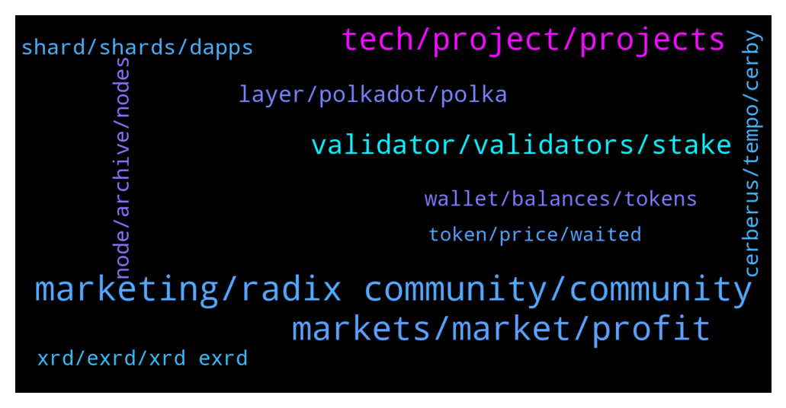

# **@radix_dlt**
 ## Analysis for **2022-01-04** - **2022-01-05**.

---

## 📊 **Basic Stats**

**n_messages_sent**: 966

---

---

## 🔝 **Top keywords and related messages**

1. **marketing, radix community, community**

    @gpel33 --- *I think there is some value in asking "If Radix is so obviously technically superior, why aren't other people copying it?"* **--->** [TG Discussion](https://t.me/radix_dlt/334123)

    @Syn --- *@Adam_XRD I would like to forward the following video to your Marketing. This girl really boils it down, what makes a blockchain successful. Even the technologically best blockchain can fail. I am forwarding this because I feel it goes a bit wrong. I am in Marketing myself and saw such fails like the underground billboards very often. It was like telling Radix insiders that you are still alive, instead attracting the target group. It really was a cool designed billboard (for Designers) but with no message for newcomers and paying for a mass of target groups you will never reach, because they are not interested and dont need it. Work out your stakeholders and target groups, most of them are sitting in financial institutions or have already a big successful blockchain defi project. 😀 https://youtu.be/TZ1g87VXUN4* **--->** [TG Discussion](https://t.me/radix_dlt/332944)

    @bjp333 --- *Are there teams working on the native, permissionless bridge to RADIX from Ethereum?  I think this is crucial.  Bitfinex and Instapass are horrible to use.* **--->** [TG Discussion](https://t.me/radix_dlt/334155)

    @PeterFATAss --- *If Radix is superior  I don't understand why Vitalik is not adopting it for ETH 2.0. Radix paper is available since 2 years* **--->** [TG Discussion](https://t.me/radix_dlt/334097)

    @Cpt_Charles --- *Posted a thread on Radix on twitter, appreciate it if you could give it some love :) https://twitter.com/CptCharles_/status/1478753717461471234* **--->** [TG Discussion](https://t.me/radix_dlt/334353)

    @Amit_K1 --- *Hi all. Just about to upload my creative competition entry, to my YouTube channel. Just wanted to double-check if it's ok to upload the Radix logo as a thumbnail, to show what the audio is about? Don't want to be infringing any copyright laws haha* **--->** [TG Discussion](https://t.me/radix_dlt/332981)

2. **markets, market, profit**

    @momoreina --- *And until we get true AI human traders will still dominate longer time frames* **--->** [TG Discussion](https://t.me/radix_dlt/334335)

    @Ashley --- *I’m not talking about crypto markets, there’s no microsecond latency requirement there. Second tier prop shops like tower research do very well on crypto but can’t compete with the big firms on the traditional markets* **--->** [TG Discussion](https://t.me/radix_dlt/334271)

    @Ashley --- *But what most miss is that risk management and pricing and execution are all extremely important, taking that race to the bottom of you take all the shit trades gets you nowhere :)* **--->** [TG Discussion](https://t.me/radix_dlt/334297)

    @AT --- *Well, great, the more people think like you, the more profit will be for the hedge fund where I work, which ended last year with record profits :)* **--->** [TG Discussion](https://t.me/radix_dlt/334272)

    @momoreina --- *We’re talking about scalping and HFTs here though right? 100s of turns/day per trader?* **--->** [TG Discussion](https://t.me/radix_dlt/334316)

    @momoreina --- *For day traders that do 2-3 trades per day seems like current infrastructure is ok. Definitely not talking about the HFTs that need to place their hardware 1 block away from the NYSE to avoid ms latencies.  I know the current idea is that we can’t compete with the HFTs and that’s probably correct if you’re looking for ticks,  but the current delays for slower traders is fine in my experience, you can get 60-80 points per day without needing light speed. I think the main class of trader that got wiped out by the advent of HFTs are mainly the tick hunters but please correct me if I’m wrong.* **--->** [TG Discussion](https://t.me/radix_dlt/334328)

3. **tech, project, projects**

    @fpieper --- *Yes, studied computer science, probably helps to understand the tech 😂* **--->** [TG Discussion](https://t.me/radix_dlt/334008)

    @Alex --- *Exactly, no I mean the approach of the team is fully understandable. I am just very surprised that many people just buy the hype instead of conducting proper research about valid alternatives, which would lead them straight to radix😅* **--->** [TG Discussion](https://t.me/radix_dlt/334244)

    @PeterFATAss --- *They could make a totally new architecture and migrate accounts* **--->** [TG Discussion](https://t.me/radix_dlt/334103)

    @Vorgesetzter --- *Possible. But other PC vendors would have been much better. In fact ANY other vendor.* **--->** [TG Discussion](https://t.me/radix_dlt/333831)

    @mx471 --- *https://youtu.be/rkpqWwktS8w?t=329 For this he will surely get some hate from the maxis of other projects* **--->** [TG Discussion](https://t.me/radix_dlt/333694)

    @mx471 --- *I didn't see your criticism as mean, but great response. I was worried that my one point would be taken quite differently than I thought. Developers from financial institutions might indeed be difficult, but I guess it's not that problematic. As a developer you have to be ready for something new, because the internet and partly also programming is fast moving. Maybe it applies to their work situation as well. I think the willingness to try something completely new is relatively high. But maybe I'm misjudging that.* **--->** [TG Discussion](https://t.me/radix_dlt/332974)

4. **validator, validators, stake**

    @millionaire308 --- *This isn't a complaint, it's a right that delegates can claim. Does 0.17% seem small? Then why can other projects cancel the validator right away? How does the Radix project, which claims to be developed recently, take 2 weeks to unstake?* **--->** [TG Discussion](https://t.me/radix_dlt/333441)

    @Martin --- *Hey guys. What should I look for when choosing validators?* **--->** [TG Discussion](https://t.me/radix_dlt/332902)

    @millionaire308 --- *Hello admin, the 2 weeks unstaking period of Radix takes too long. Is there any improvement plan? On other platforms, 3 days is a long time, but I don't understand why Radix designed it this way. This time, I also unstaking, but it's not something I wanted to do. Validators suddenly raise their blood to 1.48%, which is ridiculous from a delegator's point of view. If it's 1%, I understand and leave it alone, but if I raise it from 0 like that, of course I want to change it. If the validators behave unilaterally, I think it is right for the delegators to change their delegation so that the unstaking can be done right away.* **--->** [TG Discussion](https://t.me/radix_dlt/333427)

    @millionaire308 --- *No, in the future, when many customers raise this issue, are you going to tell them not to stake like they are now? Isn't that something to think about in your project?* **--->** [TG Discussion](https://t.me/radix_dlt/333447)

    @Magal36 --- *anyone with 100% uptime and less than 2% total stake share (for promoting decentralization). Better to spread between some validators.* **--->** [TG Discussion](https://t.me/radix_dlt/333120)

    @Sturlison_98 --- *If you dont want the 2 weeks, dont stake. It's easy* **--->** [TG Discussion](https://t.me/radix_dlt/333445)

5. **layer, polkadot, polka**

    @PeterFATAss --- *This will happen one day and Polkadot is the best layer 0 so far* **--->** [TG Discussion](https://t.me/radix_dlt/333559)

    @Michelinux --- *Do you know any major layer 1 running on Polkadot?* **--->** [TG Discussion](https://t.me/radix_dlt/333541)

    @Michelinux --- *Layer 0 is a broken concept invented by Polkadot, there is no layer 0.* **--->** [TG Discussion](https://t.me/radix_dlt/333538)

    @PeterFATAss --- *Lol. Polkadot is working fine 👌* **--->** [TG Discussion](https://t.me/radix_dlt/333539)

    @Orbitalz --- *Ummm. Thought layer 0 was for interoperability and such* **--->** [TG Discussion](https://t.me/radix_dlt/333596)

    @prp_999 --- *Polka dot requires a bridge to interact with different networks. That’s not a layer 0 by definition.* **--->** [TG Discussion](https://t.me/radix_dlt/333549)

6. **shard, shards, dapps**

    @Bent --- *Wouldn't big services like Uniswap mirror their AMMs on all the shards though to prevent this problem? They'd probably want to implement some automated cross-shard arbitrage but this seems doable. Main problem perhaps is it multiplies up the liquidity needed.* **--->** [TG Discussion](https://t.me/radix_dlt/333956)

    @S --- *And then his final proposal is just grouping contracts together on a single shard, if I understand it correctly. Because otherwise they'd need optimistic execution. But that's not a solution, more of a stopgap, right* **--->** [TG Discussion](https://t.me/radix_dlt/333896)

    @fpieper --- *It fragments liquidity and your ecosystem is not unified anymore. Even if you do it for big pools, the scalability is limited because you can't infinitely split your liquidity.  Also it introduces a lot more complexity because now devs need to distinguish between local pools and pools on other shards.  And in general the liquidity efficiency decreases which makes everything more expensive (like swapping etc.)* **--->** [TG Discussion](https://t.me/radix_dlt/333972)

    @crypt_punk --- *I think it's not good mirror all dapp on all shard  They create shard to separate dapp and reduce traffic If all dapp run on all shard what's different with single shard?* **--->** [TG Discussion](https://t.me/radix_dlt/333962)

    @PeterFATAss --- *"Basically because polkadot and Elrond have a metachain which means slow and expensive cross-shard transactions -> all interacting dapps in one shard -> no scaling.". Wrong!!! Interacting dapps can be on different Parachains ("Shards"). Dapps don't interact 24/7. Most of the interaction is inside the Parachain. I see not problem for 100 shards!!!@@* **--->** [TG Discussion](https://t.me/radix_dlt/334075)

    @S --- *Hm. Well, it would work to the extent that ppl are willing to accept high fees for the shard where everyone congregates* **--->** [TG Discussion](https://t.me/radix_dlt/333959)

7. **cerberus, tempo, cerby**

    @fpieper --- *You need to decide for one, implement EVM or change their architecture to fit Cerberus 😜* **--->** [TG Discussion](https://t.me/radix_dlt/334113)

    @mx471 --- *Has Cerberus actually been reviewed by more scientists than M. Sadoghi and UC Davis?* **--->** [TG Discussion](https://t.me/radix_dlt/332917)

    @Magal36 --- *Indeed it is! It's why we have invested a lot of time and effort in Cerberus. Have you read the academic paper on Cerberus here (written by Prof. Sadoghi from the University of California Davis)?  https://arxiv.org/abs/2008.04450* **--->** [TG Discussion](https://t.me/radix_dlt/333635)

    @fpieper --- *I think there is one tiny little detail. There is not a ready to use solution available. Cerberus is only the consensus and not full state management etc. Quite some of the details are not public yet.  The competition can't simply just copy Cerberus because some key details are not fully published or implemented.  And it even takes Radix 2 years to fully implement it in production grade. There is no way someone else can copy it and release it faster. And even after Xian is released and everything is public it would takes years to copy, not even talking about migrating your existing ledger.  I think some underestimate how hard it is to change the architecture of a DLT after launch.  E.g. I think the original plan of ETH 2.0 was more along the lines of Polkadot, but they weren't able to pull it off and drastically reduced their roadmap.* **--->** [TG Discussion](https://t.me/radix_dlt/334145)

    @Avaunt --- *The finer details of Cerberus is closely guarded at the moment, once we hit Xi'an more will be known and become Open Source. From there it would take at least 2-3+ for a new project to copy what Radix has developed imo. By then Radix will have captured the De-Fi market.* **--->** [TG Discussion](https://t.me/radix_dlt/334133)

    @PeterFATAss --- *What is Dans backround. Couldn't find another paper of him* **--->** [TG Discussion](https://t.me/radix_dlt/333643)

8. **node, archive, nodes**

    @Radstakes --- *Also try restarting the app if you haven't already.  There have been some reports a few days ago of congestion on the Radix archive nodes but it should now be resolved.  You can login OK without any delays?* **--->** [TG Discussion](https://t.me/radix_dlt/334382)

    @M5M400 --- *quick question: is there a reason the radix wallet wouldn't let me connect to a local archive node on a private subnet?* **--->** [TG Discussion](https://t.me/radix_dlt/333244)

    @Ravient78 --- *Tried - also switched nodes again.* **--->** [TG Discussion](https://t.me/radix_dlt/334383)

    @PeterFATAss --- *Are you sure? Why I can't communicate over the relay chain* **--->** [TG Discussion](https://t.me/radix_dlt/334087)

    @giskard_rich --- *Have people switched back to mainnet or are most still using community nodes?* **--->** [TG Discussion](https://t.me/radix_dlt/333193)

    @Jonn --- *I'm in Australia too, I switched from a community node to the mainnet today and it works, but it is still a bit slower than usual.* **--->** [TG Discussion](https://t.me/radix_dlt/333246)

9. **xrd, exrd, xrd exrd**

    @J --- *J G was just coping and pasting from xrd website to answer question about exrd and bridging to xrd..* **--->** [TG Discussion](https://t.me/radix_dlt/333154)

    @Lost_in_town --- *Ok @Magal36 thanks a lot for the answer. And also, I remember that e-xrd is the ERC-20 token version of the XRD coin, right ? How is it that market caps of both e-rxd and xrd are different ? For example the market cap of the xrd coin looks like this* **--->** [TG Discussion](https://t.me/radix_dlt/333374)

    @Alex --- *That’s enough of a feedback to not even consider it haha thanks just stacked some more xrd!* **--->** [TG Discussion](https://t.me/radix_dlt/334223)

    @fpieper --- *This can be different, if they list DGC. They can list XRD also.* **--->** [TG Discussion](https://t.me/radix_dlt/333038)

    @Lost_in_town --- *and the one of e-xrd is like this :* **--->** [TG Discussion](https://t.me/radix_dlt/333378)

    @Magal36 --- *XRD is what matters, eXRD is just a part of the XRD supply that is wrapped on Ethereum* **--->** [TG Discussion](https://t.me/radix_dlt/333377)

10. **wallet, balances, tokens**

    @zzaksyusuf --- *When will mobile wallet be available* **--->** [TG Discussion](https://t.me/radix_dlt/332984)

    @WardNijmegen --- *I can't access my wallet as well* **--->** [TG Discussion](https://t.me/radix_dlt/333302)

    @BlAzAk --- *I didn't check the Desktop Wallet code but I saw that my balances autorefresh when I receive tokens. And I don't know existence of websockets so I guess it's a setInterval who calls API (every 10 seconds ?). Official node is the default node for each new users. So if they keep their wallet open. Number of requests to the node can be crazy.  Balances page is 1 request to get balances and 1 request for each RRI found to show the name. We released RadixCollection with 30+ different tokens.  So imagine 100 players (we have 800) with an average of 15/30 different badges with wallet opens on balance page. It's something like 9600 calls per minute.  @russellharv ?* **--->** [TG Discussion](https://t.me/radix_dlt/333715)

    @Tom --- *Ongoing wallet (performance) issues and still no solid API do not really paint a great picture to be honest. Makes me less confident that the team can pull off the actual difficult stuff. Project looks good on paper but actual implementation seems to be quite messy. Any comments?* **--->** [TG Discussion](https://t.me/radix_dlt/333265)

    @Renetheuns --- *how come I see DGC in my wallet since today? (stream app) ?* **--->** [TG Discussion](https://t.me/radix_dlt/333317)

    @Ravient78 --- *Others having wallet issues or just me? The send screen won’t come up. Been trying for an hour. Balance screen works* **--->** [TG Discussion](https://t.me/radix_dlt/334379)

