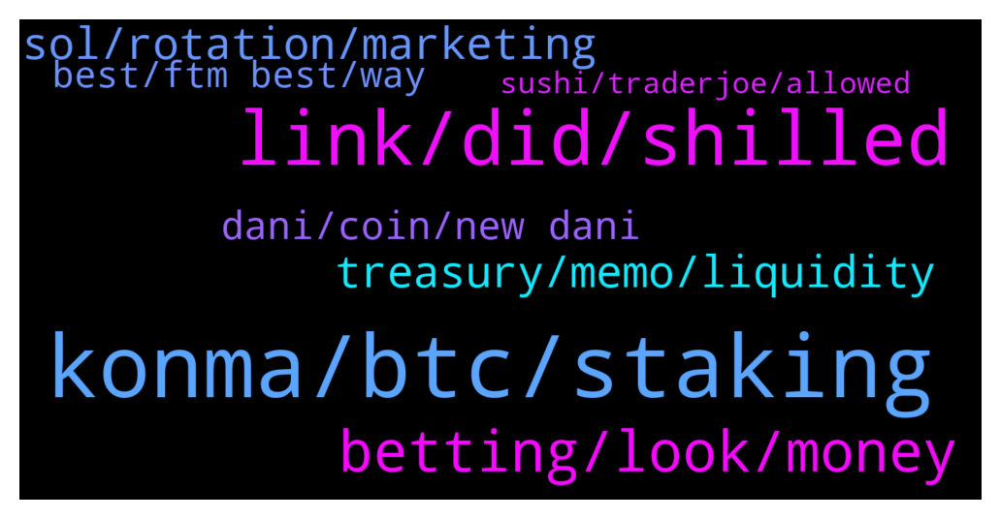

# **@shitpool**
 ## Analysis for **2022-01-04** - **2022-01-05**.

---

## 📊 **Basic Stats**

**n_messages_sent**: 215

---

---

## 🔝 **Top keywords and related messages**

1. **konma, btc, staking**

    @R0mster --- *Take profit. Nothing organically 10 xs in a week without some kind of pull back.* **--->** [TG Discussion](https://t.me/shitpool/713810)

    @yesbutalsono --- *BTC, ETH, CEL, TIME, SPELL, SUSHI, LINK* **--->** [TG Discussion](https://t.me/shitpool/713985)

    @kevvy_wevvy --- *a big part of teh UST demand is achor interest* **--->** [TG Discussion](https://t.me/shitpool/713922)

    @kevvy_wevvy --- *the ponzinomics will catch up at some point* **--->** [TG Discussion](https://t.me/shitpool/713923)

    @pizza_dog --- *Yeah I think that’s where Time has to go, unless this revenue sharing thing incentivized people to not dump and actually stay staked* **--->** [TG Discussion](https://t.me/shitpool/713924)

    @MoneroPal --- *Possibly for now, not like UST will disappear.* **--->** [TG Discussion](https://t.me/shitpool/713925)

2. **link, did, shilled**

    @yesbutalsono --- *not a gud funny feeling either* **--->** [TG Discussion](https://t.me/shitpool/714188)

    @IndianTonic --- *And get them to the safe too , in multiple tranches , u never know* **--->** [TG Discussion](https://t.me/shitpool/714165)

    @Lingling --- *You mean I am a robot?* **--->** [TG Discussion](https://t.me/shitpool/714131)

    @yesbutalsono --- *sorry designing some shitttt for work* **--->** [TG Discussion](https://t.me/shitpool/713989)

    @Rekt_Flair --- *I got in at 30 this morning* **--->** [TG Discussion](https://t.me/shitpool/713854)

    @Horselorde --- *That could away from you? What lol* **--->** [TG Discussion](https://t.me/shitpool/713986)

3. **betting, look, money**

    @MoneroPal --- *Jake wouldn’t look any different if they didn’t.  They’re both just really low class uneducated commoners that got propelled into money and stardom because somone else is making more off of them. Likely will be broke like most, only one I respect in the scene is Canelo Alvarez, doesn’t even belong in the same sentence as them.* **--->** [TG Discussion](https://t.me/shitpool/713968)

    @yesbutalsono --- *nodes and the casino sports betting platform* **--->** [TG Discussion](https://t.me/shitpool/713949)

    @yesbutalsono --- *Kain and his brother at it again* **--->** [TG Discussion](https://t.me/shitpool/714025)

    @goldencatpat --- *Hoffman is such a little faggot* **--->** [TG Discussion](https://t.me/shitpool/714104)

    @MoneroPal --- *This is vomit worthy. His other projects are total dog shit, yet, he’s onto more? LOL, clown show* **--->** [TG Discussion](https://t.me/shitpool/713890)

    @MoneroPal --- *I respect the guy for his efforts and commitment, but why do they have to look like total faggots? The disgusting designer shit, tattos, cartier glasses with empty lenses and diamonds around the frame, gaudy Richard Mille watches with diamonds. These clowns all look the same, it’s horrible.* **--->** [TG Discussion](https://t.me/shitpool/713961)

4. **treasury, memo, liquidity**

    @hosermage --- *Well rebases inflate the supply but people are just selling that into the liquidity pool to generate fees. I guess they will use those fees to stabilize price somehow* **--->** [TG Discussion](https://t.me/shitpool/714147)

    @MoneroPal --- *Still confusing, but slightly more clear, so they're going to stop minting new TIME, but will in turn sell MEMO directly for LP tokens. They earn more fees from liquidity cross chain. The price of TIME / MEMO stabilize and will potentially create buy pressure as more will buy to yield farm with.* **--->** [TG Discussion](https://t.me/shitpool/714158)

    @MoneroPal --- *So basically, they're going to sell MEMO directly from the treasury to bonders / minters instead of creating through inflation more TIME. Most rebases are dumped or yield farmed on TraderJoe to earn TraderJoe LP tokens.   Wonderland profits from the selling of TIME because they own the liquidity tokens from bonding / minting, they will make even more as they have more cross-chain liquidity (ETH, BSC, FTM, and so on), because users will be selling LP tokens from thsoe liquidity pools on other chains to buy MEMO directly from the treasury, thus building the treasury assets up through more then just rebases and high APY and stabilizing price.   This will in turn create less inflation, but how will this increase the price of TIME or MEMO? I guess by building the treasury without inflation they will have more assets and will have more potential to invest those assets for a return later on. It is not clear if they will cease to provide rebases of TIME or if they will continue to sell TIME at a discount via minting / bonding.* **--->** [TG Discussion](https://t.me/shitpool/714154)

    @MoneroPal --- *So the rebases of TIME are being farmed by holders on TraderJoe to earn JOE and other tokens (share of the fees). Wonderland treasury is aiming to profit more from this activity by having more protocol owned liquidity on various chains to get a larger share of those fees. They will get this protocol owned liquidity by offering MEMO directly, not through inflation, but by selling directly from the treasury.* **--->** [TG Discussion](https://t.me/shitpool/714152)

    @MoneroPal --- *The rebases of TIME generate revenue for Wonderland how? They’re usually sold on exchanges like TraderJoe. I guess they own the LP tokens in the treasury (protocol owned liquidity) and they capture that revenue, but will now also be doing so from other chains not just Avalanche.* **--->** [TG Discussion](https://t.me/shitpool/714146)

    @MoneroPal --- *"9/ The rebases into the LP already generates revenues for Wonderland that are captured by selling those ( and part of the runway ) into wMEMO/MIM LPs, FTM, MIM, ETH .. on other chains”   This part is confusing, so they’re no longer selling TIME at a discount for minting aka bonds for stables to the treasury, but they’re now selling MEMO directly from the treasury, not minting new TIME or MEMO for selling the treasury stables. Fair, but I don’t get the above.* **--->** [TG Discussion](https://t.me/shitpool/714145)

5. **sol, rotation, marketing**

    @kevvy_wevvy --- *that said i think the next rotation might be into SOL* **--->** [TG Discussion](https://t.me/shitpool/713892)

    @kevvy_wevvy --- *i think thats just marketing shit like almost everything with SOL* **--->** [TG Discussion](https://t.me/shitpool/713891)

    @kevvy_wevvy --- *thats like 1 SOl failure a month each of the last 6 months* **--->** [TG Discussion](https://t.me/shitpool/713880)

    @kevvy_wevvy --- *SOL... has been trash for like half a year. good marketing to be associated i guess* **--->** [TG Discussion](https://t.me/shitpool/713869)

    @AsianFever --- *You might be right, Sol ecosystem sentiment rock bottom, serum, ray, mango… rekt. Might be the play if ur willig to hodl, zig when they zag* **--->** [TG Discussion](https://t.me/shitpool/714000)

    @kevvy_wevvy --- *SOL is trash, heard it froze again yesterday* **--->** [TG Discussion](https://t.me/shitpool/713876)

6. **dani, coin, new dani**

    @yesbutalsono --- *Dani coins and new Dani project on ftm* **--->** [TG Discussion](https://t.me/shitpool/713886)

    @AsianFever --- *Is fantom a danny coin now @yesbutalsono ? :)* **--->** [TG Discussion](https://t.me/shitpool/713781)

    @MoneroPal --- *Dani had a falling out with the founder over something related to incentives, it was a few months ago* **--->** [TG Discussion](https://t.me/shitpool/714144)

    @Horselorde --- *Must w8 for new dani cone* **--->** [TG Discussion](https://t.me/shitpool/713934)

    @MoneroPal --- *Not at all, but greatly dislike Dani and his ecosystem, believe he is a total clown. Loves to spread hopium, but is clealy clueless, his projects are dog shit too. MIM has no utility but looping in his fun house of projects. TIME is hyper inflationary worthless shit with no plan for the future just infighting and frog memes. Price is down 70% and that is relevent because price is all that matters…* **--->** [TG Discussion](https://t.me/shitpool/713910)

    @yesbutalsono --- *Associated but not a Dani coin per say* **--->** [TG Discussion](https://t.me/shitpool/713782)

7. **best, ftm best, way**

    @MoneroPal --- *Why is FTM even on the map what is it doing that Avalanche, ETH, SOL, Cardano, Terrra, and others are not?* **--->** [TG Discussion](https://t.me/shitpool/713875)

    @yesbutalsono --- *FTM ecosystem will flourish this week. Harmony too* **--->** [TG Discussion](https://t.me/shitpool/713873)

    @OxZilla --- *Beethoven X is the best on ftm.* **--->** [TG Discussion](https://t.me/shitpool/714101)

    @OxZilla --- *FTM is hands down the chain with the best devs and most innovative products* **--->** [TG Discussion](https://t.me/shitpool/714092)

    @gonubie --- *and will it be distributed to ftm holders.. hence le pump* **--->** [TG Discussion](https://t.me/shitpool/713749)

    @yesbutalsono --- *gonna be of ftm tho obviously* **--->** [TG Discussion](https://t.me/shitpool/713746)

